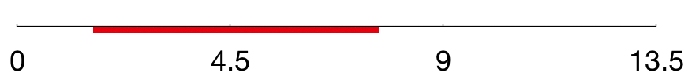
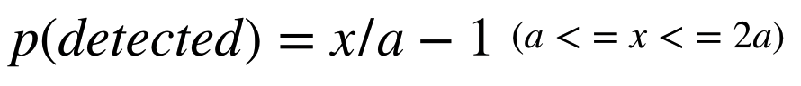
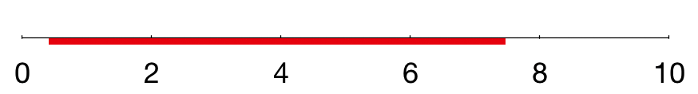
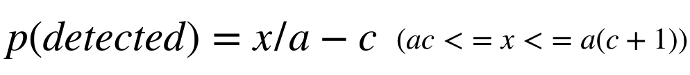
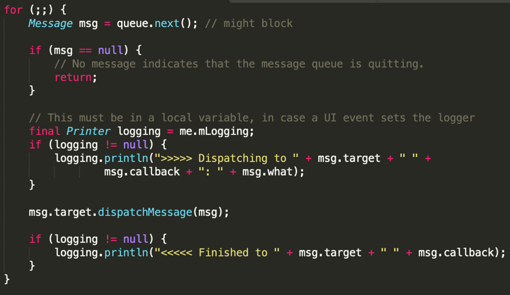
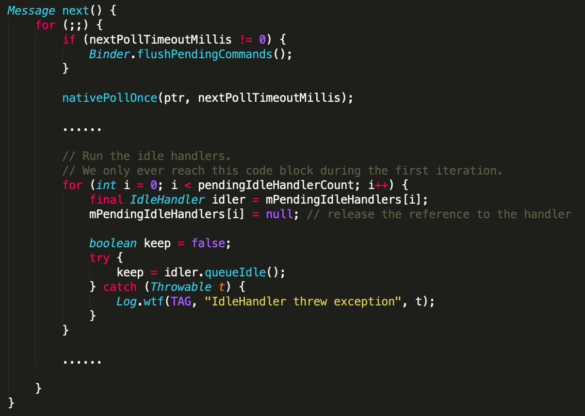
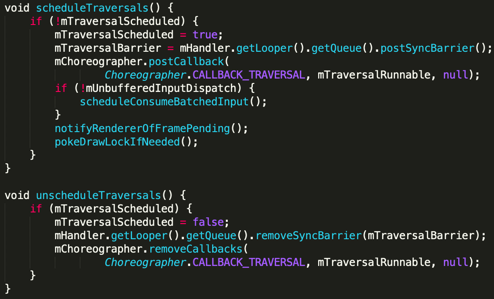
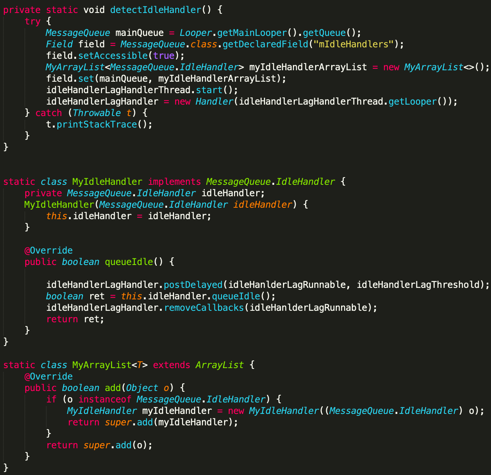
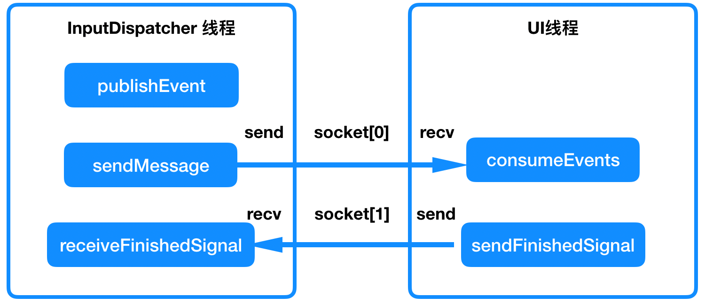
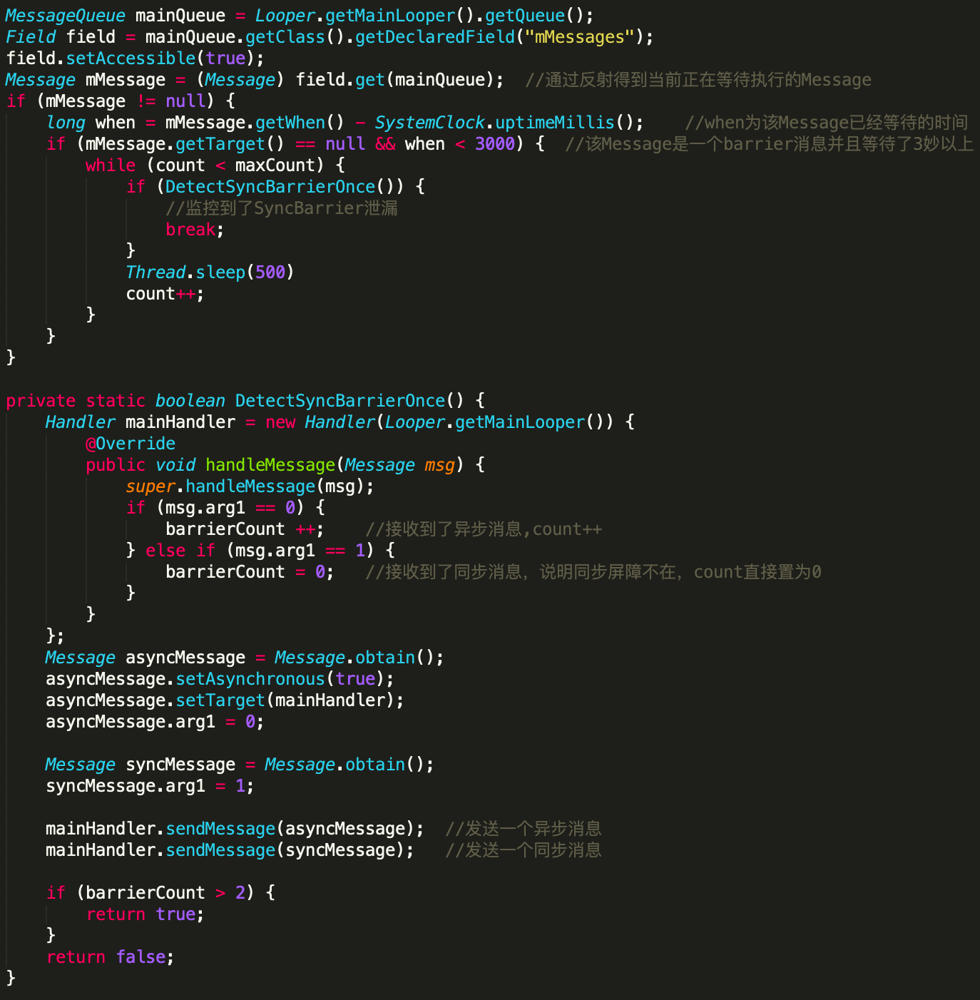

-   微信Android客户端的卡顿和ANR的治理之路（一） — 卡顿监控

    

    

    

    | 导语 卡顿/ANR的线上监控，对于应用的长期运营和发展来说十分重要。本文主要讨论Android客户端两种线上卡顿监控的方案，分析其原理和优缺点并提出更加完善的方案。

    ​    文章开始，有必要先聊一聊卡顿与ANR的关系：这里的卡顿指的是UI卡顿，产生卡顿的根本原因是UI线程不能够及时的进行渲染，导致UI的反馈不能按照用户的预期，连续一致的呈现，出现卡顿的直接原因多种多样，很难一一列举；而ANR是Google人为规定的一个概念，可能产生ANR的原因最多只有四个，本文不详细展开，之后会有专门一篇文章讨论ANR的监控。

    ​    一方面，卡顿与ANR息息相关，事实上，长时间的UI卡顿是导致ANR最常见的原因。另一方面，严格来说，两者是既不充分也不必要条件：产生了卡顿不一定造成ANR；产生ANR也并不一定说明发生了UI卡顿（例如后台ANR，即SilentAnr）。

    ​    下面主要讨论两种监控卡顿的方案，这两种方案就经常被用来作为监控ANR的方案（只要卡顿阈值设置为5秒）。然而这其实是很不严谨的：首先，5秒只是ANR其中一种情况（Touch事件5秒未被及时消费）的默认阈值，其他原因的ANR默认阈值并不是5秒；另外，就算是主线程卡顿了5秒，如果用户没有输入任何的Touch事件，同样是不会发生ANR的（更不要说是进程处在后台的情况了）。所以以下两种方案用来监控ANR都是不准确的，真正意义上监控ANR的方案下一篇会详细讨论。另外，这两种方案都是比较适合监控比较严重的卡顿，对于监控细微的掉帧并不太合适，掉帧和轻微卡顿这个话题后面会再专门讨论。

    ## 一、WatchDog

    ​    这种方案的本质是开启一个子线程不断轮询UI线程，这是最容易理解，最简单粗暴的方法。这种方法甚至具有一定的普适性，iOS或者其他的客户端系统，都可以用类似的思路来监控卡顿。具体的原理和实现方法很简单：不断向主线程发送Message，每隔一段时间检查一次刚刚发送的Message是否被处理，如果没有被处理，则说明这段时间主线程被卡住了。这种方案在Bugly上有使用，微信之前也使用过这种方案。

    -   **优点：简单，稳定，可以监控到各种类型的卡顿**
    -   **缺点：随机漏报，不确定性，轮询不优雅**

    ​    这种方法的轮询的时间间隔选择很重要，又让人左右为难，轮询的时间间隔越小，对性能的负面影响就越大，而时间间隔选择的越大，漏报的可能性也就越大。前者很容易理解，主线程要不断处理我们的Message，必然会影响性能。而随机漏报的问题的题比较有趣，可以稍微展开聊聊。

    ​    以我们微信自己之前的方案为例，时间间隔选择了4.5秒（事实上，之前是想要通过这种方案来监控ANR，当然，上面提到过，这并不严谨），简单画个图：

    

    ​    每隔4.5秒，向主线程发送一个消息。现在有一个5秒的卡顿（红线部分）发生在第2秒，结束在第7秒，这种情况无论是在0-4.5秒的周期内，还是4.5-9秒的周期内，都有一段时间是不卡顿的，消息都可以被处理掉，这种情况自然就无法被监控到。如果有兴趣，我们甚至可以算出一个概率：

    

    ​    其中x代表卡顿的时间，a代表设置的轮询间隔，可以计算出来：如果轮询间隔设置为4.5秒，发现一个5秒的卡顿的概率仅为20%。有的开源库例如[ANR-WatchDog](https://github.com/SalomonBrys/ANR-WatchDog)，默认轮询间隔为5秒，如果有一个8秒的卡顿（8秒已经很容易产生ANR），被发现的概率也只有8/5-1=60%。另外从这个概率公式还可以发现，对于一个固定的轮询间隔，只有卡顿时间大于两倍的轮询间隔，才能百分之百被监控到，例如想要百分之百监控到4秒以上的卡顿，轮询间隔必须要设置成2秒或者更短。

    ​    如果不断缩小轮询的间隔呢？我们所知的有些方案，是用更短的轮询时间，连续几个周期消息都没被处理才视为一次卡顿，例如：每2秒轮询一次，如果连续三次消息都没被处理，则认为发生了卡顿，这种方案我们可以再画个图：

    

    ​    这种情况其实是第一种情况的更一般的情况，我们同样可以算出一个概率：

    

    ​    其中x代表卡顿的时间，a代表设置的轮询间隔，c表示连续几次周期没处理消息才认为发生了卡顿。再举个例子：如果设置轮询间隔为2秒，连续3次没处理消息就认为发生了卡顿，那么对于7秒的卡顿，被监控到的概率为7/2-3=33.3%。

    ​    一时兴起，写了一段测试程序，模拟上面那些情况，尝试不断在随机的时间点触发一次sleep，检查是否监控到了卡顿。结果基本上大概进行十次左右，实验得出的频率就很常接近公式算出的概率了。

    ## 2、Looper Printer

    ​    替换主线程Looper的Printer，这方案也十分常见，手Q的Android客户端目前也正在使用这种方案，微信（Matrix）本身也在线上也使用了这种方案，而且已经稳定运行了很长时间。

    -   **优点：不会随机漏报，无需轮询，一劳永逸**
    -   **缺点：某些类型的卡顿无法被监控到**

    ​    其原理也很容易理解，以下是android.os.Looper.java的部分关键代码：

    

    ​    无论是通过反射替换Looper的mLogging还是通过setMessageLogging设置printer，我们只需要替换主线程Looper的printer对象，通过计算执行dispatchMessage方法之后和之前打印字符串的时间的差值，就可以拿到到dispatchMessage方法执行的时间。而***大部分***的主线程的操作最终都会执行到这个dispatchMessage方法中。

    ​    为什么说是大部分？因为有些情况的卡顿，这种方案从原理上就无法监控到。看到上面的queue.next()，这里给了注释： ***might block***，直接跟你说这里是可能会卡住的，这时候再计算dispatchMessage方法的耗时显然就没有意义了。有的同学可能会想，那我改成计算相邻两次dispatchMessage执行之前打印字符串的时间差值不就好了？这样就可以把next()方法的耗时也计算在内。不幸的是，主线程空闲时，也会阻塞在MessageQueue的next方法中，我们很难区分究竟是发生了卡顿还是主线程空闲。

    ​    如果排除主线程空闲的情况，究竟会是什么原因会卡在MessageQueue的next方法中呢？下图是next方法简化过后的源码：

    

    ​    最常见的一种情况是卡在nativePollOnce方法，除了主线程空闲时就是阻塞在这里之外。非常重要的是，应用的Touch事件也是在这里被处理的。这就意味着，***View的TouchEvent中的卡顿这种方案是无法监控的***。然而，对于我们来说，微信中有大量的自定义View，这些View中充满了各种各样很多的onTouch回调，卡在这里面的情况非常普遍，这种情况的卡顿监控不到是很难接受的。另外，除了Touch事件，Native Message也会卡在nativePollOnce方法中，这种同样无法监控到。

    ​    另外一种常见的情况是***IdleHandler的queueIdle()回调方法也是无法被监控的***，这个方法会在主线程空闲的时候被调用。然而实际上，很多开发同学都先入为主的认为这个时候反正主线程空闲，做一些耗时操作也没所谓，其实queueIdle默认也是执行在主线程，所以这里的耗时操作其实是很容易引起卡顿和ANR的。例如微信之前就利用IdleHandler在进入微信的主界面后，如果Looper空闲，就对之前统计上报失败的数据进行补充上报，此时在queueIdle方法中做了许多读写文件的IO操作，引起了不少的卡顿和ANR问题。

    ​    还有一类相对少见的问题是***SyncBarrier（同步屏障）的泄漏同样无法被监控到***，当我们每次通过invalidate来刷新UI时，最终都会调用到ViewRootImpl中的scheduleTraversals方法，会向主线程的Looper中post一个SyncBarrier，其目的是为了在刷新UI时，主线程的同步消息都被跳过，此时渲染UI的异步消息就可以得到优先处理。但是我们注意到这个方法是线程不安全的，如果在非主线程中调用到了这里，就有可能会同时post多个SyncBarrier，但只能remove掉最后一个，从而有一个SyncBarrier就永远无法被remove，就导致了主线程Looper无法处理同步消息（Message默认就是同步消息），导致卡死。

    

    ​    以上的情况既然监控不到，我们想能不能通过另外的一些手段，专门监控这些情况呢？下面分别针对这三种情况，提出了三种对应的监控方法，**以下是本篇的重点：**

    ### 1、监控IdleHandler卡顿

    ​    首先从简单的下手，对于IdleHandler的queueIdle回调方法的监控。我们惊喜的发现MessageQueue中的mIdleHandlers是可以被反射的，这个变量保存了所有将要执行的IdleHandler，我们只需要把ArrayList类型的mIdleHandlers，通过反射，替换为MyArrayList，在我们自定义的MyArrayList中重写add方法，再将我们自定义的MyIdleHandler添加到MyArrayList中，就完成了“偷天换日”。从此之后MessageQueue每次执行queueIdle回调方法，都会执行到我们的MyIdleHandler中的的queueIdle方法，就可以在这里监控queueIdle的执行时间了。

    

    ### 2、监控TouchEvent卡顿

    ​    那么TouchEvent我们有什么办法监控吗？首先想到的可能是反射View的mListenerInfo，然后进一步替换其中的mTouchListenr，但是这需要我们枚举所有需要被监控的View，全部反射替换一遍，这完全是憨憨行为。那有没有更加根本，全局性的方法呢？

    ​    熟悉input系统的同学应该知道，Touch事件最终是通过server端的InputDispatcher线程传递给Client端的UI线程的，并且使用的是一对Socket进行通讯的。我们可以通过ELF Hook，去Hook这对Socket的send和recv方法来监控Touch事件啊！我们先捋一下一次Touch事件的处理过程：

    

    ​    我们通过ELF Hook，成功hook到libinput.so中的recvfrom和sendto方法，使用我们自己的方法进行替换。当调用到了recvfrom时，说明我们的应用接收到了Touch事件，当调用到了sendto时，说明这个Touch事件已经被成功消费掉了，当两者的时间相差过大时即说明产生了一次Touch事件的卡顿。这种方案经过验证是可行的！

    ### 3、监控SyncBarrier泄漏

    ​    最后，SyncBarrier泄漏的问题，有什么好办法能监控到吗？目前我们的方案是不断轮询主线程Looper的MessageQueue的mMessage(也就是主线程当前正在处理的Message)。而SyncBarrier本身也是一种特殊的Message，其特殊在它的target是null。如果我们通过反射mMessage，发现当前的Message的target为null，并且通过这个Message的when发现其已经存在很久了，这个时候我们合理怀疑产生了SyncBarrier的泄漏（但还不能完全确定，因为如果当时因为其他原因导致主线程卡死，也可能会导致这种现象），然后再发送一个同步消息和一个异步消息，如果异步消息被处理了，但是同步消息一直无法被处理，这时候就说明产生了SyncBarrier的泄漏。如果激进一些，这个时候我们甚至可以反射调用MessageQueue的removeSyncBarrier方法，把这个SyncBarrier移除掉。下面图片展示了大概的原理：

    

    ​    坏消息是，这种方案只能监控到问题的产生（也可以直接解决问题），但是无法溯源问题究竟是哪个View的刷新导致的。其实我们也尝试和考虑过，通过插桩或者hook的方法，监控invalidate方法是否在非主线程中进行，但是考虑到风险以及对性能影响都比较大，没有在线上使用；而好消息是，通过监控发现，这个问题对我们来说，发生的概率目前还很低。

    ​    以上，针对Looper Printer监控卡顿的方案，无法监控到的三个问题，分别都提出了对应的监控方案。如此以来，绝大多数的卡顿问题都可以被我们监控到了，一套比较完整的卡顿监控方案就获得了。

    ​    欢迎大家三连（顶，收藏，分享），如果有任何问题和建议也欢迎大家评论。本系列之后会继续讨论卡顿和ANR的相关问题，之后的一篇文章会仔细讨论ANR的监控方案。