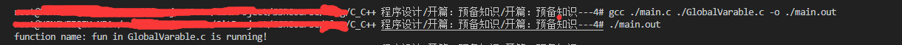
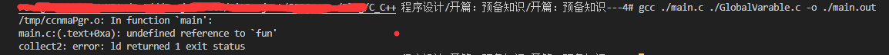
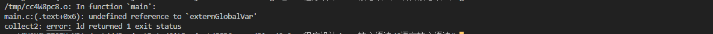
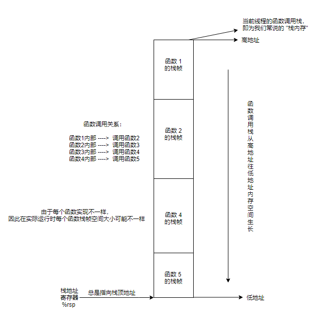
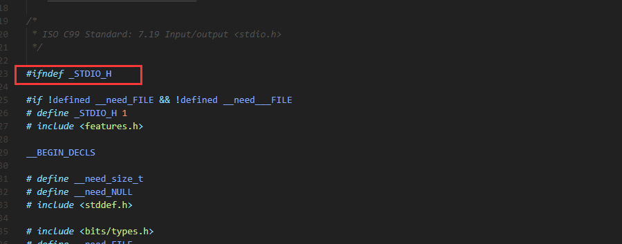
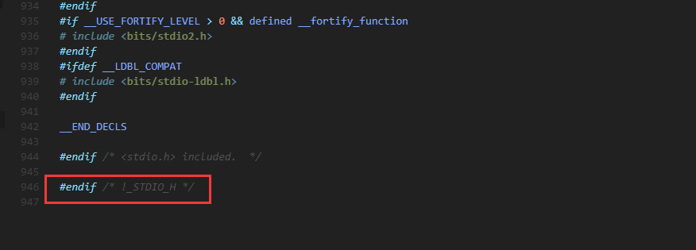

[TOC]

## 前言

在本系列的上一篇文章中我们着重探讨了一下 C 语言中的数据类型，并且从计算机内存编码的角度来看数据类型的表示原理。本篇文章我们一起来看一下C语言里面的一些核心语法。

本文主要是对 C 语言基础的语法进行介绍，熟悉的小伙伴可以直接跳过~。

本文例子在 `Linux` 系统上运行。

## 运算符和语句

一些编程语言通用的运算符这里不再介绍，有几个值得一说的运算符：

#### 逗号运算符

这个运算符在其他编程语言中并不常见，语法如下：

```c
var = (表达式1, 表达式2, 表达式3....);
```

逗号运算符会计算所有表达式的值，将最后一个表达式的值作为结果返回。看一个例子：

```c
int c = (1, 2, 3);
printf("c = %d\n", c);
```

结果：

```
c = 3
```

逗号分隔的每一项只要是一个合法的表达式即可：

```c
#include <stdio.h>

int max(int a, int b) {
    return a > b ? a : b;
}

int main() {    
    int a = 1;
    int b = 2;
    // max(a, b) 作为一个函数调用，有返回值，即为一个合法的表达式
    int c = (1, 2, max(a, b));
    printf("c = %d\n", c);
    return 0;
}

```

结果：

```
c = 2
```

在使用 C语言编程过程中，逗号运算符其实用的并不多，但是可以用它来简化一些代码：

```c
int main() {    
    int a;
	int b;
	int c = (a = 1, b = 2, max(a, b));
    printf("c = %d\n", c);
    return 0;
}
```

这里我将 `a = 1`, `b = 2` 这两句赋值语句放在一个逗号表达式中完成了，效果和上面其实是一样的。

#### sizeof 运算符

很多小伙伴可能会将 `sizeof` 当成一个函数，但其实并不是，`sizeof` 是 C语言里面的一个关键字，我们知道，函数是不可以采用关键字进行命名的。`sizeof` 是 C语言里面的一个比较特殊的运算符。其作用为计算某种类型/某个值在当前机器中占用的内存字节数：

```c
int main() {
    printf("sizeof int = %d\n", sizeof(int));
    int a = 1;
    printf("sizeof a = %d\n", sizeof(a));
	int arrays[10];
    printf("sizeof arrays = %d\n", sizeof(arrays));
    int *p = arrays;
    printf("sizeof p = %d\n", sizeof(p));
    return 0;
}
```

运行结果：

```
sizeof int = 4
sizeof a = 4
sizeof arrays = 40
sizeof p = 8
```

在笔者的机器上，`int` 类型占用 4 个字节的内存空间，那么一个 10 个元素的 int 数组就是 40 个字节的内存空间。因为笔者的电脑是 64 位机器，所以指针类型的变量占用 8 个字节(8 * 8bit)的内存空间。

#### 控制语句

条件语句：

```c
// 单 if 语句，括号内表达式必须返回一个 0/非0 值。
if (表达式) {
    // do something
}

// if-elseif-else 语句，所有的表达式必须返回一个 0/非0 值。只会执行一个代码块中的代码。
if (表达式1) {
    // do something1
} else if (表达式1) { // 中间可以有若干个 else if 
    // do something2
} else if (表达式1) {
    // do something3
} else {
    // 当 if 和所有的 else-if 条件都不成立的时候，执行 else 里面的代码块
}
```

循环语句

```c
// while 循环： 表达式必须返回一个 0/非0 值。当表达式返回的值为 0 的时候，结束循环
while(表达式) {
    // do something
}

// for 循环： 表达式2 必须返回一个 0/非0 值。当表达式2返回的值为 0 的时候，结束循环
for (表达式1; 表达式2; 表达式3) {
    // do something
}

// do-while 循环：至少会执行一次循环体内的代码，表达式必须返回一个 0/非0 值。当表达式返回的值为 0 的时候，结束循环
do {
    // do something
} while (表达式);
```

跳转语句

```c
// goto 语句：先定义标签，然后通过 goto 关键字跳转到指定的标签，执行对应代码。不建议在代码中使用
标签:
// do something
goto 标签;
```

分支跳转语句（switch-case）

```c
// switch-case 语句，先判断所有的 case 是否匹配，如果所有的 case 都不匹配，再执行 default 中的代码
switch (表达式) {
    case 常量值1:
        // do something
        break;
    case 常量值2:
        // do something
        break;
    case 常量值3:
        // do something
        break;
    case 常量值4:
        // do something
        break;
	// ...
    default:
        // do something
        break;
}
```

例：

```c
switch (max(1, 2)) {
    default:
        printf("no any case was matched!");
    	break;
    case 1:
        printf("result of max(1, 2) is 1\n");
        break;
    case 2:
        printf("result of max(1, 2) is 2\n");
        break;
}
```

结果：

```
result of max(1, 2) is 2
```

可以看到，即使我把 `default` 代码块提前，程序在运行时也是先匹配 `case` 的值是否满足。

## 作用域

作用域指的是一个变量的可见范围。C语言中有三种作用域：全局作用域、函数作用域、块级作用域。

### 全局作用域

这里的全局作用域针对的是单个源代码文件而言的，单代码文件全局作用域的变量可以在已定义后的任何位置访问：

```c
#include<stdio.h>

/* 单文件全局作用域变量，默认值为 0 */
int singleGlobalVar;

void fun() {
    singleGlobalVar = 1;
}

int main() {
    fun();
    printf("singleGlobalVar = %d\n", singleGlobalVar);
    return 0;
}
```

### 函数作用域

如果一个变量定义在一个函数中，那么其只在该函数内部，并且是该变量定义位置之后才有效：

```c
#include <stdio.h>

void fun() {
    // 该变量仅在该函数内部有效
    int functionRegionVar;
    printf("functionRegionVar = %d\n", functionRegionVar);
}

int main() {
    fun();
    // error: ‘functionRegionVar’ undeclared 
    // functionRegionVar = 2;
    return 0;
}
```

### 块级作用域

如果一个变量定义在一个大括号内，那么其只在这个大括号内部，并且是该变量定义位置之后才可见：

```c
#include <stdio.h>

void fun() {

    {
        // 块级作用域变量，只在当前块级可见
        int blockRegionVar = 1;
        printf("blockRegionVar = %d\n", blockRegionVar);
    }
    // error: ‘blockRegionVar’ undeclared
    // blockRegionVar = 2;
}

int main() {
    fun();
    return 0;
}
```

其实函数级作用域和块级作用域是一个道理，因为函数体本身就由大括号开始和结束的。

### 跨文件可见

上面我们讨论的变量最大可见范围仅为单文件内部。如何做到变量跨文件可见呢？比如我在 `A.c` 文件中定义了一个全局变量 `a`，我想在 `B.c` 文件中使用这个变量，
即为怎么实现才能多个源文件之间共享变量访问呢？有一种方法是通过 `extern` 关键字:

#### extern 关键字

`extern` 关键字用于变量实际使用之前的声明，它告诉编译器当前变量可能是使用的其它源文件中定义的全局变量，因此编译器在当前文件中没有找到该变量时就会去其他源文件找。如果所有的源文件中都没有找到该变量，则再报编译错误。
我们新建一个全局变量的定义文件: `GlobalVarable.c`

```c
#include <stdio.h>

int externGlobalVar;

void fun() {
    printf("function name: fun in GlobalVarable.c is running!\n");
}
```

在同一个文件夹下再创建一个 `main.c` 文件：

```c
#include <stdio.h>

int main() {
    // 这里使用了 extern 关键字声明该变量可能在其他源文件中定义，因此编译器不会直接报错，而是会正常的执行编译，待到链接的时候会去其他参与链接的相关文件中再次寻找该变量。在这里实际上就是在 GlobalVarable.c 中定义的
    extern int externGlobalVar;
    printf("externGlobalVar = %d\n", externGlobalVar);
    return 0;
}
```

由于我们现在已经是两个文件的项目了，因此我们在使用 `gcc` 编译的时候要把两个文件都作为源文件一起编译，编译命令：

```
gcc ./main.c ./GlobalVarable.c -o ./main.out
```

运行结果显而易见：


而对于函数来说，在声明的时候默认就是 `extern` 的，即：
`int max(int a, int b);` 和 `extern int max(int a, int b);` 是等价的。我们将上面的 `main.c` 文件略作修改：

```c
#include <stdio.h>

// 这里进行了函数的声明，该声明等价于：extern void fun();
// 这个函数定义在 GlobalVarable.c 中。
void fun();

int main() {
    // 这里使用了 extern 关键字声明该变量可能在其他源文件中定义
    // extern int externGlobalVar;
    // printf("externGlobalVar = %d\n", externGlobalVar);
    fun();
    return 0;
}
```

同样的，编译命令中的源文件需要带上 `GlobalVaralbe.c` 文件：` gcc ./main.c ./GlobalVarable.c -o ./main.out`。
运行结果：



### 跨文件不可见

如果我写的函数不想让外部文件使用该做么做呢？我们可以用 `static` 关键字进行声明，对 `GlobalVarable.c` 略做修改：

```c
#include <stdio.h>

int externGlobalVar;

// 在函数定义时使用了 static 关键字，表示该函数只能在当前文件中使用
static void fun() {
    printf("function name: fun in GlobalVarable.c is running!\n");
}
```

此时再编译，你就会得到如下错误信息：



从错误信息上看，在编译的过程中通过了编译（因为 `GlobalVarable.c` 中确实定义了该函数，同时 `main.c` 的 `main` 函数上方也声明了 `fun` 函数）。但是没有成功的链接 `fun` 函数。

对于变量来说也是如此，如果我将 `externGlobalVar` 变量的定义声明为 `static` 的:

```c
#include <stdio.h>

// 此时 externGlobalVar 变量已经使用 static 关键字声明，意为着该变量只能在当前文件中使用
static int externGlobalVar;

// 在函数定义时使用了 static 关键字，表示该函数只能在当前文件中使用
static void fun() {
    printf("function name: fun in GlobalVarable.c is running!\n");
}
```

此时如果我们再继续使用 `externGlobalVar` 变量则会报错：

```c
#include <stdio.h>

int main() {
    // 这里使用了 extern 关键字声明该变量可能在其他源文件中定义
    // extern int externGlobalVar;
    // printf("externGlobalVar = %d\n", externGlobalVar);
    return 0;
}
```

编译结果：



综上，我们可以知道：

**变量和函数默认可以跨文件使用，需要在其他文件中使用该变量/函数的地方之前进行声明**：

```c
extern 变量类型 变量名; // 声明该变量在其他文件中已经定义
函数类型 函数名(参数部分); // 声明该函数在当前/其他文件中定义
```

**如果不想让变量/函数被其他文件使用，可以在变量/函数定义时加入 static 关键字修饰，这样变量/函数就只能在定义的文件中使用。**

关于 static 关键字我们在之后的内容中还会详细讨论。

## 函数

#### 基本定义

函数是对一段代码的封装。

我们可以将一段需要在多处重复调用的代码通过封装成函数，将其中需要在不同条件下进行变动的数据提炼成参数的方法来进行代码复用。

函数定义的语法：

```c
返回值类型 函数名(参数类型1 参数1, 参数类型2 参数2, ...) {
    // 函数体代码
}
```

比如我们上一小节定义的 `fun` 函数和 `main` 函数就是符合函数定义语法。

而在进行函数调用时在代码中只需要使用 `函数名(参数1, 参数2, ....);` 的语法即可。函数可以说是一切代码设计的底层语法依赖。

#### 函数运行时

每一个函数在被调用时需要构建出一个 "运行时内存空间"，我们将其称为 "栈帧"（这里的栈帧是一个虚拟的概念，其实就是指的是一段内存空间），意为函数调用栈中的一个元素。这个栈帧里面用来存放对应被调函数的 "私有数据"，其为动态化的。这里的私有数据指的是：函数内部定义的字段、函数内部储存的相关寄存器的值......我们暂且不去细化栈帧里面的数据细节，我们现在知道栈帧是做什么的就行了。整个函数调用栈的内存结构可以简单理解为如下图：



那么其实函数调用的过程就可以理解为函数调用栈不断 push 栈帧（调用函数）和 pop 栈帧（调用的函数运行结束）的过程，也可以理解为栈地址寄存器(%rsp) 的值不断的减少（push 栈帧）和不断增大（pop 栈帧）的过程。

我们在上面已经介绍了函数调用的大致过程，可以发现每一次进行函数调用都是有成本的：我们需要保存函数调用者的状态；开辟一段新的内存空间，然后当前线程的程序计数器（program counter）需要指向被调用函数的第一条指令的地址，进而执行被调用函数的指令。最后，函数调用结束之后，需要回复函数调用者的状态，继续执行函数调用者的后续代码。

上面一系列步骤都是函数调用的成本，那么有没有什么方法可以既能在编码时使用函数提供的语法便利，同时又能消除程序在运行过程中调用该函数时产生的成本呢？答案是函数内联：

#### 函数内联


#### 动态参数


## 数组

## 结构

### 内存对齐

### 位段

## 联合


## 枚举


## 预处理

在前面的文章我们已经知道 C语言程序编译的第一步就是预处理，预处理会将源文件中的换行、注释等对编译无用的信息全部去掉。同时会对所有使用到的预处理指令执行对应的操作。C语言支持的预处理指令有：

`#include`, `#define`,  `#ifdef`,  `#else`,  `#endif`,  `#ifndef`,  `#if`,  `#elif`,  `#line`,  `#error`,  `#pragma`

### #include

`#include` 指令应该是我们每一次源程序原件都需要使用的预处理指令了，当预处理器发现 `#include` 指令时，会查找要包含的文件，并将文件内容放入当前源程序中。`#include` 指令有两种用法：

```c
// 文件名在尖括号中
#include <stdio.h>
// 文件名在双引号中
#include "mystuff.h"
```

在 UNIX 系统中，尖括号告诉预处理器在标准系统目录中查找该文件。双引号告诉预处理器首先在当
前目录中（或文件名中指定的其他目录）查找该文件，如果未找到再查找标准系统目录。

当然，也可以直接采用文件的绝对路径进行包含：

```c
// 包含 /home/myhead.h 文件
#include "/home/myhead.h"c
```

我们来看看一个最简单的 C语言程序在经过 `#include` 指令处理之后的样子：

新建一个自定义的头文件 `include_ins.h`，键入如下内容：

```c
// 这里用到了条件编译，我们之后会介绍
#ifndef INCLUDE_INS_H
#define INCLUDE_INS_H
int integer;

void getMax(int a, int b, int c);
#endif
```

新建一个自定义的源程序文件 `include_ins.c`，键入如下内容：

```c
#include "include_ins.h"

int main() {
    return 0;
}
```

使用命令：`gcc -E include_ins.c -o include_ins.i` 来执行预处理步骤，查看 `include_ins.i` 文件内容：

```c
# 1 "include_ins.c"
# 1 "<built-in>"
# 1 "<command-line>"
# 1 "/usr/include/stdc-predef.h" 1 3 4
# 1 "<command-line>" 2
# 1 "include_ins.c"
# 1 "include_ins.h" 1


int integer;

void getMax(int a, int b, int c);
# 2 "include_ins.c" 2


int main() {

    return 0;
}
```

可以看到 `#include` 指令其实是将 `include_ins.h` 文件的内容直接 "复制" 过来了。那么我们写程序时通过 `#include` 指令引入的系统库头文件（`stdio.h`，`math.h` ......）其实也是将文件内容直接 "复制" 过来了，感兴趣的小伙伴可以自己试一下。

### #define

#### 普通宏

`#define` 指令用于定义宏，也可以看成是字符串常量定义，语法如下：

```c
#define 标签 字符串常量值
```

完成定义之后我们就可以在程序中通过标签来使用这个宏了：

```c
#include <stdio.h>
#define PR printf

int main() {
    PR("hello world\n");
    return 0;
}
```

我们在程序开始时定义了一个 `PR` 宏，其值为 `printf`。而后我们在 `main` 方法中使用 `PR` 宏来代替直接输入 `printf`。老规矩，来看看预处理之后的代码：

```c
// ...... 上面全是头文件 stdio.h 的内容，这里省略
int main() {
    // 这里，宏直接被替换成了定义的字符串常量值
    printf("hello world\n");
    return 0;
}

```

运行结果也是显而易见的：

```
hello world
```

#### 带参宏

上面我们演示了一下最简单的宏定义，其实宏定义还可以附带参数：

```c
#define MAX(x, y) (x > y ? x : y);
```

在这里我定义了一个名为 `MAX` 的宏，其接收两个参数，在后面的常量值部分我们返回了两个值之中较大的一个，用法其实和函数调用没区别：

```c
#include <stdio.h>
#define PR printf
#define MAX(x, y) (x > y ? x : y)


int main() {
    PR("hello world\n");
    PR("The max value of 1 and 2 is %d\n", MAX(1, 2));
    return 0;
}
```

预处理之后的代码：

```c
// ...... 上面全是头文件 stdio.h 的内容，这里省略
int main() {
    printf("hello world\n");
    printf("The max value of 1 and 2 is %d\n", (1 > 2 ? 1 : 2));
    return 0;
}
```

仍然是字符串替换操作，运行结果：

```
hello world
The max value of 1 and 2 is 2
```

还可以通过 `#` 在宏定义的字符串中获取传入的参数名：

```c
#include <stdio.h>
// 这里的宏定义值中，通过 #x 在双引号内的字符串中获取宏调用时传入的实际参数名
#define PSQR(x) printf("The square of " #x " is %d\n", ((x) * (x)))

int main() {
    int y = 2;
    PSQR(y);
    PSQR(2 + 4);
    return 0;
}
```

用 `y` 替换 `#x`。调用第 2 个宏时，用 `2 + 4` 替换 `#x` 。结果：

```
The square of y is 4
The square of 2 + 4 is 36
```

在宏定义值中的非字符串部分，可以通过 `##` 来获取调用宏时传入的参数名：

```c
#include <stdio.h>
#define PR printf
// 这里的宏定义值中，通过 ##n 获取宏调用时传入的实际参数名
#define XNAME(n) x ##n

int main() {
    int xy = 1;
    int x2 = 2;
    PR("xy = %d\n", XNAME(y));
    PR("x2 = %d\n", XNAME(2));
    return 0;
}
```

运行结果：

```
xy = 1
x2 = 2
```

#### 变参宏

一些函数（如 `printf`）接受数量可变的参数。在宏定义中可以通过把宏参数列表中最后的参数写成省略号（即，3 个点...）来实现这一功能。这样，预定义宏 `__VA_ARGS__` 可用在替换部分中，表明省略号代表什么。例：

```c
#include <stdio.h>
#define PR(...) printf(__VA_ARGS__)

int main() {
    int x = 1;
    float y = 2.1f;
    PR("x = %d, y = %f\n", x, y);
    return 0;
}
```

结果：

```
x = 1, y = 2.100000
```

类似于变参函数，变参宏的省略号只能作为最后一个参数，其他情况是不符合语法的：

```c
// 不能这样做
#define WRONG(X, ..., Y) 
```

#### 预定义宏

C语言标准本身预定义了一些宏，可以直接在代码中使用。

------

| 宏               | 含义                                                         |
| ---------------- | ------------------------------------------------------------ |
| __DATE__         | 预处理的日期（"Mmm dd yyyy"形式的字符串字面量，如 Nov 23 2013） |
| __FILE__         | 表示当前源代码文件名的字符串字面量                           |
| __LINE__         | 表示当前源代码文件中行号的整型常量                           |
| __STDC__         | 设置为 1 时，表明实现遵循 C 标准                             |
| __STDC_HOSTED__  | 本机环境设置为 1；否则设置为 0                               |
| __STDC_VERSION__ | 支持 C99 标准，设置为 199901L；支持 C11 标准，设置为 201112L |
| __TIME__         | 翻译代码的时间，格式为“hh:mm:ss”                             |
| __VA_ARGS__      | 代表宏/函数中传入的可变参数的值                              |

C99 标准提供一个名为`__func__` 的预定义标识符，它展开为一个代表函数名的字符串（该函数包含
该标识符） 。那么，`__func__` 必须具有函数作用域，而从本质上看宏具有文件作用域。因此，`__func__ 
`是 C 语言的预定义标识符，而不是预定义宏。

例：

```c
#include <stdio.h>

void why_me() {
    printf("This function is %s\n", __func__);
	printf("This is line %d.\n", __LINE__);
}

int main() {
    printf("The file is %s.\n", __FILE__);
    printf("The date is %s.\n", __DATE__);
    printf("The time is %s.\n", __TIME__);
    printf("The version is %ld.\n", __STDC_VERSION__);
    printf("This is line %d.\n", __LINE__);
    printf("This function is %s\n", __func__);
    why_me();
	return 0;
}
```

结果：

```c
The file is predefine.c.
The date is Oct 10 2020.
The time is 20:34:34.
The version is 201112.
This is line 13.
This function is main
This function is why_me
This is line 5.
```

#### 宏和函数

从使用方角度来看，带参宏和函数调用有点类似，但是从原理上看，两者还是有很大区别的：

##### 1、时间和空间的平衡

宏本身是编译器在预处理过程中进行处理的，本质上就是单纯的字符串替换，相当于把宏 "内联" 了。相比直接的函数调用，这样可以提升程序的运行效率（没有函数调用的开销）。但是如果过度使用宏，也会造成程序体积增大的情况，来看下面的例子：

```c
#include <stdio.h>
#define LONG_CONSTANT (假设这里是一万字的字符串定义)

int main() {
    // 第一次调用该宏
    LONG_CONSTANT;
    // 第二次调用该宏
    LONG_CONSTANT;
    return 0;
}
```

预处理之后该程序就变成了：

```c
#include <stdio.h>

int main() {
    // 第一次调用该宏，此时通过字符串替换
	假设这里是一万字的字符串定义
    // 第二次调用该宏，此时通过字符串替换
    假设这里是一万字的字符串定义
    return 0;
}
```

此时源代码已经变成了 2 w 多字符串，而且每次使用该宏，源代码就会增加 1w 多字符串。这种情况显然适合使用函数调用。

##### 2、另类的 "函数重载"

我们在上文定义过一个 `MAX` 宏（`#define MAX(x, y) (x > y ? x : y)`），意为求出两个值中较大的一个，但是宏没有规定传入的参数类型（事实上也没法规定，因为宏就是字符串替换），所以我们可以传入 `int` 类型的参数，也可以传入 `float` 类型的参数....

这样其实是简化了代码，一份宏可以在多种类型参数中使用，看上去实现了类似函数重载的功能（C语言本身不支持函数重载）。但其实这只是宏本身的字符串替换的特点导致的额外属性。

从上面可以看出，宏定义本身不适合非常复杂的逻辑，一个原因是因为会增加程序体积，更重要的原因是因为宏定义的值中只是一个字符串，不应该存在复杂逻辑，而且一旦有问题极难定位。

而对于简单的判断逻辑通过宏来处理可以提高程序的运行效率（类似内联函数）。

### 条件编译

在上文我们自定义的 `include_ins.h` 头文件内容中，我们用到了 `#ifndef` 指令：

```c
#ifndef INCLUDE_INS_H
#define INCLUDE_INS_H
int integer;

void getMax(int a, int b, int c);
#endif
```

其实这里的 `#ifndef` 指令即为条件编译指令，条件编译告诉编译器根据编译时的条件执行或忽略信息（或代码）块。

这里的 `#ifndef` 指令意为：如果没有定义某个宏，则条件成立，其后面的代码会参与后续的编译过程。为什么要有条件编译呢？我们知道 `#include` 指令会将包含的文件内容 "复制" 到当前文件中，那么假设没有条件编译，我们的 `include_ins.h` 头文件就会变成：

```c
int integer;

void getMax(int a, int b, int c);
```

然后如果我们在一个文件中直接/间接的多次包含了 `include_ins.h` 头文件，就会出现变量/函数重复定义/声明的情况：

```c
#include "include_ins.h"
// 此处有意而为之
#include "include_ins.h"

int main() {
    return 0;
}
```

我们再看看此时预处理之后的文件内容：

```c
# 1 "include_ins.c"
# 1 "<built-in>"
# 1 "<command-line>"
# 1 "/usr/include/stdc-predef.h" 1 3 4
# 1 "<command-line>" 2
# 1 "include_ins.c"
# 1 "include_ins.h" 1
int integer;

void getMax(int a, int b, int c);
# 2 "include_ins.c" 2

# 1 "include_ins.h" 1
int integer;

void getMax(int a, int b, int c);
# 4 "include_ins.c" 2

int main() {
    return 0;
}
```

显而易见，这个时候编译肯定会出错的。有小伙伴可能会说了，那我不重复 `#include "include_ins.h"` 文件不就行了。

这个其实很难控制，我们上面属于直接重复包含的情况，其实更多的情况在于间接重复包含的情况，比如 `A` 文件被 `B` 文件 `#include` 了，`A` 文件又被 `C` 文件 `#include` 了，然后 `B` 文件和 `C` 同时被 `D` 文件包含了。那么此时 `D` 文件其实就是间接包含了两次 `A` 文件。

这时条件编译就显得很重要。条件编译的相关指令有： `#ifdef`,  `#else`,  `#endif`,  `#ifndef`,  `#if`,  `#elif`。我们一个个看：

`#ifdef`：如果定义了某个宏，则条件成立，内部的代码生效。

`#ifndef`：和 `#ifdef` 类似，但是是相反的，如果没有定义某个宏，则条件成立，内部的代码生效。

`#if`：这个指令很像 `if` 语句后面跟一个 **整形表达式** ，如果表达式非 0 ，则条件成立，内部的代码生效。

`#elif`：和 `else if ` 类似，和 `#if` 指令配合使用，后面跟一个 **整形表达式** ，如果表达式非 0 ，则条件成立，内部的代码生效。

`#else`：和 `else` 类似，可以和 `#ifdef`、`#ifndef`、`#if`、`#elif` 配合使用。当上面所有的条件都不成立的时候，内部的代码生效。

`#endif`：条件编译结束指令。

现在我们来看看如何通过条件编译指令解决文件重复包含导致的编译问题：

```c
#ifndef INCLUDE_INS_H
#define INCLUDE_INS_H
int integer;

void getMax(int a, int b, int c);
#endif
```

首先，在第一次包含 `include_ins.h` 文件时，`INCLUDE_INS_H` 宏还未定义，因此下面的代码生效，先定义 `INCLUDE_INS_H` 宏，并且 

```c
int integer;

void getMax(int a, int b, int c);
```

代码生效，可以进行编译。当第二次及之后再包含 `include_ins.h` 文件时，由于 `INCLUDE_INS_H` 宏已经定义了，因此后面的代码不生效。这样就避免了多次定义变量/函数的情况。

我们翻看C语言系统库中的头文件写法：



 



注意到系统头文件中头文件标识的宏名称都是以 `_` 下划线开头，为了避免和系统头文件宏冲突，我们自定义的头文件直接使用 `文件名_H` 作为头文件标识宏。当然这只是一个规范建议。