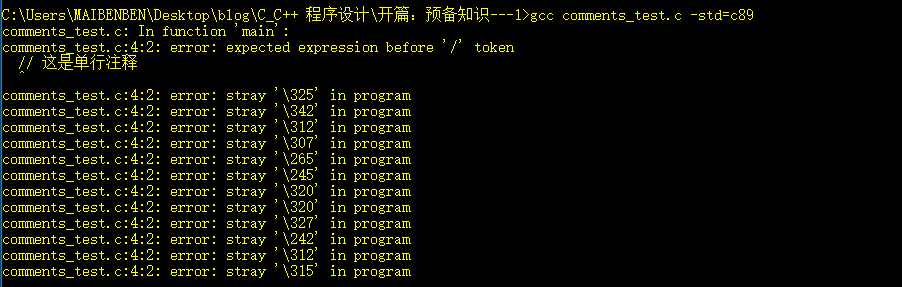
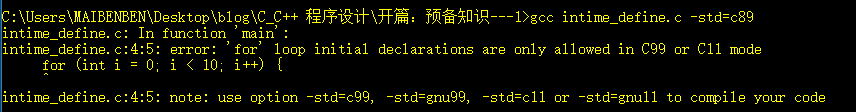
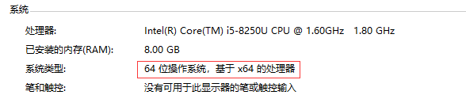

[TOC]

## 前言

​		大家好，好久不写博客了，久违的感觉。这篇文章是 `C/C++ 程序设计`专栏的第一篇文章。说实话这个专栏申请了有半年多了，但是到目前为止仍然没有文章产出，本来打算今年年初开始动笔，其中又因为毕业的相关事宜耽误了很长时间，想想真的是非常惭愧。从另一个方面也暴露出了自己在时间管理方面能力的不足。以后真的是得多注意这方面的东西。好了，我们还是进入正题吧。说实话 C语言是我最早接触的编程语言，大一大二写算法代码的时候都是用的 `C` 和 `C++`，当时觉得 C语言从某些方面来看非常鸡肋，比如说我们用标准 `C语言` 语法无法写出漂亮的图形化界面，只适用于做数据处理。后来当我真正对 C语言有了一个更加深入的了解了之后才发现以前的自己太年轻。想要写出图形界面我们随便使用一种图形化框架（MFC、QT 等）就可以达到目的。这些图形化框架是遵循标准 C/C++ 语法的，在这个基础上各种图形库框架提供了各种类库来供开发者使用，这些类库就包括了一些图形化控件（窗口、按钮、对话框等）。因此我们借助这些框架提供的各种类库组合起来就可以写出漂亮的界面。而当我们熟悉了这些框架的相关原理（当然这里面包括很多东西，比如窗口的声明周期、组件的绘制原理和时间、整个程序框声明周期、消息处理机制等）后。回过头来我们会发现这些框架是在 C/C++ 语法的基础上将操作系统提供的一些接口以某种思想（面向对象编程）封装了起来，让我们可以通过调用其封装的相关 API 来间接的调用操作系统的相关接口。其本质上还是需要遵循 C/C++ 语法规则（当然，能设计出一款图形库框架是非常了不起的）。因此本专栏的重点是放在 C/C++ 的语言特性和一些必要的底层原理上，不会从 0 开始介绍 C/C++ 的语法。同时，对于图形化相关的东西不会过多介绍。也算是对 C/C++ 做一个学习总结。作者水平有限，如果文章中有不正确之处还望多多指点，谢谢大家。

​		在正式开始之前我们还是有必要了解一下 C/C++ 语言的相关背景。C语言最早是在贝尔实验室为了开发 Unix 操作系统而设计的，在此之后 C语言由于其高效、可移植（相对于当时来说）、强大、灵活等特性广为流传。之后在 1989 年 美国国家标准协会（ANSI）发布了第一个 C语言标准，国际标准化组织于 1990 年采用了这套 C 标准（ISO C）。ISO C 和 ANSI C 是完全相同的标准。ANSI/ISO 标准的最终版本通常叫作 C89（因为 ANSI 于 1989 年批准该标准）或 C90（因为 ISO 于 1990 年批准该标准）。1994 年，ANSI/ISO 联合委员会开始修订 C 标准，为了弥补 C89 标准中存在的一些缺陷。最终在 1999 年发布了 C99 标准。而在 2011 年发布了 C11 标准。关于 C11，我们之后还会介绍。20 世纪 90 年代，许多软件公司开始改用 C++来开发大型的编程项目。C++在 C 语言的基础上嫁接了面向对象编程工具。C++几乎是 C 的超集，这意味着任何 C 程序差不多就是一个 C++程序。我们在写 C语言程序的时候将源文件后缀名改为 `.cpp` 就可以在其中使用 C++ 的语言特性了。

​		在定制了语言标准之后，许多编译器提供商就开始根据标准来设计并制作对应的编译器，当然编译器厂商可能并不会完全按照标准来，就好像浏览器内核厂商并不会完全按照 W3C 定制的 html 等前端标准来制作内核一样，因此同一份 html 代码在不同厂商的浏览器上可能会有不同的表现。当然不必对这些过于担心，因为大部分编译器厂商还是紧跟标准来制作编译器的。这其中包括两个非常有名的编译器：GCC 和 Clang。其中，GCC 作为 GNU（“GNU’s Not UNIX” ）的产品之一，GNU 是一个致力于开发大量免费 Unix 产品的项目。而 GCC 用来作为语言编译器。编译 C/C++ 源代码是它的功能之一。Clang 隶属于 LLVM 项目，该项目是与编译器相关的开源软件集合，Clang 是该项目的产品之一，用于处理 C/C++ 代码。在本专栏中我们主要采用 GCC 作为编译器。

## 程序的编译和运行

​		CPU 负责处理指令和数据，每一个 CPU 指令都有一个对应的二进制数字编码表示，而我们书写的 C语言程序都是文本文件（当然，本质上文本文件也是二进制文件），这种文本文件是 CPU 不能直接识别的，因此我们需要一个“翻译官”，负责将我们书写的源程序代码文件翻译成 CPU 可以识别的二进制指令和数据。这个“翻译官”就是我们上面提到的编译器。拿 C语言来说，我们在写好一个 C语言源程序之后，需要对源程序成功编译、链接等步骤之后才可以得到对应的可执行程序文件，具体步骤为：预处理->编译->汇编->链接。这些具体步骤中细节内容颇多，我们将在放在下一篇文章中介绍 GCC 相关知识点时一起探讨。当我们书写的源程序经过上述编译步骤后，编译器会生成一个可执行的二进制文件，这个二进制文件的格式是符合操作系统对可执行文件内容格式要求的。这种文件在 Windows 系统上的后缀名一般为 `.exe`。当然后缀名本身并不能改变文件内容和相关属性，它能决定的是操作系统默认用什么方式来处理该文件而已。比如一个后缀名为 `.txt` 的文件，Windows 系统会默认使用记事本程序打开它，当然你也可以改变这种默认行为，比如你可以通过浏览器打开一个 `.txt` 的文件，通过右键->打开方式即可选择打开这个文件的应用程序。当一个文件的后缀名是操作系统无法识别的时候，操作系统就会弹框提醒你选择一个本地存在的应用程序去打开它或者从互联网上下载并安装一个程序来打开它。而某些时候通过某些应用程序打开一些文件的结果可能并不是你想要的，比如你试图用一个只支持 `GBK ` 编码的文本查看器去打开一个以 `UTF-8` 编码的文本文件，就会出现乱码现象。出现这些现象的原因终归来说都是文件的二进制内容格式不符合打开这个文件的程序可以识别的二进制内容格式的要求。如果你经常使用电脑，这些现象你应该都遇见过。好了，回到刚刚的话题，当我们得到了一个可执行程序文件之后，我们运行它（通过命令行启动或者双击鼠标左键）时，操作系统默认不会将这个可执行程序文件用其他应用程序打开，因为它本身就是操作系统直接可以分辨并执行的，此时操作系统默认会将其作为一个应用程序来执行。这个过程的具体细节相当复杂，我们在之后的文章会再探讨。可以粗略概括为操作系统就会将其中的相关数据（指令也是数据）从磁盘装载进内存中，并在内部创建一个新的进程来储存这个正在运行的程序信息并且进行相应的控制，之后找到该程序的入口指令地址并开始执行里面的一条条指令。

## 库

​		库可以理解为仓库，或者已经存在的东西，在计算机中可以看成可以直接使用的代码或功能实现程序块。我们可以将使用库大致总结为两种：上层调用下层库和调用第三方库

#### 上层调用下层库

​		这种总结方法来源于分层思想：下层实现某个功能，上层使用下层提供的功能实现更加复杂的功能。从这个角度上来说，所有利用高级编程语言实现的功能中都使用了库，就算我们写一个最简单的打印 `Hello world` 的程序也是：

```c
#include <stdio.h>

int main() {
    printf("Hello world");
    return 0;
}
```

这里我们调用了 `printf` 函数，这个函数是 C语言的库函数，因此，我们算是使用了 C语言提供的库。而 `printf` 函数内部会进行系统调用，将要输出的字符通过操作系统提供的系统调用输出到标准输出文件，默认即为屏幕，那么 `printf` 函数使用了操作系统提供的库。之后操作系统通过设备驱动程序将数据集（包括这里打印的字符）传递给显示屏完成硬件调用。这里的分层思想为 程序员->C语言库->操作系统库->设备驱动程序库。计算机中很多应用都是基于这种分层思想来进行的，即底层完成成对应功能，上层调用底层提供的功能来完成更加复杂的功能......。典型的一个例子之一就是计算机网络协议的分层思想。

#### 调用第三方库

​		这种总结方法主要针对应用层而言。我们在使用第三方提供的服务时，我们需要调用第三方服务提供商提供的库。一个典型的例子即为第三方登录，我们来拿第三方登录举例。如果我们的应用/网站需要获取第三方用户的信息，我们需要先向第三方开放平台申请 `AppKey`，即为我们应用在第三方登录后台的标识。同时，我们还需要下载并将第三方提供的库加入到我们的工程中，当用户进入我们的网站并使用第三方进行登录的时候。我们的网站代码会调用第三方提供的登录验证库并传入我们的 `AppKey`，第三方后台在通过 `AppKey` 验证我们的身份后在用户端会拉起登录界面，在用户完成登录后第三方后台会将登录用户的部分信息以回调参数的形式传递给我们，以便我们进行下一步操作。在这里我们并不知道第三方处理问题的细节，比如 `AppKey` 是以何种加密方法加密的，验证 `AppKey` 的服务器域名等。这些属于第三方业务的机密，外人不会随便知道，即便是提供给我们的库代码也是经过混淆之后的。但是我们也不需要知道太多的内部技术细节，我们只需要知道库的功能和这个库大体的流程就可以将这个功能加入我们的业务中了。

​		既然我们可以使用别人提供的库，那么我们自然可以编写一个可以实现某种功能的代码块并将其编译成库，这样，我们不仅可以将其提供给别人使用，在之后我们再遇见这种功能需求时我们就可以直接使用了。使用不同的编程语言，我们可以创建不同的库，比如通过 C语言我们可以创建 C语言库（`Linux` 下后缀名为 `.so` 或者 `.a`），而通过 Java 提供的一些工具我们可以创建 Java库（`.jar` 文件）。我们将在下一篇文章中详细讨论如何创建 C语言库。

## C 的语法误区

​		先有 C语言后有 C++语言，C++语言在 C语言的基础上添加了很多新特性，是 C语言 的超集，这意味着你可以在 C++ 中使用所有 C语言库函数。很多小伙伴会将 C++ 的一些语法特性用到 C语言中，或者说本身想使用 C语言写程序，却不经意间使用了 C++的语法特性。当然 C 和 C++ 语言之间的语法基本相同，但在某些方面还是有一些区别，我们来看一下这些语法上的不同点。

#### 注释

​		早期的 C语言（C89/C90）标准只支持 `/*注释内容*/` 类型的注释，不支持当行注释，如果你在 C语言源文件中使用了单行注释（`// 注释内容`），编译器会报错：

```c
#include <stdio.h>

int main() {
    // 这是单行注释
    printf("Hello world");
    return 0;
}
```

编译结果：



​		可以看到，当我们使用 C89 标准（通过 `-std=` 参数指定编译时采用的语言标准）来编译 C语言源文件时其不能识别单行注释。单行注释这个特性在 C99 标准中被加入，因此我们采用 `gcc comments_test.c -std=c99` 命令时即可正常编译。当然我们也可以直接将文件后缀名改为 `.cpp`，这样的话我们就可以使用 C++语言特性，显然，C++ 是支持单行注释的。

#### 即时变量

​		早期的 C语言（C89）标准不允许使用即时变量。何为即时变量呢？比如下面的代码：

```c
#include <stdio.h>

int main() {
    for (int i = 0; i < 10; i++) {
    	printf("i = %d\n", i);        
    }
    return 0;
}
```

​		这里我在 `for` 循环中定义了变量 `i` 并且直接使用 `i` 来进行 10 次循环。这个 `i` 即为即时变量，这在 C89 标准中是不被允许的，编译结果如下：



​		C89 要求变量的定义和使用在两条独立的语句中，我们可以把上面的程序段改为：

```c
int i;
for (i = 0; i < 10; i++) {
    printf("i = %d\n", i);
}
```

​		当然如果你不更改程序段的话，那么解决方法和上面注释小节是一样的：要么使用 C99 标准，或者更改文件后缀名为 `.cpp` 以使用 C++ 特性。

## 机器字长

​		每一台计算机都有一个字长位数，代表的是这台计算机最大的寻址范围，在现在计算机中这个值一般为 32 或者 64（对于 PC 来说，字长为 64 的计算机偏多）。

​		这是我的 PC 的系统部分属性，它是 64 位字长的，意味着它可以寻址的范围为 `2^64 = 18446744073709551616 = 18014398509481984(K) = 17592186044416(M) = 17179869184(G) `。而对于 32 位字长的机器来说，其可以寻址的范围为 `2^32 = 1024*1024*1024*4 = 4294967296 = 4194304(K) = 4096(M) = 4(G) `。注意，这里的 4G 是计算机可以寻址的个数，是数量单位，不是大小单位。而因为计算机系统最小的寻址单元为 1 byte，也就是说计算机系统会为每一个地址分配一个字节的内存，所以上面 32 位字长的机器最大寻址的地址范围为 4GB（这里的 B 为 byte，1 byte = 8bit）。这也是为什么 32 位机器最多只能使用容量为 4GB 的内存条的原因。那么这个机器字长和 C语言有什么关系呢？我们知道 C语言支持的基本数据类型有 `char`、`short`、`int`、`long`、`float`、`double` 和指针。这些数据类型在 32 位字长和 64 位字长的机器中所占用的字节数如下表:

| 数据类型 | 32位所占用字节数 | 64位所占用字节数 |
| -------- | ---------------- | ---------------- |
| char     | 1                | 1                |
| short    | 2                | 2                |
| int      | 4                | 4                |
| float    | 4                | 4                |
| long     | 4                | 8                |
| double   | 8                | 8                |
| 指针     | 4                | 8                |

​		我们可以看到，`long` 类型在 32 位机器和 64 位机器中占用的内存字节数不一样。那么如果我在 64 位机器上使用 `long` 类型编写了一个程序，我期待其能储存的数据范围是 `-2^63 ~ 2^63-1`。而当这份程序的源代码移至到 32 位机器上重新编译运行的话，里面的 `long` 类型占用的内存变成了 4 个字节，对应数据储存范围变为了 `-2^31 ~ 2^31-1`。这样的话极易发生数据溢出，导致程序异常。为了解决这个问题，**C99 标准**中引入了两个新的数据类型：`int_32` 和 `int_64`。对应为 4 字节的 int 类型和 8 字节的 int 类型，而且这两种数据类型在不同字长的机器中占用的字节数都是一样的，即都是 4 个字节和 8 个字节：

| 数据类型 | 32位所占用字节数 | 64位所占用字节数 |
| -------- | ---------------- | ---------------- |
| int_32   | 4                | 4                |
| int_64   | 8                | 8                |

​		这样的话当我们需要使用 8 个字节的 int 类型时使用 `int_64` 代替`long` 即可解决上面提到的 `long` 类型在不同字长机器中占用字节数不统一的问题。

​		好了，在这篇文章中我们简单的介绍了一下一些基础概念，包括 C语言的由来，编译器标准，程序的编译和执行等。在最后我们介绍了一下对于库的一些理解和 C语言的语法误区。那么这篇文章就到这里了。在下篇文章中我们将会详细介绍关于 GCC 编译器的使用，包括如何通过 GCC 编译 C语言程序、创建和编译 C语言库等等。

如果博文中有什么不正确的地方，请多多指点，如果觉得这边文章对你有帮助，请不要吝啬您的赞。

谢谢观看。。。