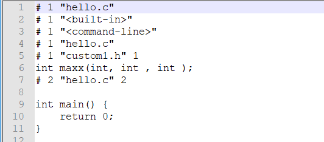
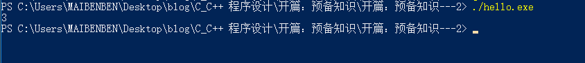

## 前言

​		在前一篇文章中我们大致介绍了 C语言的一些预备知识，对其中的某些常用知识点进行了一个概述。这篇文章中我们来通过实践的形式来加深对之前知识点的理解。

## 程序的编译过程

​		我们在上篇文章中提到 C语言编译器将一个源程序编译成可执行程序大致需要经过`预处理`、`编译`、`汇编`、`链接`这四个过程。我们来借助 GCC 编译器来详细看看这几个过程。在开始之前确保你的计算机已经成功安装了 GCC 编译器。Linux 系统是自带 GCC 的，如果你是 Windows 系统，则需要通过 MinGW 组件安装 GCC，具体过程可以参考 [这篇文章](https://www.cnblogs.com/ggg-327931457/p/9694401.html)。完成之后如果你在命令行中执行 `gcc -v` 命令可以得到 GCC 的相关信息证明 GCC 的相关程序组件安装完成：


#### 预处理

​		预处理是用来处理 C语言中的 `#include`、`#define` 等预处理指令的，每一个预处理指令有其对应的处理方式。比如遇见 `#include` 指令时将其包含的头文件内容插入到该指令所在位置。我们可以通过执行 `gcc -E 源文件路径 -o 输出文件路径` 指令来对 C语言源文件进行预处理操作。为了验证这个过程，我们自定义两个头文件：`custom1.h` 和 `custom2.h`。`custom1.h` 内容如下：

```c
int maxx(int, int, int);
```

我们在这个头文件里面声明了一个函数，名为 `maxx`，这个函数的目标功能为求出 3 个数中的最大值

`custom2.h` 内容如下：

```c
#include "custom1.h"
int minn(int, int , int);
```

在这个函数中我们通过 `#include` 指令将 `custom1.h` 头文件包含了，同时还声明了一个函数 `minn`，目的为求出 3 个数中的最小值。下面我们来写一段简单的源代码：

```c
#include "custom1.h"

int main() {
    return 0;
}
```

我们将其命名为 `hello.c`。然后在该文件同级目录下键入指令 `gcc -E hello.c -o hello.i`：


我们也可以通过 `cpp ` 程序来单独完成预处理这一过程：`cpp hello.c -o hello.i`。(这里的 `cpp` 为 `C Preprocessor` 的缩写)。我们可以在同级目录下发现多了一个 `hello.i` 文件，这个文件依然是一个文本文件，我们可以用文本浏览器查看其文件内容：



可以看到，除了添加了部分注释之外，`#include` 指令将 `custom1.h` 头文件中的文本内容复制到 `#include` 指令所在的位置了。那么当被包含的头文件中还包含了其他头文件时情况如何呢？我们拿上面的 `custom2.h` 头文件举例子，将 `hello.c` 的代码内容改为：

```c
#include "custom2.h"

int main() {
    return 0;
}
```

再执行同样的 gcc 指令：`gcc -E hello.c -o hello.i`，得到的 `hello.i` 如下：


通过结果我们可以知道预处理指令是嵌套进行的，在处理上面的 `custom2.h` 头文件时，发现其有 `#include "custom1.h"` 指令，于是继续处理这个 `#include` 指令...... 直到头文件中没有对应的预处理指令为止。

#### 编译

​		经过了第一步预处理之后，我们就可以将预处理操作输出的结果文件进行编译了，GCC 指令为  `gcc -S 预处理后的文件 -o 输出文件路径及文件名` 。我们来编译上文中得到的 `hello.i` 文件：`gcc -S hello.i -o hello.s`：


我们也可以通过 `ccl` 程序来单独完成编译这一过程：`ccl  hello.i -o hello.s`。此时得到的 `hello.s` 文件就为编译后的汇编文件，里面的代码为汇编代码：


#### 汇编

​		得到对应的汇编代码后，我们就可以通过执行汇编指令将对应的汇编代码转换为二进制文件了，GCC 指令如下：`gcc -C 汇编文件 -o 输出文件路径`。我们来将上文中的汇编文件转换为二进制文件，执行 `gcc -c hello.s -o hello.o`：


我们也可以通过 `as` 程序单独完成汇编这一过程：`as hello.s -o hello.o`。经过汇编过程之后得到的 `hello.o` 文件就是二进制文件了。如果我们用文本编辑器打开会得到一堆乱码：


但是此时得到的 `hello.o` 文件还不能执行，如果想让其可执行，我们还需要进行链接步骤。

#### 链接

​		我们已经通过上面的 `汇编` 步骤得到二进制文件了，为什么还不能执行呢？因为我们上面的到的不是真正的可执行文件，其缺少一些必要的系统入口代码和库实现文件。我们需要通过链接操作来添加必要的系统入口代码和程序中使用到的库实现文件。启动链接的指令为：`gcc hello.o -o hello.exe`。事实上，这也是 GCC 将源文件直接编译为可执行文件的指令（`gcc 源文件 -o 可执行文件输出路径`）。


我们也可以通过 `ld` 程序单独完成链接这一过程：`ld hello.o -o hello.exe`。我们现在得到了可执行程序了。通过命令行执行：


纳尼，什么也没输出吗？对的，因为我们的源程序中的 `main` 方法什么也没有做，是一个空方法。好了，我们已经成功的通过 4 个编译步骤将 C语言源程序 "变" 成了可执行文件。如果你已经很熟悉这个过程或者不想这么麻烦，你也可以直接使用 `gcc 源文件路径 -o 可执行文件输出路径` 命令直接将源程序编译成可执行文件。

上面说到了链接过程需要加入必要的系统入口代码和库实现文件，因为系统入口代码和各个操作系统有关，而 GCC 在链接过程中会帮我们添加。所以我们来着重讨论一下后面的库实现文件。比如说我们上面在 `custom1.h` 中声明了一个 `int maxx(int, int, int )` 函数用来求出 3 个数中的最大值。但是我们并没有实现这个函数，即没有为这个函数编写对应的函数体。所以编译器在链接过程中需要寻找对应函数的实现库文件并将其加入调用了该函数的源程序编译得到的 `.o` 文件中。在这里链接器不需要寻找该函数的实现库文件，因为我们在 `hello.c` 源程序文件中的 `main` 函数中并没有调用这个 `maxx` 函数，所以此时链接过程只需要将之前的 `hello.o` 文件中加入必要的系统启动代码后即可以生成可执行文件。这也是之前我们可以成功执行链接得到可执行文件的原因。那么如果我们把 `hello.c` 的源代码改成如下呢：

```c
#include <stdio.h>
#include "custom1.h"

int main() {
    int maxValue = maxx(1, 2, 3);
    printf("%d\n", maxValue);
    return 0;
}
```

即我们再 `main` 函数中调用了 `custome1.h` 头文件中声明的函数 `maxx`，编译过程中会有什么变化呢？你会发现你可以成功的执行编译的前三个步骤：`预处理`、`编译`、`汇编`，在将汇编过程产生的 `.o` 文件进行链接成可执行文件的时候会得到以下错误信息：


这个问题相信很多小伙伴都遇见过，意为未定义指向 `maxx` 函数的引用。即链接器找不到指向 `maxx` 函数的实现。这时我们可以有两种解决方法：

1、自己写一个实现了 `maxx` 函数的源程序文件(`.c`)，将其编译成 `.o` 文件，并和 `hello.o` 一起执行链接。

2、找到一个实现了 `maxx` 函数的库文件并和 `hello.o` 一起执行链接。

这两种方法的核心都是需要补齐 `maxx` 函数的实现库文件，并在链接过程中加入 `hello.o` 中。当然最简单的方法就是直接在 `hello.c` 源文件中自己实现一个 `maxx` 函数。我们在这里选择第一种方法，即自己写一个实现了 `maxx` 函数的源程序将其编译后链接和 `hello.o` 一起进行链接过程。

## 创造和使用库

​		为了解决上面的问题，我们需要写一个 C语言源文件并将其编译成 `.o` 文件，我们在 `custom1.h` 的同级目录下新建一个 `custom1.c` 文件

```c
int maxx(int a, int b, int c) {
	return a > b ? (a > c ? a : c) : (b > c ? b : c);
}
```

下面我们需要对其进行预处理、编译、汇编三个步骤得到对应的 `.o` 文件，为了简单，这里直接使用命令 `gcc -c custom1.c -o custom1.o` 命令将源程序文件其直接编译成 `.o` 文件：


现在我们已经得到了实现了 `maxx` 函数的 `.o` 文件 `custom1.o`。我们重新启动链接，将 `hello.o` 和 `custom1.o` 文件链接成一个可执行文件，执行命令： `gcc hello.o custom1.o -o hello.exe`:


可以看到，这次链接没有报错，我们来执行得到的可执行文件（`hello.exe`）看看：

Ok，完成。其实在这个过程中我们就已经创建了一个我们自己的库：`custom1.o`，里面实现了一个函数：`maxx` 可以求出三个整数中值最大的数。使用到这个库的程序可以说成是这个库的库依赖程序。

​		思考一下，如果每次链接一个库都需要将其加入 GCC 的命令行参数中，比如上面如果我们还需要链接一个名为 `custom2.o` 的库，那么我们就会写成 `gcc hello.o custom1.o custom2.o -o hello.exe`。那么假设我们有一个非常大的程序，其需要链接很多个 `.o` 文件，那么我们总不能每编译一次就写一次这么长的命令行吧。此时我们可以借助 `ar` 工具（ar 为 `archive` 的缩写，它并不是一个编译工具，而是一个文件打包工具）将多个 `.o` 文件打包成一个大的库文件。命令为：`ar -rcs 生成的库文件路径 xx1.o xx2.o xx3.o ...`。

我们来试验一下，在 `custom2.h` 同级目录下（建议将当前创建的所有文件都放在同一目录）。创建一个新的 `custom2.c` 文件，来实现 `minn` 函数：

```c
int minn(int a, int b, int c) {
    return a < b ? (a < c ? a : c) : (b < c ? b : c);
}
```

同样的通过 `gcc -c custom2.c -o custom.o` 将其编译为 `.o` 文件。这时我们就有了两个 `.o` 文件：`custom1.o` 和 `custom2.o`。我们来通过 `ar` 程序打包：


完成之后我们就有了一个大的库文件，这其实就是我们创建的库文件，里面包含了 `custom1.h` 和 `custom2.h` 头文件中的声明的函数实现。既然我们在上面 `custom2.o` 中实现了 `minn` 函数，那么我们就可以在主程序的 `main` 函数中调用 `minn` 函数了。修改主程序(`hello.c`)代码如下：

```c
#include <stdio.h>
// 这里因为 custom2.h 已经 #include "custom1.h" 了，所以这里直接包含 custom2.h 即可
#include "custom2.h"

int main() {
    int maxValue = maxx(1, 2, 3);
    int minValue = minn(1, 2, 3);
    printf("max value = %d\n", maxValue);
    printf("min value = %d\n", minValue);
    return 0;
}
```

我们直接通过命令：`gcc hello.c libcustom.a -o hello.exe` 即可完成整个编译链接等过程，在链接过程中会自动将 `libcustom.a` 库文件和汇编得到的 `hello.o` 进行链接，得到可执行文件，不过这个过程被隐藏了，我们看不到。整个操作结果如下：


成功！到这里我们已经成功的创建了并使用了我们自己的库。不知道小伙伴有没有好奇，在上面我将 `custom1.o` 和 `custom2.o` 打包成一个库的时候为什么要将打包后的库文件命名为 `libcustom.a`。这不是偶然，我们将在下面的小节中讨论这个问题。

## 动态库和静态库

​		在上面我们已经成功的创建并使用了我们自己的库（`libcustom.a`）。为什么我要将库文件命名为 `libcustom.a` 呢？这其实和库文件的种类和命名标准有关。库文件种类分为两种：动态链接库和静态链接库。

#### 动态链接库

​		动态链接库即为动态加载的，在链接时不将整个库文件链入可执行程序中，只是将库文件的信息放入可执行文件中。在可执行程序运行时如果需要使用该动态链接库中的某个模块或者函数时再进行动态加载。这样的话可以减少可执行程序文件的大小。在 Linux 下动态链接库的文件后缀名为 `.so`。在 Windows 下为 `.dll`。我们可以通过 GCC 来创建动态链接库文件，为了方便，这里直接使用上文中得到的两个 `.o` 文件（`custom1.o` 和 `custom2.o`）进行操作。我们通过命令：`gcc custom1.o custom2.o -shared -o libcustom.dll`。因为我的 PC 为 Windows 系统，因此这里将生成的动态链接库文件后缀名设置为 `.dll`，如果是 Linux 系统，那么文件后缀名改为 `.so`。我们也可以直接使用 `custom1.c` 和 `custom2.c` 两个源程序文件来创建动态链接库：`gcc custom1.c custom2.c -shared -o libcustom.dll`。不过这样需要将两个源程序文件重新编译成 `.o` 文件再创建对应的链接库，因此相比直接使用 `.o` 文件来说速度会更慢。我们来看看操作结果：


成功。这里我们用 GCC 编译时用到了 `-L` 和 `-l` 参数，关于 GCC 的常用编译参数我们下个小节再进行讨论。上面提到过：使用动态库链接到的可执行程序是在程序运行并使用到对应库中的数据时被加载，即为运行时加载。也就是说虽然我们通过动态库链接得到了可执行程序。我们也不能将对应的动态库删除，否则当程序运行时找不到要加载的动态链接库就会报错。这里我有意删除了生成的 `libcustom.dll` 动态库文件，运行结果如下：


如果小伙伴对 Windows 系统接触的多的话，我相信你一定遇见过这种类型的错误。遇见这种错误时通常重新安装程序可以解决。但其本质原因还是因为丢失了某些程序运行时必须的动态链接库文件导致的。

我们再来此时看看生成的 `hello.exe` 的文件大小：


这里我们先暂且记下，待会和使用静态链接库生成的可执行文件进行一个对比。

好了，这里我们成功的创建并使用了动态链接库。这个动态链接库不仅可以给我们用，还可以提供给运行在**其他相同操作系统**的程序中使用。这就是库文件存在的最大价值：共享性。我们在实现一些功能时，可以先查找并使用已经存在的库文件，一方面减少我们自己的工作量，另一方面可以保证代码质量（库文件被多人使用过，其正确性已经被各种数据场景验证过）。

#### 静态链接库

​		静态链接库的作用和动态链接库一样，都是用来共享，减轻工作量和提升代码质量。不过在机制上有所不同。上问提到：使用动态链接库文件时并不是将整个库文件链入可执行程序文件中，而是在可执行文件中存入动态链接库文件的相关信息，以供程序在运行过程中在需要时进行动态链接库文件的加载。而对于静态链接库来说，其在链接过程中就将整个库文件链入可执行程序文件中，这样程序在运行时就无需动态加载库文件。也就是说生成的程序就是一个完整的可执行程序，无需依赖外部库文件。但是生成的可执行文件大小肯定比使用动态链接库更大。我们其实在上面已经生成过静态链接库文件了，聪明的小伙伴已经猜到了，没错，就是在上面通过 `ar` 工具生成的 `libcustom.a`。静态链接库文件的后缀名在 Windows 和 Linux 系统中一样，都是 `.a`。我们可以借助 `ar` 工具将多个**已经编译好的 `.o` 文件**打包成一个静态链接库文件。因为 `ar` 是一个打包工具，不具备编译功能，因为我们必须提供已经编译好的文件让其进行打包。这里我们直接将上面已经编译好的 `custom1.o` 和 `custom2.o` 文件打包成静态链接库文件：`ar -rsc libcustom.a custom1.o custom2.o`。操作结果如下：


我们来看看此时生成的可执行文件的大小：


比使用动态链接库生成的可执行文件大几百字节左右。这是因为链接的静态库比较小，差距不是特别明显，当链接大型库文件时，这两种类型对应生成的可执行文件的大小差距就很明显了。同时，因为使用的是静态链接库。因此即使删除了 `libcustom.a` 库文件后程序依然可以正常执行。这里不做演示了，小伙伴们可以自行尝试。

我们在上面生成动态链接库和静态链接库文件时，采用的文件名都是以 `lib***.a` / `lib***.dll` 的形式，即为以 `lib` 前缀开头。这是因为 GCC 在进行链接库文件查询时会自动会为参数指定的库文件名加上前缀和对应的后缀，比如上面我们采用了命令行 `gcc hello.c -L"." -lcustom -o hello.exe`，这里通过 `-L` 参数来指定额外链接库所在的目录，这里指定为 `"."` 即为当前源程序文件所在的目录（相对目录）；再通过 `-l` 参数指定要加载的库文件，这里指定的库文件为 `custom`。GCC 自动补全前缀后的库文件名为 `libcustom`。那么后缀名如何确定呢？GCC 优先使用动态链接库，也就是说当链接库文件夹中存在动态链接库文件的时候，使用动态链接库文件进行链接操作，此时确定的库文件名为 `libcustom.dll`（Windows 系统）或者 `libcustom.so`（Linux 系统），当链接库文件夹中不存在动态链接库文件时，才使用静态库文件，你也可以在编译命令中加入 `-static` 参数来禁止 GCC 使用动态库进行链接，这时 GCC 只会使用静态库来进行链接，生成可执行文件也会更大。因为在这里对应目录下没有动态链接库文件（`libcustom.dll`），只有静态链接库文件（`libcustom.a`），因此在这里确定的库文件名为 `libcustom.a`。整条命令的含义为将 `hello.c` 源程序编译为可执行程序文件 `hello.exe`，在链接过程中将 `hello.c` 文件所在目录下的 `libcustom.a` 文件作为需要额外链接的静态库文件。 在我们之后在进行创建链接库文件时应该遵循这种命名规则，这样我们创建的库文件才具有通用性。

## GCC 常用编译参数

​		我们先简单总结一下GCC 编译 C语言程序的过程：先进行预处理，查找源文件中包含（`#include`）的头文件和其他文件，找到之后进行内容处理和替换，在预处理指令全部处理完成后进行编译，将 C语言代码编译成汇编代码然后进行汇编。汇编过程将汇编代码变成二进制文件，最后经过链接处理生成可执行文件。在 Linux 系统下，GCC 在预处理时默认会在 ` /usr/include` 文件夹中搜索使用到的头文件，在链接时会在 `/usr/lib` 文件夹中搜索要链接的库文件，Windows 下为 MinGW 安装目录的 `include` 和 `lib` 子目录下。我们在上面已经用过了 `-L` 和 `-l` 参数，分别用来指定 GCC 在链接过程中需要**额外**链接的库文件目录和链接的库名。这是在链接阶段使用到的参数，我们还可以通过 `-I` 参数指定 GCC 在预处理过程中需要**额外**搜索的头文件目录路径。假设我们有以下代码：

```c
#include <stdio.h>
#include "sub-header.h"

int main() {
    return 0;
}
```

我们将其命名为 `header_test.c`。可以看到我们包含了一个新的头文件，那么我们新建一个空的 `.h` 文件，名为 `sub-header.h`，为了测试，我们将其放在 `header_test.c` 所在目录的的子目录 `sub-header` 下：


然后用 GCC 对其进行编译：


这里报错了，说没有 `sub-header.h` 文件。这个很好理解解决这个问题可以有两个方法：

1、将上面 `header_test.c` 的 `#include "sub-header.h"` 代码改为 `#include "./sub-header/sub-header.h"`，即使用相对路径将 `test_header.h` 正确的路径包含进代码中。

2、将 `sub-header.h` 文件放在 GCC 默认会搜索的头文件目录中，Linux 下为 `usr/include`，Windows 下为 MinGW 安装目录的 `include` 子目录下。

3、将 `sub-header` 的相对路径 / 绝对路径通过 `-I` 参数加入 GCC 编译命令中，使 GCC 将 `sub-header` 目录作为头文件搜索目录之一。

这里我们采用第 3 种方式，将编译命令改为 `gcc header_test.c -o header_test.exe -I"./sub-header"`：


OK，成功编译没有报错，因为在 `header_test.c` 的 `main` 函数中我们什么都没有做，因此这里运行 `header_test.exe` 时没有任何输出。

除了这几个参数之外。GCC 还有非常多的编译参数，这里列举几个：

`-isysroot xxx`：将 `xxx` 作为头文件搜索的逻辑根目录，和 `--sysroot` 参数类似，不过只作用于头文件。

`--sysroot=xxx`：将 `xxx` 作为逻辑根目录。编译器默认会在 `/usr/include` 和 `/usr/lib` 中搜索头文件和库，使用这个选项后将在 `xxx/usr/include` 和 `xxx/usr/lib` 目录中搜索。如果使用这个选项的同时又使用了 `-isysroot` 选项，则此选项仅作用于库文件的搜索路径，而 `-isysroot` 选项将作用于头文件的搜索路径。

`-std=xxx`：选择编译时采用的 C语言标准，不同的标准支持的语法和 API 会略有不同。比如 `-std=c89` 指名是用 `c89` 标准编译程序。`-std=gnu99` 使用 ISO C99 标准进行编译，同时加上一些 GNU 扩展。

`-Ox`：编译时采用的优化等级，有 `O0`, `O1`, `O2`, `O3` 4 个选项。默认为 `O1`（偷偷告诉你，`O2` 和 `O3` 等级的编译优化支持尾递归）。

`-m32` 和 `-m64`：生成适用于 32 位 / 64 位机器字长计算机的可执行程序文件。

关于其他的 GCC 编译参数，可以参考 [GCC 使用帮助](https://gcc.gnu.org/onlinedocs/gcc/index.html#SEC_Contents)

## make 和 makefile

​		当我们在编译大型程序的时候，一次性要编译多个文件，此时我们的 GCC 编译命令会很长，所以每一次编译的时候都去写一遍 GCC 编译命令是一件非常低效的事。因此 GCC 中提供了 `make` 工具（和 `ar` 类似，是一个工具类程序）让我们可以更方便快捷的进行大型程序编译。

要在项目中使用 `make`  工具，我们需要在项目文件夹下编写 `makefile` 文件，在执行 `make` 程序的时候，它会到当前工作目录下寻找 `makefile` 文件并读取其中的内容并按照 `makefile` 的内容来执行对应的操作。我们来实践一下，新建一个文件夹，名为 `make-test`，把这个文件夹作为新的工程目录。然后我们将上面书写过的 `hello.c`, `custom1.h`, `custom1.c`, `custom2.h`, `custom2.c` 文件复制进入 `make-test` 文件夹中。这几个文件的内容如下。

`hello.c`:

```c
#include <stdio.h>
// 这里因为 custom2.h 已经 #include "custom1.h" 了，所以这里直接包含 custom2.h 即可
#include "custom2.h"

int main() {
    int maxValue = maxx(1, 2, 3);
    int minValue = minn(1, 2, 3);
    printf("max value = %d\n", maxValue);
    printf("min value = %d\n", minValue);
    return 0;
}
```

`custom1.h`:

```c
int maxx(int, int , int );
```

`custom1.c`:

```c
int maxx(int a, int b, int c) {
	return a > b ? (a > c ? a : c) : (b > c ? b : c);
}
```

`custom2.h`:

```c
#include "custom1.h"

int minn(int , int , int );
```

`custom2.c`:

```c
int minn(int a, int b, int c) {
    return a < b ? (a < c ? a : c) : (b < c ? b : c);
}
```

最后，我们在 `make-test` 目录下新建一个名为 `makefile` 的文件并使用文本编辑器打开它。我们在 `makefile` 文件中输入如下内容并保存：

```shell
hello.exe: custom1.o custom2.o
		gcc hello.c custom1.o custom2.o -o hello.exe
custom1.o:
		gcc -c custom1.c -o custom1.o
custom2.o:
		gcc -c custom2.c -o custom2.o
```

最后我们在 `make-test` 工作目录下命令行中执行 `make` 命令，这里需要注意的是在 Windows 系统下 MinGW 中 `make` 程序被命名为了 `ming32-make.exe` 但是功能还是不变的，如果你不习惯的话可以在 MinGW 安装目录下的 `bin` 子目录下找到这个程序文件并将其重命名为 `make.exe` 即可。这里我采用的是原文件名：


可以看到，通过 `make` 和 `makefile` 我们成功的得到了可执行程序文件。下面我们来探讨一下 `makefile` 文件的写法。

我们可以将 `makefile` 内容看做是以任务为最小单位驱动的。每一个任务的格式为：

```shell
任务名: 依赖的任务1 依赖的任务2 依赖的任务3 ... 依赖的任务n
		完成这个任务需要执行的命令
```

其中，**"完成任务需要执行的命令" 部分需要和首部空开一个以 8 个英文字符宽度为单位的 tab 或者两个以 4 个英文字符宽度为单位的 tab，不能用视觉上宽度相同的多个空格来代替 tab**。

我们按照上面的规律来比对一下之前写的 `makefile` 文件的内容。首先是 `hello.exe` 任务，可以看到这个任务依赖两个任务：`custom1.o` 任务和 `custom2.o` 任务。意味着在执行 `hello.exe` 任务之前要确保 `custom1.o` 任务和 `custom2.o` 任务已经执行完毕。同时，完成这个 `hello.exe` 任务需要执行的命令为 `gcc hello.c custom1.o custom2.o -o hello.exe`，即编译 `hello.c` 源文件和链接 `custom1.o`， `custom2.o` 两个已经编译的二进制文件最终得到一个名为 `hello.exe` 的可执行文件。 接下来是 `custom1.o` 任务，这个任务不依赖任何其他任务，通过将 `custom1.c` 源文件编译为 `custom1.o` 文件即可完成。后面的 `custom2.o` 任务也是类似。

我们在使用 `make` 工具的时候，如果 `make` 命令后面不接任何参数，意味着执行当前工作目录下 `makefile` 文件定义的**第一个**任务，当执行某个任务时，`make` 会自动计算任务依赖关系的顺序并按照任务对其他任务的依赖性从小到大依次执行任务。比如上面书写的 `makefile` 在执行 `hello.exe` 任务之前，会先执行 `custom1.o` 任务再执行 `custom2.o` 任务，最后执行 `hello.exe` 任务（这使我想起了拓扑排序）。另一方面，`make` 将任务名当成这个任务生成的目标文件名，如果发现当前目录中文件名和当前任务名相同的文件已经存在，则不会再执行这个任务，不管源代码文件有没有更新。我们也可以单独执行某个任务，在 `make` 命令后面加入任务名即可，比如在上面我需要单独执行 `custom2.o` 任务，在命令行中执行 `make custom2.o` 即可。

有了 `make` 工具之后，我们就可以通过编写 `makefile` 文件来更加灵活的控制程序的编译了，比如当程序的某些源码文件发生更改了之后，我们只需要对这部分源程序生成的可执行文件重新编译即可，无需重新编译整个工程的程序代码。这对编译大型的程序是十分便利的。

最后，更正一个网络上存在的错误结论：`gcc` 只能编译 C语言不能编译 C++语言，`g++` 可以编译 C++ 语言。这个结论看似正确，因为你在使用 `gcc` 编译 C++ 源文件的时候会得到这样的报错信息，而是用 `g++` 的时候却可以成功编译得到可执行程序并运行：


**其实 `gcc` 和 `g++` 都可以编译 C++语言程序，只不过 `gcc` 默认不能链接 C++ 的链接库文件而已。**我们可以通过给 `gcc` 命令后面通过 `-L` 和 `-l` 参数链接需要的 C++库文件即可解决这个问题：


成功！这就说明在上面使用 `gcc` 编译 C++ 源文件的报错是发生在链接过程中的，并不是编译的前三个阶段（预处理、编译、汇编）中的。这里不做演示了，有兴趣的小伙伴可以自行尝试。

好了，在这篇文章中我们从实践的角度着重介绍了 C语言程序编译的流程和 GCC 的相关用法，在最后我们介绍了一下关于 `make` 工具的用法和 `makefile` 文件的书写规则。相信到这里你对 GCC 相关用法已经有了一个不错的了解，这也为之后的内容打下了基础。这篇文章就到这里了，我们下篇文章再见~

如果觉得本文对你有帮助，请不要吝啬你的赞，如果觉得文章内容有什么问题，请多多指点。

谢谢观看。。。