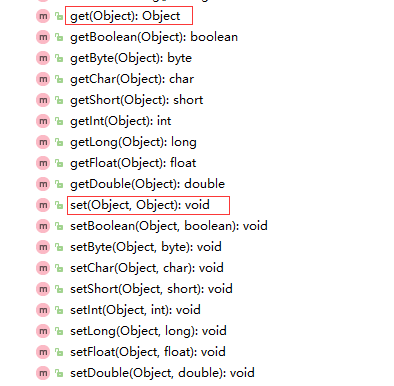
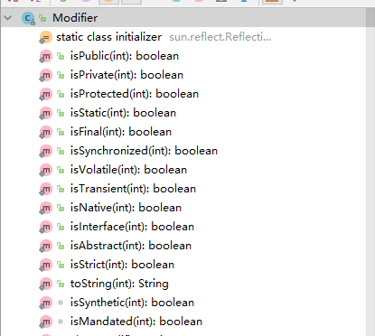
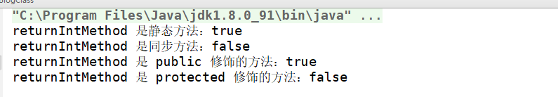
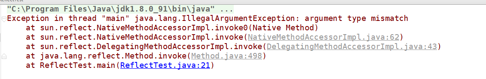

[TOC]

## 前言

不知不觉 2018 已经结束了，而 2019 年的 1 月份也已经到底了，先给各位小伙伴送一句迟到的祝福：祝大家新年快乐。回想起我刚刚接触 Java 的时候，对它的反射机制很是好奇，因为通过它可以访问一些类中的非 `public`  的属性和方法，当时觉得这真是一个非常厉害的黑科技啊，而当我对 Java 有了更深的理解之后，才发现这一切都归功于 Java 中的一个概念：类。

## 初探 Class

我们都知 Java 程序是运行在 JVM（Java 虚拟机）上的。而虚拟机处理类是采用动态加载机制的，即用到了某个类才将其加载进入内存中，而 Java 虚拟机内存可以分为 5 个部分：`程序计数器`，`虚拟机栈`，`本地方法栈`，`堆`，`方法区`。而 Java 中的类就是被虚拟机加载并解析成 `Class` 对象放进 `方法区` 中的。这样做很明显的一个好处是节省虚拟机内存，即只有用到了某个类才加载它。而在类加载的过程又有很多的细节，比如要加载某个类之前为了保证安全先得对其进行验证，看其中的数据是否符合一般的类标准，验证完成之后需要加载其父类，再之后解析类结构，提取其中的字段和方法，之后再初始化其中的静态变量和执行静态代码块...... 当然我们这里并不深入讨论这个过程，这篇文章中我们来认识一下描述一个类的类：`Class` 类。可能小伙伴会问了：什么叫描述类的类？有点拗口。确实有点拗口，我们先来这么看：首先，它是不是一个类？我们来看看源码：

```java
public final class Class<T> implements java.io.Serializable, GenericDeclaration, Type, AnnotatedElement {
	// ...
}
```

我们可以看到，其被定义为 `public final class Class<T>`，也就是说它是一个名为 `Class` 的类。那么它的作用是什么？我们来看看源码中对其的描述：

```java
Instances of the class {@code Class} represent classes and interfaces in a running Java application.
```

翻译过来即为：Class 的实例代表了在一个运行中的 Java 程序中的类和接口。即首先它是一个类，第二它是用来描述类和接口的，那么其就是一个用来描述类的类。从这个角度理解的话这个 `Class` 类的对象就是用来描述一个类的对象（描述类的类 -> 描述类的对象），这个描述的类是哪个类呢？这就和 `Class` 类中定义的泛型参数 `T` 有关了，假设我们现在要创建一个描述 `Object` 类的引用（注意是引用），我们会怎么写呢？根据上面的说法，我们可以写出这段代码：

```java
Class<Object> objClass;
```

那么我们已经定义了一个指向一个 `Class` 对象的引用，我们怎么给它赋值呢？很明显我们需要将一个对应类的类对象赋值给它，既然它是描述 `Object` 类的引用，那么我们当然要赋给它 `Object` 类的类对象了：

```java
Class<Object> objClass = Object.class;
```

其实虚拟机在执行这段代码对应的字节码（Java 代码在编译的时候被翻译成字节码，类似于汇编）的时候，虚拟机看到 `Object.class` 的时候，就会去加载 `Object` 类的类对象到方法区中，因为 `Object` 类是一切 Java 类的父类，因此 `Object` 类的类对象也是第一个被加载进入虚拟机中的。好了，相信现在得到其他类的类对象对你来说已经没有什么难度了。有些小伙伴可能会问了，我能不能通过 `new Class（...）` 的形式来创建 `Class` 对象呢？答案是不能，因为 `Class` 类中没有访问权限为 `public` 的构造方法：

```java
/*
 * Private constructor. Only the Java Virtual Machine creates Class objects.
 * This constructor is not used and prevents the default constructor being
 * generated.
 */
private Class(ClassLoader loader) {
    // Initialize final field for classLoader.  The initialization value of non-null
    // prevents future JIT optimizations from assuming this final field is null.
    classLoader = loader;
}
```

可以看到，唯一的构造方法被声明为 `private` 的，而这个构造方法其实是给类加载器在加载类时创建 `Class` 对象用的。也就是说通过类加载器能创建 `Class` 对象，那么我们现在已经知道存在两种途径来获取 `Class` 对象（理论上来说是一种，因为 `类名.class` 得到的 `Class` 对象也是通过类加载器加载类得到的）。那么我们得到了描述某个类的  `Class` 对象有什么用呢？

## Class 与反射

这就要提到前文说过的黑科技了：上文说过通过反射机制可以访问一些类中的私有字段和方法，那么具体的实现手段是什么呢？就是通过 `Class` 对象！其实，通过反射，我们不仅仅可以访问访问一些类的私有字段和方法，还可以做很多事情，比如说不使用 `new` 关键字来创建对象，通过另一种方式（`method.invoke(args...)`）来调用类和对象的方法等。在了解这些之前，我们先来看看和 `Class` 有关的一些类：

### Constructor

这个类可以代表某个类的构造方法，我们来看看它的官方解释：

```java
/**
 * {@code Constructor} provides information about, and access to, a single
 * constructor for a class.
 */
```

即为提供了一个类中某个构造函数的信息、访问权限的类。既然说了可以提供构造函数的访问权限，那么也就是说我们可以通过这个方法构造一个类的对象了吗？答案是肯定的，我们来看看里面的相关方法：

```java
public final class Constructor<T> extends Executable {
    // ...
    
    /**
     * 创建对应类的一个对象，并且传入对应构造方法的参数，如果参数是基本数据类型，则会进行自动进行包装，
     * 例如：float 会被包装为 java.lang.Float 类型
     */
    public T newInstance(Object ... initargs)
        throws InstantiationException, IllegalAccessException,
               IllegalArgumentException, InvocationTargetException
    {
        if (!override) {
            if (!Reflection.quickCheckMemberAccess(clazz, modifiers)) {
                Class<?> caller = Reflection.getCallerClass();
                checkAccess(caller, clazz, null, modifiers);
            }
        }
        if ((clazz.getModifiers() & Modifier.ENUM) != 0)
            throw new IllegalArgumentException("Cannot reflectively create enum objects");
        ConstructorAccessor ca = constructorAccessor;   // read volatile
        if (ca == null) {
            ca = acquireConstructorAccessor();
        }
        @SuppressWarnings("unchecked")
        T inst = (T) ca.newInstance(initargs);
        return inst;
    }
}
```

我们注意到 `Constructor` 类继承于 `Executable` 类 ，这个 `Executable` 是干什么的呢？来看看源码说明：

```java
/**
 * A shared superclass for the common functionality of {@link Method}
 * and {@link Constructor}.
 *
 * @since 1.8
 */
public abstract class Executable extends AccessibleObject implements Member, GenericDeclaration {
	// ...
    /**
     * 获取定义当前对象所代表的成员所在的类
     */
    public abstract Class<?> getDeclaringClass();

    /**
     * 获取当前对象所代表的成员在其类中定义的名称
     */
    public abstract String getName();

    /**
     * 获取当前对象所代表的成员在其类中定义的修饰符 （public、protected、private、static ...）
     */
    public abstract int getModifiers();
    
    /**
     * 获取当前可执行对象（方法）的接受的参数类型数组（Type 类型）
     */
    public abstract TypeVariable<?>[] getTypeParameters();

    /**
     * 返回当前对象所代表的方法接受的参数的类型
     */
    public abstract Class<?>[] getParameterTypes();

    /**
     * 返回当前对象所代表的方法接受的参数的个数
     */
    public int getParameterCount() {
        throw new AbstractMethodError();
    }
}
```

看注释就明白了，这个类是 `Constructor` 类和 `Method` 类（之后会讲到）的父类，提供了一些通用的方法来获取对应成员字段在其类中的相关属性信息，并且它是一个抽象类，意味着其只能被继承。同时该类还继承于 `AccessibleObject` 类，那么我们再来看看 `AccessibleObject` 类的相关信息：

```java
/**
 * The AccessibleObject class is the base class for Field, Method and
 * Constructor objects.  It provides the ability to flag a reflected
 * object as suppressing default Java language access control checks
 * when it is used.  The access checks--for public, default (package)
 * access, protected, and private members--are performed when Fields,
 * Methods or Constructors are used to set or get fields, to invoke
 * methods, or to create and initialize new instances of classes,
 * respectively.
 */
```

看注释就知道了，这个类是 `Field`、`Method` 和 `Constructor` 类的共同父类（间接父类），我们来看看这个类提供了哪些方法：

```java
	
public class AccessibleObject implements AnnotatedElement {
    // ...

    /**
     * 获取当前对象所代表的类方法 / 字段的可访问性，true 为可访问，false 为不可访问
     * 这个就是我们上面讲过的通过反射访问某个类的私有字段的黑科技的核心代码
     */
    public void setAccessible(boolean flag) throws SecurityException {
        SecurityManager sm = System.getSecurityManager();
        if (sm != null) sm.checkPermission(ACCESS_PERMISSION);
        setAccessible0(this, flag);
    }
    
    /**
     * 获取当前对象所代表的类属性（Constructor, Method, Field...）上所有修饰其的注解，
     * 在重写的方法的时候同样会获取其父类的对应方法的注解
     * @since 1.5
     */
    public Annotation[] getAnnotations() {
        return getDeclaredAnnotations();
    }

    /**
     * 获取当前对象所代表的类属性（Constructor, Method, Field...）上直接定义了的的注解，
     * 在重写方法时，不会获取对应方法从父类方法中继承过来的注解
     * @since 1.5
     */
    public Annotation[] getDeclaredAnnotations()  {
        throw new AssertionError("All subclasses should override this method");
    }
}
```

`AccessibleObject` 类中提供了更改当前对象所代表的类属性的可访问性和 获取修饰其的注解信息的方法，因为在一个类中，字段（`Field`）和方法（`Method`）都有可访问性的概念（`public`, `protected`, `private`），同时字段和方法上面都可以添加一些注解来标识该属性的一些特性，我们常见的 `@Override` 便是其中一种。

上面我们通过 `Constructor` 类引出了里面相关类的继承关系，接下来来看看用来描述类中其他的属性（方法、字段）的类（其实之前已经遇见过了）：

### Method

还是先从官方的解释开始：

```java
/**
 * A {@code Method} provides information about, and access to, a single method
 * on a class or interface.  The reflected method may be a class method
 * or an instance method (including an abstract method).
 */  
```

和 `Constructor` 类似，该类提供了描述类中某一方法的信息、调用类中对应方法的途径等。来看看相关代码：

```java
public final class Method extends Executable {
    private Class<?>            clazz; // 方法所属的类
    private int                 slot;
    // This is guaranteed to be interned by the VM in the 1.4
    // reflection implementation
    private String              name; // 方法名
    private Class<?>            returnType; // 方法的返回值类型
    private Class<?>[]          parameterTypes; // 方法接受的参数类型
    private Class<?>[]          exceptionTypes; // 方法抛出的异常类型 (throws 关键字)
    private int                 modifiers; // 方法的修饰符（public, protected, private...）
    
    /**
     * 获取当前对象所代表的类字段所在的类
     */
    @Override
    public Class<?> getDeclaringClass() {
        return clazz;
    }

    /**
     * 获取当前对象所代表的方法的方法名
     */
    @Override
    public String getName() {
        return name;
    }

    /**
     * 获取当前对象所代表的方法的修饰符
     */
    @Override
    public int getModifiers() {
        return modifiers;
    }
    
    /**
     * 获取当前对象所代表的方法的返回值类型
     */
    public Class<?> getReturnType() {
        return returnType;
    }

    /**
     * 获取当前对象所代表的方法接收的参数类型
     */
    @Override
    public Class<?>[] getParameterTypes() {
        return parameterTypes.clone();
    }
    
    /**
     * 获取当前对象所代表的方法接收的泛型参数类型
     */
    @Override
    public Type[] getGenericParameterTypes() {
        return super.getGenericParameterTypes();
    }

    /**
     * 获取当前对象所代表的方法声明的会抛出的异常类型（throws 关键字在方法名后声明）
     */
    @Override
    public Class<?>[] getExceptionTypes() {
        return exceptionTypes.clone();
    }

    /**
     * 获取当前对象所代表的方法声明的会抛出的泛型异常类型（throws 关键字在方法名后声明）
     */
    @Override
    public Type[] getGenericExceptionTypes() {
        return super.getGenericExceptionTypes();
    }
    
    /**
     * 调用该方法，obj 为对象， args 为调用时传入的参数，等同于：
     * obj.methodName(args); 如果当前 Method 对象代表某个类的静态方法，则 obj 参数传入 null
     */
    public Object invoke(Object obj, Object... args)
        throws IllegalAccessException, IllegalArgumentException,
           InvocationTargetException
    {
        if (!override) {
            if (!Reflection.quickCheckMemberAccess(clazz, modifiers)) {
                Class<?> caller = Reflection.getCallerClass();
                checkAccess(caller, clazz, obj, modifiers);
            }
        }
        MethodAccessor ma = methodAccessor;             // read volatile
        if (ma == null) {
            ma = acquireMethodAccessor();
        }
        return ma.invoke(obj, args);
    }
}
```

通过 `Method` 对象我们可以知道：这个方法在哪个类中定义，这个方法的方法名，这个方法的修饰符...等所有的关于这个方法定义时的相关信息。

### Field

和 `Method` 类似，一个类中除了定义了方法之外，还定义了属性，Java 里面通过 `Field` 类来描述一个类中定义的某个属性的信息。我们还是从官方的解释开始：

```java
 /**
 * A {@code Field} provides information about, and dynamic access to, a
 * single field of a class or an interface.  The reflected field may
 * be a class (static) field or an instance field.
 */
```

其实和 `Constructor`, `Method` 的解释差不多，即提供了某个类中定义的字段的信息，并且可以动态进行字段的访问和修改：

```java
public final
class Field extends AccessibleObject implements Member {

    private Class<?>            clazz;
    private int                 slot;
    // This is guaranteed to be interned by the VM in the 1.4
    // reflection implementation
    private String              name;
    private Class<?>            type;
    private int                 modifiers;
    
    // ...
    
    /**
     * 获取当前对象所代表的类字段所在的类
     */
    public Class<?> getDeclaringClass() {
        return clazz;
    }

    /**
     * 获取当前对象所代表的类字段定义时的名称
     */
    public String getName() {
        return name;
    }

    /**
     * 获取当前对象所代表的类字段的修饰符
     */
    public int getModifiers() {
        return modifiers;
    }
    
    /**
     * 获取当前对象所代表的类字段的数据类型
     */
    public Class<?> getType() {
        return type;
    }

    /**
     * 获取当前对象所代表的类字段的 Type 类型，与 getType 方法的区别：
     * 如果属性是一个正常的数据类型，那么两者没有却别，如果属性是一个泛型，从 getType() 只能得到这个属性的接口类型。但从 getGenericType() 还能得到这个泛型的参数类型。
     * @since 1.5
     */
    public Type getGenericType() {
        if (getGenericSignature() != null)
            return getGenericInfo().getGenericType();
        else
            return getType();
    }
    
    /**
     * 获取在所有修饰当前对象所代表的类字段中某个特定的类型的注解
     * @param annotationClass 要获取的注解的类型
     */
    public <T extends Annotation> T getAnnotation(Class<T> annotationClass) {
        Objects.requireNonNull(annotationClass);
        return annotationClass.cast(declaredAnnotations().get(annotationClass));
    }

    /**
     * 获取所有修饰当前对象所代表的类字段的注解
     *（因为字段和方法不一样，没有重写的概念，因此也不存在注解的继承）
     */
    public Annotation[] getDeclaredAnnotations()  {
        return AnnotationParser.toArray(declaredAnnotations());
    }
}
```

除了上面列出的方法之外，`Field` 类还提供了获取 / 设置某个字段值的方法，因为这些比较好理解，同时为了节省空间，这里通过图片展示：



其实主要的就是两个方法：`get(Object obj)` 和 `set(Object obj, Object newValue)` ，分别代表获取 `obj` 对象中当前 `Field` 对象所代表的字段的值和设置 `obj` 对象中当前 `Field` 对象所代表的字段的值。而其他的例如 `getBoolean(Object obj)` 方法则是对 `get(Object obj)` 方法的一些简写，即当当前  `Field` 对象所代表的字段的数据类型为 `boolean` 类型时，可以直接通过 `getBoolea(Object obj)` 方法直接获取对应的 `boolean` 值，其他的方法也是同理。

上面代码中还有两个方法容易搞混：`getXXXType` 和 `getGenericXXXType` ，这两类方法在 `Method` 和 `Field` 类中都出现了，在注释里面简单介绍了一下：即前者是直接获取对应字段 / 方法的类型，后者是获取对应的泛型值（如果给定值是泛型）。不过这样讲可能还是不便于理解，我们来看个例子：

```java
import java.lang.reflect.Method;
import java.lang.reflect.Type;
import java.util.List;

public class BlogClass {

    public int returnIntMethod(int x) {
        return 0;
    }

    public List<Integer> returnIntListMethod(List<String> args) {
        return null;
    }

    public static void main(String[] args) {
        Class<BlogClass> tClass = BlogClass.class;
        try {
            System.out.println("getType 和 getGenericXXXType 在没有泛型参数的方法中的结果：");
            Method method = tClass.getDeclaredMethod("returnIntMethod", int.class);
            Class returnClass = method.getReturnType();
            Type returnType = method.getGenericReturnType();
            System.out.println(returnClass.toString() + ", " + returnType.toString());

            System.out.println("\ngetType 和 getGenericXXXType 在有泛型参数的方法中的结果：");
            method = tClass.getDeclaredMethod("returnIntListMethod", List.class);
            returnClass = method.getReturnType();
            returnType = method.getGenericReturnType();
            System.out.println(returnClass.toString() + ", " + returnType.toString());

        } catch (NoSuchMethodException e) {
            e.printStackTrace();
        }

    }
}
```

来看看结果：


可以看到，在不存在泛型参数的时候，`getXXXType` 方法和 `getXXXGenericType` 方法得到的结果是一样的，但是在有泛型参数的时候，`getXXXType` 方法得到的结果中并没有具体的泛型类本身的信息，而 `getXXXGenericType` 方法得到的结果中也存在具体的泛型类型信息。

### Class 

好了，有了上面的基础之后，我们再来以分类的形式看一下 `Class` 对象提供的一些方法，这里需要说一下，接口(interface) 也可以通过 Class 来描述：

```java
public final class Class<T> implements java.io.Serializable, GenericDeclaration, Type, 												AnnotatedElement {
    // 加载类相关：

	/**
     * 用于加载特定类的方法，在之后会讲到
     */
    @CallerSensitive
    public static Class<?> forName(String className)
                throws ClassNotFoundException {
        Class<?> caller = Reflection.getCallerClass();
        return forName0(className, true, ClassLoader.getClassLoader(caller), caller);
    }


    /**
     * 用于加载特定类的方法，在之后会讲到
     */
    @CallerSensitive
    public static Class<?> forName(String name, boolean initialize,
                                   ClassLoader loader)
        throws ClassNotFoundException
    {
        Class<?> caller = null;
        SecurityManager sm = System.getSecurityManager();
        if (sm != null) {
            // Reflective call to get caller class is only needed if a security manager
            // is present.  Avoid the overhead of making this call otherwise.
            caller = Reflection.getCallerClass();
            if (sun.misc.VM.isSystemDomainLoader(loader)) {
                ClassLoader ccl = ClassLoader.getClassLoader(caller);
                if (!sun.misc.VM.isSystemDomainLoader(ccl)) {
                    sm.checkPermission(
                        SecurityConstants.GET_CLASSLOADER_PERMISSION);
                }
            }
        }
        return forName0(name, initialize, loader, caller);
    }

    // 新建一个对应类型的对象
	public native T newInstance() throws InstantiationException, IllegalAccessException;

    // 获取当前对象所代表的类的相关信息：
    
    /**
     * 判断参数 obj 指向的对象是否为当前对象所代表的类的一个实例对象
     */
	public native boolean isInstance(Object obj);

    /**
     * 判断当前对象所代表的类是否为一个接口类型
     */
    public native boolean isInterface();

    /**
     * 判断当前对象所代表的类是否为一个数组类型，例：int[].class
     */
    public native boolean isArray();


    /**
     * 判断当前对象所代表的类是否为一个基本数据类型，例：int.class，
     * 另外，包装累的 TYPE 属性和对应基本数据类型的 class 是一致的，例：Integer.TYPE == int.class
     */
    public native boolean isPrimitive();

    /**
     * 判断当前对象所代表的类是否为一个注解类型
     */
    public boolean isAnnotation() {
        return (getModifiers() & ANNOTATION) != 0;
    }
    
	/**
     * 获取当前对象所代表的类的全限定名，即为 包名.类名 的形式，例：java.lang.Float
     */
    public String getName() {
        String name = this.name;
        if (name == null)
            this.name = name = getName0();
        return name;
    }

    /**
     * 获取加载当前对象所代表的类的类加载器，关于类加载器之后会介绍
     */
	@CallerSensitive
    public ClassLoader getClassLoader() {
        ClassLoader cl = getClassLoader0();
        if (cl == null)
            return null;
        SecurityManager sm = System.getSecurityManager();
        if (sm != null) {
            ClassLoader.checkClassLoaderPermission(cl, Reflection.getCallerClass());
        }
        return cl;
    }
    
    /**
     * 获取当前对象所代表的类的父类
     */
    public native Class<? super T> getSuperclass();

    /**
     * 获取当前对象所代表的类所属的包
     */
    public Package getPackage() {
        return Package.getPackage(this);
    }

    /**
     * 获取当前对象所代表的类实现的接口，如果当前对象代表的是一个接口，则返回这个接口所有继承的父接口
     */
    public Class<?>[] getInterfaces() {
        ReflectionData<T> rd = reflectionData();
        if (rd == null) {
            // no cloning required
            return getInterfaces0();
        } else {
            Class<?>[] interfaces = rd.interfaces;
            if (interfaces == null) {
                interfaces = getInterfaces0();
                rd.interfaces = interfaces;
            }
            // defensively copy before handing over to user code
            return interfaces.clone();
        }
    }
    
    /**
     * 获取当前类的修饰符（public, protected, private, default, static, final...）
     */
    public native int getModifiers();
    
    /**
     * 获取当前对象所代表的类的简单类名，即没有包名，例：java.lang.Float -> Float
     */
	public String getSimpleName() {
        if (isArray())
            return getComponentType().getSimpleName()+"[]";

        String simpleName = getSimpleBinaryName();
        if (simpleName == null) { // top level class
            simpleName = getName();
            return simpleName.substring(simpleName.lastIndexOf(".")+1); // strip the package name
        }
        // According to JLS3 "Binary Compatibility" (13.1) the binary
        // name of non-package classes (not top level) is the binary
        // name of the immediately enclosing class followed by a '$' followed by:
        // (for nested and inner classes): the simple name.
        // (for local classes): 1 or more digits followed by the simple name.
        // (for anonymous classes): 1 or more digits.

        // Since getSimpleBinaryName() will strip the binary name of
        // the immediatly enclosing class, we are now looking at a
        // string that matches the regular expression "\$[0-9]*"
        // followed by a simple name (considering the simple of an
        // anonymous class to be the empty string).

        // Remove leading "\$[0-9]*" from the name
        int length = simpleName.length();
        if (length < 1 || simpleName.charAt(0) != '$')
            throw new InternalError("Malformed class name");
        int index = 1;
        while (index < length && isAsciiDigit(simpleName.charAt(index)))
            index++;
        // Eventually, this is the empty string iff this is an anonymous class
        return simpleName.substring(index);
    }

	/**
     * 判断当前对象所代表的类是否是一个匿名类
     */
    public boolean isAnonymousClass() {
        return "".equals(getSimpleName());
    }

    /**
     * 判断当前对象所代表的类是否是一个局部类
     */
    public boolean isLocalClass() {
        return isLocalOrAnonymousClass() && !isAnonymousClass();
    }

    /**
     * 判断当前对象所代表的类是否是一个成员类（内部类）
     */
    public boolean isMemberClass() {
        return getSimpleBinaryName() != null && !isLocalOrAnonymousClass();
    }

	/**
     * 获取当前对象所代表的类中定义的所有 public 修饰的内部类和内部接口
     */
    @CallerSensitive
    public Class<?>[] getClasses() {
        checkMemberAccess(Member.PUBLIC, Reflection.getCallerClass(), false);

        // Privileged so this implementation can look at DECLARED classes,
        // something the caller might not have privilege to do.  The code here
        // is allowed to look at DECLARED classes because (1) it does not hand
        // out anything other than public members and (2) public member access
        // has already been ok'd by the SecurityManager.

        return java.security.AccessController.doPrivileged(
            new java.security.PrivilegedAction<Class<?>[]>() {
                public Class<?>[] run() {
                    List<Class<?>> list = new ArrayList<>();
                    Class<?> currentClass = Class.this;
                    while (currentClass != null) {
                        Class<?>[] members = currentClass.getDeclaredClasses();
                        for (int i = 0; i < members.length; i++) {
                            if (Modifier.isPublic(members[i].getModifiers())) {
                                list.add(members[i]);
                            }
                        }
                        currentClass = currentClass.getSuperclass();
                    }
                    return list.toArray(new Class<?>[0]);
                }
            });
    }


    /**
     * 返回在当前对象所代表的类中定义的所有 public 修饰的字段，如果该类的父类也定义了 public 修饰的字段，
     * 那么同时也会加入父类定义的字段，即可以继承，对于接口也是同理
     */
    @CallerSensitive
    public Field[] getFields() throws SecurityException {
        checkMemberAccess(Member.PUBLIC, Reflection.getCallerClass(), true);
        return copyFields(privateGetPublicFields(null));
    }


    /**
     * 获取当前对象所代表的类中 public 修饰的方法，如果父类中存在 public 修饰的方法，
     * 那么也会获取父类中 public 修饰的方法，即可以继承
     */
    @CallerSensitive
    public Method[] getMethods() throws SecurityException {
        checkMemberAccess(Member.PUBLIC, Reflection.getCallerClass(), true);
        return copyMethods(privateGetPublicMethods());
    }


    /**
     * 获取当前对象所代表的类的所有 public 修饰的构造方法
     */
    @CallerSensitive
    public Constructor<?>[] getConstructors() throws SecurityException {
        checkMemberAccess(Member.PUBLIC, Reflection.getCallerClass(), true);
        return copyConstructors(privateGetDeclaredConstructors(true));
    }


    /**
     * 获取当前对象所代表的类中的某个名为 name 的 public 类型的字段，如果在当前类中没找到，则去其父类找
     */
    @CallerSensitive
    public Field getField(String name)
        throws NoSuchFieldException, SecurityException {
        checkMemberAccess(Member.PUBLIC, Reflection.getCallerClass(), true);
        Field field = getField0(name);
        if (field == null) {
            throw new NoSuchFieldException(name);
        }
        return field;
    }


    /**
     * 获取当前对象所代表的类中的某个名为 name ，接受参数为 parameterTypes 的 public 类型方法，
     * 如果在当前类中没找到，则去其父类找
     */
    @CallerSensitive
    public Method getMethod(String name, Class<?>... parameterTypes)
        throws NoSuchMethodException, SecurityException {
        checkMemberAccess(Member.PUBLIC, Reflection.getCallerClass(), true);
        Method method = getMethod0(name, parameterTypes, true);
        if (method == null) {
            throw new NoSuchMethodException(getName() + "." + name + argumentTypesToString(parameterTypes));
        }
        return method;
    }

    /**
     * 获取当前对象所代表的类中接受参数为 parameterTypes 的并且为 public 修饰的构造方法
     */
    @CallerSensitive
    public Constructor<T> getConstructor(Class<?>... parameterTypes)
        throws NoSuchMethodException, SecurityException {
        checkMemberAccess(Member.PUBLIC, Reflection.getCallerClass(), true);
        return getConstructor0(parameterTypes, Member.PUBLIC);
    }


    /**
     * 获取当前对象所代表的类中所有直接定义的内部类和接口（包括 public, protected, private 和 default ）
     * 但是这里并不包括父类中定义的
     */
    @CallerSensitive
    public Class<?>[] getDeclaredClasses() throws SecurityException {
        checkMemberAccess(Member.DECLARED, Reflection.getCallerClass(), false);
        return getDeclaredClasses0();
    }


    /**
     * 获取当前对象所代表的类中所有直接定义的字段（包括 public, protected, private 和 default 的）
     * 但是这里并不包括父类中定义的
     */
    @CallerSensitive
    public Field[] getDeclaredFields() throws SecurityException {
        checkMemberAccess(Member.DECLARED, Reflection.getCallerClass(), true);
        return copyFields(privateGetDeclaredFields(false));
    }


    /**
     * 获取当前对象所代表的类中所有直接定义的方法（包括 public, protected, private 和 default 的）
     * 但是这里并不包括父类中定义的
     */
    @CallerSensitive
    public Method[] getDeclaredMethods() throws SecurityException {
        checkMemberAccess(Member.DECLARED, Reflection.getCallerClass(), true);
        return copyMethods(privateGetDeclaredMethods(false));
    }


    /**
     * 获取当前对象所代表的类中所有直接定义的字段（包括 public, protected, private 和 default 的）
     * 这里并不包括父类中定义的
     */
    @CallerSensitive
    public Constructor<?>[] getDeclaredConstructors() throws SecurityException {
        checkMemberAccess(Member.DECLARED, Reflection.getCallerClass(), true);
        return copyConstructors(privateGetDeclaredConstructors(false));
    }


    /**
     * 获取当前对象所代表的类中直接定义的名为 name 的字段（包括 public, protected, private 和 default）
     * 不会去父类找
     */
    @CallerSensitive
    public Field getDeclaredField(String name)
        throws NoSuchFieldException, SecurityException {
        checkMemberAccess(Member.DECLARED, Reflection.getCallerClass(), true);
        Field field = searchFields(privateGetDeclaredFields(false), name);
        if (field == null) {
            throw new NoSuchFieldException(name);
        }
        return field;
    }


    /**
     * 获取当前对象所代表的类中直接定义的名为 name，接受参数为 parameterTypes 的方法
     *（包括 public, protected, private 和 default 的）, 不会去父类找
     */
    @CallerSensitive
    public Method getDeclaredMethod(String name, Class<?>... parameterTypes)
        throws NoSuchMethodException, SecurityException {
        checkMemberAccess(Member.DECLARED, Reflection.getCallerClass(), true);
        Method method = searchMethods(privateGetDeclaredMethods(false), name, parameterTypes);
        if (method == null) {
            throw new NoSuchMethodException(getName() + "." + name + argumentTypesToString(parameterTypes));
        }
        return method;
    }


    /**
     * 获取当前对象所代表的类中接受参数类型为 parameterTypes 的构造方法
     *（包括 public, protected, private 和 default ）
     */
    @CallerSensitive
    public Constructor<T> getDeclaredConstructor(Class<?>... parameterTypes)
        throws NoSuchMethodException, SecurityException {
        checkMemberAccess(Member.DECLARED, Reflection.getCallerClass(), true);
        return getConstructor0(parameterTypes, Member.DECLARED);
    }
}

```

可以看到，我将 `Class` 类中提供的方法分成了几类，而这几类方法加起来几乎涵盖了所有关于 Java 中类和对象的操作。在提供的获取类中相关字段和方法的 API 中我们可以发现一个规律：**在使用 `getDeclearedXXX` 之类的方法时只会在当前类中寻找相关的属性，而不会去父类中寻找，在寻找时会寻找所有的修饰类型的（`public`, `protected`, `private` 和 `default`）。而在使用 `getXXX` 之类的方法不仅会在当前类中寻找，并且在当前类中没找到的时候会去父类中寻找，但是只会寻找 `public` 修饰的相关属性。** 

### Modifiers

回顾上面的代码，我们在 `Constructor`, `Method`, `Field` , `Class` 中都发现了同一个方法：`getModifiers()`，这个方法返回一个 `int` 值，代码中已经给了一些简单的注释：这个方法返回对应构造方法，方法，字段和类的修饰符，我们再来看看 `Class` 类中对这个方法的注释：

```java
Returns the Java language modifiers for this class or interface, encoded
in an integer. The modifiers consist of the Java Virtual Machine's
constants for {@code public}, {@code protected}, {@code private}, {@code final}, {@code static}, {@code abstract} and {@code interface}; they should be decoded using the methods of class {@code Modifier}.
```

大概意思是这些修饰类和接口的修饰符包括 `public`, `protected`, `private`, `static`, `final`, `abstract`, `interface` 等等。可能有些小伙伴会有疑问，为什么 `interface` 也被列为修饰符呢？其实从这里可以看出接口其实也是一个特殊的类，只不过 Java 本身对其进行了一些处理，让它只能被普通的类实现和只能被接口继承。我们在注释中还可以看到我们可以通过 `Modifier` 类来进行解码，那么我们来看看 `Modifier` 类的说明：

```java
The Modifier class provides {@code static} methods and constants to decode class and member access modifiers.
```

大致意思是 `Modifier` 类提供了一些静态方法和常量来解码类和成员的访问修饰符。再来看看它提供的一些静态方法：



可以看到，这些静态方法都是判断 "某个修饰值" 是否包括某个特定的修饰符，接受的参数自然是前面说到的 "某个修饰值"，也就是 `getModifiers()` 方法的返回值。为了更好的理解，我们来看一个简单的例子：

```java
import java.lang.reflect.Method;
import java.lang.reflect.Modifier;
import java.lang.reflect.Type;
import java.util.List;

public class BlogClass {

    public static int returnIntMethod(int x) {
        return 0;
    }

    public static void main(String[] args) {
        try {
            Method method = BlogClass.class.getDeclaredMethod("returnIntMethod", int.class);
            int modifiers = method.getModifiers();
            System.out.println("returnIntMethod 是静态方法：" + Modifier.isStatic(modifiers));
            System.out.println("returnIntMethod 是同步方法：" + Modifier.isSynchronized(modifiers));
            System.out.println("returnIntMethod 是 public 修饰的方法：" + Modifier.isPublic(modifiers));
            System.out.println("returnIntMethod 是 protected 修饰的方法：" + Modifier.isProtected(modifiers));
        } catch (NoSuchMethodException e) {
            e.printStackTrace();
        }
    }
}

```

很简单的代码，我相信你已经知道结果了，我们还是来看一下：



结合代码和结果，我想如果要进行别的属性判断也难不倒你了。


好了，这篇文章到这里就快结束了，最后我们来看一个简单的例子：

```java
import java.lang.reflect.InvocationTargetException;
import java.lang.reflect.Method;

class TestClass {

    private void method(String[] str) {
        System.out.println("TestClass.method invoke: " + str[0]);
    }
}

public class ReflectTest {

    public static void main(String[] args) {
        Class<TestClass> tClass = TestClass.class;
        try {
            // 获取 TestClass 类中名为 method ，接受参数为 String 类型的方法
            Method tMethod = tClass.getDeclaredMethod("method", String[].class);
            // 因为 TestClass 中 method 方法的访问权限为 private，因此需要设置其的可访问性为 true(跳过 Java 的访问性语法检查)
            tMethod.setAccessible(true);
            // 调用得到的方法，因为该方法是实例方法（非静态方法），因此调用的时候需要传递一个 TestClass 对象参数
            tMethod.invoke(tClass.newInstance(), (Object) new String[]{"反射调用传递的参数"});
        } catch (NoSuchMethodException | IllegalAccessException | InstantiationException | InvocationTargetException e) {
            e.printStackTrace();
        }
    }
}
```

很简单的一个通过反射来调用一个类中的访问权限为 `private` 的方法。我们看看结果：



纳尼~，抛异常了？看异常信息：`argument type mismatch`（参数类型不匹配），并且是在方法调用的时候抛出的，不应该啊，我们通过反射调用的 `method` 方法就是接受一个 `string[]` 类型的参数啊，怎么会抛异常呢？这个问题要看 `Method.invoke` 方法的参数类型来解答：`public Object invoke(Object obj, Object... args)`，也就是说我们在调用参数时，第二个参数需要传递 `Object` 类型的可变参数，而我们这里传递的明显是 `String[]` 类型的参数，所以异常中说的异常其实是在调用 `Method.invoke` 方法时传入的参数不匹配导致的。知道原因之后，问题就好解决了，因为 `Object` 类是一切类的父类，那么我们在传递参数的时候强制转换一下就可以了：`tMethod.invoke(tClass.newInstance(), (Object) new String[]{"反射调用传递的参数"});` 。再来看看结果：


OK，完成！

好了，在这篇文章中我们已经完成了开头提到的 "黑科技"，也大体上介绍了一下 Java 反射机制涉及到的相关类，相信你对 Java 反射机制一定有了一个基本的理解。那么这篇文章到这里就结束了，下篇文章我们来一起看一下类是怎么由一个编译好的 `.class` 文件加载到 JVM 中变成一个 `Class` 类型的对象的。

如果觉得文章中有不正确指出，还请多多指点，如果觉得这篇文章对您有帮助，请不要吝啬您的赞。

谢谢观看。。。