[TOC]

## 前言

大家好，在该专栏的上一篇文章中我们介绍了一下关于 Java 中类的相关知识点。那么这篇文章我们来看一下一个 Java 类是怎么被虚拟机加载并使用的，本文内容参考了《深入理解Java机》一书。

试想一下，如果没有 Eclipse，IDEA 等 Java 编程工具，我们在编写好一个 Java 类源文件（.java）后如何将其编译成一个 .class 文件呢？没错，通过 `javac` 命令，实际上也就是 `javac` 程序，它一般在你 Java 安装目录的 `bin` 子目录下：

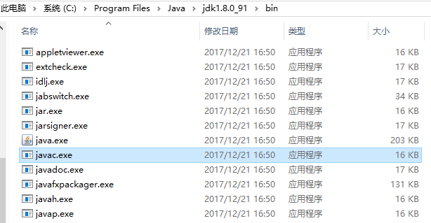

在这里我们不仅看到了 `javac` 命令，还看到了我们非常熟悉的 `java`，`javadoc`，`javah`， `javap`  等程序。其中 `javadoc` 是为类生成 `html` 格式的文档的程序，`javah` 是为某个存在 `native` 方法的类生成 `jni` 头文件的程序，`javap` 是用来生成某个类的字节码的程序。好了，让我们回到最开始接触 Java 的时候， 来手动编译并运行一个类吧，我们先新建一个类文件，暂且叫 `Main.java`：

```java
public class Main {
    
    public static void main(String[] args) {
        System.out.println("This is a simple class!");
    }
}
```

我们来通过命令行进行操作（确保你已经将 java 安装目录下的 bin 子目录成功的添加到环境变量中，即成功配置好 Java 环境）：

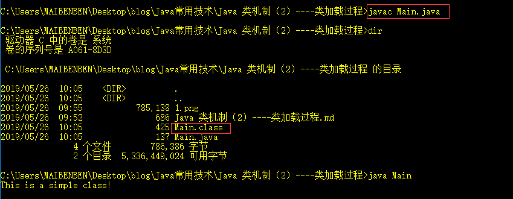

好了，我们已经成功得到了编译出来的类文件了。当我们调用 `java Main` 命令时，会执行这个类中的 `main(Stirng[] args)` 方法，在这个过程中首先会创建一个虚拟机进程，然后虚拟机会寻找并加载 `Main` 类，在加载完成后执行其 `main` 方法。那么接下来我们来看看虚拟机是如何寻找并加载类的。

## 类加载过程

要加载一个类，先得找到这个类，因此在上面的命令行中我们先进入了 `Main.class` 文件所在的目录，然后调用 `java Main` 命令，这样虚拟机就会在当前目录下寻找名为 `Main` 的 class 文件。那么如果当前命令调用时所在目录不在 `Main.class` 文件所在目录该怎么办呢？我们需要使用 `-classpath` 参数来指定要加载的类所在的目录：


这里我在 D盘根目录下调用 `java` 命令，通过 `-classpath` 命令指定 `Main` 所在的目录，虚拟机成功加载该类并运行，所以在上面调用 `java Main` 命令等同于 `java -classpath "C:\Users\MAIBENBEN\Desktop\blog\Java常用技术\Java 类机制（2）----类加载过程" Main` 命令。那么如果我有多个类文件目录（当然本例中没有）怎么办呢？我们只需要在 `-classpath` 参数值中以分号分隔多个路径即可：`-classpath "C:\Users\MAIBENBEN\Desktop\blog\Java常用技术;C:\Users\MAIBENBEN\Desktop\blog\Java常用技术\Java 类机制（2）----类加载过程"`。好了，现在虚拟机已经可以找到我们自定义的类了，可以进行加载这个类的动作了。一般来说，虚拟机要加载一个类，需要经过以下步骤：`加载`->`验证`->`准备`->`解析`->`初始化`。其中，`验证`、`解析` 和 `准备` 这三个过程也被称为 `链接`。当这些动作完成并且中途没有出错后，类就已经被成功加载到虚拟机中了（生成一个 `Class` 类型的对象，储存在方法区 / 堆中，一般是方法区）。之后这个类就可以被使用了。

`加载` 步骤主要是将要进行加载的类的 `.class` 文件的二进制流加载进来，但是如何得到类的二进制数据，虚拟机并未进行明确规定，可以是通过命令编译出来的类文件，也可以是通过网络传输的数据，甚至可以是人为编辑的二进制文件（如果你对 `.class` 文件格式足够熟悉的话）。即加载哪个类数据和如何加载类数据是开发者可自定义的。之后会对加载进来的类数据进行格式解析，如果解析成功（二进制数据符合规定的类数据格式），则会在内存中生对应类的一个 `Class` 对象，否则抛出 `ClassFormatError` 异常。

`验证` 步骤用来判断在上一步加载的类是否符合当前虚拟机要求，并且不会危害当前虚拟机安全。从语言特性上来说，Java 类在编译时就会判断语法的正确性，那为什么虚拟机还要花大功夫来进行验证呢？正如 `加载` 部分所述，我们得到的类数据的方法有很多种，可以通过编译后的 `.class` 文件，也可以通过网络等方式。也就是说类数据的来源是未知的，如果这个时候虚拟机不进行验证的话，很可能加载对虚拟机有害的类数据，其次，即使上一步生成的类对象是一个正常的类，但是由于 Java 语言是在不断更新的，因此类和虚拟机之间可能会产生版本差，即类本身用到了一些 Java 语言新版本的特性，而当前虚拟机是旧版本的，即其不能处理新版本的语言特性，这种情况也会导致出错。因此 `验证` 这一部分是非常重要的。

`准备` 阶段，虚拟机会将类对象中的 **静态变量** （即被 `static` 关键字修饰的非常量）赋零值，例：

```java
private static int value1 = 3;
```

对于 `short`，`int`，`long`，`float`，`double` 数值描述的类型赋值为 0，`boolean` 类型赋值为 `false`，`char` 类型赋值为 `\u0000`，引用类型复制为 `null`。具体所指定的值（这里为 3）则会在初始化阶段进行赋值。而对于常量，例：

```java
private static final int value1 = 3;
```

在该阶段会直接赋值为所指定的值（这里即为 3）。

`解析` 阶段虚拟机会针对类和接口、字段、类方法、接口方法、方法类型等进行解析，这个过程会加载该类定义的字段的类型中还未被加载进入虚拟机中的类。

`初始化` 阶段是类加载的最后一个阶段，这个阶段中虚拟机会调用`<cinit>` 方法，当然，这个方法不是开发者写的，而是在编译器编译类的过程中编译器加上的，编译器会收集**静态变量赋值代码**和 `static{}` 代码块，将这些代码放入 `<cinit>` 方法中，收集的顺序即为代码块在类中声明的顺序。上面 `准备` 步骤中静态变量的最终值会在该方法中赋值给该静态变量。同时，虚拟机会保证在子类的 `<cinit>` 方法执行时，其父类的 `<cinit>` 已经被执行完毕，其次，每个 `<cinit>` 方法只会被调用一次。这里说一下编译器为类生成的 `<init>` 方法和 `<cinit>` 方法区别：`<init>` 在创建某个类的实例对象时被调用，而 `<cinit>` 方法在类加载的初始化阶段被调用，对于同一个类对象来说，`<init>` 方法可能被调用多次（每次实例化该类的一个对象时被调用），而 `<cinit>` 方法只会被调用一次（类加载时）。这里给出一个关于类的相关方法调用顺序的实践代码：

```java
public class InvokeOrder {
    static int v = 1;

    static {
        System.out.println(Thread.currentThread() + ": InvokeOrder cinit invoke: v = " + v);
    }

    int vv = 2;

    {
        System.out.println(Thread.currentThread() + ": InvokeOrder init invoke: vv = " + vv);
    }

    InvokeOrder() {
        System.out.println(Thread.currentThread() + ": InvokeOrder constructor invoke");
    }

    static class SubClass extends InvokeOrder {
        static int x = 3;

        static {
            System.out.println(Thread.currentThread() + ": SubClass: cinit invoke: x = " + x);
        }

        int xx = 4;

        {
            System.out.println(Thread.currentThread() + ": SubClass init invoke: xx = " + xx);
        }

        SubClass() {
            System.out.println(Thread.currentThread() + ": SubClass constructor invoke");
        }
    }

    public static void main(String[] args) {
        SubClass subClass = new SubClass();
    }
}
```

结果如下所示：

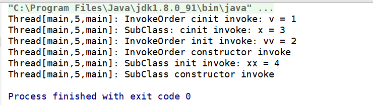

由此，我们可以得出创建一个还未被加载的类的实例对象时相关代码的执行顺序：**父类静态代码块->子类静态代码块->父类非静态代码块->父类构造方法->子类非静态代码块->子类构造方法**。并且我们还可以发现：虚拟机不会另辟线程去进行类加载，进行类加载的线程即为执行了导致该类被加载的代码的线程。

我们在上文中已经知道了在类加载过程中虚拟机允许开发者来自定义要加载的类数据，那么开发者该通过什么方式来自定义这个要加载的类数据呢？答案自然是大名鼎鼎的类加载器（`ClassLoader`）。

我们从上文中已经知道了，整个类加载过程的 `准备` 阶段中获取类数据的操作是开发者可控的，即具体怎么加载类数据和加载什么类数据是可以由开发者决定的。那么开发者通过什么控制这个操作呢？自然是大名鼎鼎的类加载器（`ClassLoader`）。

### ClassLoader

我们还是从官方对这个类的说明开始：

```java
/**
 * A class loader is an object that is responsible for loading classes. The
 * class <tt>ClassLoader</tt> is an abstract class.  Given the <a
 * href="#name">binary name</a> of a class, a class loader should attempt to
 * locate or generate data that constitutes a definition for the class.  A
 * typical strategy is to transform the name into a file name and then read a
 * "class file" of that name from a file system.
 *
 * <p> Every {@link Class <tt>Class</tt>} object contains a {@link
 * Class#getClassLoader() reference} to the <tt>ClassLoader</tt> that defined
 * it.
 */
```

大概意思为类加载负责进行类的加载，同时 `ClassLoader` 是一个抽象类，其功能是通过给定的类名生成描述这个类的二进制数据。一个典型的场景是将类名转换为对应的类文件名并读取该文件，得到对应的类数据，再生成对应的 `Class` 对象。每一个 `Class` 对象都包含一个指向加载它的 `ClassLoader` 对象的引用字段，可以通过 `Class` 类的实例方法 `getClassLoader()` 来的到这个 `ClassLoader` 对象。

从上面的说明我们可以知道：`ClassLoader` 具有的能力是解析类的二进制数据来生成对应的  `Class` 对象，`ClassLoader` 类提供了 `defineClass(byte[] b, int off, int len)` 方法来完成这个功能，`ClassLoader` 类部分源码如下：

```java
public abstract class ClassLoader {
    // ...
    
    /* 当前 ClassLoader 的父 ClassLoader */
    private final ClassLoader parent;
    
    /**
     * 构造方法，通过 parent 参数指定该类加载器的父类加载器
     */
    protected ClassLoader(ClassLoader parent) {
        this(checkCreateClassLoader(), parent);
    }
    
    /**
     * 默认的构造方法，采用 AppClassLoader 作为父类加载器，下文会介绍 AppClassLoader
     */
    protected ClassLoader() {
        this(checkCreateClassLoader(), getSystemClassLoader());
    }
    
    /**
     * 这个方法为类加载原理的核心方法，name 参数代表要加载的类名，
     * resolve 参数代表是否需要对加载得到的类进行链接操作
     *（链接操作即为我们上面提到的类加载的 验证、准备和解析过程）。
     * 如果这个方法成功加载对应的类，则返回对应的 Class 对象，否则抛出对应异常
     */
    protected Class<?> loadClass(String name, boolean resolve)
        throws ClassNotFoundException
    {
        synchronized (getClassLoadingLock(name)) {
            // First, check if the class has already been loaded
            // 先确认该类是否已经被当前类加载器加载过
            Class<?> c = findLoadedClass(name);
            // 如果得到的 Class 对象为空，证明该类还未被当前类加载器加载过，开始进行委托操作
            if (c == null) {
                long t0 = System.nanoTime();
                try {
                    if (parent != null) {
                        // 如果父类加载器不为空，则先委托父类加载器加载
                        c = parent.loadClass(name, false);
                    } else {
                        // 否则委托启动类加载器加载
                        c = findBootstrapClassOrNull(name);
                    }
                } catch (ClassNotFoundException e) {
                    // ClassNotFoundException thrown if class not found
                    // from the non-null parent class loader
                }
                // 如果得到的 Class 对象还是为空，则证明父类加载器和启动类加载器都不能加载该类，
                // 此时需要调用 findClass(String name) 方法来自己进行加载
                if (c == null) {
                    // If still not found, then invoke findClass in order
                    // to find the class.
                    long t1 = System.nanoTime();
                    c = findClass(name);

                    // this is the defining class loader; record the stats
                    sun.misc.PerfCounter.getParentDelegationTime().addTime(t1 - t0);
                    sun.misc.PerfCounter.getFindClassTime().addElapsedTimeFrom(t1);
                    sun.misc.PerfCounter.getFindClasses().increment();
                }
            }
            // 如果需要对得到的 Class 对象进行链接，则调用 resolveClass(Class c) 方法进行类链接操作
            if (resolve) {
                resolveClass(c);
            }
            return c;
        }
    }

    /**
     * 查找类名为 name 的类，返回对应的 Class 对象，这个方法是子类要重写的方法，
     * 在这个方法中加入自定义加载类的逻辑
     *
     * @since  1.2
     */
    protected Class<?> findClass(String name) throws ClassNotFoundException {
        throw new ClassNotFoundException(name);
    }

    /**
     * 将参数 b 储存的数据的 [offset, offset + len - 1] 部分转换为一个 Class 对象,
     * 如果数据不符合规定的类数据规范，则抛出 ClassFormatError 异常，这个方法已经被
     * defineClass(String, byte[], int, int) 方法替代
     */
    @Deprecated
    protected final Class<?> defineClass(byte[] b, int off, int len)
        throws ClassFormatError
    {
        return defineClass(null, b, off, len, null);
    }
    
    /**
     * 将参数 b 储存的数据的 [offset, offset + len - 1] 部分转换为一个 Class 对象,
     * 如果数据不符合规定的类数据规范，则抛出 ClassFormatError 异常。
     * 最终会经过一系列的验证（比如 name 能以 java. 开头），如果验证不通过，抛出对应异常，
     * 最后调用 native 的方法来进行真正的类定义（创建对应的 Class 对象）
     */
    protected final Class<?> defineClass(String name, byte[] b, int off, int len)
        throws ClassFormatError
    {
        return defineClass(name, b, off, len, null);
    }
}
```

当我们要使用某个 `ClassLoader` 方法加载某个类的时候，我们会调用其 `loadClass(String name)` 方法，即为加载名为 `name` 的类。我们详细看看这个方法的代码注释，可以总结出类加载的大致流程：先判断当前 `ClassLoader` 有没有加载过该类，如果有，则直接返回，否则判断 `parent` 是否为空，不为空则调用 `parent.loadClass(name)` 来委托父 `ClassLoader` 加载，否则调用 `findBootstrapClassOrNull(name);` 来委托启动类加载器加载该类。如果最后得到的 class 还是为空，则证明该类不能被父 `ClassLoader` 和启动类加载器加载。接下来调用自身的 `findClass(name);` 来加载该类，而默认的 `findClass` 直接抛出了 `ClassNotFoundException` 异常，证明需要子类重写该方法并填充自定义的类加载逻辑。我们之前已经说过了 `ClassLoader` 已经提供了 `defineClass` 方法来通过二进制数据（byte[]）来得到对应的 `Class` 对象，所以我们重写 `findClass` 方法的一般模板便是：

```java
protected Class<?> findClass(String name) throws ClassNotFoundException {
    // ... 通过某种方式得到类的二进制数据（以 byte[] 类型储存）
    byte[] classData = getClassData(...);
    return defineClass(classData, ...);
}
```

所以我们能定义的便是代码注释中的 `通过某种方式得到类的二进制数据`过程，这也是上文介绍类加载步骤中 `加载` 步骤中提到的 `加载哪个类数据和如何加载类数据是开发者可自定义的` 过程的具体体现。好了，我们在上文提到了 `委托父 ClassLoader 加载` 和 `委托启动类加载器加载` 这两个动作，那么什么是父加载器和启动类加载器呢？回答这个问题之前我们先来引出另一个问题：我们知道虚拟机要使用一个类必须先将这个类加载到虚拟机内存中并生成一个 `Class` 对象。那么形如 JDK 本身提供的类（`Object`，`String` 等），是怎么被加载进入虚拟机的呢？

其实就是通过启动类加载器（`BootstrapClassLoader`），由于启动类加载器是通过 C++ 实现的，因此这里我们无法直接看到对应的源码。启动类加载器会负责加载 JDK 安装目录下 `\jre\lib` 等文件夹中的 `jar` 文件或 `-Xbootclasspath` 参数指定的文件夹中的类，可通过  `sun.boot.class.path` 属性得到对应路径，而 `Object`，`String` 等类文件就在该文件夹下的 `rt.jar` 包中：

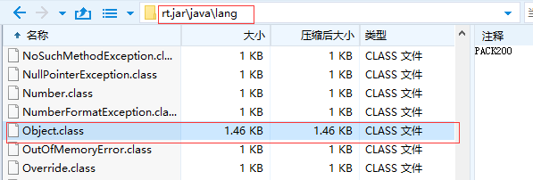

除了启动类加载器，JDK 还提供了扩展类加载器（`ExtClassLoader`），用于加载 JDK 安装目录下 `\jre\lib\ext` 等文件夹中的类，可通过 `java.class.path` 属性得到对应路径。

最后是应用程序类加载器（`AppClassLoader`），用于加载虚拟机运行时通过  `-classpath` 参数指定的目录下的类，可通过 `java.class.path` 属性得到对应路径，上文中我们运行的命令行中通过 `-classpath` 参数指定的文件夹路径中的 `Main` 类就是被应用程序加载进入虚拟机的。来看一下三个属性值的值：

```java
public class ClassLoaderTest {

    public static void main(String[] args) {
        System.out.println(System.getProperty("sun.boot.class.path"));
        System.out.println(System.getProperty("java.ext.dirs"));
        System.out.println(System.getProperty("java.class.path"));
    }
}
```

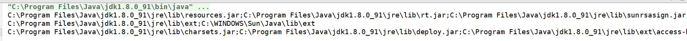

在三者之间，应用程序类加载器（`AppClassLoader`）的 `parent` 字段指向扩展类加载器（`ExtClassLoader`），但是扩展类加载器的 `parent` 字段为 null（理论上应该指向启动类加载器对象，但因为启动类加载器通过 C++ 实现，Java 层没有其对象）。因此在上面委托启动类加载器加载类时需要调用 `findBootstrapClassOrNull(name)` 方法来单独处理。那么，为什么一个 `ClassLoader` 在加载某个类的时候需要先委托父 `ClassLoader` 和启动类加载器加载呢？这其实为了遵循双亲委派模型。

### 双亲委派模型 

双亲委派模型是 Java 虚拟机默认的类加载机制，也是其推荐的类加载机制，其流程如下：当某个类加载器要加载某个类时，先判断该类有没有被当前类加载器加载过，如果加载过，则直接返回对应 `Class` 对象，否则如果其存在父类加载，则会先委托其父类加载器进行加载这个类，否则委托启动类加载器加载。对于其父类加载器也是同样的流程。我们可以用一张图来表示这个过程：

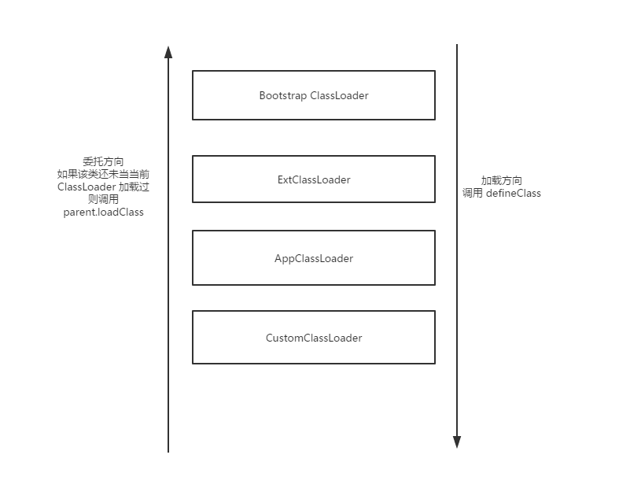

这也即为 `Bootstrap ClassLoader`，`ExtClassLoader ， AppClassLoader` 和自定义 `ClassLoader` 之间的委派关系（自定义 `ClassLoader` 的 `parent` 为 `AppClassLoader`， `AppClassLoader` 的 `parent` 为 `ExtClassLoader`）。那么为什么要遵循双亲委派模型呢？我们要知道，虚拟机在判断两个 `Class` 是否相等时不仅会判断这两个类的类名是否相等， 还会判断加载这两个类的 `ClassLoader` 是否是同一个 `ClassLoader`，如果我同一个类通过某个 `ClassLoader` 加载两次就会生成两个 `Class` 对象，那么这对虚拟机和开发者来说都不是好事，一方面多个同一个类的 `Class` 对象浪费内存和 CPU（每加载一个 `Class` 对象需要经过 `加载`，`验证`，[`链接`] 过程(链接过程可以通过参数控制是否进行)），另一方面对开发者来说也是没有必要的，因为对于一个类，一般只要有一个对应的 `Class` 就足够了。我们来看一个小例子加深理解：

```java
public class ClassLoaderTest {

    /**
     * 自定义的 ClassLoader，加载指定路径下的类
     */
    static class CustomClassLoader extends ClassLoader {
        private static final String TO_LOAD_CLASS_NAME = "A";
        // 默认加载的类所在文件夹路径
        private static final String DEFAULT_CLASS_DIR = "D:/ProjectData/JavaProjects/IDEAProject/Test/out/production/Test/";

        private String classDir;
        
        CustomClassLoader(String classDir) {
            super();
            if (classDir == null) {
                throw new IllegalArgumentException("argument is illegal!");
            }
            this.classDir = classDir;
        }
        
        @Override
        public Class<?> loadClass(String name) throws ClassNotFoundException {
            // 如果要加载的类名为 A，则不遵循双亲委派模型，强行加载。
            if (name.equals(TO_LOAD_CLASS_NAME)) {
                return findClass(TO_LOAD_CLASS_NAME);
            }
            // 否则遵循双亲委派模型
            return super.loadClass(name);
        }

        @Override
        protected Class<?> findClass(String name) throws ClassNotFoundException {
            // 先加载类字节数据，再调用 defineClass 方法生成 Class 对象
            byte[] classData = loadClassData(name);
            if (classData != null) {
                return defineClass(name, classData, 0, classData.length);
            }
            return null;
        }

        /**
         * 读取类 class 文件的数据，以字节数组返回
         *
         * @param className
         * @return
         */
        private byte[] loadClassData(String className) {
            String classPath = classDir +
                    className.replace('.', '/') + ".class";
            System.out.println(classPath);
            ByteArrayOutputStream bos = new ByteArrayOutputStream();
            try {
                FileInputStream fis = new FileInputStream(classPath);
                byte[] bs = new byte[1024];
                int readCount;
                while ((readCount = fis.read(bs)) != -1) {
                    bos.write(bs, 0, readCount);
                }
            } catch (IOException e) {
                e.printStackTrace();
                return null;
            }
            return bos.toByteArray();
        }
    }

    public static void main(String[] args) {
        CustomClassLoader classLoader1 = new CustomClassLoader(CustomClassLoader.DEFAULT_CLASS_DIR);
        CustomClassLoader classLoader2 = new CustomClassLoader(CustomClassLoader.DEFAULT_CLASS_DIR);
        try {
            Class c1 = classLoader1.loadClass(CustomClassLoader.TO_LOAD_CLASS_NAME);
            Class c2 = classLoader2.loadClass(CustomClassLoader.TO_LOAD_CLASS_NAME);
            System.out.println("c1, c2, c1 == c2: " + c1 + ", " + c2.toString() + ", " + (c1 == c2));
        } catch (ClassNotFoundException e) {
            e.printStackTrace();
        }
    }

}
```

要加载的类 A 定义如下：

```java
public class A {
}
```

结果如下：

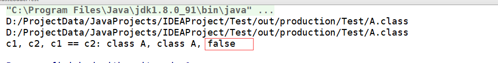

可以看到，在我们强行破坏了双亲委派模型的情况下，即使我们两次加载同一个类，得到的两个 `Class` 对象也是不相等的。同时，一个 `ClassLoader` 不能对同一个类调用两次 `defineClass` 方法，也就是说对于同一个 `ClassLoader` ，在加载一个类时，不能产生两个不同的 `Class` 对象。这也是虚拟机为了保证类加载时的一致性而设计的。我们加一段代码来打印一下类 `A` 的 `ClassLoader` 的父类加载器情况：

```java
static void printClassLoader(Class c) {
    if (c != null) {
        ClassLoader classLoader = c.getClassLoader();
        while (classLoader != null) {
            System.out.println(classLoader);
            classLoader = classLoader.getParent();
        }
    }
}
```

在 `main` 方法中加载完 `c1` `c2` 之后调用这个方法：

```java
printClassLoader(c1);
```

结果：

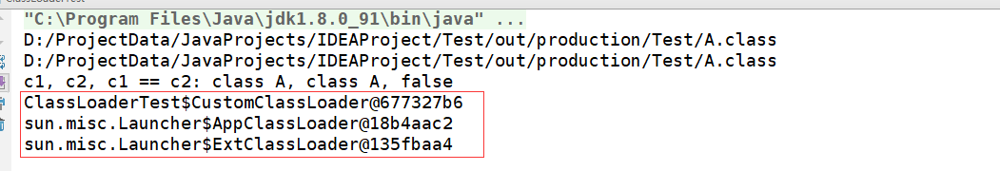

可以看到，先是 `CustomClassLoader`，即为我们自定义的 `ClassLoader`，再是 `AppClassLoader`，再是 `ExtClassLoader`，由于启动类加载器(`BootstrapClassLoader`)为 C++ 实现，因此扩展类加载器中并没有其对象，所以并未打印出来。这也验证了我们上面的结论。

### Java 提供的类加载器

Java 本身已经给我们提供了几个自带的类加载器：`SecureClassLoader`，`URLClassLoader`，`ExtClassLoader 和 AppClassLoader` 。他们之间的继承关系如下：

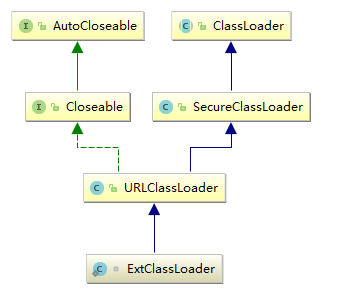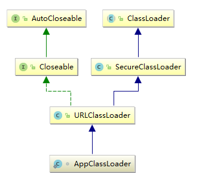

注意**这里指的是这些类加载器作为类的继承关系，不是双亲委派模型的委派关系**。他们的双亲委派关系上面已经说明。我们来简单看一下这些类加载器。

#### URLClassLoader

我们来看看官方的代码相关注释：

```java
/* This class loader is used to load classes and resources from a search
 * path of URLs referring to both JAR files and directories. Any URL that
 * ends with a '/' is assumed to refer to a directory. Otherwise, the URL
 * is assumed to refer to a JAR file which will be opened as needed.
 * ...
 */
public class URLClassLoader extends SecureClassLoader implements Closeable {
    // ...

    public URLClassLoader(URL[] urls, ClassLoader parent) {
        super(parent);
        // this is to make the stack depth consistent with 1.1
        SecurityManager security = System.getSecurityManager();
        if (security != null) {
            security.checkCreateClassLoader();
        }
        ucp = new URLClassPath(urls);
        this.acc = AccessController.getContext();
    }

    public URLClassLoader(URL[] urls) {
        super();
        // this is to make the stack depth consistent with 1.1
        SecurityManager security = System.getSecurityManager();
        if (security != null) {
            security.checkCreateClassLoader();
        }
        ucp = new URLClassPath(urls);
        this.acc = AccessController.getContext();
    }
```

大意为：这个类加载器用来加载由多个 `URL` 指定的类路径或者是 `JAR` 文件 ，如果某个 `URL` 路径以 `/` 结尾，则该 `URL` 代表的是路径，否则代表的是某个 `JAR` 文件。同时我们可以看到 `URLClassLoader` 提供的两个公有构造方法接收 `URL` 数组作为参数，也就是可以从多个 `URL` 中加载对应的类。

既然 Java 已经提供给我们加载某个特定路径下的类的类加载器。那么我们来实践一次：使用 `URLClassLoader` 来完成我们上面自定义的类加载器：

```java
public class CustomURLClassLoader extends URLClassLoader {

        public CustomURLClassLoader(URL[] urls) {
            super(urls);
        }
    	
    	public static void main(String[] args) {
        String classPath = "file://D:/ProjectData/JavaProjects/IDEAProject/Test/out/production/Test/";
        try {
            CustomURLClassLoader customURLClassLoader = new CustomURLClassLoader(new URL[]{new URL(classPath)});
            Class c = customURLClassLoader.loadClass("A");
            System.out.println("loaded class: " + c);
        } catch (MalformedURLException | ClassNotFoundException e) {
            e.printStackTrace();
        }
    }
}
```

看看结果：

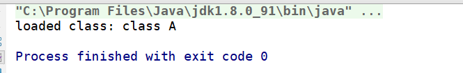

成功！我们通过系统提供的类加载器通过非常简短的代码就完成了我们上面自定义的类加载器，既然 `URLClassLoader` 接收 `URL` 对象作为参数，那么其可不可以加载网络上的 `class` 文件呢？答案是肯定的！我们把上面 `main` 方法代码中的 `classPath` 换成一个类文件下载链接：

```java
String classPath = "https://raw.githubusercontent.com/StarkZhidian/JavaComponentProject/master/";
```

在这里我将 `A.class` 文件上传到了 Github 上，因此这里直接使用 Github 提供的文件下载链接，再看看结果：

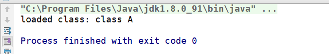

依然可以！证明 `URLClassLoader` 不仅可以加载本地的类，还可以加载网络上的类，其实这也正好符合 `URL` 的含义（统一资源定位符，这个资源不一定是在本地）。

### 数组类的加载和被动引用

我们上面已经讨论过了一般类的加载，那么数组类的加载是怎么样的呢？这个需要对数组进行分类讨论：如果数组类为基本类型数组（byte[], char[], short[], int[], float[], long[], double[]），则由虚拟机进行加载，如果这个数组类为对象数组类，则依然由数组对象类型对应的类加载器进行加载，来看一个实践代码：

```java
ClassLoader loaders = int[].class.getClassLoader();
System.out.println(loaders);
loaders = int[][].class.getClassLoader();
System.out.println(loaders);
// 使用了上面自定义的 CustomURLClassLoader 类
loaders = CustomURLClassLoader[].class.getClassLoader();
System.out.println(loaders);
```

结果：

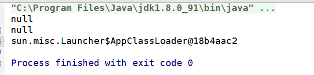

那么是不是代码中引用了某个类这个类就一定会被加载呢？其实并不是，当这个类是被动引用的时候，不会触发加载。那么何为被动引用呢？分几种情况：

**引用到某个类的常量**，不会触发这个类的加载（因为在编译期间将常量储存到调用类的常量池中了）。

**定义某个类的数组**，不会触发这个类的加载。

**通过子类引用父类的静态变量**，不会触发**子类**的加载。我们来实践一下：

```java
public class ClassLoaderTest {
    public static void main(String[] args) {
        // 引用某个类定义的常量
        System.out.println(ParentClass.W);
        // 定义某个类的数组
        ParentClass[] parentClasses = new ParentClass[1];
        // 通过子类访问父类的静态变量
        System.out.println(ChildrenClass.x);
    }

	static class ParentClass {
        static final int W = 2;
        static int x = 1;
         static {
            System.out.println("ParentClass: I'm be loading!");
        }
    }

    static class ChildrenClass extends ParentClass {
        static {
            System.out.println("ChildrenClass: I'm be loading!");
        }
    }
}
```

结果：

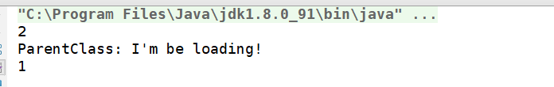

好了，这篇文章中我们详细看了一下关于 JVM中类加载的机制，下一篇文章我们将一起研究一下 `class` 文件的格式，届时会再度回顾这篇文章的某些内容。如果觉得本篇文章对您有帮助，不妨动动手指点个赞鼓励一下~

如果博客中有什么不正确的地方，请多多指点。

谢谢观看。。。