@[TOC]

## 前言

​		在上一篇文章中我们一起来看了一下 Java 虚拟机的类加载过程，包括虚拟机加载、验证、准备、解析和初始化 5 个大步骤，同时我们还讨论了 Java 虚拟机加载类时采用的双亲委派模型思想。在这篇文章中我们来一起看一下 class 文件的结构，来进一步加深我们对虚拟机的类加载机制和类机制的理解。本文参考了 《深入理解 Java 虚拟机》一书。

在正式开始之前我们先复习一下一些基础知识，我们知道一个类的全名格式为 `包名.类名`。比如 `java.lang.Object`。那么一个类的全限定名是什么呢？就是就是将类全名中的 `.` 换成 `/` 。所以 `java.lang.Object` 类的全限定名为 `java/lang/Object`。类的简单名就是这个类的名字，比如 `java.lang.Object` 类的简单名为 `Object`。

相对于类名和类的全限定名来说，方法的描述符就复杂一点，方法的描述符的作用是描述一个方法的方法名、参数类型和方法返回值。对于基本数据类型和代表无返回值的 `void` 类型都用一个大写字母表示。而复杂对象类型则用字母 `L` 加上对象所属类的全限定名表示。如下表：

| 标识字符 |              含义              |
| :------: | :----------------------------: |
|    B     |         基本类型 byte          |
|    C     |         基本类型 char          |
|    D     |        基本类型 double         |
|    F     |         基本类型 float         |
|    I     |          基本类型 int          |
|    J     |         基本类型 long          |
|    S     |         基本类型 short         |
|    Z     |        基本类型 boolean        |
|    V     |         特殊类型 void          |
|    L     | 对象类型，如 Ljava/lang/Object |

 对于数组类型，每一维度使用一个前置 `[` 来描述，如定义一个 `int[]` 类型的数组将被表示为 `[I`。`java.lang.String[][]` 将被表示为 `[[Ljava/lang/String;`。

用描述符描述方法时，将参数列表描述放在前面，返回值描述放在后面。比如方法 `int getInt()` 的描述为 `()I`。方法 `void setA()` 的描述为 `()V`。方法 `int binarySearch(int[] arr, int goal)` 的方法描述为 `([II)I`。我们在下面解析  `.class` 文件中会在用到这里介绍的知识点。

## 解析 .class 文件

​		我们都知道一个 Java 类（`.java`）文件在被 Java 编译器（`javac`) 编译过后，如果语法没有错误，则会生成一个对应的 `.class` 文件，这个 `.class` 文件是一个二进制文件，用一定的格式保存了我们书写的类的所有信息。不像 `xml`和 `json` 这些带有标志的语言一样，`.class` 文件是一个纯二进制文件，其中的数据是紧凑并且没有任何分隔符的，因此 `.class` 文件中的数据的顺序和含义是具有非常严格的规定的，`.class` 文件中的数据格式可以用以下表格描述：

|      类型      |        名称         |          数量           |          含义          |
| :------------: | :-----------------: | :---------------------: | :--------------------: |
|       u4       |        magic        |            1            |        文件魔数        |
|       u2       |    minor_version    |            1            |        次版本号        |
|       u2       |    major_version    |            1            |        主版本号        |
|       u2       | constant_pool_count |            1            | 常量池中的常量数量 + 1 |
|    cp_info     |    constant_pool    | constant_pool_count - 1 |       常量池信息       |
|       u2       |     access_flag     |            1            |       类访问标识       |
|       u2       |     this_class      |            1            |   当前类全限定名下标   |
|       u2       |     super_class     |            1            |    当前类的父类信息    |
|       u2       |  interfaces_count   |            1            |    类实现的接口数量    |
|       u2       |     interfaces      |    interfaces_count     |   类实现的接口的信息   |
|       u2       |    fields_count     |            1            |    类定义的字段数量    |
|   field_info   |       fields        |      fields_count       |    类定义的字段信息    |
|       u2       |    methods_count    |            1            |    类定义的方法数量    |
|  method_info   |       methods       |      methods_count      |    类定义的方法信息    |
|       u2       |  attributes_count   |            1            |  类的其他属性信息数量  |
| attribute_info |     attributes      |    attributes_count     |    类的其他属性信息    |

其中，`u` 代表无符号整数类型，`u1` 则代表 1 个字节的无符号整数类型，`u2` 代表 2 个字节的无符号整数类型，`u4` 代表 4 个字节的无符号整数类型，而其他的类型（`cp_info`, `field_info`, `method_info`, `attribute_info`）等则是 `.class` 文件自定义的数据结构（表）。有了这个基础之后，我们来通过例子来理解上面表格的数据含义，新建一个 `ClassContent` 类：

```java
public class ClassContent {
    public static final String STR = "s";
    public static final int A = 1;

    public int getInt() {
        int x = 1;
        return x;
    }

    public static void main(String[] args) {
        System.out.println("hello");
    }
}

```

非常简单的一段代码，没有什么特殊含义，我们编译这个类，可以得到对应的类文件（`ClassContent.class`），

用16进制编辑器打开对应的类文件（`ClassContent.class`），笔者这边使用的是 010 Editor：

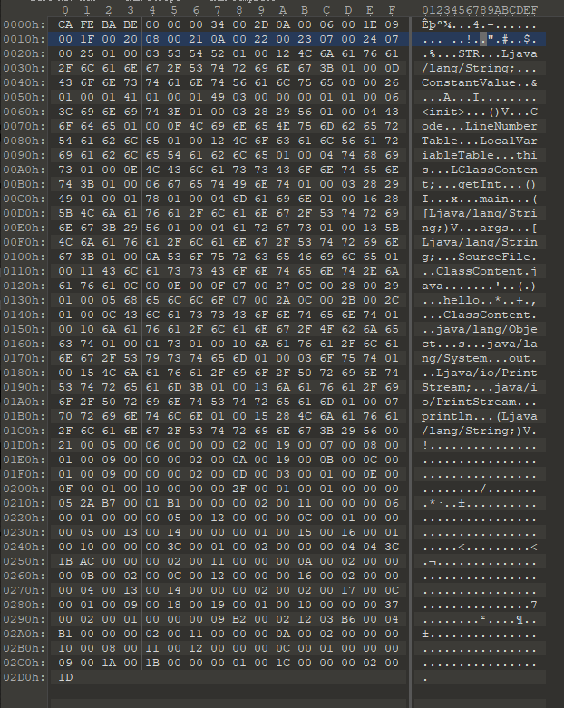

#### magic

​		前 4 个字节为 `.class` 文件的魔数，用于做一个最简单的文件类型校验。比如你将一个 `.jpg` 类型的图片文件后缀名改成 `.class` 时，这个 `.class` 文件是无效的，因为第一步的魔数就不一样。这个是一个固定的数据，对于其他的文件类型可能也存在，只不过值不一样而已。在 `.class` 文件中值为 `CAFEBABY`（咖啡宝贝？），这个值非常有意思，因为其意义正好对应 Java 的图标：


来杯 82 年的 Java 压压惊？

#### minor_version

​		按字节顺序继续往下看，接下来的 2 个字节代表该 `.class` 文件要求装载它的虚拟机的最低次版本号，这里为 0，证明只要虚拟机的主版本号不小于当前类文件的主版本号就可以加载这个类。

#### major_version

​		接下来两个字节代表该 `.class` 文件要求装载它的虚拟机的最低主版本号，这里为 `0x0034`，即为 10 进制的 52，JDK 的主版本号是从 45 开始的，接下去的每一个大版本号都为之前的大版本号 + 1，高版本号的虚拟机可以向下兼容加载低版本号的类文件，但无法加载版本号比它更高的类文件。这个其实很好理解，因为 Java 每一次升级都会带来一些语法变化和一些新特性（Java 8 带来了新的 API，lambda 表达式等），对应的会带来支持这些新特性的虚拟机，而老版本的虚拟机并不支持这些新特性，所以为了安全，虚拟机不允许加载版本号比自己的版本号高的类文件。

​		比如 JDK 1 能加载版本号为 45.0 ~ 45.65535 的 `.class` 文件，但是无法加载版本号为 46.0 ~ 46.65536 的 `.class` 文件。在这个例子中 `.class` 文件主版本号为 52，次版本号为 0，总版本号为 52.0，证明其只能被 JDK 1.8 以上版本提供的虚拟机加载。

#### constant_pool

​		接下来的多个字节代表当前类的常量池信息，我们先看紧接着前面的两个字节：`0x002D`，这个值为 10 进制的 45，意味着该类中的常量数为 44，为什么是 44  呢？因为 `.class` 中的常量的下标从 1 开始，那么下标 0 代表的是什么呢？代表的是**某项数据不引用常量中的任何常量项目**，这句话怎么理解呢？我们可以从对象的值上理解，比如我们有一个 `Person` 类，现在我们定义了一个 `Person` 类的引用：`Person person;`，我们暂时没有 `Person` 类型的对象去给这个引用赋值，那么我们会把它赋值为 null:`person = null;`。这就相当于**不引用任何Personal类型的对象项目**，那么类文件中的常量池的下标 0 也是一样的道理：如果类文件中某个项目引用到的常量的下标为 0，证明这个项目不需要使用常量池中任何一个项目的值。

​		另外，常量池中的项目类型是多样的，因为常量本身就是多类型的（字符串常量、整形常量、浮点型常量、复杂对象类型常量......）下表列举了所有常量池中的项目可能出现的类型：

|               类型               | 标志 |            含义            |
| :------------------------------: | :--: | :------------------------: |
|        CONSTANT_Utf8_info        |  1   |     UTF-8 编码的字符串     |
|      CONSTANT_Integer_info       |  3   |         整形字面量         |
|       CONSTANT_Float_info        |  4   |        浮点型字面量        |
|        CONSTANT_Long_info        |  5   |        长整型字面量        |
|       CONSTANT_Double_info       |  6   |     双精度浮点型字面量     |
|       CONSTANT_Class_info        |  7   |    类或者接口的符号引用    |
|       CONSTANT_String_info       |  8   |      字符串类型字面量      |
|      CONSTANT_Fieldref_info      |  9   |       字段的符号引用       |
|     CONSTANT_Methodref_info      |  10  |     类中方法的符号引用     |
| CONSTANT_InterfaceMethodref_info |  11  |    接口中方法的符号引用    |
|    CONSTANT_NameAndType_info     |  12  | 字段或者方法的部分符号引用 |
|    CONSTANT_MethodHandle_info    |  15  |        表示方法句柄        |
|     CONSTANT_MethodType_info     |  16  |        标识方法类型        |
|   CONSTANT_InvokeDynamic_info    |  18  |   表示一个动态方法调用点   |

非常繁琐的是上面的每一种常量类型都有一个自定义的数据结构（表）类型，这些结构我们在碰到时再进行列举。这些表结构有一个共性：表的第一个字节数据名为 tag，代表的是当前常量的类型，（即为上面常量类型表中的标志）。我们来看上面 `.class` 文件的第一个常量类型（紧接着上面的常量数量字节后面的 1 个字节数据）：`0x0A`，即为 10 进制的 10，对应的常量类型为 `CONSTANT_Methodref_info` ，即为一个描述方法的常量类型，那么我们来看一下这种类型的常量的表结构：

| 类型 |     名称     |                             含义                             |
| :--: | :----------: | :----------------------------------------------------------: |
|  u1  |     tag      |                      常量类型，值为 10                       |
|  u2  | class_index  |   指向声明这个方法的类描述符 CONSTANT_Class_info 的索引项    |
|  u2  | method_index | 指向描述该方法信息的描述符 CONSTANT_NameAnd_Type_info 的索引项 |

这个表的属性也很好理解，既然这个表示用来描述一个类的方法的信息，那么我们肯定需要知道定义这个方法的类的信息和这个方法本身的信息（方法名、参数个数和类型、返回值等），我们继续看紧跟着 tag 的后两个字节：`0x0006`，即为 10 进制的 6，也就是说这个方法所属的类的信息储存在常量池中第 6 个常量中，我们继续看后面两个字节：`0x001E`，即为 10 进制的 30，也就是说这个方法本身的信息在储存在常量池中的第 30 个常量中。它们的具体值我们待会可以通过工具生成，这里需要知道这个分析过程即可。我们到这里已经分析完了常量池的第一个常量字段，下面我们来简单看一下第二个常量，来巩固一下这个分析过程。

​		紧接着第一个常量信息字节结束，第二个常量的 tag 值为 `ox09`，即为 10 进制的 9，对应的常量类型为 `CONSTANT_Fieldref_info` 类型，即为一个描述字段信息的常量类型，我们来看一下这种类型的常量的表结构：

| 类型 |    名称     |                             含义                             |
| :--: | :---------: | :----------------------------------------------------------: |
|  u1  |     tag     |                       常量类型，值为 9                       |
|  u2  | class_index | 指向声明这个字段的类或接口的描述符 CONSTANT_Class_info 的索引项 |
|  u2  | field_index | 指向描述该字段信息的描述符 CONSTANT_NameAnd_Type_info 的索引项 |

和方法信息描述表类似，字段也有所属的类和字段本身的信息（修饰符、类型、名称）。我们来看接下来的 4 个字节，分析出这个字段的所属类信息和其本身的信息，这两个值分别为 `0x001F` 和 `0x0020`，对应 10 进制分别为 31 和 32。也就是说这两个信息储存在常量池中第 31 个和第 32 个常量中。这两个常量中我们都碰到了 `CONSTANT_Class_info ` 和 `CONSTANT_NameAnd_Type_info ` 这两种常量类型，那么我们来看一下他们的表结构，首先是 `CONSTANT_Class_info ` `：

| 类型 | 名称  |               含义               |
| :--: | :---: | :------------------------------: |
|  u1  |  tag  |         常量类型，值为 7         |
|  u2  | index | 指向这个类的全限定名的常量项索引 |

接下来是 `CONSTANT_NameAnd_Type_info `：

| 类型 |     名称      |                  含义                  |
| :--: | :-----------: | :------------------------------------: |
|  u1  |      tag      |           常量类型，值为 12            |
|  u2  |  name_index   |  指向该字段或者方法名称的常量项的索引  |
|  u2  | descibe_index | 指向该字段或者方法描述符的常量项的索引 |

好了，有了上面的基础之后，我们来借助工具来看一下常量中的所有常量信息，我们在 `ClassContent.class` 所在的目录下执行 `javap -v ClassContent.class` 命令行来获取该类文件的详细信息：

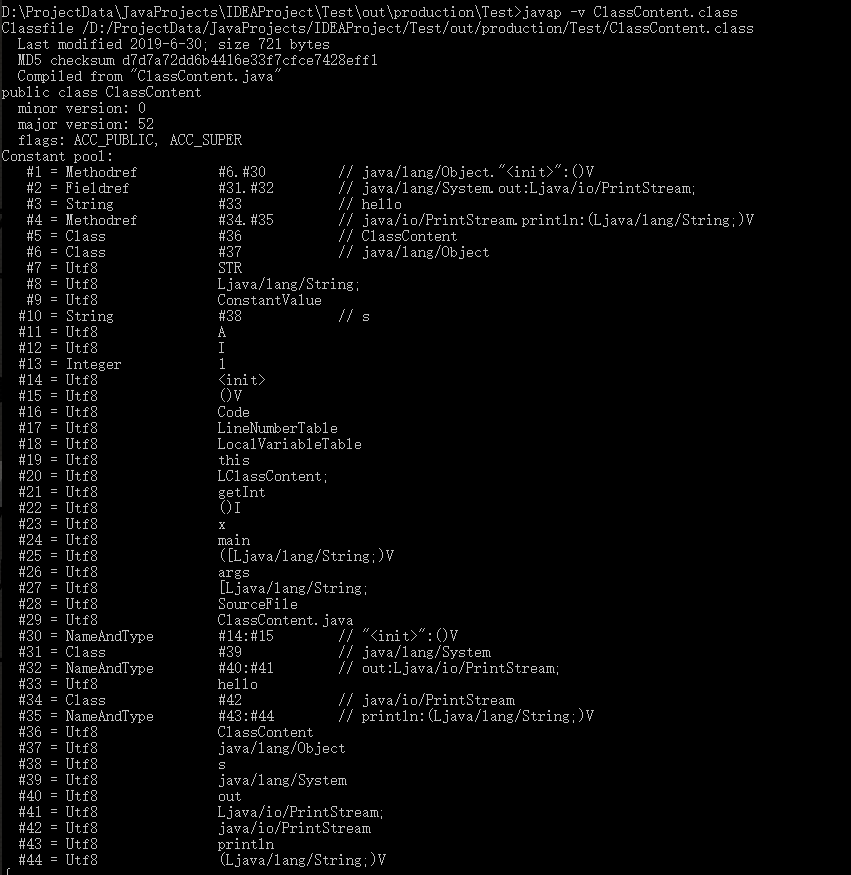

由于版面原因，这里并没有截取所有的字节码，这里我们关注常量池中的信息即可，我们可以看到刚刚我们分析的前两个常量分别为 `CONSTANT_Methodref_info` 和 `CONSTANT_Fieldref_info` 类型，和这里生成的常量类型匹配，同时第一个方法描述常量对应的类信息为第 6 个常量，第 6 个常量为 `CONSTANT_CLass_info` 类型，其类的全限定名用一个 `CONSTANT_Utf8_info` 类型的常量来描述，这个常量类型的表结构如下：

| 类型 |  名称  |                             含义                             |
| :--: | :----: | :----------------------------------------------------------: |
|  u1  |  tag   |                       常量类型，值为 1                       |
|  u2  | length |               UTF-8 编码的字符串所占用的字节数               |
|  u1  | bytes  | 长度为 length 并使用 UTF-8 编码后的字符串数据，总体占用 length 个字节 |

这里的类的全限定名为 `java/lang/Object`，也就是这个方法是在 `java.lang.Object` 中定义的，我们再看方法的详细信息，在第 30 个常量中，这个常量类型为 `CONSTANT_NameAnd_Type_info` 类型，对应的方法名和描述分别为 `<init>` 和 `()V`，还原之后为 `void <init>()`，这个方法本身在 `Object` 类中并没有定义，**这是因为类在编译时编译器为这个类自动生成的一个方法，类中的一些非静态代码块和非静态变量赋值操作都会移至该方法中执行。**

​		接下来的是描述字段类型的常量，所属的类信息在第 31 个常量中储存，字段本身信息在第 32 个常量中储存，继续 “递归” 查找，发现这个字段所属的类为 `java.lang.System`，字段名为 `out`，类型为 `java.io.PrintStream`。其实这个就是因为我们代码中调用了 `System.out.println` 方法导致的，**在进行代码编译时，编译器会将某个类中的常量值储存在该常量调用类的常量池中。**

​		总体看常量池中的常量信息，我们会发现能直接储存“字面量”值的只有基本类型对应的常量数据类型（`CONSTANT_Utf8_info` , `CONSTANT_Integer_info`, `CONSTANT_Float_info`, `CONSTANT_Double_info`, `CONSTANT_Long_info`）。那么如果我们定义了一个 `boolean` 类型的常量会怎么样呢？它会被当作 `int` 类型的常量处理（`byte`，`char`，`short` 类型的常量也是如此 ）。所有的复杂常量类型中的属性真实值最终都是通过这几个基本表中的值来储存。最后给出所有常量类型的数据表结构（来自《深入理解 Java 虚拟机》）：

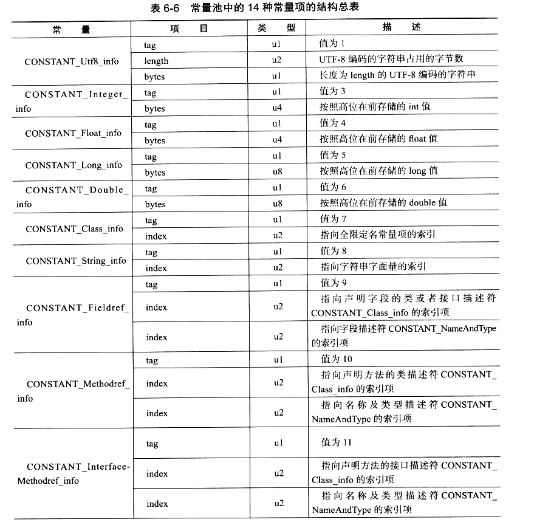

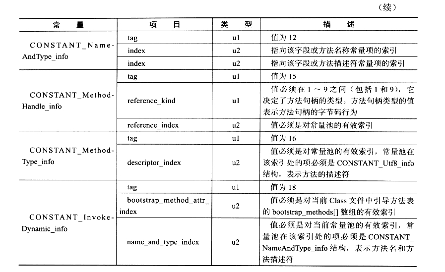

#### access_flag

在常量池部分结束了之后，紧接着的两个字节代表的是访问标识，访问标识即为该类定义时的访问权限，比如该类是否为抽象类，是否为接口，是否为 final 类，是否为枚举等等。具体的标志位和含义如下表：

|    标志名称    | 标志值 |                             含义                             |
| :------------: | :----: | :----------------------------------------------------------: |
|   ACC_PUBLIC   | 0x0001 |                    该类是否为 public 类型                    |
|   ACC_FINAL    | 0x0010 |                     该类是否为 final 类                      |
|   ACC_SUPER    | 0x0020 | 是否允许使用 invokespecial 字节码指令的新语义，invokespecial指令的语义在 JDK1.0.2 发生改变过，因此在 JDK 1.0.2 之后编译出来的类中这个标志一定为真 |
| ACC_INTERFACE  | 0x0200 |                      该类是否为接口类型                      |
|  ACC_ABSTRACT  | 0x0400 | 是否为 abstract 类型，对于接口和抽象类来说，这个标志为真，其他为假 |
| ACC_SYNTHETIC  | 0x1000 |          标志这个类并非由用户代码产生的（动态代理）          |
| ACC_ANNOTATION | 0x2000 |                       标识这是一个注解                       |
|    ACC_ENUM    | 0x4000 |                       标识这是一个枚举                       |

对于我们上面的 `ClassContent` 类来说，其是 `public` 修饰的，同时是使用 JDK 1.8 语法编译的，因此它的 `ACC_PUBLIC` 和 `ACC_SUPER` 标志为真，即其 `access_flag` 的值应该为 `0x0021`，我们来看一下：

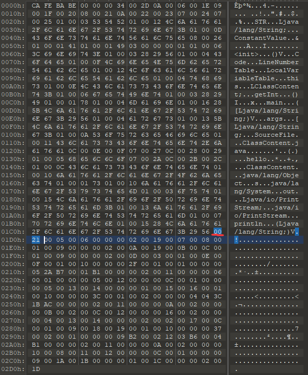

图中红色线条标注部分即为 `access_flag` 标志开始部分，我们可以看到这个结果和我们上面计算的相符。

#### this_class

​		紧接着 `access_flag` 后面的两个字节为 `this_class` 数据，表示的是当前类信息，其值作为下标指向常量池的一个 `CONSTANT_Class_info` 类型的常量，这里的值为 `0x0005`，即为常量池中的第 5 个常量，我们回过头去看看，第 5 个常量确实为 `CONSTANT_Class_info ` 类型，类的全限定名具体值为第 36 个常量的值，即为 `ClassContent`。

#### super_class

​		接下来的两个字节数据为该类的父类的信息，值为 `0x0006`，同样的我们去找一下常量池中第 6 个常量的信息，对应的类的全限定名储存在第 37 个常量中，即为 `java/lang/Object`。也就是说 `ClassContent` 类的父类为 `Object` 类，这也是毋庸置疑的。

#### interfaces_count

​		接下来的两个字节数据为该类实现的接口数量，如果该类本身是一个接口，则为该接口继承的接口数量。因为 `ClassContent` 并没有实现任何接口，因此这两个字节的数据为 `0x0000`，即为 0。

#### interfaces

​		接下来会有 `interfaces_count` 个 u2 类型的数据，指向的是描述该类实现 / 继承的接口的信息常量在常量池中的下标（均为 `CONSTANT_Class_info` 类型）。因为在这里 `ClassContent` 并没有实现任何接口，因此这里没有任何数据。

#### fields_count

​		和 `interfaces_count` 属性类似，接下来的两个字节数据代表的是该类定义的字段数，在这里为 `0x0002`，即为两个字段。

#### fileds

​		紧接着是 `fileds_count` 个 `fields_info` 表结构的数据，描述的是当前类定义的字段的信息，`fields_info` 表结构如下：

|      类型      |       名称       |       数量       |            含义            |
| :------------: | :--------------: | :--------------: | :------------------------: |
|       u2       |   access_flag    |        1         |       字段的访问标识       |
|       u2       |    name_index    |        1         | 字段名常量在常量池中的下标 |
|       u2       | descriptor_index |        1         |  字段类型在常量池中的下标  |
|       u2       | attributes_count |        1         |      额外属性信息数量      |
| attribute_info |    attributes    | attributes_count |        额外属性信息        |

我们来继续看字段信息数据，紧接着的两个字节为 `access_flag`，这里值为 `0x0019`，我们来看一下在字段中可能出现的访问标志：

|   标志名称    | 标志值 |              含义              |
| :-----------: | :----: | :----------------------------: |
|  ACC_PUBLIC   | 0x0001 |    该字段是否为 public 修饰    |
|  ACC_PRIVATE  | 0x0002 |   该字段是否为 private 修饰    |
| ACC_PROTECTED | 0x0004 |  该字段是否为 protected 修饰   |
|  ACC_STATIC   | 0x0008 |       字段是否为 static        |
|   ACC_FINAL   | 0x0010 |        字段是否为 final        |
| ACC_VOLATILE  | 0x0040 |      字段是否为 volatile       |
| ACC_TRANSIENT | 0x0080 |      字段是否为 transient      |
| ACC_SYNTHETIC | 0x1000 | 标志这个字段由编译器自动生成的 |
|   ACC_ENUM    | 0x4000 |     标识字段是否为一个枚举     |

根据这个表，我们可以还原出第一个字段的修饰符：`public static final`（10 + 8 + 1）。我们接着看下两个字节（name_index）的数据：`0x0007`，我们去找下标为 7 的常量值：`STR`，也就是说这个字段名为 `STR`，继续看下两个字节（descriptor_index）的数据：`0x0008`。找到常量池中下标为 8 的常量值：`Ljava/lang/String;` 意味这这个字段是 `String` 类型的。我们继续看下两个字节（attributes_count）的数据：`0x0001`，意味着这个字段有 1 个额外属性信息。那么接下来的一部分字节数据就是用来描述这个额外的属性表的信息，我们来看看 `attribute_info` 表的一般结构，需要注意的是这里是 `attribute_info`  表的大致描述，`attribute_info` 有多种不同类型的具体表结构（具体表现为 `info` 部分的不同）：

| 类型 |                     名称                     |       数量        |            含义            |
| :--: | :------------------------------------------: | :---------------: | :------------------------: |
|  u2  |             attribute_name_index             |         1         | 属性名在常量池中的常量下标 |
|  u4  |              attributes_length               |         1         |       属性数据的长度       |
|  u1  | info（这里是统称，实际的数据由具体的表决定） | attributes_length |          属性数据          |

我们接着看下两个字节（attribute_name_index）的数据：`0x0009`，在常量池中第 9 项常量的数据为 `ConstantValue` ，意味着这个属性表为 `ConstantValue` 表，继续看接下来四个字节（attributes_length）的数据：`0x00000002`，意味着该属性值的数据量为 2 个字节，接下来两个字节即为该属性的数据：`0x0A00`，即为 10 ，这个属性表的数据分布如下图：

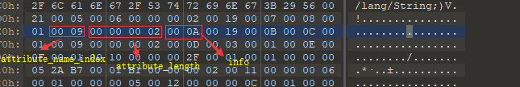

那么这个 10 代表什么意义呢？我们来看看 `ConstantValue` 表的结构：

| 类型 |         名称         |       数量        |                     含义                      |
| :--: | :------------------: | :---------------: | :-------------------------------------------: |
|  u2  | attribute_name_index |         1         |          属性名在常量池中的常量下标           |
|  u4  |  attributes_length   |         1         |                属性数据的长度                 |
|  u1  | constantValue_index  | attributes_length | 指向常量池中下标为 constantValue_index 的常量 |

对应于上面的 `attribute_info` 一般表的结构，其中 `constantValue_index` 就对应于 `attribute_info` 中的 `info`。好了，我们知道了，上面的那个 10 代表的是常量池中的一个常量的下标，那么我们来看看常量池中第 10 个常量是什么：经过查找，第 10 个常量的字面量为 `s`，这不就是我们在代码中定义的常量值吗。至此，我们可以还原出这个字段的完整定义：`public static final String STR = "s";`。我们已经解析了第一个常量，第二个常量也是同样的道理，我们提取出描述第二个常量的数据：`00 19 00 0B 00 0C 00 01 00 09 00 00 00 02 00 0D`。`access_flag` 值为 `0x0019`，字段名常量所在常量池下标为 `0x000B` 即为 11，字段类型常量所在常量池下标为 `00 0C`，得到的值为 `I`（即为 int），常量表中常量值所在常量池的下表为 `0x000D` ，得到的值为`1`。所以这个常量还原出来的代码定义为 `public static final int A = 1;`。此外将常量值储存在字段的额外信息中，待虚拟机加载该类时在**准备**阶段时就可以将最终值赋值给该常量。而一般的静态字段在准备阶段时会被赋 0 值，在**初始化**阶段中执行 `<cinit>` 方法时才会赋最终值。

​		在上面属性表中，属性名储存在常量池中，而属性表本身通过 attribute_name_index 数据指向属性表名字常量在常量池中的下标来记录属性表名称。除了 `ConstantValue` 以外，Java 虚拟机还有很多其他类型的属性表，最常见的便是 `Code` 表，它的结构我们在分析类文件中的方法属性时会介绍，如果虚拟机在进行属性表解析时发现属性表名不是其可以识别（内置）的属性表名时，则会略过这一属性表数据的所有数据，继续向后解析。

#### methods_count

​		字段信息解析完成之后，接下来的两个字节的数据代表当前类的方法数，值为 `0x0003`：

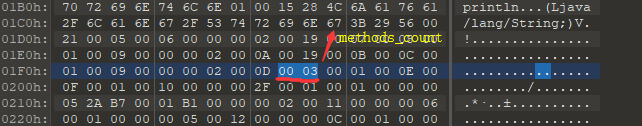

也就是说这个类一共有三个方法，但是我们明明在代码中只定义了 2 个方法啊，第三个方法怎么来的？别忘了之前提到的 `<init>` 方法，编译器在编译每一个类时都会为这个类提供一个 `<init>` 方法。

#### methods

​		紧接着便是方法的具体信息了，这里先来看一下 `method_info` 表的格式：

|      类型      |       名称       |       数量       |             含义             |
| :------------: | :--------------: | :--------------: | :--------------------------: |
|       u2       |   access_flag    |        1         |        方法的访问标识        |
|       u2       |    name_index    |        1         |  方法名常量在常量池中的下标  |
|       u2       | descriptor_index |        1         | 方法描述常量在常量池中的下标 |
|       u2       | attributes_count |        1         |       额外属性信息数量       |
| attribute_info |    attributes    | attributes_count |         额外属性信息         |

方法可能存在的访问标识如下：

|     标志名称     | 标志值 |              含义              |
| :--------------: | :----: | :----------------------------: |
|    ACC_PUBLIC    | 0x0001 |    该方法是否为 public 修饰    |
|   ACC_PRIVATE    | 0x0002 |   该方法是否为 private 修饰    |
|  ACC_PROTECTED   | 0x0004 |  该方法是否为 protected 修饰   |
|    ACC_STATIC    | 0x0008 |       方法是否为 static        |
|    ACC_FINAL     | 0x0010 |        方法是否为 final        |
| ACC_SYNCHRONIZED | 0x0020 |  方法是否为 synchronized 修饰  |
|    ACC_BRIDGE    | 0x0040 | 方法是否为编译器生成的桥接方法 |
|   ACC_VARARGS    | 0x0080 |      方法是否接受不定参数      |
|    ACC_NATIVE    | 0x0100 |       方法是否为 native        |
|   ACC_ABSTRACT   | 0x0400 |       方法是否为抽象方法       |
|   ACC_STRICTFP   | 0x0800 |      方法是否为 strictfp       |
|  ACC_SYNTHETIC   | 0x1000 |   方法是否为编译器自动生成的   |

如果你理解了上一节字段相关的内容，那么这两个表格对你来说一点难度都没有。我们继续来看方法的内容，紧接着 `methods_count` 的两个字节为第一个方法的 `access_flag` 属性值，为 `0x0001`，即为 `public` 修饰的方法，接下来两个字节为 `name_index` 属性值，为 `0x000E`，对应常量池中第 14 个常量，值为 `<init>`，即该方法的方法名为 `<init>`，接下来两个字节为 `descriptor_index` 的属性值，为 `0x000F`，对应常量池中的第 15 个常量，即该方法的方法描述为 `()V`，也就是说该方法没有参数和返回值，那么我们现在可以复原出这个方法了：`public void <init>();`。我们接着来看 `attributes_count` 属性的值，这里为 `0x0001`，即该方法有一个额外的属性表，属性的表名为 `attribute_name_index` 的值指向常量池对应下标的常量值，即为下标为 `0x0010` 的常量值，对应的常量池中的常量值为 `Code`。我们应该可以猜到这个 `Code` 属性表就是储存该方法代码的字节码的表结构了，我们来看看 `Code` 表的结构：

|      类型      |          名称          |          数量          |                             含义                             |
| :------------: | :--------------------: | :--------------------: | :----------------------------------------------------------: |
|       u2       |  attribute_name_index  |           1            |                  属性名在常量池中的常量下标                  |
|       u4       |   attributes_length    |           1            |                        属性数据的长度                        |
|       u2       |       max_stack        |           1            |                方法执行时操作数栈深度的最大值                |
|       u2       |       max_locals       |           1            | 方法执行时局部变量表所需要的存储空间，这里的单位 Slot，一个 Slot 可以储存长度不超过32位的局部变量值 |
|       u4       |      code_length       |           1            |                代码编译成字节码之后的代码长度                |
|       u1       |          code          |      code_length       |            代码内容，每一个字节数据对应一个字节码            |
|       u2       | exception_table_length |           1            |                       方法的异常表长度                       |
| exception_info |    exception_table     | exception_table_length |                      方法抛出的异常信息                      |
|       u2       |    attribute_count     |           1            |                        额外属性表数目                        |
| attribute_info |       attributes       |    attribute_count     |                        额外属性表信息                        |

`<init>` 方法的 `Code` 属性完整数据如下（底色为深蓝色的数据）：

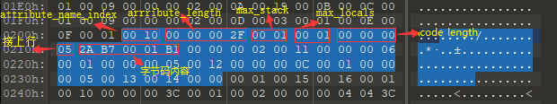

这个方法存在 5 个字节的字节码数据，字节码之所以被称为字节码，就是因为每一个字节码都有一个字节的数据对应，通过一个字节的数据可以确定一个字节码，Java 虚拟机已经定义了 200 多条字节码指令（一个字节的数据范围为 0~255）。我们通过某个字节的数据就可以得到其所代表的字节码。在这里 `<init>` 方法中的 5 条字节码指令分别为：

```
aload_0: 将第一个引用类型本地变量推至操作数栈顶
invokespecial: 调用父类构造方法，实例初始化方法，似有方法（这里为调用父类构造方法）
nop: 什么都不做
aconst_null: 将 null 推至操作数栈顶
return: 从当前方法返回 void
```

接下来的两个字节数据为 `exception_table_length`，这里的值为 `0x0000`，证明该方法没有显示的异常信息抛出。接下来的两个字节数据为 `attribute_count`，值为 `0x0002`，证明这个 `Code` 表中存在两个额外的属性信息，先看第一个属性信息（`attribute_info`）：前两个字节为数据为 `0x0011`，证明第一个属性表的 `attribute_name_index` 的值为 10 进制的 17，对应常量池的第 17 项，即为 `LineNumberTable`，也就是说第一个属性表的具体表为 `LineNumberTable`，我们来看看这个表的结构：

|       类型       |           名称           |           数量           |
| :--------------: | :----------------------: | :----------------------: |
|        u2        |   attribute_name_index   |            1             |
|        u4        |    attributes_length     |            1             |
|        u2        | line_number_table_length |            1             |
| line_number_info |    line_number_table     | line_number_table_length |

这里 `line_number_info` 是一个新的表结构，里面有两个属性，一个是两个字节长度（`u2`）的 `start_pc`，另一个是 两个字节长度（`u2`）的 `line_number` ，前者代表的字节码行号，后者代表的是对应的  Java 源代码行号。我们在代码运行出现异常时会收到 IDE 异常代码行号的提示，如：


我们知道，JVM 是运行 `.class` 文件中的字节码的，而发生异常时定位到对应的代码行号依靠的就是字节码行号和源代码行号的对应表，即为这里的 `LineNumberTable`。接下来是 `attributes_length` ，为 `0x0006`，证明 `line_number_table_length` 属性和 `line_number_table` 属性的长度和为 6 个字节，接下来的 6 个字节为 `0x0001 0000 0005`，那么可以得出 `line_number_table_length ` 的值为 `0x0001`，`line_number_info` 中 `start_pc` 和 `line_number` 的值分别为 `0x0000` 和 `0x0005`，证明该方法第一行字节码对应的源码行号为第 5 行。我们看看这个源码第 5 行是什么：

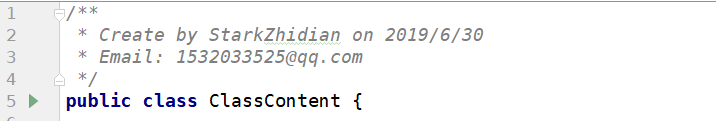

可能有些小伙伴会有疑问，为什么是在定义类的代码所在行呢？因为当前分析的方法是 `<init>` 方法，我们在这个类里面没有书写代码块，因此这个方法在 Java 源码中并不存在代码，因此编译器将这个方法的开始代码设置为类定义的地方，即为第 5 行。

好了，我们来看看下一个属性表，这个属性表的完整数据如下：

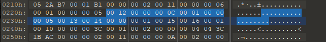

类似的，我们可以得到 `attribute_name_index` 的值为 `0x0012`，即为 18，查找常量池中第 18 个常量为： `LocalVariableTable`，也就是这个属性表的具体类型为 `LocalVariableTable` 。这个表用来表示方法中局部变量的相关信息，我们看看这个属性表的结构：

|        类型         |            名称             |            数量             |
| :-----------------: | :-------------------------: | :-------------------------: |
|         u2          |    attribute_name_index     |              1              |
|         u4          |      attributes_length      |              1              |
|         u2          | local_variable_table_length |              1              |
| local_variable_info |    local_variable_table     | local_variable_table_length |

我们对应这个表的结构，很容易得出各个属性的值：`attributes_length` 值为 `0x0000000c`，即为 12，`local_variable_table_length` 的值为 `0x0001`，而接下来的 `local_variable_info` 表的值为 `0x00 00 00 05 00 13 00 14 00 00` 。而 `local_variable_info`  表的结构为：

| 类型 |       名称       | 数量 |
| :--: | :--------------: | :--: |
|  u2  |     start_pc     |  1   |
|  u4  |      length      |  1   |
|  u2  |    name_index    |  1   |
|  u2  | descriptor_index |  1   |
|  u2  |      index       |  1   |

其中，`start_pc` 和 `length` 属性分别代表了这个局部变量生命周期开始字节码的偏移量及作用范围覆盖的长度，两者结合即为这个局部变量的作用域范围。`name_index`，`descriptor_index ` 都是指向了常量池中的常量项索引，分别代表了当前局部变量的名称和这个局部变量的描述，这里即为 `0x0013` 和 `0x0014`，即为第 19 号常量和第 20 号常量，这里值为 `this` 和 `LClassContent`，因为当前方法是编译器生成的 `<init>` 方法，所以只有一个局部变量，即为指向当前对象的引用，类型为 `ClassContent`。最后一个 `index` 属性为这个局部变量在栈帧局部变量表中 Slot 所处的位置，如果这个变量是 64 位（`long` 和 `double`）时，其占用的位置为 index 和 index + 1 两个 Slot，这里的值为 `0x0000`，即说明这个局部变量在栈帧局部变量表中第一个位置。好了，我们已经解析了第一个方法的所有信息，剩下的两个方法小伙伴们可以自行分析。

#### attributes_count

​		紧接着方法字节数据结束后的两个字节为 `attributes_count` 数据，代表的是当前类的额外属性表数量。在这个类文件中存在一个额外属性表，这部分数据在类文件数据末尾：

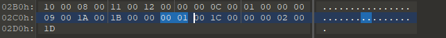

#### attributes

​		紧接着上面的 `attributes_count` 数据后的数据为当前类文件的唯一一个属性表数据：

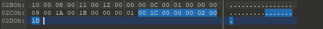

根据属性表的一般结构，我们可以得到该属性表的表名属性（attribute_name_index）为 `0x001C` 对应常量池中的常量为 `SourceFile`，也就是说这是一个 `SourceFile` 表，我们来看看 `SourceFile` 表的结构：

| 类型 |         名称         | 数量 |                    含义                    |
| :--: | :------------------: | :--: | :----------------------------------------: |
|  u2  | attribute_name_index |  1   |         属性名在常量池中的常量下标         |
|  u4  |  attributes_length   |  1   |             属性表中数据的长度             |
|  u1  |   sourcefile_index   |  1   | 指向常量池中下标为 sourcefile_index 的常量 |

这里我们可以得到该表中 `sourcefile_index` 的值为 `0x001D`，对应常量池中下标为 29 的常量，即为 `ClassContent.java`，这也就是编译出这个 `.class` 文件的 Java 文件的文件名。

​		上面已经说过了 `attribute_info` 表是一个一般描述，并没有规定具体的表结构，而 Java 虚拟机内置的属性表（即 `attribute_info` 表可能存在的具体表）的表名如下：

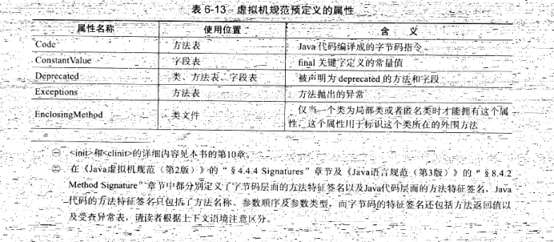

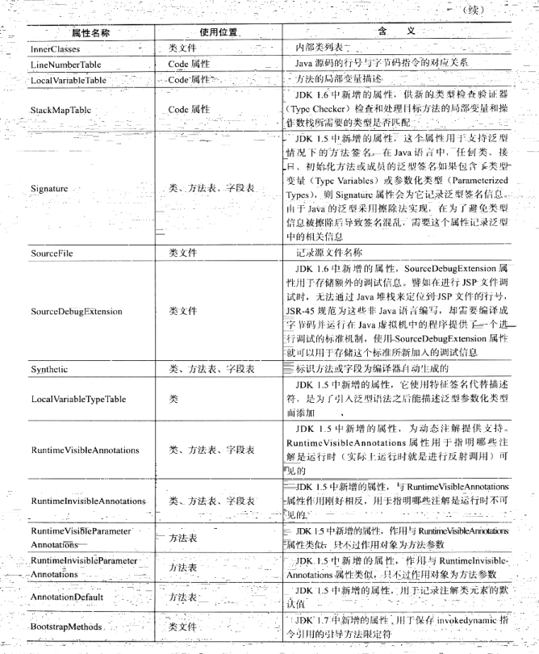

我们在上面已经讲过了 `Code`、`ConstantValue`、 `LineNumberTable`、``LocalVariableTable`  和 `SourceFile` 属性表的结构，关于其他属性表的结构就需要小伙伴们自己去参阅相关书籍和资料了。

到这里我们就已经把一个 `.class` 文件中包含的信息类型基本解析了一遍，说实话，这个过程并不容易，归根结底还是因为 `.class` 文件和 `.xml` 文件不一样，`.class` 文件是用来给机器 "看的"（用来给 JVM 加载），而不是给开发者看的。`.class` 文件本质上是一个二进制文件，里面的数据并没有结构性并且不同类型数据之间没有额外的分隔数据，十分紧凑，所以我们在上面人为模拟机器解析 `.class` 文件的信息的时候非常费力，需要从头到尾一步步来。但是这对机器来说十分友好，因为数据的紧凑性能够最小化其占用的内存空间，并且在从头到尾顺序读取数据时速度非常快。所以我们在这里模拟机器进行数据解析只是为了了解 `.class` 文件的数据储存原理，并不推荐人为分析 `.class` 文件的数据。其余情况下我们应该借助 `javap` 等工具来分析某个 `.class` 文件包含的类信息。

## 再论类加载

​		回想一下我们在上篇文章中讨论的 Java 类加载机制，需要经过五大步骤：加载、验证、准备、解析、初始化。其实 验证过程是最复杂的，因为这个过程需要扫描整个在加载过程中得到得到的 `.class` 文件格式的二进制数据，也就是相当于将我们在上面模拟的解析 `.class` 文件的过程，并且判断相关的数据是否合法，比如文件的魔数是否为 `CAFEBABY`，类的主次版本号是否不高于当前虚拟机的版本号，同时需要检测字节码的调用是否合法，比如一个局部变量是不是在未被赋初始值就被使用了，是否使用了不当的跳转指令等等。总言之这部分工作需要确保该类在加载进入虚拟机之后在被使用的过程中不会出现致命性的问题以威胁虚拟机的正常运行状态。

​		而在解析这一步中虚拟机需要将类中出现的符号引用替换为直接引用，这个过程可能又会触发其他类的加载，比如有两个类 A 和类 B ，类 B 中有一个 A 类的引用，那么在加载类 B 的时，在解析过程中发现引用了 类 A 的变量，那么这时候可能会触发虚拟机对类 A 的加载。

​		回想一下我们在 [初识 Class](https://blog.csdn.net/Hacker_ZhiDian/article/details/86706987) 中对 Java 中 `Class` 类的介绍，当时说这个类是 `描述类信息的类`，在这里就体现在某个 `Class` 类的对象包含了 JVM 在对应的 `.class` 文件中加载的这个类的所有信息。而 `Class` 类提供了很多 `get` 方法来获取这个类的各种信息。**可以说 `Class` 类对象是 `.class` 文件在 JVM 进程内存中的动态数据结构表示。**

好了，在这篇文章中我们通过一个例子来看了一下类文件格式，相信你对 Java 类机制有了一个更深的理解。下篇文章我们将一起讨论一下 JVM 中的字节码和方法调用。如果博客中有什么不正确的地方，还请多多指点。如果觉得这篇文章对您有帮助，请不要吝啬您的赞。

谢谢观看。。。