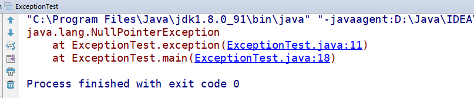
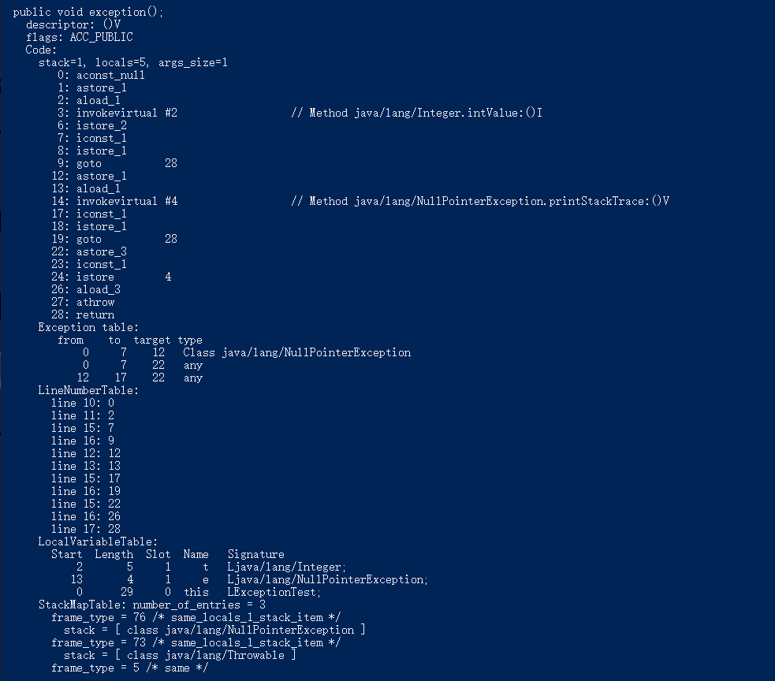

[TOC]

## 前言

​		大家好，不知不觉已经到 9 月份了，本篇文章是 Java 类机制的最后一篇，我们来一起探讨一下关于 Java 的字节码和方法调用。本篇文章参考了《深入理解 JVM 虚拟机》一书。

在开始之前我们先回顾一下在之前讲过的内容，在 [Java 类机制（3）---- 类文件结构](https://blog.csdn.net/Hacker_ZhiDian/article/details/94362039) 中我们解析了已经编译好的 `.class` 文件的内容结构。其中包括 

`magic`、`minor_version`、`major_version`...`methods_count`、`methods` 等结构。通过上篇文章我们已经知道一个 `methods` 结构中包含了某个方法的具体信息，其中就包含了这个方法代码的字节码表示，我们再来看看 `methods` 的结构：

|      类型      |       名称       |       数量       |             含义             |
| :------------: | :--------------: | :--------------: | :--------------------------: |
|       u2       |   access_flag    |        1         |        方法的访问标识        |
|       u2       |    name_index    |        1         |  方法名常量在常量池中的下标  |
|       u2       | descriptor_index |        1         | 方法描述常量在常量池中的下标 |
|       u2       | attributes_count |        1         |       额外属性信息数量       |
| attribute_info |    attributes    | attributes_count |         额外属性信息         |

其中，`attritube_info` 描述了方法的额外信息，其表结构如下：

| 类型 |                       名称                       |       数量        |            含义            |
| :--: | :----------------------------------------------: | :---------------: | :------------------------: |
|  u2  |               attribute_name_index               |         1         | 属性名在常量池中的常量下标 |
|  u4  |                attributes_length                 |         1         |       属性数据的长度       |
|  u1  | info（这里是统称，实际的数据由具体的表类型决定） | attributes_length |          属性数据          |

注意这里的 `attritube_info` 描述的是一类属性表的一般结构，并不是具体的某一个属性表，`attritube_info` 表的 `info` 字段描述的是这个属性表的数据，具体是何种数据需要根据 `attribute_name_index` 指向的常量池中的常量来决定，比如说当 `attribute_name_index` 指向的常量值为 `ConstantValue` 时，代表这个额外属性表的具体类型为 `ConstantValue` 类型，这个类型的表结构如下：

| 类型 |         名称         |       数量        |                     含义                      |
| :--: | :------------------: | :---------------: | :-------------------------------------------: |
|  u2  | attribute_name_index |         1         |          属性名在常量池中的常量下标           |
|  u4  |  attributes_length   |         1         |                属性数据的长度                 |
|  u1  | constantValue_index  | attributes_length | 指向常量池中下标为 constantValue_index 的常量 |

对应上面的 `attribute_info` 表：其 `info` 字段在 `ConstantValue` 表中的具体体现即为 `constantValue_index` 字段。而如果 `attritube_info` 表中的 `attribute_name_index` 字段指向的常量值为 `Code`，则代表当前的属性表的具体类型为 `Code` 类型，一个方法（即 `methods` 结构）中是一定会有一个名为 `Code` 的额外属性表的。这个表的具体类型如下：

|      类型      |          名称          |          数量          |                             含义                             |
| :------------: | :--------------------: | :--------------------: | :----------------------------------------------------------: |
|       u2       |  attribute_name_index  |           1            |                 属性表名在常量池中的常量下标                 |
|       u4       |   attributes_length    |           1            |                        属性数据的长度                        |
|       u2       |       max_stack        |           1            |                方法执行时操作数栈深度的最大值                |
|       u2       |       max_locals       |           1            | 方法执行时局部变量表所需要的存储空间，这里的单位 Slot，一个 Slot 可以储存长度不超过32位的局部变量值 |
|       u4       |      code_length       |           1            |                代码编译成字节码之后的代码长度                |
|       u1       |          code          |      code_length       |            代码内容，每一个字节数据对应一个字节码            |
|       u2       | exception_table_length |           1            |                       方法的异常表长度                       |
| exception_info |    exception_table     | exception_table_length |                      方法抛出的异常信息                      |
|       u2       |    attribute_count     |           1            |                        额外属性表数目                        |
| attribute_info |       attributes       |    attribute_count     |                        额外属性表信息                        |

这个时候 `attribute_info` 表中的 `info` 字段的具体体现即为 `Code` 表中除了最上面的两个 `attribute_name_index` 和 `attributes_length` 外的所有部分。

因此在 `attribute_info` 表中，`info` 字段的具体值需要确定了具体的表类型之后才能确定。故上文说 `attribute_info` 是描述一类表指的就是这个意思。除了 `Code` 和 `ConstantValue` 表之外，`attribute_info` 还可以有其他的具体类型表，小伙伴们可以参考该系列的 [上一篇文章](https://blog.csdn.net/Hacker_ZhiDian/article/details/94362039)。因为本文讨论的是字节码和方法的执行，因此我们这篇文章的重点就是放在 `Code` 表上。

## Code 表解析

其实我们在上一篇文章中已经分析过了 `Code` 表的二进制数据，解析出来的数据结构对应的就是上面列出的 `Code` 表，我们来详细解释一下其中包含的字段和相关含义：

`attribute_name_index`：属性表名在常量池中的常量所在的下标，`u2` 类型，即为无符号占用 2 个字节内存空间的无符号整数。这里其指向的常量一定为 `Code`，因为这个属性表就是 `Code` 类型的表。

`attribute_length`：属性数据的长度，`u4` 类型，即为无符号占用 4 个字节内存空间的无符号整数，它的值代表了这个 `Code` 表中除了 `attribute_name_index` 和 `attribute_length`  属性之外的其余属性所占用的内存空间数。

`max_stack`：方法的操作数栈的最大深度值，Java 方法在  JVM 中执行时采用的是栈模型，在执行字节码时会从栈中取出对应的操作数，并将操作结果（如果有并且需要的话）压回操作数栈中，这样的话整个 Java 方法执行的过程就是不断的对这个操作数栈进行入栈和出栈的过程，因此就一定会有一个操作数栈中元素最多的节点，而在这个节点的操作数栈的元素数量即为 `max_stack` 的值。

`max_locals`：方法执行时局部变量表所需要的最大储存空间，单位是 `Slot`，这里的局部变量表储存了方法参数，一个 `Slot` 可以储存不超过 32 位的一个局部变量值，因此方法参数的个数决定了这个值的大小，如果是非静态方法，则这个值至少为 1（会隐式的把对应的对象引用传入局部变量表，作为其第一个元素），而静态方法的 `max_locals` 最小值可以为 0，因为在静态方法中不能访问所在的类对象中的非静态属性（即 `this`）。

`code_length`：这个值表示的是真正的字节码的数量，这是一个 `u4` 类型，即为占用 4 个字节内存空间的无符号整数，所以其可以表示的最大字节码数量为 `2^32 - 1` 个。一个 Java 方法中的代码在编译成字节码后的数量几乎不可能超过这个数。

`code`：这个值就是表示了具体的字节码，类型为 `u1`，即为占用 1 个字节内存空间的无符号整数，其可以表示的范围为 `0~255`，每一个具体的值都对应一个具体的字节码，比如 `0x00` 对应的是 `nop`，`0xb1` 对应的是 `return`。JVM 中现有的字节码有两百多个，但是这个值没有超过 255。

`exception_table_length`：这个值表示了方法中的异常表信息的数量，类型为 `u2`，即为占用 2 个字节内存空间的无符号整数，比如我们有如下代码：

```java
public void exception() {
    try {
        // do something
    } catch (Exception e) {
        // do something
    }
}
```

那么这个方法在 `.class` 文件中的 `exception_table_length` 的值就为 1，因为我们在这里尝试 `catch` 了一个异常。

`exception_table`：异常表信息，标识了代码块中可能出现的某个异常的相关信息，这个表的数量为 `exception_table_length` 的值，因为在上一篇文章中由于篇幅原因没有解析这个表的信息，因此我们在这里来尝试对 `exception_table` 的数据来做一个例子解析。

#### ExceptionTable 

在开始之前我们先看看 `exception_table` 表的结构：

| 类型 |    名称    |                      含义                      | 数量 |
| :--: | :--------: | :--------------------------------------------: | ---- |
|  u2  |  start_pc  |            异常判断开始字节码所在行            | 1    |
|  u2  |   end_pc   |            异常判断结束行（不包含）            | 1    |
|  u2  |  catch_pc  |               尝试捕获的异常类型               | 1    |
|  u2  | handler_pc | 捕获到 catch_pc 指定类型异常后转到处理的代码行 | 1    |

这个表的作用可以用一句话来概括：当字节码在第 `start_pc` 行到 `end_pc` 行（不包含）之间出现了类型为 `catch_type` 或者其子类的异常（`catch_type` 指向了一个 `CONSTANT_Class_info` 类型常量的索引），则转到第 `handler_pc` 行继续处理。当 `catch_type` 值为 0 时，代表任何的异常情况都需要转向到 `handler_pc` 处进行处理。

下面我们来通过一个小例子看一下：

```java
public class ExceptionTest {
    
    public void exception() {
        try {
            Integer t = null;
            int tt = t;
        } catch (NullPointerException e) {
            e.printStackTrace();
        }
    }
    
    public static void main(String[] args) {
        new ExceptionTest().exception();
	}
}
```

这段代码的结果显而易见：



我们来看一下编译出来的 `.class` 文件的二进制内容：


这里我直接标出了编译后类中的 `exception` 方法在 `.class` 文件中的二进制数据，蓝色背景标注开头的 `00 0B` 即为 10 进制的 `11`，我们借助 `javap` 工具来看一下这个类的常量池内容：


可以看到，第 11 号常量的值为 `Code`，也就是说当前选中的是表示一个 `Code` 表类型的数据。这里为了方便，我直接将 `Code` 中的 `exception_info` 表的数据标注出来了，4 部分 8 个字节，对应 `start_pc`，`end_pc`，`handler_pc`，`catch_type` ，在这里这四个部分的 10 进制值为 `0`，`7`，`10`，`3`。对照 4 个字段的含义翻译过来就是：**如果在执行方法的第 0 行到第 10 行（不包括 10）字节码中发生了 `NullPointerException` 及其子类的异常，则跳转到第 7 行字节码继续执行。** 既然涉及到这个方法的字节码，那么我们就来看一下这个方法的字节码内容，同样借助 `javap` 工具：


结合字节码，我们可以很容易的总结出方法的运行规则：

尝试执行 0~6 这几行字节码，如果这个过程中发生了 `NullPointerException` 异常，则跳转到第 10 行字节码执行，否则会顺序执行到第 7 行，这是是一个 `goto` 语句，直接跳转到第 15 行，第 15 行是一个 `return` 指令，意味着结束方法的执行并且返回 `null`。如果跳转到第 10 行，证明在 0 ~ 6 行字节码的执行过程中发生了 `NullPointerException` 异常，此时会顺序执行第 10,、11、12、15 行字节码，也就是将异常信息打印后退出方法的执行。

#### 其他信息

其实在通过 `javap` 工具我们就可以看到 `exception` 中 `Code` 属性的全部信息，因为在图中我们可以看到 `Code` 下方还有好几个属性表数据，我们来看一下：

`LineNumberTable` 表代表该方法 Java 代码行数到字节码行数的映射，比如第 10 行 Java 代码对应的是该方法中第 0 行代码，我们可以看一下 Java 代码行数信息：


`LocalVariableTable` 表代表的是该方法的本地变量数据，方法内定义的局部变量储存在这个表中。

`StackMapTable` 存储了一些类型信息，用于提供数据给 `Type Checker` 检查和处理目标方法的局部变量和操作数栈所需要的数据类型是否匹配。

我们接下来为 `exception` 方法添加 `finally` 代码块，代码如下：

```java
public void exception() {
    try {
        Integer t = null;
        int tt = t;
    } catch (NullPointerException e) {
        e.printStackTrace();
    } finally {
        int x = 1;
    }
}
```

再来通过 `javap` 工具看一下 `exception` 方法的相关数据：



这里的 `ExceptionTable` 发生了一些变化，下面多了两行跳转信息，并且 `type` 为 `any`，也就是说从 0 ~ 7行和12 ~ 17 行字节码的执行过程中，无论有没有发生异常，其都会跳转到 22 行字节码进行执行，那么我们根据 `finally` 关键字的特性（无论 `try` 代码块中有没有发生异常`finally` 关键字中的代码块都会被执行），就可以猜出第 22 行字节码是 `finally` 代码块的开始，事实也确实如此：


可以看到在下面的 `LineNumberTable` 表中已经有 Java 代码行数到字节码行数的映射，而 15 对应的正是 22。

好了，到这里我们就把方法中的 `Code` 表的相关信息和作用通过一个例子解析了一遍。在之后再有分析 `.class` 文件的内容，我们将直接借助 `javap` 工具来完成。

## 方法的执行

从上面的内容中我们已经知道 Java 类中方法中的代码经过编译器编译后会作为字节码储存在 `method_info` 中的额外属性 `Code` 表中，也就是说我们写的 Java 代码在虚拟机执行的时候是执行一行行的字节码，上面我们已经了解过了关于字节码的概念，我们可以把它看成 Java 语言的 “汇编指令”，每一个字节码都有一个一个字节的数据值与其对应，相当于一个字节数据到字节码的映射表。这样虚拟机在碰见对应的数据值的时候就可以通过这个映射表来找到对应的字节码并执行。因为数据值的占用的大小是一个字节，因此最多可以有 256 个字节码（2^8）。

我们都知道方法代码在线程中执行，当然线程只是一个抽象概念，真正执行代码指令的只有 CPU，拿到这里来说就是线程在获取计算机相关资源的时候执行方法中的字节码，在虚拟机中每一个线程都会有一个专有的 **虚拟机栈**，当线程执行一个方法时，会将保存该方法相关信息的栈帧压入该线程的虚拟机栈中，一个栈帧包含了方法的以下信息：局部变量表（`Local Variable Table`）、操作数栈（`Operand Stack`）、动态链接（`Dynamic Linking`）、返回地址（`Return Address`）等。

#### 局部变量表

局部变量表是一组变量值储存空间，方法参数和方法内定义的变量的值都储存在局部变量表中，在 Java 编译器编译 Java 文件成 Class 文件时，就在该方法的 `Code` 额外属性表中确定了该方法所需要分配的局部变量表的最大容量，并储存在 `Code` 表中的 `max_local` 字段中，我们来看看上面的方法的局部变量表信息


可以看到每一个局部变量表有 4 个属性 `start`，`length`，`slot` （槽）和 `name`。`start` 和 `length` 代表变量作用域开始的字节码行数和作用域持续行数，这样算起来变量作用域的行数范围就是：`[start, start + length)`。`slot` 代表的是储存该变量需要占用的 `slot` 数，在局部变量表中每一个变量占用空间不是以字节为单位，而是以 `slot` 为单位，`slot` 相当于对变量储存的一个抽象，虚拟机没有明确对应一个 `slot` 需要占用多少字节的内存空间，只是规定了一个 `slot` 可以储存一个 `boolean`、`byte`、`char`、`short`、`int`、`float`、`reference` 和 `returnAddress` 类型的数据。而对于 `double` 和 `long`，则需要 2 个连续的 `slot` 进行储存。我们回到上图中的局部变量表信息，发现有两个局部变量（`tt` 和 `x`）没有出现在局部变量表内，这是因为我们在代码中只定义了这两个变量，但是并没有使用它们，也就是说这两个变量是无用变量，虚拟机在执行时并不会把它们放入局部变量表中以节省空间。我们继续看：名为 `this` 的局部变量储存在编号为 0 的 `slot` 中，而 `e` 和 `t` 这两个变量储存在同一个 `slot` 中，可能有些小伙伴会问了，这是有问题吗？其实这是由于虚拟机的一种优化机制，因为变量 `e` 和变量 `t` 的作用域没有重叠的部分，从 Java 代码中看，`t` 在 `try` 语句中定义，而 `e` 在 `catch` 语句中定义，因此当变量 `t` 声明周期结束了之后变量 `e` 就可以复用变量 `t` 的 `slot` 了，达到节省空间的目的。

#### 操作数栈

操作数栈是一个栈结构，也就是说它里面的元素是先进后出的，和局部变量表一样，操作数栈的最大深度也是在编译的时候就决定并且写到 `Code` 表中的 `max_stack` 属性中了。操作数栈中的数据类型可以是任意 Java 数据类型，包括 `long` 和 `double`，32 位数据类型占用 1 个栈元素，64 为数据类型占用 2 个栈元素，在方法执行的任何时候，操作数栈的深度都不会超过 `max_stack` 数据项中设定的最大值。

#### 动态链接

每一个栈帧都有一个指向运行时常量池中该栈帧所属方法的引用，持有这个引用是为了支持方法调用过程中的动态链接，我们知道在 `.class` 文件的常量池中存在大量的符号引用（`MethodRef`、`ClassRef` 等），有了指向这些符号引用的数据，当在使用这些符号引用指向的类和方法时虚拟机就可以将其转换为直接引用，比如 `invokevirtual` 指令就是调用某个类对象的实例方法，虚拟机在执行这个指令时就需要知道这个指令需要调用的类和方法的直接引用，如果还没有对应的直接引用，则需要通过指向它的符号引用来进行转换。

#### 方法返回地址

当一个方法开始执行后，要退出这个方法的执行有两种方法：一种是方法在执行过程中遇到了 `return` 系列的指令，这种方式为方法正常退出。另外一种是方法在执行过程中遇到了**未在方法内捕获并处理**的异常，此时会导致方法异常退出，这种方式是不会给调用者返回任何返回值的。

不管是哪种退出方式，在方法退出之后，调用者都需要确定方法被调用的位置，才能继续往下执行代码，如果是方法正常退出，方法调用者的 PC 计数器值可以作为返回地址，如果异常退出，则返回地址需要通过异常处理表确定。PC 计数器即为 `程序计数器`，是 Java 虚拟机内存的一部分，它保存了当前线程下一条要执行指令的地址，代码中的各种循环跳转逻辑就是依赖程序计数器实现的。同时，一个 Java 线程中有一个 `程序计数器`，即 `程序计数器` 是线程独立的，多个线程之间互不影响，想想也非常合理，因为一个单核处理器每一时刻只能执行一个线程的代码，那么其他线程总会有休眠的时候，在线程进入休眠（失去 CPU 资源）之前通过程序计数器保存这个线程下一条要执行的指令的地址就非常重要了，在线程重新获取 CPU 资源的时候，程序计数器可以帮助线程继续往下执行代码，而不用 “重新来过”。

方法执行其实就是把一个新的栈帧压入执行这个方法的线程的虚拟机栈中，同理，方法退出也就是将这个方法的栈帧从执行这个方法的线程的虚拟机栈中移除，如果这个方法有返回值，则会把返回值压入方法调用者的操作数栈中，调整  PC 计数器的值以指向这个方法调用指令的下一条指令以继续执行代码。

#### 字节码

我们再之前已经多次接触过了字节码了，也知道了字节码的概念和意义，这里给出 Java 虚拟机字节码指令对照表以供使用时参考：[字节码指令对照](http://www.blogjava.net/DLevin/archive/2011/09/13/358497.html)。

我们来通过一段简单的代码来解析一下 Java 方法的执行过程：

```java
public int byteCode() {
    int a = 100;
    int b = 200;
    int c = a + b;
    return c;
}
```

通过 `javap -v xxx.class` 来看一下这个方法字节码：


编译出来的 `Code` 信息中告诉我们这个方法的操作数栈最大深度为 2，需要 4 个 `slot` 的局部变量空间。我们一行一行指令往下看。

首先执行偏移地址为 0 的字节码，`bipush` 指令的作用是将单个字节的整型常量（-128~127）推入操作数栈顶，这个指令后跟随一个参数，指名推送的常量值，这里是 100。

接下来执行偏移地址为 2 的字节码，`istore_1` 指令的作用是将操作数栈顶部的整型值出栈并存入局部变量表的第一个 `slot` 中（注意：局部变量表的 `slot` 序号从 0 开始，序号为 0 的 `slot` 用于存类对象的引用）。接下来的两条指令也是做同样的事，不过数值变成了 200，同时存入的局部变量表的 `slot` 变成了 2（序号为 1 的 `slot` 已经存了 100 ），这里略过。

接下来是 `iload_1` 和 `iload_2` 指令，这两条执行分别将局部变量表中 `slot` 序号为 1 和 2 储存的整型值复制到操作数栈顶。此时操作数栈已经有两个整形值元素：100 和 200，其中 200 在栈顶，100 在栈底。

接下来是 `iadd` 指令，这条指令将操作数栈中的栈顶的两个元素出栈，做整型加法，并将结果重新入栈，在 `iadd` 指令执行完成之后，操作数栈中只有一个整型元素，值为 300。

接下来是 `istore_3` 指令，将操作数栈栈顶的整形元素出栈并存入局部变量表的第三个 `slot` 中。执行完这条指令后操作数栈为空。

接下来是 `iload_3` 指令，将局部变量表中第 3 个 `slot` 储存的整型值复制到操作数栈顶，执行完成后操作数栈有一个值为 300 的整型值元素。

最后是一个 `ireturn` 指令，这个指令是返回系列指令之一，将操作数栈顶的整型值（这里即为 300）返回给此方法的调用者。方法执行结束。

从这个指令执行过程可以看出虚拟机屏蔽了底层 CPU 的运算实现细节（基于寄存器模型），向上层提供了一个基于操作数栈的指令执行模型，这样的话一来可以统一虚拟机的指令执行机制，不管是在基于 `x86` 架构 CPU 的机器上还是 `arm` 架构 CPU 的机器上都可以获得统一的执行效果，底层的复杂操作则由对应的虚拟机负责处理。真正做到了：“一次编译，处处运行”。但是相对于基于寄存器模型来说，基于栈的指令执行模型也有缺点：我们可以很明显的观察到每次只能操作栈顶元素，如果需要操作栈顶以下的元素，则需要先将栈顶元素出栈并储存到局部变量表中。这样的话实现同样的功能会多使用一些指令，从某个角度上来说牺牲了一些效率，但是从虚拟机出现的目的来说，牺牲这些效率来提供一个统一的指令执行标准是值得的。

好了，到这里我们就将 Java 类机制介绍完了，这个系列从反射开始、到类的加载过程、再到类文件结构、最后是虚拟机的字节码和指令执行模型，希望这一系列对你理解虚拟机中的类机制会有所帮助。

如果文章中有什么不正确的地方，请多多指点，如果觉得本篇文章对你有帮助，请不要吝啬你的赞。


谢谢观看。。。