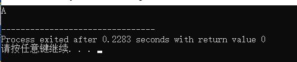

[TOC]

## 前言

​	我们在之前两篇文章中详细的介绍了一下 C语言的历史和关于 GCC 编译器的使用方法。这篇文章中我们来一起探讨一下关于信息数据在计算机是如何储存和表示的。有些小伙伴可能会问。数据就是储存在计算机的硬盘和主存中的啊。还能存去哪？确实，计算机中的所有数据都储存在有储存功能的部件中，这些部件包括内存、硬盘、CPU（寄存器）等。但是在这里我们要探讨的是数据在计算机中的表示形式，比如一个整型数 1 在计算机中的编码值，这是一个理论层面的东西，也可以理解为计算机科学家定制的一个标准。了解这些标准可以帮助我们更好的理解计算机的工作方式，写出更加健壮的程序。

## 信息的本质-编码

任何信息都是按照某个规则进行编码而得到的。我们日常见到的汉字、数字、英文等，当然也包括这篇文章。我们拿英语单词来举例子：

所有英语单词都是由 `a~z` 26 个字母中选取一个或者多个字母通过一定的顺序组合成的，这个过程就可以理解成编码：选取一个或者多个英文字母并按照一定顺序排列的过程。实际上，在这里我们把 `英文字母` 换成符号可能会更合适，因为从本质上来说，`a~z` 就是英语中 26 个用来进行信息表示的基本符号，至于为什么要采用 `a~z` 来作为基本符号，就得问这个语言的发明者了。

同样的，编码这个动作也适用于英语句子：所有的英语句子都是由一个或者多个英语单词按照一定的顺序组成的。

对于汉字也是一样的道理：中文中的一句话是由一个或者多个汉字组成的，而汉字又是由一个或者多个偏旁组成的。

对于不同层面的信息我们有不同的编码规则。但是只有经过了编码之后的符号才有意义。我们可以理解为：信息就是一个或者多个符号经过某个编码规则进行排列组合后得到的符号所表达的东西。

从古代的实物计数、结绳计数、筹码计数等到现代的罗马数字、阿拉伯数字，某个信息在不同的编码规则下可能有不同的符号表现。比如 ”五“ 这个数量词在罗马数字中用 `V` 符号表示，而在阿拉伯数字中用 `5` 这个符号来表示，但是它们表示的信息本质都是 `五` 这个数量词。

## 计算机中信息的编码

​	让我们的思绪回到现代社会。计算机帮我们 ”记住“ 和 ”做“ 了很多事情，这句话换一个描述方式是：计算机帮我们储存和处理了很多信息。而计算机内部采用 `二进制` 的形式来储存和处理信息。这意味着在计算机内部中，只有 `0` 和 `1` 两个符号可选。好在这两个符号数量是不受限制的。也就是说我们可以选取任意个 `0` 和 `1` 的符号进行排列组合，即编码，来得到无数个可能的结果（因为我们可以选取任意个 `0` 和 `1`）。通过这两个不同的符号已经足够描述这个世界了，只是在现实层面上我们缺少足够多的能够储存信息的介质而已，而这种介质在计算机中的最直接体现就是硬盘（无论再大，一个硬盘的容量也是有限的，容量大小时硬盘的物理属性之一）。

假设我们现在有 1 位的二进制数据，我们可以选取的二进制符号有 `0` 或者 `1`。这两我们通过排列组合得到的结果有两种可能：`0`、`1`。

如果可以选择 2 位的二进制数据呢？我们在第一位可以选择 `0` 或者 `1`，在第二位也可以选择 `0` 或者 `1`。这两我们通过排列组合得到的结果有 4 种可能性：`00`、`01`、`10`、`11`。

如果可以选择 n 位的二进制数据呢？我们通过排列组合得到的结果就有 `2^n` 种可能。

我们上面说过，将一个或者多个符号通过排列组合的过程就是编码。编码后的符号代表了某些信息。我们在上面已经通过二进制的符号（`0` 和 `1`）编码出了一些符号组合。但是并没有赋予其具体的含义。也就是说缺少了符号到信息的映射关系。这里的原因在于我们缺少一个实际场景，这里的缺少实际场景指的是我们还未指定这些符号要用来表示哪种类型的信息。我们来看看在计算机中这些符号组合分别代表什么信息。

### 信息的表示与处理

​	我们在上面已经知道了，编码出来的符号需要有实际的场景才可以表示对应的信息。而在计算机中这些符号表示的信息取决于这些符号被赋值给了哪种类型的变量。假设我们有一个编码出来的 8 位二进制符号：`01000001`，它代表的信息根据它的变量数据类型决定，我们拿 C语言中的数据类型举例子：

#### char

​	字符类型，每个变量占用 1 个字节（8位二进制）的储存空间。二进制符号范围为：`00000000` ~ `11111111`。一共可以有 `256` 个组合， 每一个值都被表示为了一个字符，对于上面的 `01000001` 来说。其表示的是大写字母 `A`，参见 [Ascii 字符对照表](#1、Ascii 码字符对照表)。我们可以通过代码验证：

```c
#include <stdio.h>

int main() {
    // 0b 开头的代表这是一个二进制编码数据
	char c = 0b01000001;
	printf("%c\n", c);
	return 0;
} 
```



#### short

​	短整型类型，每个变量占用 2 个字节（16位二进制）的储存空间。二进制符号范围为 `0000000000000000` ~ `1111111111111111`。一共有 `65536` 种编码组合。 这种类型的每一种符号组合都被映射成了一个整数值。数值范围（10 进制为）：`-32768` ~ `32767`。至于为什么会是这个数值范围参考 [整数的补码表示](#整数的补码表示) 小节。我们可以看到这个数值范围恰好把 `short` 类型的 `65536` 种组合用完了（`-32768` ~ `-1` 一共 `32768` 用了种组合，`0` ~ `32767` 一共用了 `32768`，两个部分一共用了 `65536` 种组合）。

#### int

​	整型类型，在 64 位计算机上，每个变量占用 4 个字节（32位二进制）的储存空间，32 位计算机上（基本已经很少了），每个变量占用 2 个字节的储存空间（16 位二进制）。如果在 32 位机器上，这个类型就等价于 `short` 类型。我们这里只讨论 64 位计算机。其二进制符号范围为 `00000000000000000000000000000000` ~ `11111111111111111111111111111111`。一共有 `4294967296` 种编码组合。

和 `short` 类型类似，`int ` 类型的每一个符号组合也被映射成了一个整数值。数值范围（10 进制为）：`-2147483648` ~ `2147483647`。所有数字的个数总和正好等于 `4294967296`，将 `4294967296` 种二进制编码的总和用完了。

#### long

​	长整型，在 64 位计算机上，每个变量占用 8 个字节（64位二进制）的储存空间，32 位计算机上（基本已经很少了），每个变量占用 4 个字节的储存空间（32 位二进制）。这里也只讨论 64 位机器。其二进制符号范围为 `0000000000000000000000000000000000000000000000000000000000000000` ~ `1111111111111111111111111111111111111111111111111111111111111111`。 一共有 `1.8446744073709552e+19` 种编码组合。

和 `int` 类型类似，`long` 类型的每一个符号组合也被映射成了一个整数值。数值范围（10 进制为）：`-9.223372036854776e+18` ~ `9.223372036854776e+18 - 1`。所有数字的个数总和正好等于 `1.8446744073709552e+19`，将 `1.8446744073709552e+19` 种二进制编码的总和用完了。

#### float

​	单精度浮点类型。每个变量占用 4 个字节（32 位二进制）的储存空间。二进制符号范围为：`00000000000000000000000000000000` ~ `11111111111111111111111111111111` 。你会发现和 `int` 类型的二进制符号范围一致，其实这个很好理解，因为都是用二进制来进行编码，占用的二进制位数（都是32）也一样，自然最后编码得到的符号范围和总数也一样。那么它们的区别在哪？其实就是对每个二进制编码出来的符号赋予的含义不同：在 `int` 类型中，每一个二进制符号都被表示成了一个整数，而在 `float` 类型中，每一个二进制符号都被表示成了一个浮点数。`float` 类型能表示的浮点数的范围为：`-` ~ 。这个范围是根据  [浮点数的表示](#浮点数的表示) 规则得出来的。


### 整数的补码表示


### 整数的运算


### 浮点数的表示


### 浮点数的运算


## 附录

### 1、Ascii 码字符对照表

| Bin(二进制) | Oct(八进制) | Dec(十进制) | Hex(十六进制) | 缩写/字符                   | 解释         |
| ----------- | ----------- | ----------- | ------------- | --------------------------- | ------------ |
| 0000 0000   | 00          | 0           | 0x00          | NUL(null)                   | 空字符       |
| 0000 0001   | 01          | 1           | 0x01          | SOH(start of headline)      | 标题开始     |
| 0000 0010   | 02          | 2           | 0x02          | STX (start of text)         | 正文开始     |
| 0000 0011   | 03          | 3           | 0x03          | ETX (end of text)           | 正文结束     |
| 0000 0100   | 04          | 4           | 0x04          | EOT (end of transmission)   | 传输结束     |
| 0000 0101   | 05          | 5           | 0x05          | ENQ (enquiry)               | 请求         |
| 0000 0110   | 06          | 6           | 0x06          | ACK (acknowledge)           | 收到通知     |
| 0000 0111   | 07          | 7           | 0x07          | BEL (bell)                  | 响铃         |
| 0000 1000   | 010         | 8           | 0x08          | BS (backspace)              | 退格         |
| 0000 1001   | 011         | 9           | 0x09          | HT (horizontal tab)         | 水平制表符   |
| 0000 1010   | 012         | 10          | 0x0A          | LF (NL line feed, new line) | 换行键       |
| 0000 1011   | 013         | 11          | 0x0B          | VT (vertical tab)           | 垂直制表符   |
| 0000 1100   | 014         | 12          | 0x0C          | FF (NP form feed, new page) | 换页键       |
| 0000 1101   | 015         | 13          | 0x0D          | CR (carriage return)        | 回车键       |
| 0000 1110   | 016         | 14          | 0x0E          | SO (shift out)              | 不用切换     |
| 0000 1111   | 017         | 15          | 0x0F          | SI (shift in)               | 启用切换     |
| 0001 0000   | 020         | 16          | 0x10          | DLE (data link escape)      | 数据链路转义 |
| 0001 0001   | 021         | 17          | 0x11          | DC1 (device control 1)      | 设备控制1    |
| 0001 0010   | 022         | 18          | 0x12          | DC2 (device control 2)      | 设备控制2    |
| 0001 0011   | 023         | 19          | 0x13          | DC3 (device control 3)      | 设备控制3    |
| 0001 0100   | 024         | 20          | 0x14          | DC4 (device control 4)      | 设备控制4    |
| 0001 0101   | 025         | 21          | 0x15          | NAK (negative acknowledge)  | 拒绝接收     |
| 0001 0110   | 026         | 22          | 0x16          | SYN (synchronous idle)      | 同步空闲     |
| 0001 0111   | 027         | 23          | 0x17          | ETB (end of trans. block)   | 结束传输块   |
| 0001 1000   | 030         | 24          | 0x18          | CAN (cancel)                | 取消         |
| 0001 1001   | 031         | 25          | 0x19          | EM (end of medium)          | 媒介结束     |
| 0001 1010   | 032         | 26          | 0x1A          | SUB (substitute)            | 代替         |
| 0001 1011   | 033         | 27          | 0x1B          | ESC (escape)                | 换码(溢出)   |
| 0001 1100   | 034         | 28          | 0x1C          | FS (file separator)         | 文件分隔符   |
| 0001 1101   | 035         | 29          | 0x1D          | GS (group separator)        | 分组符       |
| 0001 1110   | 036         | 30          | 0x1E          | RS (record separator)       | 记录分隔符   |
| 0001 1111   | 037         | 31          | 0x1F          | US (unit separator)         | 单元分隔符   |
| 0010 0000   | 040         | 32          | 0x20          | (space)                     | 空格         |
| 0010 0001   | 041         | 33          | 0x21          | !                           | 叹号         |
| 0010 0010   | 042         | 34          | 0x22          | "                           | 双引号       |
| 0010 0011   | 043         | 35          | 0x23          | #                           | 井号         |
| 0010 0100   | 044         | 36          | 0x24          | $                           | 美元符       |
| 0010 0101   | 045         | 37          | 0x25          | %                           | 百分号       |
| 0010 0110   | 046         | 38          | 0x26          | &                           | 和号         |
| 0010 0111   | 047         | 39          | 0x27          | '                           | 闭单引号     |
| 0010 1000   | 050         | 40          | 0x28          | (                           | 开括号       |
| 0010 1001   | 051         | 41          | 0x29          | )                           | 闭括号       |
| 0010 1010   | 052         | 42          | 0x2A          | *                           | 星号         |
| 0010 1011   | 053         | 43          | 0x2B          | +                           | 加号         |
| 0010 1100   | 054         | 44          | 0x2C          | ,                           | 逗号         |
| 0010 1101   | 055         | 45          | 0x2D          | -                           | 减号/破折号  |
| 0010 1110   | 056         | 46          | 0x2E          | .                           | 句号         |
| 0010 1111   | 057         | 47          | 0x2F          | /                           | 斜杠         |
| 0011 0000   | 060         | 48          | 0x30          | 0                           | 字符0        |
| 0011 0001   | 061         | 49          | 0x31          | 1                           | 字符1        |
| 0011 0010   | 062         | 50          | 0x32          | 2                           | 字符2        |
| 0011 0011   | 063         | 51          | 0x33          | 3                           | 字符3        |
| 0011 0100   | 064         | 52          | 0x34          | 4                           | 字符4        |
| 0011 0101   | 065         | 53          | 0x35          | 5                           | 字符5        |
| 0011 0110   | 066         | 54          | 0x36          | 6                           | 字符6        |
| 0011 0111   | 067         | 55          | 0x37          | 7                           | 字符7        |
| 0011 1000   | 070         | 56          | 0x38          | 8                           | 字符8        |
| 0011 1001   | 071         | 57          | 0x39          | 9                           | 字符9        |
| 0011 1010   | 072         | 58          | 0x3A          | :                           | 冒号         |
| 0011 1011   | 073         | 59          | 0x3B          | ;                           | 分号         |
| 0011 1100   | 074         | 60          | 0x3C          | <                           | 小于         |
| 0011 1101   | 075         | 61          | 0x3D          | =                           | 等号         |
| 0011 1110   | 076         | 62          | 0x3E          | >                           | 大于         |
| 0011 1111   | 077         | 63          | 0x3F          | ?                           | 问号         |
| 0100 0000   | 0100        | 64          | 0x40          | @                           | 电子邮件符号 |
| 0100 0001   | 0101        | 65          | 0x41          | A                           | 大写字母A    |
| 0100 0010   | 0102        | 66          | 0x42          | B                           | 大写字母B    |
| 0100 0011   | 0103        | 67          | 0x43          | C                           | 大写字母C    |
| 0100 0100   | 0104        | 68          | 0x44          | D                           | 大写字母D    |
| 0100 0101   | 0105        | 69          | 0x45          | E                           | 大写字母E    |
| 0100 0110   | 0106        | 70          | 0x46          | F                           | 大写字母F    |
| 0100 0111   | 0107        | 71          | 0x47          | G                           | 大写字母G    |
| 0100 1000   | 0110        | 72          | 0x48          | H                           | 大写字母H    |
| 0100 1001   | 0111        | 73          | 0x49          | I                           | 大写字母I    |
| 01001010    | 0112        | 74          | 0x4A          | J                           | 大写字母J    |
| 0100 1011   | 0113        | 75          | 0x4B          | K                           | 大写字母K    |
| 0100 1100   | 0114        | 76          | 0x4C          | L                           | 大写字母L    |
| 0100 1101   | 0115        | 77          | 0x4D          | M                           | 大写字母M    |
| 0100 1110   | 0116        | 78          | 0x4E          | N                           | 大写字母N    |
| 0100 1111   | 0117        | 79          | 0x4F          | O                           | 大写字母O    |
| 0101 0000   | 0120        | 80          | 0x50          | P                           | 大写字母P    |
| 0101 0001   | 0121        | 81          | 0x51          | Q                           | 大写字母Q    |
| 0101 0010   | 0122        | 82          | 0x52          | R                           | 大写字母R    |
| 0101 0011   | 0123        | 83          | 0x53          | S                           | 大写字母S    |
| 0101 0100   | 0124        | 84          | 0x54          | T                           | 大写字母T    |
| 0101 0101   | 0125        | 85          | 0x55          | U                           | 大写字母U    |
| 0101 0110   | 0126        | 86          | 0x56          | V                           | 大写字母V    |
| 0101 0111   | 0127        | 87          | 0x57          | W                           | 大写字母W    |
| 0101 1000   | 0130        | 88          | 0x58          | X                           | 大写字母X    |
| 0101 1001   | 0131        | 89          | 0x59          | Y                           | 大写字母Y    |
| 0101 1010   | 0132        | 90          | 0x5A          | Z                           | 大写字母Z    |
| 0101 1011   | 0133        | 91          | 0x5B          | [                           | 开方括号     |
| 0101 1100   | 0134        | 92          | 0x5C          | \                           | 反斜杠       |
| 0101 1101   | 0135        | 93          | 0x5D          | ]                           | 闭方括号     |
| 0101 1110   | 0136        | 94          | 0x5E          | ^                           | 脱字符       |
| 0101 1111   | 0137        | 95          | 0x5F          | _                           | 下划线       |
| 0110 0000   | 0140        | 96          | 0x60          | `                           | 开单引号     |
| 0110 0001   | 0141        | 97          | 0x61          | a                           | 小写字母a    |
| 0110 0010   | 0142        | 98          | 0x62          | b                           | 小写字母b    |
| 0110 0011   | 0143        | 99          | 0x63          | c                           | 小写字母c    |
| 0110 0100   | 0144        | 100         | 0x64          | d                           | 小写字母d    |
| 0110 0101   | 0145        | 101         | 0x65          | e                           | 小写字母e    |
| 0110 0110   | 0146        | 102         | 0x66          | f                           | 小写字母f    |
| 0110 0111   | 0147        | 103         | 0x67          | g                           | 小写字母g    |
| 0110 1000   | 0150        | 104         | 0x68          | h                           | 小写字母h    |
| 0110 1001   | 0151        | 105         | 0x69          | i                           | 小写字母i    |
| 0110 1010   | 0152        | 106         | 0x6A          | j                           | 小写字母j    |
| 0110 1011   | 0153        | 107         | 0x6B          | k                           | 小写字母k    |
| 0110 1100   | 0154        | 108         | 0x6C          | l                           | 小写字母l    |
| 0110 1101   | 0155        | 109         | 0x6D          | m                           | 小写字母m    |
| 0110 1110   | 0156        | 110         | 0x6E          | n                           | 小写字母n    |
| 0110 1111   | 0157        | 111         | 0x6F          | o                           | 小写字母o    |
| 0111 0000   | 0160        | 112         | 0x70          | p                           | 小写字母p    |
| 0111 0001   | 0161        | 113         | 0x71          | q                           | 小写字母q    |
| 0111 0010   | 0162        | 114         | 0x72          | r                           | 小写字母r    |
| 0111 0011   | 0163        | 115         | 0x73          | s                           | 小写字母s    |
| 0111 0100   | 0164        | 116         | 0x74          | t                           | 小写字母t    |
| 0111 0101   | 0165        | 117         | 0x75          | u                           | 小写字母u    |
| 0111 0110   | 0166        | 118         | 0x76          | v                           | 小写字母v    |
| 0111 0111   | 0167        | 119         | 0x77          | w                           | 小写字母w    |
| 0111 1000   | 0170        | 120         | 0x78          | x                           | 小写字母x    |
| 0111 1001   | 0171        | 121         | 0x79          | y                           | 小写字母y    |
| 0111 1010   | 0172        | 122         | 0x7A          | z                           | 小写字母z    |
| 0111 1011   | 0173        | 123         | 0x7B          | {                           | 开花括号     |
| 0111 1100   | 0174        | 124         | 0x7C          | \|                          | 垂线         |
| 0111 1101   | 0175        | 125         | 0x7D          | }                           | 闭花括号     |
| 0111 1110   | 0176        | 126         | 0x7E          | ~                           | 波浪号       |
| 0111 1111   | 0177        | 127         | 0x7F          | DEL (delete)                | 删除         |


