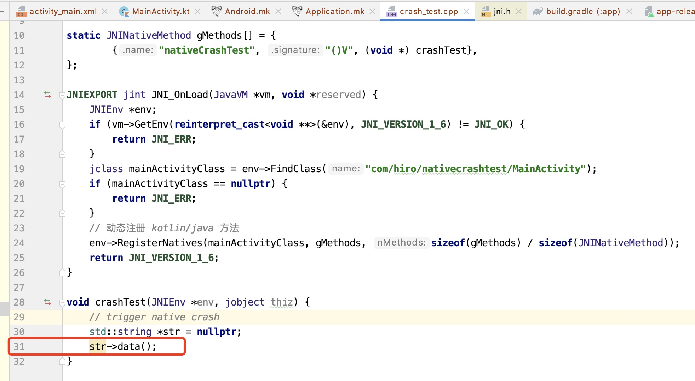
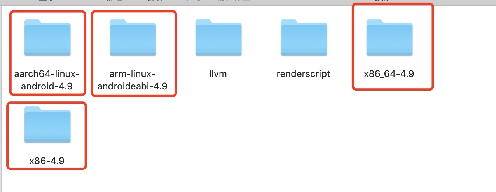
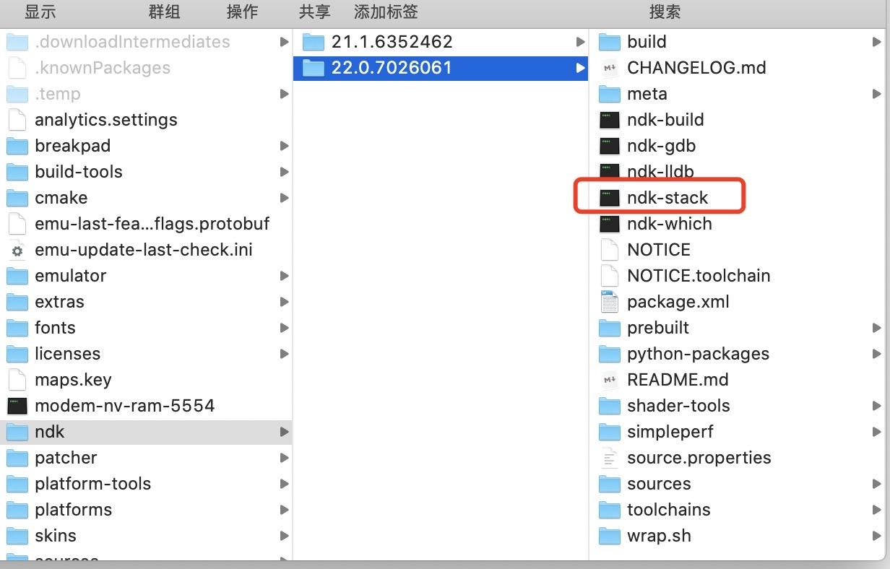

[TOC]

## 前言

我们在使用 Android 官方提供的 ndk 工具来开发带 native 代码的程序时，难免会碰到 native 层的代码 crash。而这类 crash 因为平时大家接触的比较少，然后相对于 java 层 crash 来说，ntive crash 的 log 中没有虚拟机帮忙生成调用栈信息，需要自己进行转换，相对来说麻烦一点。所以对于很多刚接触原生开发的小伙伴来说如何处理 native crash 是一道小槛。
本文将会介绍如何使用 Android ndk 提供的相关工具来进行 native crash 的定位，来帮助刚接触 native 开发的小伙伴 “迈过” 这道小槛。

## 准备工作

分析和定位 native crash 需要以下几个东西：
1、addr2line, objdump, ndk-stack 等工具，这些工具都附加在 ndk 开发工具包里，只要下载了 ndk 即可，无需单独下载；
2、带 symbols 符号表的 so 文件；
3、crash log；

## 创建一个 native crash

要想分析 native crash，我们必须先要有一个 native crash，这里我写了一个最简单的产生 native crash 的代码，主要代码逻辑包括两个文件：`MainActivity.kt` 和 `crash_test.cpp`。先看 `MainActivity.kt`：

```kotlin
package com.hiro.nativecrashtest

import androidx.appcompat.app.AppCompatActivity
import android.os.Bundle

class MainActivity : AppCompatActivity() {

    companion object {
        init {
            System.loadLibrary("crash_test")
        }
    }

    override fun onCreate(savedInstanceState: Bundle?) {
        super.onCreate(savedInstanceState)
        setContentView(R.layout.activity_main)
        // trigger native crash
        nativeCrashTest()
    }

    /**
     * 声明 native 方法
     */
    private external fun nativeCrashTest()
}
```

很简单的逻辑，在 `MainActivity` 的伴生对象中的类初始化时加载了名为 `crash_test` 的 so 库。在 `onCreate` 方法中调用了 `nativeCrashTest` 方法，这个方法在 `c++` 层的实现为触发一个 native crash，接下来来看看对应的 c++ 代码逻辑 `crash_test.cpp`：

```c++
#include <jni.h>
#include <iostream>

void crashTest(JNIEnv *env, jobject thiz);

static JNINativeMethod gMethods[] = {
        {"nativeCrashTest", "()V", (void *) crashTest},
};

JNIEXPORT jint JNI_OnLoad(JavaVM *vm, void *reserved) {
    JNIEnv *env;
    if (vm->GetEnv(reinterpret_cast<void **>(&env), JNI_VERSION_1_6) != JNI_OK) {
        return JNI_ERR;
    }
    jclass mainActivityClass = env->FindClass("com/hiro/nativecrashtest/MainActivity");
    if (mainActivityClass == nullptr) {
        return JNI_ERR;
    }
    // 动态注册 crashTest 方法
    env->RegisterNatives(mainActivityClass, gMethods, sizeof(gMethods) / sizeof(JNINativeMethod));
    return JNI_VERSION_1_6;
}

void crashTest(JNIEnv *env, jobject thiz) {
    // trigger native crash
    std::string *str = nullptr;
    str->data();
}
```

我们在 `JNI_OnLoad` 方法中动态注册了 c++ 层的 `crasgTest` 方法，使其和 `kotlin` 层的 `com.hiro.nativecrashtest.MainActivity#nativeCrashTest` 方法关联起来，同时我们在 `crashTest` 方法中出发了一个空指针异常。

非常简单的代码逻辑，这里就不再贴 `Android.mk` 和 `Application.mk` 等配置文件的代码了。我们来运行这个应用看看：

## 分析 native crash log

和我们预期一样，应用在启动时就发生了 crash。我们先来看一下 crash log：

```txt
2021-02-14 10:09:38.235 14222-14222/? A/DEBUG: *** *** *** *** *** *** *** *** *** *** *** *** *** *** *** ***
2021-02-14 10:09:38.235 14222-14222/? A/DEBUG: Build fingerprint: 'Xiaomi/grus/grus:10/QKQ1.190828.002/V12.0.3.0.QFBCNXM:user/release-keys'
2021-02-14 10:09:38.235 14222-14222/? A/DEBUG: Revision: '0'
2021-02-14 10:09:38.235 14222-14222/? A/DEBUG: ABI: 'arm64'
2021-02-14 10:09:38.236 14222-14222/? A/DEBUG: Timestamp: 2021-02-14 10:09:38+0800
2021-02-14 10:09:38.236 14222-14222/? A/DEBUG: pid: 14183, tid: 14183, name: nativecrashtest  >>> com.hiro.nativecrashtest <<<
2021-02-14 10:09:38.236 14222-14222/? A/DEBUG: uid: 10846
2021-02-14 10:09:38.236 14222-14222/? A/DEBUG: signal 11 (SIGSEGV), code 1 (SEGV_MAPERR), fault addr 0x0
2021-02-14 10:09:38.236 14222-14222/? A/DEBUG: Cause: null pointer dereference
2021-02-14 10:09:38.236 14222-14222/? A/DEBUG:     x0  0000000000000000  x1  0000007fd0f9e8a4  x2  0000007fd0f9e860  x3  0000007b4687d470
2021-02-14 10:09:38.236 14222-14222/? A/DEBUG:     x4  0000000000000001  x5  0000007fd0fa0300  x6  0000007fd0f9e870  x7  0000007bcc564020
2021-02-14 10:09:38.236 14222-14222/? A/DEBUG:     x8  0000000000000000  x9  2c040fe008b2e91d  x10 0000000000430000  x11 0000007fd0f9e810
2021-02-14 10:09:38.236 14222-14222/? A/DEBUG:     x12 0000007fd0f9e8a4  x13 0000007fd0f9e898  x14 0000000000000000  x15 0000000000000000
2021-02-14 10:09:38.236 14222-14222/? A/DEBUG:     x16 0000007add16698c  x17 0000000000000000  x18 0000007bcd6c4000  x19 0000007b47869c00
2021-02-14 10:09:38.236 14222-14222/? A/DEBUG:     x20 0000000000000000  x21 0000007b47869c00  x22 0000007fd0f9eb10  x23 0000007b2e88ee32
2021-02-14 10:09:38.236 14222-14222/? A/DEBUG:     x24 0000000000000004  x25 0000007bcc564020  x26 0000007b47869cb0  x27 0000000000000001
2021-02-14 10:09:38.236 14222-14222/? A/DEBUG:     x28 0000007fd0f9e8a0  x29 0000007fd0f9e7f0
2021-02-14 10:09:38.236 14222-14222/? A/DEBUG:     sp  0000007fd0f9e7e0  lr  0000007add166a68  pc  0000007add166a68
2021-02-14 10:09:38.800 14222-14222/? A/DEBUG: backtrace:
2021-02-14 10:09:38.800 14222-14222/? A/DEBUG:       #00 pc 0000000000000a68  /data/app/com.hiro.nativecrashtest-KnMRyOa6M5ICdjqhJVorww==/lib/arm64/libcrash_test.so (BuildId: 41b6e3847e7950e1bba8448a36c1dfcdcf4ef5f2)
2021-02-14 10:09:38.800 14222-14222/? A/DEBUG:       #01 pc 0000000000000a14  /data/app/com.hiro.nativecrashtest-KnMRyOa6M5ICdjqhJVorww==/lib/arm64/libcrash_test.so (BuildId: 41b6e3847e7950e1bba8448a36c1dfcdcf4ef5f2)
2021-02-14 10:09:38.800 14222-14222/? A/DEBUG:       #02 pc 00000000000009d0  /data/app/com.hiro.nativecrashtest-KnMRyOa6M5ICdjqhJVorww==/lib/arm64/libcrash_test.so (BuildId: 41b6e3847e7950e1bba8448a36c1dfcdcf4ef5f2)
2021-02-14 10:09:38.800 14222-14222/? A/DEBUG:       #03 pc 00000000000009ac  /data/app/com.hiro.nativecrashtest-KnMRyOa6M5ICdjqhJVorww==/lib/arm64/libcrash_test.so (crashTest(_JNIEnv*, _jobject*)+32) (BuildId: 41b6e3847e7950e1bba8448a36c1dfcdcf4ef5f2)
2021-02-14 10:09:38.800 14222-14222/? A/DEBUG:       #04 pc 0000000000140350  /apex/com.android.runtime/lib64/libart.so (art_quick_generic_jni_trampoline+144) (BuildId: 376198a47d78b78005bb3b63433c492c)
2021-02-14 10:09:38.800 14222-14222/? A/DEBUG:       #05 pc 0000000000137334  /apex/com.android.runtime/lib64/libart.so (art_quick_invoke_stub+548) (BuildId: 376198a47d78b78005bb3b63433c492c)
2021-02-14 10:09:38.800 14222-14222/? A/DEBUG:       #06 pc 0000000000145fec  /apex/com.android.runtime/lib64/libart.so (art::ArtMethod::Invoke(art::Thread*, unsigned int*, unsigned int, art::JValue*, char const*)+244) (BuildId: 376198a47d78b78005bb3b63433c492c)
2021-02-14 10:09:38.800 14222-14222/? A/DEBUG:       #07 pc 00000000002e37d0  /apex/com.android.runtime/lib64/libart.so (art::interpreter::ArtInterpreterToCompiledCodeBridge(art::Thread*, art::ArtMethod*, art::ShadowFrame*, unsigned short, art::JValue*)+384) (BuildId: 376198a47d78b78005bb3b63433c492c)
2021-02-14 10:09:38.800 14222-14222/? A/DEBUG:       #08 pc 00000000002dea30  /apex/com.android.runtime/lib64/libart.so (bool art::interpreter::DoCall<false, false>(art::ArtMethod*, art::Thread*, art::ShadowFrame&, art::Instruction const*, unsigned short, art::JValue*)+892) (BuildId: 376198a47d78b78005bb3b63433c492c)
2021-02-14 10:09:38.800 14222-14222/? A/DEBUG:       #09 pc 00000000005a32cc  /apex/com.android.runtime/lib64/libart.so (MterpInvokeDirect+424) (BuildId: 376198a47d78b78005bb3b63433c492c)
2021-02-14 10:09:38.800 14222-14222/? A/DEBUG:       #10 pc 0000000000131914  /apex/com.android.runtime/lib64/libart.so (mterp_op_invoke_direct+20) (BuildId: 376198a47d78b78005bb3b63433c492c)
2021-02-14 10:09:38.800 14222-14222/? A/DEBUG:       #11 pc 0000000000029b4a  [anon:dalvik-classes2.dex extracted in memory from /data/app/com.hiro.nativecrashtest-KnMRyOa6M5ICdjqhJVorww==/base.apk!classes2.dex] (com.hiro.nativecrashtest.MainActivity.onCreate+18)
2021-02-14 10:09:38.800 14222-14222/? A/DEBUG:       #12 pc 00000000005a1264  /apex/com.android.runtime/lib64/libart.so (MterpInvokeVirtual+1352) (BuildId: 376198a47d78b78005bb3b63433c492c)
2021-02-14 10:09:38.801 14222-14222/? A/DEBUG:       #13 pc 0000000000131814  /apex/com.android.runtime/lib64/libart.so (mterp_op_invoke_virtual+20) (BuildId: 376198a47d78b78005bb3b63433c492c)
2021-02-14 10:09:38.801 14222-14222/? A/DEBUG:       #14 pc 00000000001af0ce  /system/framework/framework.jar (android.app.Activity.performCreate+38)
2021-02-14 10:09:38.801 14222-14222/? A/DEBUG:       #15 pc 00000000005a1264  /apex/com.android.runtime/lib64/libart.so (MterpInvokeVirtual+1352) (BuildId: 376198a47d78b78005bb3b63433c492c)
2021-02-14 10:09:38.801 14222-14222/? A/DEBUG:       #16 pc 0000000000131814  /apex/com.android.runtime/lib64/libart.so (mterp_op_invoke_virtual+20) (BuildId: 376198a47d78b78005bb3b63433c492c)
2021-02-14 10:09:38.801 14222-14222/? A/DEBUG:       #17 pc 00000000001af08e  /system/framework/framework.jar (android.app.Activity.performCreate+2)
2021-02-14 10:09:38.801 14222-14222/? A/DEBUG:       #18 pc 00000000005a1264  /apex/com.android.runtime/lib64/libart.so (MterpInvokeVirtual+1352) (BuildId: 376198a47d78b78005bb3b63433c492c)
2021-02-14 10:09:38.801 14222-14222/? A/DEBUG:       #19 pc 0000000000131814  /apex/com.android.runtime/lib64/libart.so (mterp_op_invoke_virtual+20) (BuildId: 376198a47d78b78005bb3b63433c492c)
2021-02-14 10:09:38.801 14222-14222/? A/DEBUG:       #20 pc 0000000000211a56  /system/framework/framework.jar (android.app.Instrumentation.callActivityOnCreate+6)
2021-02-14 10:09:38.801 14222-14222/? A/DEBUG:       #21 pc 00000000005a1264  /apex/com.android.runtime/lib64/libart.so (MterpInvokeVirtual+1352) (BuildId: 376198a47d78b78005bb3b63433c492c)
2021-02-14 10:09:38.801 14222-14222/? A/DEBUG:       #22 pc 0000000000131814  /apex/com.android.runtime/lib64/libart.so (mterp_op_invoke_virtual+20) (BuildId: 376198a47d78b78005bb3b63433c492c)
2021-02-14 10:09:38.801 14222-14222/? A/DEBUG:       #23 pc 000000000019dddc  /system/framework/framework.jar (android.app.ActivityThread.performLaunchActivity+752)
2021-02-14 10:09:38.801 14222-14222/? A/DEBUG:       #24 pc 00000000005a3570  /apex/com.android.runtime/lib64/libart.so (MterpInvokeDirect+1100) (BuildId: 376198a47d78b78005bb3b63433c492c)
2021-02-14 10:09:38.801 14222-14222/? A/DEBUG:       #25 pc 0000000000131914  /apex/com.android.runtime/lib64/libart.so (mterp_op_invoke_direct+20) (BuildId: 376198a47d78b78005bb3b63433c492c)
2021-02-14 10:09:38.801 14222-14222/? A/DEBUG:       #26 pc 000000000019da5a  /system/framework/framework.jar (android.app.ActivityThread.handleLaunchActivity+94)
2021-02-14 10:09:38.801 14222-14222/? A/DEBUG:       #27 pc 00000000005a1264  /apex/com.android.runtime/lib64/libart.so (MterpInvokeVirtual+1352) (BuildId: 376198a47d78b78005bb3b63433c492c)
2021-02-14 10:09:38.801 14222-14222/? A/DEBUG:       #28 pc 0000000000131814  /apex/com.android.runtime/lib64/libart.so (mterp_op_invoke_virtual+20) (BuildId: 376198a47d78b78005bb3b63433c492c)
2021-02-14 10:09:38.801 14222-14222/? A/DEBUG:       #29 pc 00000000002824c2  /system/framework/framework.jar (android.app.servertransaction.LaunchActivityItem.execute+126)
2021-02-14 10:09:38.801 14222-14222/? A/DEBUG:       #30 pc 00000000005a1264  /apex/com.android.runtime/lib64/libart.so (MterpInvokeVirtual+1352) (BuildId: 376198a47d78b78005bb3b63433c492c)
2021-02-14 10:09:38.801 14222-14222/? A/DEBUG:       #31 pc 0000000000131814  /apex/com.android.runtime/lib64/libart.so (mterp_op_invoke_virtual+20) (BuildId: 376198a47d78b78005bb3b63433c492c)
2021-02-14 10:09:38.801 14222-14222/? A/DEBUG:       #32 pc 0000000000284a0e  /system/framework/framework.jar (android.app.servertransaction.TransactionExecutor.executeCallbacks+154)
2021-02-14 10:09:38.801 14222-14222/? A/DEBUG:       #33 pc 00000000005a1264  /apex/com.android.runtime/lib64/libart.so (MterpInvokeVirtual+1352) (BuildId: 376198a47d78b78005bb3b63433c492c)
2021-02-14 10:09:38.801 14222-14222/? A/DEBUG:       #34 pc 0000000000131814  /apex/com.android.runtime/lib64/libart.so (mterp_op_invoke_virtual+20) (BuildId: 376198a47d78b78005bb3b63433c492c)
2021-02-14 10:09:38.801 14222-14222/? A/DEBUG:       #35 pc 000000000028494a  /system/framework/framework.jar (android.app.servertransaction.TransactionExecutor.execute+146)
2021-02-14 10:09:38.801 14222-14222/? A/DEBUG:       #36 pc 00000000005a1264  /apex/com.android.runtime/lib64/libart.so (MterpInvokeVirtual+1352) (BuildId: 376198a47d78b78005bb3b63433c492c)
2021-02-14 10:09:38.801 14222-14222/? A/DEBUG:       #37 pc 0000000000131814  /apex/com.android.runtime/lib64/libart.so (mterp_op_invoke_virtual+20) (BuildId: 376198a47d78b78005bb3b63433c492c)
2021-02-14 10:09:38.801 14222-14222/? A/DEBUG:       #38 pc 000000000019ca9a  /system/framework/framework.jar (android.app.ActivityThread$H.handleMessage+86)
2021-02-14 10:09:38.801 14222-14222/? A/DEBUG:       #39 pc 00000000005a1264  /apex/com.android.runtime/lib64/libart.so (MterpInvokeVirtual+1352) (BuildId: 376198a47d78b78005bb3b63433c492c)
2021-02-14 10:09:38.801 14222-14222/? A/DEBUG:       #40 pc 0000000000131814  /apex/com.android.runtime/lib64/libart.so (mterp_op_invoke_virtual+20) (BuildId: 376198a47d78b78005bb3b63433c492c)
2021-02-14 10:09:38.801 14222-14222/? A/DEBUG:       #41 pc 0000000000321d52  /system/framework/framework.jar (android.os.Handler.dispatchMessage+38)
2021-02-14 10:09:38.801 14222-14222/? A/DEBUG:       #42 pc 00000000005a1264  /apex/com.android.runtime/lib64/libart.so (MterpInvokeVirtual+1352) (BuildId: 376198a47d78b78005bb3b63433c492c)
2021-02-14 10:09:38.801 14222-14222/? A/DEBUG:       #43 pc 0000000000131814  /apex/com.android.runtime/lib64/libart.so (mterp_op_invoke_virtual+20) (BuildId: 376198a47d78b78005bb3b63433c492c)
2021-02-14 10:09:38.801 14222-14222/? A/DEBUG:       #44 pc 0000000000346d24  /system/framework/framework.jar (android.os.Looper.loop+484)
2021-02-14 10:09:38.801 14222-14222/? A/DEBUG:       #45 pc 00000000005a3d14  /apex/com.android.runtime/lib64/libart.so (MterpInvokeStatic+1040) (BuildId: 376198a47d78b78005bb3b63433c492c)
2021-02-14 10:09:38.801 14222-14222/? A/DEBUG:       #46 pc 0000000000131994  /apex/com.android.runtime/lib64/libart.so (mterp_op_invoke_static+20) (BuildId: 376198a47d78b78005bb3b63433c492c)
2021-02-14 10:09:38.801 14222-14222/? A/DEBUG:       #47 pc 00000000001a6c24  /system/framework/framework.jar (android.app.ActivityThread.main+196)
2021-02-14 10:09:38.801 14222-14222/? A/DEBUG:       #48 pc 00000000002b4ae4  /apex/com.android.runtime/lib64/libart.so (_ZN3art11interpreterL7ExecuteEPNS_6ThreadERKNS_20CodeItemDataAccessorERNS_11ShadowFrameENS_6JValueEbb.llvm.17460956533834400288+240) (BuildId: 376198a47d78b78005bb3b63433c492c)
2021-02-14 10:09:38.801 14222-14222/? A/DEBUG:       #49 pc 000000000059250c  /apex/com.android.runtime/lib64/libart.so (artQuickToInterpreterBridge+1032) (BuildId: 376198a47d78b78005bb3b63433c492c)
2021-02-14 10:09:38.801 14222-14222/? A/DEBUG:       #50 pc 0000000000140468  /apex/com.android.runtime/lib64/libart.so (art_quick_to_interpreter_bridge+88) (BuildId: 376198a47d78b78005bb3b63433c492c)
2021-02-14 10:09:38.801 14222-14222/? A/DEBUG:       #51 pc 00000000001375b8  /apex/com.android.runtime/lib64/libart.so (art_quick_invoke_static_stub+568) (BuildId: 376198a47d78b78005bb3b63433c492c)
2021-02-14 10:09:38.801 14222-14222/? A/DEBUG:       #52 pc 000000000014600c  /apex/com.android.runtime/lib64/libart.so (art::ArtMethod::Invoke(art::Thread*, unsigned int*, unsigned int, art::JValue*, char const*)+276) (BuildId: 376198a47d78b78005bb3b63433c492c)
2021-02-14 10:09:38.801 14222-14222/? A/DEBUG:       #53 pc 00000000004b0f10  /apex/com.android.runtime/lib64/libart.so (art::(anonymous namespace)::InvokeWithArgArray(art::ScopedObjectAccessAlreadyRunnable const&, art::ArtMethod*, art::(anonymous namespace)::ArgArray*, art::JValue*, char const*)+104) (BuildId: 376198a47d78b78005bb3b63433c492c)
2021-02-14 10:09:38.801 14222-14222/? A/DEBUG:       #54 pc 00000000004b2ab4  /apex/com.android.runtime/lib64/libart.so (art::InvokeMethod(art::ScopedObjectAccessAlreadyRunnable const&, _jobject*, _jobject*, _jobject*, unsigned long)+1480) (BuildId: 376198a47d78b78005bb3b63433c492c)
2021-02-14 10:09:38.801 14222-14222/? A/DEBUG:       #55 pc 000000000043dd4c  /apex/com.android.runtime/lib64/libart.so (art::Method_invoke(_JNIEnv*, _jobject*, _jobject*, _jobjectArray*)+52) (BuildId: 376198a47d78b78005bb3b63433c492c)
2021-02-14 10:09:38.801 14222-14222/? A/DEBUG:       #56 pc 00000000006d4b34  /system/framework/arm64/boot.oat (art_jni_trampoline+180) (BuildId: 25351c12b20109e45edf7706bf7f0c3eae83e982)
2021-02-14 10:09:38.801 14222-14222/? A/DEBUG:       #57 pc 0000000000137334  /apex/com.android.runtime/lib64/libart.so (art_quick_invoke_stub+548) (BuildId: 376198a47d78b78005bb3b63433c492c)
2021-02-14 10:09:38.801 14222-14222/? A/DEBUG:       #58 pc 0000000000145fec  /apex/com.android.runtime/lib64/libart.so (art::ArtMethod::Invoke(art::Thread*, unsigned int*, unsigned int, art::JValue*, char const*)+244) (BuildId: 376198a47d78b78005bb3b63433c492c)
2021-02-14 10:09:38.801 14222-14222/? A/DEBUG:       #59 pc 00000000002e37d0  /apex/com.android.runtime/lib64/libart.so (art::interpreter::ArtInterpreterToCompiledCodeBridge(art::Thread*, art::ArtMethod*, art::ShadowFrame*, unsigned short, art::JValue*)+384) (BuildId: 376198a47d78b78005bb3b63433c492c)
2021-02-14 10:09:38.802 14222-14222/? A/DEBUG:       #60 pc 00000000002dea30  /apex/com.android.runtime/lib64/libart.so (bool art::interpreter::DoCall<false, false>(art::ArtMethod*, art::Thread*, art::ShadowFrame&, art::Instruction const*, unsigned short, art::JValue*)+892) (BuildId: 376198a47d78b78005bb3b63433c492c)
2021-02-14 10:09:38.802 14222-14222/? A/DEBUG:       #61 pc 00000000005a0fa4  /apex/com.android.runtime/lib64/libart.so (MterpInvokeVirtual+648) (BuildId: 376198a47d78b78005bb3b63433c492c)
2021-02-14 10:09:38.802 14222-14222/? A/DEBUG:       #62 pc 0000000000131814  /apex/com.android.runtime/lib64/libart.so (mterp_op_invoke_virtual+20) (BuildId: 376198a47d78b78005bb3b63433c492c)
2021-02-14 10:09:38.802 14222-14222/? A/DEBUG:       #63 pc 000000000039fe4e  /system/framework/framework.jar (com.android.internal.os.RuntimeInit$MethodAndArgsCaller.run+22)
2021-02-14 10:09:38.802 14222-14222/? A/DEBUG:       #64 pc 00000000002b4ae4  /apex/com.android.runtime/lib64/libart.so (_ZN3art11interpreterL7ExecuteEPNS_6ThreadERKNS_20CodeItemDataAccessorERNS_11ShadowFrameENS_6JValueEbb.llvm.17460956533834400288+240) (BuildId: 376198a47d78b78005bb3b63433c492c)
2021-02-14 10:09:38.802 14222-14222/? A/DEBUG:       #65 pc 000000000059250c  /apex/com.android.runtime/lib64/libart.so (artQuickToInterpreterBridge+1032) (BuildId: 376198a47d78b78005bb3b63433c492c)
2021-02-14 10:09:38.802 14222-14222/? A/DEBUG:       #66 pc 0000000000140468  /apex/com.android.runtime/lib64/libart.so (art_quick_to_interpreter_bridge+88) (BuildId: 376198a47d78b78005bb3b63433c492c)
2021-02-14 10:09:38.802 14222-14222/? A/DEBUG:       #67 pc 0000000002331204  /system/framework/arm64/boot-framework.oat (com.android.internal.os.ZygoteInit.main+2100) (BuildId: 413d4a1e3dbd476308485b078a0d01991e98a80b)
2021-02-14 10:09:38.802 14222-14222/? A/DEBUG:       #68 pc 00000000001375b8  /apex/com.android.runtime/lib64/libart.so (art_quick_invoke_static_stub+568) (BuildId: 376198a47d78b78005bb3b63433c492c)
2021-02-14 10:09:38.802 14222-14222/? A/DEBUG:       #69 pc 000000000014600c  /apex/com.android.runtime/lib64/libart.so (art::ArtMethod::Invoke(art::Thread*, unsigned int*, unsigned int, art::JValue*, char const*)+276) (BuildId: 376198a47d78b78005bb3b63433c492c)
2021-02-14 10:09:38.802 14222-14222/? A/DEBUG:       #70 pc 00000000004b0f10  /apex/com.android.runtime/lib64/libart.so (art::(anonymous namespace)::InvokeWithArgArray(art::ScopedObjectAccessAlreadyRunnable const&, art::ArtMethod*, art::(anonymous namespace)::ArgArray*, art::JValue*, char const*)+104) (BuildId: 376198a47d78b78005bb3b63433c492c)
2021-02-14 10:09:38.802 14222-14222/? A/DEBUG:       #71 pc 00000000004b0b00  /apex/com.android.runtime/lib64/libart.so (art::InvokeWithVarArgs(art::ScopedObjectAccessAlreadyRunnable const&, _jobject*, _jmethodID*, std::__va_list)+408) (BuildId: 376198a47d78b78005bb3b63433c492c)
2021-02-14 10:09:38.802 14222-14222/? A/DEBUG:       #72 pc 00000000003bb684  /apex/com.android.runtime/lib64/libart.so (art::JNI::CallStaticVoidMethodV(_JNIEnv*, _jclass*, _jmethodID*, std::__va_list)+624) (BuildId: 376198a47d78b78005bb3b63433c492c)
2021-02-14 10:09:38.802 14222-14222/? A/DEBUG:       #73 pc 00000000000c19ec  /system/lib64/libandroid_runtime.so (_JNIEnv::CallStaticVoidMethod(_jclass*, _jmethodID*, ...)+116) (BuildId: 60d7a9821342e505ebafb272bcc5d4f1)
2021-02-14 10:09:38.802 14222-14222/? A/DEBUG:       #74 pc 00000000000c49b0  /system/lib64/libandroid_runtime.so (android::AndroidRuntime::start(char const*, android::Vector<android::String8> const&, bool)+944) (BuildId: 60d7a9821342e505ebafb272bcc5d4f1)
2021-02-14 10:09:38.802 14222-14222/? A/DEBUG:       #75 pc 00000000000035bc  /system/bin/app_process64 (main+1388) (BuildId: 48163b9f3f369f4e0e105e516c26f543)
2021-02-14 10:09:38.802 14222-14222/? A/DEBUG:       #76 pc 000000000006ebc4  /apex/com.android.runtime/lib64/bionic/libc.so (__libc_init+108) (BuildId: 745f6147935e4ea7837d3e6fc6def1e1)
```

这么一堆密密麻麻的 log！让人看着就头疼。确实，这么多日志确实挺难的，我们来简单拆解一下这个 crash log：

### crash 开始

```txt
*** *** *** *** *** *** *** *** *** *** *** *** *** *** *** ***
```

native crash log 总是以这一行 * 号作为分割线，也是标示了 crash log 的起始。

### crash 的机型、进程等相关信息

接下来的一部分信息标示了发生 crash 的手机机型、crash 进程、线程和 crash 原因：

```txt
2021-02-14 10:09:38.235 14222-14222/? A/DEBUG: Build fingerprint: 'Xiaomi/grus/grus:10/QKQ1.190828.002/V12.0.3.0.QFBCNXM:user/release-keys'
2021-02-14 10:09:38.235 14222-14222/? A/DEBUG: Revision: '0'
2021-02-14 10:09:38.235 14222-14222/? A/DEBUG: ABI: 'arm64'
2021-02-14 10:09:38.236 14222-14222/? A/DEBUG: Timestamp: 2021-02-14 10:09:38+0800
2021-02-14 10:09:38.236 14222-14222/? A/DEBUG: pid: 14183, tid: 14183, name: nativecrashtest  >>> com.hiro.nativecrashtest <<<
2021-02-14 10:09:38.236 14222-14222/? A/DEBUG: uid: 10846
2021-02-14 10:09:38.236 14222-14222/? A/DEBUG: signal 11 (SIGSEGV), code 1 (SEGV_MAPERR), fault addr 0x0
2021-02-14 10:09:38.236 14222-14222/? A/DEBUG: Cause: null pointer dereference
```

`Build fingerprint` 表示了该 Android 系统编译时的相关信息，一般由手机厂商制定他们自己的 rom 时修改，这里我们可以大概知道手机的品牌等，这部分信息不是很重要，

`ABI` 即为 `Application Binary Interface`，标示了手机处理器的架构和版本，`arm64` ，代表手机为 `arm` 指令集架构的 64 位处理器，一般我们使用的真机都是采用 `arm` 指令集架构的，我们通过这个信息可以得到该手机上运行的 so 库的版本，进而得知是哪个 so 文件出错了。关于 cpu 芯片指令集架构相关知识，可以简单参考 [这篇文章](https://blog.csdn.net/Hongwei_1990/article/details/101082654?utm_medium=distribute.pc_relevant.none-task-blog-BlogCommendFromMachineLearnPai2-6.control&depth_1-utm_source=distribute.pc_relevant.none-task-blog-BlogCommendFromMachineLearnPai2-6.control)。

`Timestamp` 即为发生 crash 的时间。

`pid, tid, name` 这三者标示 crash 的进程号和执行 crash 代码的线程号，name 即为应用名。

`uid` 标示 Linux 系统下当前用户 id，在 Android 系统中，每一个第三方应用 app 都是一个普通的 Linux 用户。

`signal` 标示因为收到了系统发出的哪个信号而 crash 的，这里的 `SIGSEGV`（值为 11），代表的是访问非法内存空间，后面的 `fault addr` 标示了非法访问的内存空间，Linux 系统的信号机制可以简单参考 [这篇文章](https://blog.csdn.net/c1204611687/article/details/85317035)。

`Cause` 简单描述了了一下 crash 的原因，对于这个 crash 我们肯定能知道是为什么：访问了不存在内存地址。

解析到这里，我们已经可以大概知道发生 native crash 的原因了，但是我们还不知道在哪里发生了 crash。我们接着往下看：

### 寄存器值和调用链

接下来一部分信息标示了发生 crash 时的 cpu 寄存器值：

```txt
2021-02-14 10:09:38.236 14222-14222/? A/DEBUG:     x0  0000000000000000  x1  0000007fd0f9e8a4  x2  0000007fd0f9e860  x3  0000007b4687d470
2021-02-14 10:09:38.236 14222-14222/? A/DEBUG:     x4  0000000000000001  x5  0000007fd0fa0300  x6  0000007fd0f9e870  x7  0000007bcc564020
2021-02-14 10:09:38.236 14222-14222/? A/DEBUG:     x8  0000000000000000  x9  2c040fe008b2e91d  x10 0000000000430000  x11 0000007fd0f9e810
2021-02-14 10:09:38.236 14222-14222/? A/DEBUG:     x12 0000007fd0f9e8a4  x13 0000007fd0f9e898  x14 0000000000000000  x15 0000000000000000
2021-02-14 10:09:38.236 14222-14222/? A/DEBUG:     x16 0000007add16698c  x17 0000000000000000  x18 0000007bcd6c4000  x19 0000007b47869c00
2021-02-14 10:09:38.236 14222-14222/? A/DEBUG:     x20 0000000000000000  x21 0000007b47869c00  x22 0000007fd0f9eb10  x23 0000007b2e88ee32
2021-02-14 10:09:38.236 14222-14222/? A/DEBUG:     x24 0000000000000004  x25 0000007bcc564020  x26 0000007b47869cb0  x27 0000000000000001
2021-02-14 10:09:38.236 14222-14222/? A/DEBUG:     x28 0000007fd0f9e8a0  x29 0000007fd0f9e7f0
2021-02-14 10:09:38.236 14222-14222/? A/DEBUG:     sp  0000007fd0f9e7e0  lr  0000007add166a68  pc  0000007add166a68
```

这部分数据对于一般的 native crash 来说没有太多的参考价值。我们看下面的调用链：

```txt
2021-02-14 10:09:38.800 14222-14222/? A/DEBUG: backtrace:
2021-02-14 10:09:38.800 14222-14222/? A/DEBUG:       #00 pc 0000000000000a68  /data/app/com.hiro.nativecrashtest-KnMRyOa6M5ICdjqhJVorww==/lib/arm64/libcrash_test.so (BuildId: 41b6e3847e7950e1bba8448a36c1dfcdcf4ef5f2)
2021-02-14 10:09:38.800 14222-14222/? A/DEBUG:       #01 pc 0000000000000a14  /data/app/com.hiro.nativecrashtest-KnMRyOa6M5ICdjqhJVorww==/lib/arm64/libcrash_test.so (BuildId: 41b6e3847e7950e1bba8448a36c1dfcdcf4ef5f2)
2021-02-14 10:09:38.800 14222-14222/? A/DEBUG:       #02 pc 00000000000009d0  /data/app/com.hiro.nativecrashtest-KnMRyOa6M5ICdjqhJVorww==/lib/arm64/libcrash_test.so (BuildId: 41b6e3847e7950e1bba8448a36c1dfcdcf4ef5f2)
2021-02-14 10:09:38.800 14222-14222/? A/DEBUG:       #03 pc 00000000000009ac  /data/app/com.hiro.nativecrashtest-KnMRyOa6M5ICdjqhJVorww==/lib/arm64/libcrash_test.so (crashTest(_JNIEnv*, _jobject*)+32) (BuildId: 41b6e3847e7950e1bba8448a36c1dfcdcf4ef5f2)
2021-02-14 10:09:38.800 14222-14222/? A/DEBUG:       #04 pc 0000000000140350  /apex/com.android.runtime/lib64/libart.so (art_quick_generic_jni_trampoline+144) (BuildId: 376198a47d78b78005bb3b63433c492c)
2021-02-14 10:09:38.800 14222-14222/? A/DEBUG:       #05 pc 0000000000137334  /apex/com.android.runtime/lib64/libart.so (art_quick_invoke_stub+548) (BuildId: 376198a47d78b78005bb3b63433c492c)
2021-02-14 10:09:38.800 14222-14222/? A/DEBUG:       #06 pc 0000000000145fec  /apex/com.android.runtime/lib64/libart.so (art::ArtMethod::Invoke(art::Thread*, unsigned int*, unsigned int, art::JValue*, char const*)+244) (BuildId: 376198a47d78b78005bb3b63433c492c)

// ......
```

这里的调用链很长，我们只需要关注我们自己的 so 库即可，所以这里我只截取了前面一部分，当然如果面对一些非常棘手的 crash，系统层 so 库的调用链还是会有帮助的。

我们注意到了在我们自己的 `crash_test` so 库里面一共有 4 个 pc 寄存器的值：`0000000000000a68`, `0000000000000a14`,  `00000000000009d0`, `00000000000009ac` 。**这 4 个值代表了 `crash_test` so 库代码段中某些指令的地址**，下面我们来将这 4 个地址值转化为代码行号。

### address to line

要将指令地址转化为行号，我们需要借助 `addr2line` 这个命令行工具，如果你的电脑是 Linux 系统 / Mac os，那么就会自带这个工具，如果不是也没关系，我们下载的 ndk 包中会有这个工具，用法是一样的，只不过名字不一样。

`addr2line` 工具的使用格式为：

`addr2line –e ${ProjectModulePath}/build/intermediates/ndkBuild/${buildType}/obj/local/${ABI}/lib${xxxx}.so addr1 addr2 addr3 addr4 ...... addrn` 

需要注意的是，`${ABI}` 的值必须要和发生 crash 的机器的 `ABI` 对应，比如上面那个 crash 是在 `ABI` 类行为 `arm64` 上的机器上发现的，就需要

拆解一下这个命令行，即为`addr2line 工具路径`，  `-e`， `对应 ABI 带 symbols 表的 so 的路径`， `地址1`，`地址2`，`地址3`，`地址4` ...... `地址n` 

对于我们这个 crash，命令行就是：

```txt
${NDK_HOME}/toolchains/aarch64-linux-android-4.9/prebuilt/darwin-x86_64/bin/aarch64-linux-android-addr2line -e 
${ProjectModulePath}/build/intermediates/ndkBuild/debug/obj/local/arm64-v8a/libcrash_test.so 0000000000000a68 0000000000000a14 00000000000009d0 00000000000009ac
```

这里我用 `${NDK_HOME}` 代替我本机的 ndk 安装路径，`${ProjectModulePath}` 来代替 App 工程和 module 的路径。我们看看结果：

```txt
${NDK_HOME}/sources/cxx-stl/llvm-libc++/include/string:1420
${NDK_HOME}/sources/cxx-stl/llvm-libc++/include/string:1514
${NDK_HOME}/sources/cxx-stl/llvm-libc++/include/string:1242
${ProjectModulePath}/src/main/jni/crash_test.cpp:31
```

`addr2line` 工具给我们返回了 4 个代码行号，和我们相关的是最后一个代码行号，让我们赶紧去看看：



Found it !

至此，我们已经成功借助了 `addr2line` 命令行工具定位到了这个 native crash 的原因。

#### 小提示

1、需要注意的是，发生 crash so 和我们分析时用的带符号表的 so 文件一定要严格对应，也就是说如果发生 crash 后你修改了 c++ 层的代码，然后又重新编译了，那么得到的 so 文件就发生了变化，此时再得到的行号信息肯定是不准确的，或者得到 ??:0 的结果：

```
??:0
??:0
??:0
??:0
```

2、在使用 ndk 自带的 `addr2line` 工具时，一定要注意 so 的位版本（32 位的 so 库和 64 位 的 so 库对应的 `addr2line` 工具不一样）。

我们刚刚的 so 库的 `ABI` 为 `arm64` ，所以我们刚刚采用的是 `aarch64-linux-android-4.9` 文件夹下的 `addr2line` 工具，如果要分析 32 位的 so 则需要使用 `arm-linux-androideabi-4.9` 文件夹下的工具。而对于 `x86` 指令集架构的 so 文件也是一样：



### ndk-stack

上面我们手动的分析了一个 native crash，但是其实 ndk 还提供了一个好用的自动分析工具：`ndk-stack`。其存在 ndk 根目录下：



用法很简单：我们先将 crash log 存入文件中，而后通过命令：

`ndk-stack -sym ${ProjectModulePath}/obj/local/arm64-v8a -dump ${CrashLogPath}` 

即可。 `-sym` 参数为带符号表的 so 文件目录，`-dump` 参数为要分析的 crash log。

需要注意的是 crash log 中必须要带有作为 crash 开始的 * 号分割线。


关于 ndk-stack 的相关用法，也可以参考官方文档：https://developer.android.google.cn/ndk/guides/ndk-stack?hl=zh_cn


