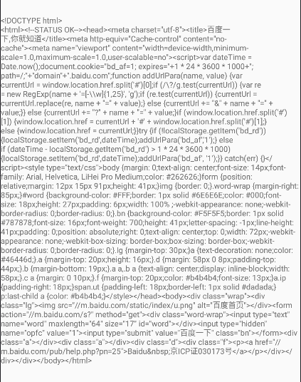
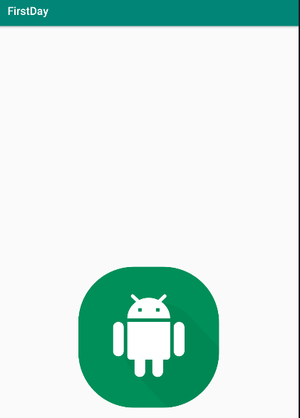
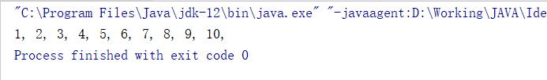

@[TOC]

## 前言

Volley 是 Google 在 2013 年推出的一款轻量级的基于 `HTTP` 协议 Android 客户端网络请求框架，官方链接：[Volley](https://developer.android.com/training/volley)。
Volley 主打轻便快捷的设计思想，其中存在的类不多，但是组合起来却具有非常强大的功能，主要功能如下:
1. 异步：在子线程进行网络请求，在请求得到响应的时候进行回调，可以自定义回调的线程。

2. 灵活：每一个请求对应一个响应，我们可以自定义每一个请求对象的相关属性（比如超时时间等）而不会影响其他请求，响应可以是正常情况下服务器发送的响应，也可以是异常情况下的错误响应。具体的响应对象将作为参数在响应回调方法中传入。

3. 基于请求队列形式：将每一个请求对象都方法请求队列（`RequestQueue`）中，相关的组件会从这个请求队列中取出并执行该请求。同时我们可以很方便的取消某个请求（调用 `Request` 对象的 `cancel` 方法将某个请求的取消标志设为 `true`）。同时可以设置每个请求的优先级和设置请求的重传机制。

4. 轻量级：Volley 占用的资源非常少，默认情况下采用 1 个缓存处理线程和 4 个网络请求线程，响应的回调在主线程中进行，同时这些参数值可以被自定义。

5. 可扩展性：Volley 采用面向接口编程的思想，所有组件均可通过传入实现了对应接口的自定义对象来进行扩展。

下面我们来先看一下 Volley 的用法
## 基本用法
要使用 volley ，我们必须先添加它的依赖，在对应 `module` 的 `build.gradle` 文件的 `dependencies` 闭包中加入一行代码：
```groovy
implementation 'com.android.volley:volley:1.1.1'
```
再单击右上角的 `sync` 按钮，同步完成之后我们就可以使用 Volley 了。首先我们需要构造出一个 `RequestQueue` 对象来存放请求(`Request`)，为了简单起见，这里直接在 `MainActivity` 中进行操作：
```java
RequestQueue requestQueue = Volley.newRequestQueue(getApplication());
```
构造一个具有默认配置的 `RequestQueue` 只需要一个传入 `Context` 类型的参数，实际上这个参数是为了获取应用的数据缓存目录，进而确定 Volley 的数据缓存目录。
有了请求队列之后，我们还需要有对应的请求(`Request`)，Volley 定义了一个请求基类（`public abstract class Request<T> `），这个类是一个抽象类，泛型参数代表响应数据的类型。子类需要继承该类并重写相关的方法来实现自定义的逻辑。为了简单，我们这里就定义一个 `StringRequest` 继承 `Request` 类来实现加载服务器上的字符串数据:
```java
/**
 * 自定义的 Request 类，定义响应数据为 String 类型
 */
public class StringRequest extends Request<String> {

    private Response.Listener<String> listener;

    /**
     * @param method      请求方法，即为 HTTP 协议支持的请求方法，定义在 {@link Method} 接口中
     * @param url         请求 url
     * @param listener    响应数据的监听器
     * @param errListener 错误监听器
     */
    public StringRequest(int method, String url, @NonNull Response.Listener<String> listener,
                         @Nullable Response.ErrorListener errListener) {
        super(method, url, errListener);
        this.listener = listener;
    }

    /**
     * 这个方法会在缓存命中或者得到服务器响应数据之后被调用
     *
     * @param response 得到的响应数据（可以是从缓存中得到的，也可以是从服务器中得到的）
     * @return 最后生成的包含响应数据的 Response 对象
     */
    @Override
    protected Response<String> parseNetworkResponse(NetworkResponse response) {
        if (response == null || response.data == null) {
            // 如果响应数据为空则派发到错误监听器
            return Response.error(new VolleyError("响应数据为空！"));
        }
        String str;
        try {
            // 尝试创建 Response 对象，将得到的响应数据转换为 String 类型，
            // 采用的编码方式为响应头中 charset 字段的值
            str = new String(response.data, HttpHeaderParser.parseCharset(response.headers));
        } catch (UnsupportedEncodingException e) {
            // 如果不支持该编码方式，则采用系统默认编码方式
            str = new String(response.data);
        }
        return Response.success(str, HttpHeaderParser.parseCacheHeaders(response));
    }

    /**
     * 派发响应对象，在上面 parseNetworkResponse 方法执行完成之后，
     * 会由响应派发线程调用该方法并将得到的响应对象作为参数传入
     *
     * @param response 得到的响应数据，类型即为定义该类时传入的具体泛型参数
     */
    @Override
    protected void deliverResponse(String response) {
        if (listener != null) {
            listener.onResponse(response);
        }
    }
}
```
有了这个 `StringRequest` 之后，我们就可以请求任意返回字符串数据的服务器接口（或者说将服务器返回的数据当成字符串处理）。我们来尝试请求百度首页，依然是在 `MainActivity` 中：
```java
public class MainActivity extends AppCompatActivity {
    private static final String TAG = MainActivity.class.getSimpleName();

    private RequestQueue requestQueue;
    private TextView requestResultView;

    @Override
    protected void onCreate(Bundle savedInstanceState) {
        super.onCreate(savedInstanceState);
        setContentView(R.layout.activity_main);
        requestResultView = findViewById(R.id.request_result_view);
        // 创建请求队列
        requestQueue = Volley.newRequestQueue(getApplication());
        // 启动请求队列（队列中的请求会被取出并执行）
        requestQueue.start();
        // 构建自定义 Request 对象
        StringRequest stringRequest = new StringRequest(Request.Method.GET,
                "https://www.baidu.com", new Response.Listener<String>() {
            @Override
            public void onResponse(String response) {
                // 默认该方法在主线程回调，因此可以直接更新 UI
                requestResultView.setText(response);
            }
        }, new Response.ErrorListener() {
            @Override
            public void onErrorResponse(VolleyError error) {
                Log.e(TAG, error.toString());
            }
        });
        // 添加 Request 到请求队列中
        requestQueue.add(stringRequest);
    }
}
```
最后，别忘了在 `AndroidManifest.xml` 文件中声明网络权限：
```xml
<uses-permission android:name="android.permission.INTERNET" />
```
我们来看看效果：

OK，成功得到了百度首页的 `html` 代码。其实 Volley 已经给我们写好了 `StringRequest` 类，功能和我们上面自己写的 `StringRequest` 是一样的，但是相关代码更加完善。

上面我们已经实现了字符串的加载，下面再来看一个例子：加载图片，我们还是自定义一个 `BitmapRequest` 类继承 `Request` 类：
```java
public class BitmapRequest extends Request<Bitmap> {

    private Response.Listener<Bitmap> listener;

    public BitmapRequest(int method, String url, @NonNull Response.Listener<Bitmap> listener,
                         @Nullable Response.ErrorListener errListener) {
        super(method, url, errListener);
        this.listener = listener;
    }

    @Override
    protected Response<Bitmap> parseNetworkResponse(NetworkResponse response) {
        if (response == null || response.data == null) {
            // 如果响应数据为空则派发到错误监听器
            return Response.error(new VolleyError("响应数据为空！"));
        }
        try {
            Bitmap bitmap = BitmapFactory.decodeByteArray(response.data, 0,response.data.length);
            return Response.success(bitmap, HttpHeaderParser.parseCacheHeaders(response));
        } catch (Exception e) {
            return Response.error(new VolleyError(e));
        }
    }

    @Override
    protected void deliverResponse(Bitmap response) {
        if (listener != null) {
            listener.onResponse(response);
        }
    }

    @Override
    public void cancel() {
        super.cancel();
        listener = null;
    }
}
```
我们还要再 `MainActivity` 的布局文件中加一个 `ImageView` 来显示加载的图片：
```xml
<?xml version="1.0" encoding="utf-8"?>
<androidx.constraintlayout.widget.ConstraintLayout xmlns:android="http://schemas.android.com/apk/res/android"
    xmlns:app="http://schemas.android.com/apk/res-auto"
    xmlns:tools="http://schemas.android.com/tools"
    android:layout_width="match_parent"
    android:layout_height="match_parent"
    tools:context=".MainActivity">

    <TextView
        android:id="@+id/request_result_view"
        android:layout_width="wrap_content"
        android:layout_height="wrap_content"
        android:text="Hello World!"
        app:layout_constraintBottom_toBottomOf="parent"
        app:layout_constraintLeft_toLeftOf="parent"
        app:layout_constraintRight_toRightOf="parent"
        app:layout_constraintTop_toTopOf="parent" />

    <ImageView
        android:id="@+id/image_result_show_view"
        android:layout_width="wrap_content"
        android:layout_height="wrap_content"
        app:layout_constraintLeft_toLeftOf="parent"
        app:layout_constraintRight_toRightOf="parent"
        app:layout_constraintTop_toTopOf="@id/request_result_view" />

</androidx.constraintlayout.widget.ConstraintLayout>
```
`MainActivity` 的代码也需要进行少许修改：
```java

public class MainActivity extends AppCompatActivity {
    private static final String TAG = MainActivity.class.getSimpleName();

    private RequestQueue requestQueue;
    private TextView requestResultView;
    private ImageView imageResultView;

    @Override
    protected void onCreate(Bundle savedInstanceState) {
        super.onCreate(savedInstanceState);
        setContentView(R.layout.activity_main);
        requestResultView = findViewById(R.id.request_result_view);
        imageResultView = findViewById(R.id.image_result_show_view);
        // 创建请求队列
        requestQueue = Volley.newRequestQueue(getApplication());
        // 启动请求队列（队列中的请求会被取出并执行）
        requestQueue.start();
        // 添加 Request 到请求队列中
        requestQueue.add(makeBitmapRequest());
    }

    private Request makeStringRequest() {
        return new StringRequest(Request.Method.GET,
                "https://www.baidu.com", new Response.Listener<String>() {
            @Override
            public void onResponse(String response) {
                // 默认该方法在主线程回调，因此可以直接更新 UI
                requestResultView.setText(response);
            }
        }, new Response.ErrorListener() {
            @Override
            public void onErrorResponse(VolleyError error) {
                Log.e(TAG, error.toString());
            }
        });
    }

    private Request makeBitmapRequest() {
        return new BitmapRequest(Request.Method.GET,
                "https://www.iconfinder.com/icons/3185263/download/png/512",
                new Response.Listener<Bitmap>() {
                    @Override
                    public void onResponse(Bitmap response) {
                        imageResultView.setImageBitmap(response);
                    }
                },
                new Response.ErrorListener() {
                    @Override
                    public void onErrorResponse(VolleyError error) {
                        Log.e(TAG,error.toString());
                    }
                });
    }
}
```
我们再来看看效果：

成功！好了，到这里我们已经知道了如何通过自定义 `Request` 加载和解析服务器下发的数据了：**在 `parseNetworkResponse` 方法中将从缓存 / 服务器上得到的原始的多字节数据按照某种规则来解析出我们想要的数据，构造出对应的 `Response` 对象并返回**。
知道了 Volley 的用法之后我们来从源码的角度上看看 Volley ，以加深对 Volley 的理解。
## 源码解析
#### Request 和 RequestQueue
我们上面已经有自定义 `Request` 的经验了，那么我们就先从 `Request` 类开始：
我们知道，一个网络请求会有以下一些基本属性：
1. 请求方法（GET、POST...）.
2. 请求 URL.
3. 请求头（Headers）和请求体（Body，POST、PUT、PATCH 请求才会有）.
4. 超时时间.

Volley 的 `Request` 在这些基础上加了一些新特性（请求可取消、是否需要读取缓存、请求的优先级...），这些属性都是通过 `Request` 的相关 `getter` 方法来进行描述的，我们来看看其中的一些方法：
```java
public abstract class Request<T> implements Comparable<Request<T>> {
	// ...
    
    /** Return the method for this request. Can be one of the values in {@link Method}. */
    public int getMethod() {
        return mMethod;
    }
    
    /** Returns the URL of this request. */
    public String getUrl() {
        return mUrl;
    }
    
    /**
     * Returns a list of extra HTTP headers to go along with this request. Can throw {@link
     * AuthFailureError} as authentication may be required to provide these values.
     *
     * @throws AuthFailureError In the event of auth failure
     */
    public Map<String, String> getHeaders() throws AuthFailureError {
        return Collections.emptyMap();
    }
    
    /**
     * Returns which encoding should be used when converting POST or PUT parameters returned by
     * {@link #getParams()} into a raw POST or PUT body.
     *
     * <p>This controls both encodings:
     *
     * <ol>
     *   <li>The string encoding used when converting parameter names and values into bytes prior to
     *       URL encoding them.
     *   <li>The string encoding used when converting the URL encoded parameters into a raw byte
     *       array.
     * </ol>
     */
    protected String getParamsEncoding() {
        return DEFAULT_PARAMS_ENCODING;
    }
    
    /**
     * Returns the raw POST or PUT body to be sent.
     *
     * <p>By default, the body consists of the request parameters in
     * application/x-www-form-urlencoded format. When overriding this method, consider overriding
     * {@link #getBodyContentType()} as well to match the new body format.
     *
     * @throws AuthFailureError in the event of auth failure
     */
    public byte[] getBody() throws AuthFailureError {
    	// getBody方法 默认的操作为对得到的参数进行编码，
        // 返回参数编码后的多字节数据
        Map<String, String> params = getParams();
        if (params != null && params.size() > 0) {
            return encodeParameters(params, getParamsEncoding());
        }
        return null;
    }
    
    /**
     * Returns a Map of parameters to be used for a POST or PUT request. Can throw {@link
     * AuthFailureError} as authentication may be required to provide these values.
     *
     * <p>Note that you can directly override {@link #getBody()} for custom data.
     *
     * @throws AuthFailureError in the event of auth failure
     */
    protected Map<String, String> getParams() throws AuthFailureError {
        return null;
    }
    
    /** Returns true if responses to this request should be cached. */
    public final boolean shouldCache() {
        return mShouldCache;
    }
    
    /**
     * Priority values. Requests will be processed from higher priorities to lower priorities, in
     * FIFO order.
     */
    public enum Priority {
        LOW,
        NORMAL,
        HIGH,
        IMMEDIATE
    }

    /** Returns the {@link Priority} of this request; {@link Priority#NORMAL} by default. */
    public Priority getPriority() {
        return Priority.NORMAL;
    }
    
    // ...
}
```
从上面的代码我们可以知道，**`Request` 本身不进行实际的网络操作，它只负责提供本次网络请求的相关信息，同时在得到响应数据之后进行回调（子类需实现具体逻辑）**。下面我们来看一下保存 `Request` 的 `RequestQueue`：
`RequestQueue` 虽然叫做 `请求队列`，但其本身也不直接储存 `Request` 对象，而是将 `Request` 对象转存到其他地方，从这个角度上来看，`RequestQueue` 更像一个“请求中转站”，我们来看看相关代码
```java
public class RequestQueue {
	// ...
    
    /** Used for generating monotonically-increasing sequence numbers for requests. */
    private final AtomicInteger mSequenceGenerator = new AtomicInteger();
    
	/** The cache triage queue. */
    private final PriorityBlockingQueue<Request<?>> mCacheQueue = new PriorityBlockingQueue<>();

    /** The queue of requests that are actually going out to the network. */
    private final PriorityBlockingQueue<Request<?>> mNetworkQueue = new PriorityBlockingQueue<>();

    /** Number of network request dispatcher threads to start. */
    private static final int DEFAULT_NETWORK_THREAD_POOL_SIZE = 4;

    /** Cache interface for retrieving and storing responses. */
    private final Cache mCache;

    /** Network interface for performing requests. */
    private final Network mNetwork;

    /** Response delivery mechanism. */
    private final ResponseDelivery mDelivery;

    /** The network dispatchers. */
    private final NetworkDispatcher[] mDispatchers;

    /** The cache dispatcher. */
    private CacheDispatcher mCacheDispatcher;
    
    // ...
    
    /**
     * Creates the worker pool. Processing will not begin until {@link #start()} is called.
     *
     * @param cache A Cache to use for persisting responses to disk
     * @param network A Network interface for performing HTTP requests
     * @param threadPoolSize Number of network dispatcher threads to create
     * @param delivery A ResponseDelivery interface for posting responses and errors
     */
    public RequestQueue(
            Cache cache, Network network, int threadPoolSize, ResponseDelivery delivery) {
        mCache = cache;
        mNetwork = network;
        mDispatchers = new NetworkDispatcher[threadPoolSize];
        mDelivery = delivery;
    }

    /**
     * Creates the worker pool. Processing will not begin until {@link #start()} is called.
     *
     * @param cache A Cache to use for persisting responses to disk
     * @param network A Network interface for performing HTTP requests
     * @param threadPoolSize Number of network dispatcher threads to create
     */
    public RequestQueue(Cache cache, Network network, int threadPoolSize) {
        this(
                cache,
                network,
                threadPoolSize,
                new ExecutorDelivery(new Handler(Looper.getMainLooper())));
    }

    /**
     * Creates the worker pool. Processing will not begin until {@link #start()} is called.
     *
     * @param cache A Cache to use for persisting responses to disk
     * @param network A Network interface for performing HTTP requests
     */
    public RequestQueue(Cache cache, Network network) {
        this(cache, network, DEFAULT_NETWORK_THREAD_POOL_SIZE);
    }
}
```
我们先来看 `RequestQueue` 中定义的相关字段，首先是一个类型为 `AtomicInteger` 的字段，主要是用来给添加的 `Request` 提供编号，作用我们在后面再细讲，两个类型为 `PriorityBlockingQueue<Request<?>>` 的字段，我们暂且将它们当成队列看待，根据注释我们很容易知道第一个 `mCacheQueue` 是用来保存需要使用缓存的 `Request` 的队列，而第二个 `mNetworkQueue` 是用来保存需要进行网络请求的 `Request` 的队列，这里稍微注意一下这个 `PriorityBlockingQueue` 类型，之后在讲请求的优先级的时候还会再碰见。
接下来是一个常量字段 `DEFAULT_NETWORK_THREAD_POOL_SIZE`，即为默认的进行网络请求的线程数。
接下来的 `Cache` 类型的字段是实际上用来进行缓存存取的对象，而下面 `Network` 的字段则是实际上用来进行网络请求的对象，下面的 `ResponseDelivery` 类型的字段则是在 `Request` 得到响应数据之后来派发这个响应的对象，这三个类型都是接口类型，Volley 提供了默认的实现，当然我们也可以提供自定义的实现。
最后两个字段一个是 `NetworkDispatcher` 类型的数组，另一个是 `CacheDispatcher` 类型的字段，这两个类型实际上都是继承于 `Thread` 类型的子类，那么我们大概就可以知道：`NetworkDispatcher` 就是用来从网络请求队列中取出 request 并进行网络请求的线程，而 `CacheDispatcher` 就是用来从缓存请求队列中取出 request 并进行缓存读取的线程。
最后我们来看一下 `RequestQueue` 的构造方法：`RequestQueue` 提供了三个构造方法，其中接受两个参数的构造方法指定了默认的网络请求线程的数量，接受三个参数的构造方法指定了默认响应回调的线程为主线程，他们都会调用接受四个参数的构造方法，在这个构造方法中执行对象的新建和赋值。

#### 请求处理线程
我们已经知道了 `CacheDispatcher` 和 `NetworkDispatcher` 是用来处理请求的线程，那么我们来从代码的角度上看看它们都做了什么：
```java
/**
 * Provides a thread for performing cache triage on a queue of requests.
 *
 * <p>Requests added to the specified cache queue are resolved from cache. Any deliverable response
 * is posted back to the caller via a {@link ResponseDelivery}. Cache misses and responses that
 * require refresh are enqueued on the specified network queue for processing by a {@link
 * NetworkDispatcher}.
 */
public class CacheDispatcher extends Thread {

    private static final boolean DEBUG = VolleyLog.DEBUG;

    /** The queue of requests coming in for triage. */
    private final BlockingQueue<Request<?>> mCacheQueue;

    /** The queue of requests going out to the network. */
    private final BlockingQueue<Request<?>> mNetworkQueue;

    /** The cache to read from. */
    private final Cache mCache;

    /** For posting responses. */
    private final ResponseDelivery mDelivery;

    /** Used for telling us to die. */
    private volatile boolean mQuit = false;

    /** Manage list of waiting requests and de-duplicate requests with same cache key. */
    private final WaitingRequestManager mWaitingRequestManager;

    /**
     * Creates a new cache triage dispatcher thread. You must call {@link #start()} in order to
     * begin processing.
     *
     * @param cacheQueue Queue of incoming requests for triage
     * @param networkQueue Queue to post requests that require network to
     * @param cache Cache interface to use for resolution
     * @param delivery Delivery interface to use for posting responses
     */
    public CacheDispatcher(
            BlockingQueue<Request<?>> cacheQueue,
            BlockingQueue<Request<?>> networkQueue,
            Cache cache,
            ResponseDelivery delivery) {
        mCacheQueue = cacheQueue;
        mNetworkQueue = networkQueue;
        mCache = cache;
        mDelivery = delivery;
        mWaitingRequestManager = new WaitingRequestManager(this);
    }

    /**
     * Forces this dispatcher to quit immediately. If any requests are still in the queue, they are
     * not guaranteed to be processed.
     */
    public void quit() {
        mQuit = true;
        interrupt();
    }

    @Override
    public void run() {
        if (DEBUG) VolleyLog.v("start new dispatcher");
        Process.setThreadPriority(Process.THREAD_PRIORITY_BACKGROUND);

        // Make a blocking call to initialize the cache.
        mCache.initialize();

		// 死循环，一直取出并执行请求
        while (true) {
            try {
                processRequest();
            } catch (InterruptedException e) {
                // We may have been interrupted because it was time to quit.
                if (mQuit) {
                    Thread.currentThread().interrupt();
                    return;
                }
                VolleyLog.e(
                        "Ignoring spurious interrupt of CacheDispatcher thread; "
                                + "use quit() to terminate it");
            }
        }
    }

    // Extracted to its own method to ensure locals have a constrained liveness scope by the GC.
    // This is needed to avoid keeping previous request references alive for an indeterminate amount
    // of time. Update consumer-proguard-rules.pro when modifying this. See also
    // https://github.com/google/volley/issues/114
    private void processRequest() throws InterruptedException {
        // Get a request from the cache triage queue, blocking until
        // at least one is available.
        // 取出当前缓存队列中的第一个 request 并执行，如果当前缓存队列为空，则该线程被阻塞
        final Request<?> request = mCacheQueue.take();
        processRequest(request);
    }

    @VisibleForTesting
    void processRequest(final Request<?> request) throws InterruptedException {
        request.addMarker("cache-queue-take");

        // If the request has been canceled, don't bother dispatching it.
        // 如果该请求已经被取消，则直接返回
        if (request.isCanceled()) {
            request.finish("cache-discard-canceled");
            return;
        }

        // Attempt to retrieve this item from cache.
        // 尝试从缓存中读取该请求的响应，通过 request 的 key 来确定对应的响应，
        // request.getCacheKey() 返回 request 的 url 和请求方法的组合字符串
        Cache.Entry entry = mCache.get(request.getCacheKey());
        if (entry == null) {
            request.addMarker("cache-miss");
            // Cache miss; send off to the network dispatcher.
            // 如果没有找到对应请求的缓存数据，则将这个 request 放入网络请求队列，
            // 由 NetworkDispatcher 进行网络请求，向服务器请求数据。
            if (!mWaitingRequestManager.maybeAddToWaitingRequests(request)) {
                mNetworkQueue.put(request);
            }
            return;
        }

        // If it is completely expired, just send it to the network.
        // 如果缓存已经过期，同样的将该 request 放入网络请求队列
        if (entry.isExpired()) {
            request.addMarker("cache-hit-expired");
            request.setCacheEntry(entry);
            if (!mWaitingRequestManager.maybeAddToWaitingRequests(request)) {
                mNetworkQueue.put(request);
            }
            return;
        }

        // We have a cache hit; parse its data for delivery back to the request.
        request.addMarker("cache-hit");
        // 调用 Request.parseNetworkResponse 抽象方法来解析数据，该方法需要子类重写。
        Response<?> response =
                request.parseNetworkResponse(
                        new NetworkResponse(entry.data, entry.responseHeaders));
        request.addMarker("cache-hit-parsed");

        if (!entry.refreshNeeded()) {
            // Completely unexpired cache hit. Just deliver the response.
            // 如果该 request 存在为过期的缓存数据并且无需刷新，则直接将缓存数据作为响应数据派发，无需进行网络请求
            mDelivery.postResponse(request, response);
        } else {
            // Soft-expired cache hit. We can deliver the cached response,
            // but we need to also send the request to the network for
            // refreshing.
            request.addMarker("cache-hit-refresh-needed");
            request.setCacheEntry(entry);
            // Mark the response as intermediate.
            response.intermediate = true;

            if (!mWaitingRequestManager.maybeAddToWaitingRequests(request)) {
                // Post the intermediate response back to the user and have
                // the delivery then forward the request along to the network.
                // 如果需要刷新，则在派发网络请求之后立马将该 request 放入网络请求队列中
                mDelivery.postResponse(
                        request,
                        response,
                        new Runnable() {
                            @Override
                            public void run() {
                                try {
                                    mNetworkQueue.put(request);
                                } catch (InterruptedException e) {
                                    // Restore the interrupted status
                                    Thread.currentThread().interrupt();
                                }
                            }
                        });
            } else {
                // request has been added to list of waiting requests
                // to receive the network response from the first request once it returns.
                mDelivery.postResponse(request, response);
            }
        }
    }
    
    // ....
}
```
既然该类是继承于 `Thread` 类，那么我们重点关注的自然是其 `run` 方法，从 `run` 方法的调用链我们可以梳理出 `CacheDispatcher` 的工作流程：不断的从缓存队列中取出请求，然后再缓存中取对应请求的缓存，如果缓存数据不存在、已经过期或者需要刷新，则将请求放入网络请求队列中让网络请求线程取出并执行，否则则将缓存数据当成响应数据派发。
接下来来看看 `NetworkDispatcher` 的工作流程：
```java
/**
 * Provides a thread for performing network dispatch from a queue of requests.
 *
 * <p>Requests added to the specified queue are processed from the network via a specified {@link
 * Network} interface. Responses are committed to cache, if eligible, using a specified {@link
 * Cache} interface. Valid responses and errors are posted back to the caller via a {@link
 * ResponseDelivery}.
 */
public class NetworkDispatcher extends Thread {

    /** The queue of requests to service. */
    private final BlockingQueue<Request<?>> mQueue;
    /** The network interface for processing requests. */
    private final Network mNetwork;
    /** The cache to write to. */
    private final Cache mCache;
    /** For posting responses and errors. */
    private final ResponseDelivery mDelivery;
    /** Used for telling us to die. */
    private volatile boolean mQuit = false;

    /**
     * Creates a new network dispatcher thread. You must call {@link #start()} in order to begin
     * processing.
     *
     * @param queue Queue of incoming requests for triage
     * @param network Network interface to use for performing requests
     * @param cache Cache interface to use for writing responses to cache
     * @param delivery Delivery interface to use for posting responses
     */
    public NetworkDispatcher(
            BlockingQueue<Request<?>> queue,
            Network network,
            Cache cache,
            ResponseDelivery delivery) {
        mQueue = queue;
        mNetwork = network;
        mCache = cache;
        mDelivery = delivery;
    }

    /**
     * Forces this dispatcher to quit immediately. If any requests are still in the queue, they are
     * not guaranteed to be processed.
     */
    public void quit() {
        mQuit = true;
        interrupt();
    }

    @TargetApi(Build.VERSION_CODES.ICE_CREAM_SANDWICH)
    private void addTrafficStatsTag(Request<?> request) {
        // Tag the request (if API >= 14)
        if (Build.VERSION.SDK_INT >= Build.VERSION_CODES.ICE_CREAM_SANDWICH) {
            TrafficStats.setThreadStatsTag(request.getTrafficStatsTag());
        }
    }

    @Override
    public void run() {
        Process.setThreadPriority(Process.THREAD_PRIORITY_BACKGROUND);
        // 同样的是死循环不断从队列中取出请求并执行
        while (true) {
            try {
                processRequest();
            } catch (InterruptedException e) {
                // We may have been interrupted because it was time to quit.
                if (mQuit) {
                    Thread.currentThread().interrupt();
                    return;
                }
                VolleyLog.e(
                        "Ignoring spurious interrupt of NetworkDispatcher thread; "
                                + "use quit() to terminate it");
            }
        }
    }

    // Extracted to its own method to ensure locals have a constrained liveness scope by the GC.
    // This is needed to avoid keeping previous request references alive for an indeterminate amount
    // of time. Update consumer-proguard-rules.pro when modifying this. See also
    // https://github.com/google/volley/issues/114
    private void processRequest() throws InterruptedException {
        // Take a request from the queue.
        // 取出网络请求队列中第一个 request 并执行
        Request<?> request = mQueue.take();
        processRequest(request);
    }

    @VisibleForTesting
    void processRequest(Request<?> request) {
        long startTimeMs = SystemClock.elapsedRealtime();
        try {
            request.addMarker("network-queue-take");

            // If the request was cancelled already, do not perform the
            // network request.
            if (request.isCanceled()) {
                request.finish("network-discard-cancelled");
                request.notifyListenerResponseNotUsable();
                return;
            }

            addTrafficStatsTag(request);

            // Perform the network request.
            // 在这里执行真正的网络请求
            NetworkResponse networkResponse = mNetwork.performRequest(request);
            request.addMarker("network-http-complete");

            // If the server returned 304 AND we delivered a response already,
            // we're done -- don't deliver a second identical response.
            // 如果服务器 HTTP 返回码为 304 并且该 request 已经派发过响应，则无需再次派发响应
            if (networkResponse.notModified && request.hasHadResponseDelivered()) {
                request.finish("not-modified");
                request.notifyListenerResponseNotUsable();
                return;
            }

            // Parse the response here on the worker thread.
            // 调用 reuqest.parseNetworkResponse 方法，即为子类需要重写的抽象方法
            Response<?> response = request.parseNetworkResponse(networkResponse);
            request.addMarker("network-parse-complete");

            // Write to cache if applicable.
            // TODO: Only update cache metadata instead of entire record for 304s.
            // 和 CacheDispatcher 对应。尝试将该 request 的响应数据写入缓存中
            if (request.shouldCache() && response.cacheEntry != null) {
                mCache.put(request.getCacheKey(), response.cacheEntry);
                request.addMarker("network-cache-written");
            }

            // Post the response back.
            // 标记该 request 已经派发响应
            request.markDelivered();
            // 派发响应数据
            mDelivery.postResponse(request, response);
            request.notifyListenerResponseReceived(response);
        } catch (VolleyError volleyError) {
            volleyError.setNetworkTimeMs(SystemClock.elapsedRealtime() - startTimeMs);
            parseAndDeliverNetworkError(request, volleyError);
            request.notifyListenerResponseNotUsable();
        } catch (Exception e) {
            VolleyLog.e(e, "Unhandled exception %s", e.toString());
            VolleyError volleyError = new VolleyError(e);
            volleyError.setNetworkTimeMs(SystemClock.elapsedRealtime() - startTimeMs);
            // 派发异常
            mDelivery.postError(request, volleyError);
            request.notifyListenerResponseNotUsable();
        }
    }

	// 解析并派发异常
    private void parseAndDeliverNetworkError(Request<?> request, VolleyError error) {
        error = request.parseNetworkError(error);
        mDelivery.postError(request, error);
    }
}
```
我们同样从 `run` 方法开始看起，和 `CacheDispatcher` 类似，`NetworkDispatcher` 也是不断的从请求队列中取出 request 并执行，不过 `CacheDispatcher` 是从缓存请求队列中取出 request，而 `NetworkDispatcher` 是从网络请求队列中取出 request。执行完 request 之后会根据情况来判断是否进行数据缓存，如果执行过程中发生异常，则会将该异常转换为对应的错误标识数据，之后将响应/错误标识数据派发出去。

#### 数据派发组件
我们在 `CacheDispatcher` 和 `NetworkDispatcher` 中都看到了响应/错误标识数据派发的代码，那么我们来看看这个流程：
响应/错误数据派发的方法由 `ResponseDelivery` 接口定义：
```java
public interface ResponseDelivery {
    /** Parses a response from the network or cache and delivers it. */
    /** 派发某个请求和对应的响应 */
    void postResponse(Request<?> request, Response<?> response);

    /**
     * Parses a response from the network or cache and delivers it. The provided Runnable will be
     * executed after delivery.
     * 和上个方法一样，不过添加了第三个 Runnable 参数可以在派发完成之后执行
     */
    void postResponse(Request<?> request, Response<?> response, Runnable runnable);

    /** Posts an error for the given request. */
    /** 派发某个请求和对应的异常（当请求不成功的时候） */
    void postError(Request<?> request, VolleyError error);
}
```
Volley 提供了该接口的默认实现类：`ExecutorDelivery`：
```java
/** Delivers responses and errors. */
public class ExecutorDelivery implements ResponseDelivery {
    /** Used for posting responses, typically to the main thread. */
    private final Executor mResponsePoster;

    /**
     * Creates a new response delivery interface.
     *
     * @param handler {@link Handler} to post responses on
     */
    public ExecutorDelivery(final Handler handler) {
        // Make an Executor that just wraps the handler.
        mResponsePoster =
                new Executor() {
                    @Override
                    public void execute(Runnable command) {
                        handler.post(command);
                    }
                };
    }

    /**
     * Creates a new response delivery interface, mockable version for testing.
     *
     * @param executor For running delivery tasks
     */
    public ExecutorDelivery(Executor executor) {
        mResponsePoster = executor;
    }

    @Override
    public void postResponse(Request<?> request, Response<?> response) {
        postResponse(request, response, null);
    }

    @Override
    public void postResponse(Request<?> request, Response<?> response, Runnable runnable) {
        request.markDelivered();
        request.addMarker("post-response");
        mResponsePoster.execute(new ResponseDeliveryRunnable(request, response, runnable));
    }

    @Override
    public void postError(Request<?> request, VolleyError error) {
        request.addMarker("post-error");
        Response<?> response = Response.error(error);
        mResponsePoster.execute(new ResponseDeliveryRunnable(request, response, null));
    }

    /** A Runnable used for delivering network responses to a listener on the main thread. */
    @SuppressWarnings("rawtypes")
    private static class ResponseDeliveryRunnable implements Runnable {
        private final Request mRequest;
        private final Response mResponse;
        private final Runnable mRunnable;

        public ResponseDeliveryRunnable(Request request, Response response, Runnable runnable) {
            mRequest = request;
            mResponse = response;
            mRunnable = runnable;
        }

        @SuppressWarnings("unchecked")
        @Override
        public void run() {
            // NOTE: If cancel() is called off the thread that we're currently running in (by
            // default, the main thread), we cannot guarantee that deliverResponse()/deliverError()
            // won't be called, since it may be canceled after we check isCanceled() but before we
            // deliver the response. Apps concerned about this guarantee must either call cancel()
            // from the same thread or implement their own guarantee about not invoking their
            // listener after cancel() has been called.

            // If this request has canceled, finish it and don't deliver.
            // 如果该 request 已经被取消了，则取消派发
            if (mRequest.isCanceled()) {
                mRequest.finish("canceled-at-delivery");
                return;
            }

            // Deliver a normal response or error, depending.
            if (mResponse.isSuccess()) {
            	// 如果响应成功，则调用 request.deliverResponse 抽象方法，这个方法需要子类重写
                mRequest.deliverResponse(mResponse.result);
            } else {
            	// 响应失败，则调用 request.deliverError 方法，这个方法 Request 有默认的实现，子类可以重写
                mRequest.deliverError(mResponse.error);
            }

            // If this is an intermediate response, add a marker, otherwise we're done
            // and the request can be finished.
            if (mResponse.intermediate) {
                mRequest.addMarker("intermediate-response");
            } else {
                mRequest.finish("done");
            }

            // If we have been provided a post-delivery runnable, run it.
            if (mRunnable != null) {
                mRunnable.run();
            }
        }
    }
}
```
`ExecutorDelivery` 采用了 Handler-MessageQueue-Looper 模型，接受一个 `Handler` 类型的对象作为构造方法的参数，而三个实现的 `post***` 方法最终都是将对应的 `Runnable` 对象发送给这个 `Handler`，再由这个 `Handler` 对象 `post` 到其对应的 `MessageQueue` 中，最终会由对应的 `Looper` 获取到并执行该 `Runnable` 对象。而这个 `Runnable` 的具体实现类型为 `ExecutorDelivery` 的静态内部类 `ResponseDeliveryRunnable`，这个类的 `run` 方法核心即为根据响应是否成功来判断是执行 `Request#deliverResponse` 方法还是 `Request#deliverError` 方法。
那么这个 `ExecutorDelivery` 在哪里被使用了呢？我们再回到 `RequestQueue` 类中的构造方法：
```java
public RequestQueue(Cache cache, Network network, int threadPoolSize) {
    this(
            cache,
            network,
            threadPoolSize,
            /* 这里创建并传入了 ExecutorDelivery 对象，使用主线程的 Looper 对象，
               因此默认 Request#deliverResponse 方法和 Request#deliverError 方法都是在主线程中被调用 */
            new ExecutorDelivery(new Handler(Looper.getMainLooper())));
}
```
这里会调用 `RequestQueue` 中接受四个参数的构造方法，我们再来看看这个方法：
```java
public RequestQueue(Cache cache, Network network, int threadPoolSize, ResponseDelivery delivery) {
    mCache = cache;
    mNetwork = network;
    mDispatchers = new NetworkDispatcher[threadPoolSize];
    mDelivery = delivery;
}
```
可以看到这里仅仅只是对类字段的赋值和对象新建，我们刚刚看到的 `CacheDispatcher` 和 `NetworkDispatcher` 都是 `Thread` 的子类，也就是说我们需要调用其 `start` 方法才可以真正启动它们，那么其 `start` 方法是在哪里被调用了呢？还记得我们在介绍 Volley 的基本用法那一节中在创建了 `RequestQueue` 后还调用了 `RequestQueue` 的 `start` 方法吗。我们赶紧来看看 `RequestQueue#start` 方法：
```java
/** Starts the dispatchers in this queue. */
public void start() {
    stop(); // Make sure any currently running dispatchers are stopped.
    // Create the cache dispatcher and start it.
    // 创建并启动缓存请求线程
    mCacheDispatcher = new CacheDispatcher(mCacheQueue, mNetworkQueue, mCache, mDelivery);
    mCacheDispatcher.start();

    // Create network dispatchers (and corresponding threads) up to the pool size.
    // 创建并启动网络请求线程（默认 4 个）
    for (int i = 0; i < mDispatchers.length; i++) {
        NetworkDispatcher networkDispatcher =
                new NetworkDispatcher(mNetworkQueue, mNetwork, mCache, mDelivery);
        mDispatchers[i] = networkDispatcher;
        networkDispatcher.start();
    }
}
```
我们再来看看 `RequestQueue#add` 方法：
```java
/**
 * Adds a Request to the dispatch queue.
 *
 * @param request The request to service
 * @return The passed-in request
 */
public <T> Request<T> add(Request<T> request) {
    // Tag the request as belonging to this queue and add it to the set of current requests.
    request.setRequestQueue(this);
    synchronized (mCurrentRequests) {
        mCurrentRequests.add(request);
    }

    // Process requests in the order they are added.
    request.setSequence(getSequenceNumber());
    request.addMarker("add-to-queue");

    // If the request is uncacheable, skip the cache queue and go straight to the network.
    // 如果该 request 设置了取消缓存，则直接将该 request 加入网络请求队列并返回
    if (!request.shouldCache()) {
        mNetworkQueue.add(request);
        return request;
    }
    // 默认将 request 先加入缓存请求队列，先让 `CacheDispatcher` 处理
    mCacheQueue.add(request);
    return request;
}
```
现在我们再来看看 `RequestQueue`，与其说它是“请求队列”，倒不如说它是一个“容器”，它里面装了所有需要用到的组件（缓存读写组件、网络请求组件、缓存请求线程、网络请求线程、响应派发组件、缓存请求队列、网络请求队列等），同时，它还向外提供了一些必要接口以提供必要的功能。
好了，我们现在已经可以理清楚 Volley 的大体工作流程了：创建 `RequestQueue` 对象后，通过其 `add` 方法向其中添加 `Request`，如果该请求没有设置禁止缓存，则会先添加到缓存请求队列中，否则直接添加到网络请求队列中，缓存处理线程会不断的取出在缓存请求队列中的 `Request` 并通过该 `Request` 的 cacheKey 来读对应的缓存数据，如果缓存数据不存在或者已经过期，则会将该 `Request` 放入网络请求队列中，否则直接派发响应数据；而对于网络请求线程，直接在网络请求队列中取出请求并执行，根据操作结果来派发对应数据。

#### 缓存处理组件
我们在 `RequestQueue` 中已经见过了其存在一个 `Cache` 接口类型的字段，而在 `CacheDispatcher` 中根据请求的 cacheKey 读取对应的缓存数据和 `NetworkDispatcher` 中将请求服务器得到的响应数据写入缓存的操作都是使用 `RequestQueue` 中的这个 `Cache` 类型的对象完成的，我们来看看这个接口的定义：
```java
/** An interface for a cache keyed by a String with a byte array as data. */
public interface Cache {
    /**
     * Retrieves an entry from the cache.
     *
     * @param key Cache key
     * @return An {@link Entry} or null in the event of a cache miss
     */
    Entry get(String key);

    /**
     * Adds or replaces an entry to the cache.
     *
     * @param key Cache key
     * @param entry Data to store and metadata for cache coherency, TTL, etc.
     */
    void put(String key, Entry entry);

    /**
     * Performs any potentially long-running actions needed to initialize the cache; will be called
     * from a worker thread.
     */
    void initialize();

    /**
     * Invalidates an entry in the cache.
     *
     * @param key Cache key
     * @param fullExpire True to fully expire the entry, false to soft expire
     */
    void invalidate(String key, boolean fullExpire);

    /**
     * Removes an entry from the cache.
     *
     * @param key Cache key
     */
    void remove(String key);

    /** Empties the cache. */
    void clear();

    /** Data and metadata for an entry returned by the cache. */
    class Entry {
        /** The data returned from cache. */
        public byte[] data;

        /** ETag for cache coherency. */
        public String etag;

        /** Date of this response as reported by the server. */
        public long serverDate;

        /** The last modified date for the requested object. */
        public long lastModified;

        /** TTL for this record. */
        public long ttl;

        /** Soft TTL for this record. */
        public long softTtl;

        /**
         * Response headers as received from server; must be non-null. Should not be mutated
         * directly.
         *
         * <p>Note that if the server returns two headers with the same (case-insensitive) name,
         * this map will only contain the one of them. {@link #allResponseHeaders} may contain all
         * headers if the {@link Cache} implementation supports it.
         */
        public Map<String, String> responseHeaders = Collections.emptyMap();

        /**
         * All response headers. May be null depending on the {@link Cache} implementation. Should
         * not be mutated directly.
         */
        public List<Header> allResponseHeaders;

        /** True if the entry is expired. */
        public boolean isExpired() {
            return this.ttl < System.currentTimeMillis();
        }

        /** True if a refresh is needed from the original data source. */
        public boolean refreshNeeded() {
            return this.softTtl < System.currentTimeMillis();
        }
    }
}
```
我们发现，缓存数据通过 `Cache` 接口的内部类 `Entry` 来描述，我们可以通过 Volley 提供的工具类 `HttpHeaderParser` 的 `parseCacheHeaders` 方法来生成 `Entry` 对象，大致的流程如下：
1. 根据 Date 首部，获得服务器响应时间
2. 如果 Header 的 Cache-Control 字段中有no-cache或no-store字段，则返回 null
3. 否则根据 Cache-Control 和 Expires 首部，计算 ttl 和 softTtl
4. 根据其他信息（`Last-Modified`, `ETag`），生成缓存其他信息

我们在上面自定义 `Request` 重写 `parseNetworkResponse` 方法时调用的 `Response.success` 方法传入的第二个参数即为生成的描述缓存的 `Entry` 对象。
Volley 提供了默认的 `Cache` 接口实现类 `DiskBasedCache`，该缓存实现类将缓存数据存在磁盘文件中，在创建该类的对象时需要指定缓存文件的根目录：
```java
/**
 * Cache implementation that caches files directly onto the hard disk in the specified directory.
 * The default disk usage size is 5MB, but is configurable.
 *
 * <p>This cache supports the {@link Entry#allResponseHeaders} headers field.
 */
public class DiskBasedCache implements Cache {

	// ...

    /**
     * Constructs an instance of the DiskBasedCache at the specified directory.
     *
     * @param rootDirectory 缓存文件储存的目录
     *
     * @param maxCacheSizeInBytes 最大的缓存容量（字节）
     */
    public DiskBasedCache(File rootDirectory, int maxCacheSizeInBytes) {
        mRootDirectory = rootDirectory;
        mMaxCacheSizeInBytes = maxCacheSizeInBytes;
    }

    /**
     * Constructs an instance of the DiskBasedCache at the specified directory using the default
     * maximum cache size of 5MB.
     *
     * @param rootDirectory The root directory of the cache.
     */
    public DiskBasedCache(File rootDirectory) {
        // DEFAULT_DISK_USAGE_BYTES 的值为 5*1024*1024，即默认最大缓存容量为 5 MB
        this(rootDirectory, DEFAULT_DISK_USAGE_BYTES);
    }
    // ...

    /** Returns the cache entry with the specified key if it exists, null otherwise. */
    @Override
    public synchronized Entry get(String key) {
        CacheHeader entry = mEntries.get(key);
        // if the entry does not exist, return.
        // 如果当前 key 对应的 CacheHeader 对象不存在，证明缓存失效，直接返回 null
        if (entry == null) {
            return null;
        }
        // 根据 key 获取对应数据文件
        File file = getFileForKey(key);
        try {
            CountingInputStream cis =
                    new CountingInputStream(
                            new BufferedInputStream(createInputStream(file)), file.length());
            try {
                // 先从缓存文件中读取 key 和响应头（header）等信息
                CacheHeader entryOnDisk = CacheHeader.readHeader(cis);
                if (!TextUtils.equals(key, entryOnDisk.key)) {
                    // File was shared by two keys and now holds data for a different entry!
                    // 如果从缓存文件中读取到的 key 和当前参数的 key 不一致，则读取缓存失败，
                    // 在 key -> CacheHeader 的键值对中移除这一缓存记录，这一步为 key 的有效性校验
                    VolleyLog.d(
                            "%s: key=%s, found=%s", file.getAbsolutePath(), key, entryOnDisk.key);
                    // Remove key whose contents on disk have been replaced.
                    removeEntry(key);
                    return null;
                }
                // 再读取剩下的数据作为响应体（body）
                byte[] data = streamToBytes(cis, cis.bytesRemaining());
                return entry.toCacheEntry(data);
            } finally {
                // Any IOException thrown here is handled by the below catch block by design.
                //noinspection ThrowFromFinallyBlock
                cis.close();
            }
        } catch (IOException e) {
            VolleyLog.d("%s: %s", file.getAbsolutePath(), e.toString());
            remove(key);
            return null;
        }
    }

	/**
     * Initializes the DiskBasedCache by scanning for all files currently in the specified root
     * directory. Creates the root directory if necessary.
     * 初始化缓存数据，即为读取磁盘中的缓存文件，重新建立每个缓存文件的 key->CacheHeader 对象的映射，
     * 该方法会在 CacheDispatcher 的 run 方法中调用
     */
    @Override
    public synchronized void initialize() {
        if (!mRootDirectory.exists()) {
            if (!mRootDirectory.mkdirs()) {
                VolleyLog.e("Unable to create cache dir %s", mRootDirectory.getAbsolutePath());
            }
            return;
        }
        File[] files = mRootDirectory.listFiles();
        if (files == null) {
            return;
        }
        for (File file : files) {
            try {
                long entrySize = file.length();
                CountingInputStream cis =
                        new CountingInputStream(
                                new BufferedInputStream(createInputStream(file)), entrySize);
                try {
                    CacheHeader entry = CacheHeader.readHeader(cis);
                    // NOTE: When this entry was put, its size was recorded as data.length, but
                    // when the entry is initialized below, its size is recorded as file.length()
                    entry.size = entrySize;
                    putEntry(entry.key, entry);
                } finally {
                    // Any IOException thrown here is handled by the below catch block by design.
                    //noinspection ThrowFromFinallyBlock
                    cis.close();
                }
            } catch (IOException e) {
                //noinspection ResultOfMethodCallIgnored
                file.delete();
            }
        }
    }

    /** Puts the entry with the specified key into the cache. */
    @Override
    public synchronized void put(String key, Entry entry) {
        pruneIfNeeded(entry.data.length);
        // 根据 key 获取要写入缓存数据的文件
        File file = getFileForKey(key);
        try {
            BufferedOutputStream fos = new BufferedOutputStream(createOutputStream(file));
            CacheHeader e = new CacheHeader(key, entry);
            // 先写入 key 和响应头（header）字段数据
            boolean success = e.writeHeader(fos);
            if (!success) {
                fos.close();
                VolleyLog.d("Failed to write header for %s", file.getAbsolutePath());
                throw new IOException();
            }
            // 再写入响应体（body）数据
            fos.write(entry.data);
            fos.close();
            // 保存 key -> CacheHeader 的键值对，在 get 时使用
            putEntry(key, e);
            return;
        } catch (IOException e) {
        }
        boolean deleted = file.delete();
        if (!deleted) {
            VolleyLog.d("Could not clean up file %s", file.getAbsolutePath());
        }
    }
    // ...
    
    /** Handles holding onto the cache headers for an entry. */
    // VisibleForTesting
    static class CacheHeader {
        /** The size of the data identified by this CacheHeader. (This is not serialized to disk. */
        long size;

        /** The key that identifies the cache entry. */
        final String key;

        /** ETag for cache coherence. */
        final String etag;

        /** Date of this response as reported by the server. */
        final long serverDate;

        /** The last modified date for the requested object. */
        final long lastModified;

        /** TTL for this record. */
        final long ttl;

        /** Soft TTL for this record. */
        final long softTtl;

        /** Headers from the response resulting in this cache entry. */
        final List<Header> allResponseHeaders;

        private CacheHeader(
                String key,
                String etag,
                long serverDate,
                long lastModified,
                long ttl,
                long softTtl,
                List<Header> allResponseHeaders) {
            this.key = key;
            this.etag = ("".equals(etag)) ? null : etag;
            this.serverDate = serverDate;
            this.lastModified = lastModified;
            this.ttl = ttl;
            this.softTtl = softTtl;
            this.allResponseHeaders = allResponseHeaders;
        }

        /**
         * Instantiates a new CacheHeader object.
         *
         * @param key The key that identifies the cache entry
         * @param entry The cache entry.
         */
        CacheHeader(String key, Entry entry) {
            this(
                    key,
                    entry.etag,
                    entry.serverDate,
                    entry.lastModified,
                    entry.ttl,
                    entry.softTtl,
                    getAllResponseHeaders(entry));
            size = entry.data.length;
        }

        private static List<Header> getAllResponseHeaders(Entry entry) {
            // If the entry contains all the response headers, use that field directly.
            if (entry.allResponseHeaders != null) {
                return entry.allResponseHeaders;
            }

            // Legacy fallback - copy headers from the map.
            return HttpHeaderParser.toAllHeaderList(entry.responseHeaders);
        }

        /**
         * Reads the header from a CountingInputStream and returns a CacheHeader object.
         *
         * @param is The InputStream to read from.
         * @throws IOException if fails to read header
         */
        static CacheHeader readHeader(CountingInputStream is) throws IOException {
            int magic = readInt(is);
            if (magic != CACHE_MAGIC) {
                // don't bother deleting, it'll get pruned eventually
                throw new IOException();
            }
            String key = readString(is);
            String etag = readString(is);
            long serverDate = readLong(is);
            long lastModified = readLong(is);
            long ttl = readLong(is);
            long softTtl = readLong(is);
            List<Header> allResponseHeaders = readHeaderList(is);
            return new CacheHeader(
                    key, etag, serverDate, lastModified, ttl, softTtl, allResponseHeaders);
        }

        /** Creates a cache entry for the specified data. */
        Entry toCacheEntry(byte[] data) {
            Entry e = new Entry();
            e.data = data;
            e.etag = etag;
            e.serverDate = serverDate;
            e.lastModified = lastModified;
            e.ttl = ttl;
            e.softTtl = softTtl;
            e.responseHeaders = HttpHeaderParser.toHeaderMap(allResponseHeaders);
            e.allResponseHeaders = Collections.unmodifiableList(allResponseHeaders);
            return e;
        }

        /** Writes the contents of this CacheHeader to the specified OutputStream. */
        boolean writeHeader(OutputStream os) {
            try {
                writeInt(os, CACHE_MAGIC);
                writeString(os, key);
                writeString(os, etag == null ? "" : etag);
                writeLong(os, serverDate);
                writeLong(os, lastModified);
                writeLong(os, ttl);
                writeLong(os, softTtl);
                writeHeaderList(allResponseHeaders, os);
                os.flush();
                return true;
            } catch (IOException e) {
                VolleyLog.d("%s", e.toString());
                return false;
            }
        }
    }
    // ...
}
```
从 `put` 方法中我们可以发现：`DiskBasedCache` 将每一次请求的响应数据作为一个文件储存，储存数据的内容有魔数（一个常量）、缓存 key（即为 `Request` 对象的 `cacheKey()` 方法的返回值）、响应头（header）数据和响应体（body）数据。同时在从缓存文件中取数据也是和存数据一样的步骤。这个类会在哪里被用到呢？其实我们上面已经用过了，就在上面我们调用 `Volley.newRequestQueue(getApplication());` 方法来创建一个新的 `RequestQueue` 对象的时候：
```java
public static RequestQueue newRequestQueue(Context context) {
	// 这个方法最终会调用下面的方法
    return newRequestQueue(context, (BaseHttpStack) null);
}

private static RequestQueue newRequestQueue(Context context, Network network) {
	// 在这里指定了缓存文件目录为程序的数据缓存目录（这个目录无需向用户申请 SD 卡读写权限）
    // DEFAULT_CACHE_DIR 的值为 "volley"，因此默认的缓存目录为：/sdcard/Android/data/{package_name}/cache/volley
    File cacheDir = new File(context.getCacheDir(), DEFAULT_CACHE_DIR);
    RequestQueue queue = new RequestQueue(new DiskBasedCache(cacheDir), network);
    // 这里调用了 queue.start() 方法，因此在上面我们无需调用 requestQueue.start() 方法
    queue.start();
    return queue;
}
```
好了，关于 Volley 的缓存就介绍到这里了，我们接下来来看下一个组件：网络请求组件。

#### 网络请求组件
在该小节开始之前还是需要强调一下：这里所说的是网络请求组件，上面介绍的 `NetworkDispatcher` 是网络处理线程，在网络处理线程中会调用网络请求组件的相关代码来完成网络请求，这两者需要区分开。
Volley 定义了 `Netwrok` 接口来描述网络处理组件的工作，我们来看看这个接口：
```java
/** An interface for performing requests. */
public interface Network {
    /**
     * Performs the specified request.
     *
     * @param request Request to process
     * @return A {@link NetworkResponse} with data and caching metadata; will never be null
     * @throws VolleyError on errors
     */
    NetworkResponse performRequest(Request<?> request) throws VolleyError;
}
```
这个接口只有一个方法，就是在 `NetworkDispatcher` 中会被调用的 `performRequest` 方法，Volley 提供了 `BasicNetwork` 类来实现这个接口：
```java
/** A network performing Volley requests over an {@link HttpStack}. */
public class BasicNetwork implements Network {
    protected static final boolean DEBUG = VolleyLog.DEBUG;

    private static final int SLOW_REQUEST_THRESHOLD_MS = 3000;

    private static final int DEFAULT_POOL_SIZE = 4096;

    private final BaseHttpStack mBaseHttpStack;

    protected final ByteArrayPool mPool;

    /** @param httpStack HTTP stack to be used */
    public BasicNetwork(BaseHttpStack httpStack) {
        // If a pool isn't passed in, then build a small default pool that will give us a lot of
        // benefit and not use too much memory.
        this(httpStack, new ByteArrayPool(DEFAULT_POOL_SIZE));
    }

    /**
     * @param httpStack HTTP stack to be used
     * @param pool a buffer pool that improves GC performance in copy operations
     */
    public BasicNetwork(BaseHttpStack httpStack, ByteArrayPool pool) {
        mBaseHttpStack = httpStack;
        // Populate mHttpStack for backwards compatibility, since it is a protected field. However,
        // we won't use it directly here, so clients which don't access it directly won't need to
        // depend on Apache HTTP.
        mHttpStack = httpStack;
        mPool = pool;
    }

    @Override
    public NetworkResponse performRequest(Request<?> request) throws VolleyError {
        long requestStart = SystemClock.elapsedRealtime();
        // ！！死循环进行请求，直到返回响应数据或者抛出异常时终止 ！！
        while (true) {
            HttpResponse httpResponse = null;
            byte[] responseContents = null;
            List<Header> responseHeaders = Collections.emptyList();
            try {
                // Gather headers.
                Map<String, String> additionalRequestHeaders =
                        getCacheHeaders(request.getCacheEntry());
                // 这里将实际的网络请求委托给 BaseHttpStack 类型的字段对象执行，
                // 先得到 HttpResponse 对象
                httpResponse = mBaseHttpStack.executeRequest(request, additionalRequestHeaders);
                int statusCode = httpResponse.getStatusCode();

                responseHeaders = httpResponse.getHeaders();
                // Handle cache validation.
                // 如果 HTTP 返回码为 304（not modified），则尝试使用当前 request 的 cacheEntry 字段数据作为响应，
                // Request 类存在一个类型为 Entry 的 cacheEntry 缓存字段，
                // 在 CacheDispatcher 执行请求时，如果找到了某个请求的缓存但是该缓存已经过期或者需要刷新时，
                // 会调用 Request#setCacheEntry 设置这个 cacheEntry 字段对象，同时将这个 request 放入网络请求队列中
                if (statusCode == HttpURLConnection.HTTP_NOT_MODIFIED) {
                    Entry entry = request.getCacheEntry();
                    if (entry == null) {
                        return new NetworkResponse(
                                HttpURLConnection.HTTP_NOT_MODIFIED,
                                /* data= */ null,
                                /* notModified= */ true,
                                SystemClock.elapsedRealtime() - requestStart,
                                responseHeaders);
                    }
                    // Combine cached and response headers so the response will be complete.
                    List<Header> combinedHeaders = combineHeaders(responseHeaders, entry);
                    return new NetworkResponse(
                            HttpURLConnection.HTTP_NOT_MODIFIED,
                            entry.data,
                            /* notModified= */ true,
                            SystemClock.elapsedRealtime() - requestStart,
                            combinedHeaders);
                }

                // Some responses such as 204s do not have content.  We must check.
                // 处理响应体数据流（body）
                InputStream inputStream = httpResponse.getContent();
                if (inputStream != null) {
                	// 如果响应体数据流不为空，则读取数据流中的数据到字节数组中。
                    // 注意这段代码，后面我们还会讲到。
                    responseContents =
                            inputStreamToBytes(inputStream, httpResponse.getContentLength());
                } else {
                    // Add 0 byte response as a way of honestly representing a
                    // no-content request.
                    // 没有响应体数据流，则将 responseContents 赋值为一个长度为 0 的字节数组
                    responseContents = new byte[0];
                }

                // if the request is slow, log it.
                long requestLifetime = SystemClock.elapsedRealtime() - requestStart;
                logSlowRequests(requestLifetime, request, responseContents, statusCode);

				// 非正常返回码，抛出异常让 catch 语句块处理
                if (statusCode < 200 || statusCode > 299) {
                    throw new IOException();
                }
                // 数据正常，将得到的数据包装成 NetworkResponse 类型的对象，
                // 之后就会调用对应 request 的 `parseNetworkResponse(NetworkResponse)` 方法
                // 并将返回的 NetworkResponse 对象作为参数传入，see NetworkDispatcher#processRequest 方法
                return new NetworkResponse(
                        statusCode,
                        responseContents,
                        /* notModified= */ false,
                        SystemClock.elapsedRealtime() - requestStart,
                        responseHeaders);
            } catch (SocketTimeoutException e) {
            	// 连接超时
                attemptRetryOnException("socket", request, new TimeoutError());
            } catch (MalformedURLException e) {
            	// 非法 URL
                throw new RuntimeException("Bad URL " + request.getUrl(), e);
            } catch (IOException e) {
                int statusCode;
                if (httpResponse != null) {
                	// 获取 HTTP 的响应码
                    statusCode = httpResponse.getStatusCode();
                } else {
                    throw new NoConnectionError(e);
                }
                VolleyLog.e("Unexpected response code %d for %s", statusCode, request.getUrl());
                NetworkResponse networkResponse;
                if (responseContents != null) {
                    networkResponse =
                            new NetworkResponse(
                                    statusCode,
                                    responseContents,
                                    /* notModified= */ false,
                                    SystemClock.elapsedRealtime() - requestStart,
                                    responseHeaders);
                    if (statusCode == HttpURLConnection.HTTP_UNAUTHORIZED
                            || statusCode == HttpURLConnection.HTTP_FORBIDDEN) {
                        // HTTP 响应码 HttpURLConnection.HTTP_UNAUTHORIZED(401) 为未认证，
                        // HttpURLConnection.HTTP_FORBIDDEN(403) 为禁止访问
                        attemptRetryOnException(
                                "auth", request, new AuthFailureError(networkResponse));
                    } else if (statusCode >= 400 && statusCode <= 499) {
                        // Don't retry other client errors.
                        // HTTP 响应码为 400 ~ 499，则为客户端异常
                        throw new ClientError(networkResponse);
                    } else if (statusCode >= 500 && statusCode <= 599) {
                    	// HTTP 响应码为 500 ~ 599，则为服务器异常
                        if (request.shouldRetryServerErrors()) {
                            attemptRetryOnException(
                                    "server", request, new ServerError(networkResponse));
                        } else {
                            throw new ServerError(networkResponse);
                        }
                    } else {
                        // 3xx? No reason to retry.
                        // 将 3xx 响应码作为服务器异常
                        throw new ServerError(networkResponse);
                    }
                } else {
                	// 非以上列举的异常并且返回数据为空，证明网络错误
                    attemptRetryOnException("network", request, new NetworkError());
                }
            }
        }
    }
    
    /**
     * Attempts to prepare the request for a retry. If there are no more attempts remaining in the
     * request's retry policy, a timeout exception is thrown.
     *
     * 在请求发生了异常的时候尝试进行重试
     * @param request The request to use.
     */
    private static void attemptRetryOnException(
            String logPrefix, Request<?> request, VolleyError exception) throws VolleyError {
        // 获取该 request 的重试策略，RetryPolicy 为一个接口
        RetryPolicy retryPolicy = request.getRetryPolicy();
        int oldTimeout = request.getTimeoutMs();

        try {
        	// 调用接口声明的方法
            retryPolicy.retry(exception);
        } catch (VolleyError e) {
            request.addMarker(
                    String.format("%s-timeout-giveup [timeout=%s]", logPrefix, oldTimeout));
            throw e;
        }
        request.addMarker(String.format("%s-retry [timeout=%s]", logPrefix, oldTimeout));
    }
    
    // ...
}
```
既然 `BasicNetwork` 实现了 `Network` 接口，核心方法自然是 `performRequest` ，在这个方法中开始了一个 `while` 死循环，把真正的网络请求交给了 `BaseHttpStack` 类型的字段对象的 `executeRequest` 方法完成，直到返回响应数据或者抛出异常时才会跳出这个死循环。`BaseHttpStack` 是一个抽象类：
```java
/** An HTTP stack abstraction. */
@SuppressWarnings("deprecation") // for HttpStack
public abstract class BaseHttpStack implements HttpStack {

    /**
     * Performs an HTTP request with the given parameters.
     *
     * <p>A GET request is sent if request.getPostBody() == null. A POST request is sent otherwise,
     * and the Content-Type header is set to request.getPostBodyContentType().
     *
     * @param request the request to perform
     * @param additionalHeaders additional headers to be sent together with {@link
     *     Request#getHeaders()}
     * @return the {@link HttpResponse}
     * @throws SocketTimeoutException if the request times out
     * @throws IOException if another I/O error occurs during the request
     * @throws AuthFailureError if an authentication failure occurs during the request
     */
    public abstract HttpResponse executeRequest(
            Request<?> request, Map<String, String> additionalHeaders)
            throws IOException, AuthFailureError;
            
    // ...
}
```
可以看到 `BaseHttpStack` 实现了 `HttpStack` 接口，而 `HttpStack` 接口声明了一个返回值为  `org.apache.http.HttpResponse` 类型的 `performRequest` 方法，这个返回值类型和 `org.apache.http.HttpClient` 是对应的，但是因为 `org.apache.http.HttpClient` 这个类已经被 Android 移除了，并且使用 `HttpURLConnection` 代替，所以这个 `HttpStack` 接口已经被废弃了，取代它的是 `BaseHttpStack` 抽象类，同时通过 `executeRequest` 方法取代 `HttpStack` 接口的 `performRequest` 方法。
`BaseHttpStack` 有一个具体的方法实现子类 `HurlStack`，这也是 Volley 默认采用的网络请求实现类：
```java
public class Volley {
    /**
     * Creates a default instance of the worker pool and calls {@link RequestQueue#start()} on it.
     *
     * @param context A {@link Context} to use for creating the cache dir.
     * @param stack A {@link BaseHttpStack} to use for the network, or null for default.
     * @return A started {@link RequestQueue} instance.
     */
    public static RequestQueue newRequestQueue(Context context, BaseHttpStack stack) {
        BasicNetwork network;
        if (stack == null) {
            if (Build.VERSION.SDK_INT >= 9) {
                network = new BasicNetwork(new HurlStack());
            } else {
                // 如果当前设备 Android 版本号低于 9 （Android 3.0，现在应该是收藏品了吧），
                // 则采用 HttpClientStack 作为实际进行网络请求的组件
                // Prior to Gingerbread, HttpUrlConnection was unreliable.
                // See: http://android-developers.blogspot.com/2011/09/androids-http-clients.html
                // At some point in the future we'll move our minSdkVersion past Froyo and can
                // delete this fallback (along with all Apache HTTP code).
                String userAgent = "volley/0";
                try {
                    String packageName = context.getPackageName();
                    PackageInfo info =
                            context.getPackageManager().getPackageInfo(packageName, /* flags= */ 0);
                    userAgent = packageName + "/" + info.versionCode;
                } catch (NameNotFoundException e) {
                }

                network =
                        new BasicNetwork(
                                new HttpClientStack(AndroidHttpClient.newInstance(userAgent)));
            }
        } else {
            network = new BasicNetwork(stack);
        }

        return newRequestQueue(context, network);
    }

    // ...

    /**
     * Creates a default instance of the worker pool and calls {@link RequestQueue#start()} on it.
     *
     * @param context A {@link Context} to use for creating the cache dir.
     * @return A started {@link RequestQueue} instance.
     */
    public static RequestQueue newRequestQueue(Context context) {
        return newRequestQueue(context, (BaseHttpStack) null);
    }
}
```
我们直接来看 `HurlStack` 类：
```java
/** A {@link BaseHttpStack} based on {@link HttpURLConnection}. */
public class HurlStack extends BaseHttpStack {

    private static final int HTTP_CONTINUE = 100;

    /** An interface for transforming URLs before use. */
    /** 在进行实际网络操作之前可以进行 URL 转换的接口 */
    public interface UrlRewriter {
        /**
         * Returns a URL to use instead of the provided one, or null to indicate this URL should not
         * be used at all.
         */
        String rewriteUrl(String originalUrl);
    }

    private final UrlRewriter mUrlRewriter;
    private final SSLSocketFactory mSslSocketFactory;

    public HurlStack() {
        this(/* urlRewriter = */ null);
    }

    /** @param urlRewriter Rewriter to use for request URLs */
    public HurlStack(UrlRewriter urlRewriter) {
        this(urlRewriter, /* sslSocketFactory = */ null);
    }

    /**
     * @param urlRewriter Rewriter to use for request URLs
     * @param sslSocketFactory SSL factory to use for HTTPS connections
     */
    public HurlStack(UrlRewriter urlRewriter, SSLSocketFactory sslSocketFactory) {
        mUrlRewriter = urlRewriter;
        mSslSocketFactory = sslSocketFactory;
    }

    @Override
    public HttpResponse executeRequest(Request<?> request, Map<String, String> additionalHeaders)
            throws IOException, AuthFailureError {
        String url = request.getUrl();
        HashMap<String, String> map = new HashMap<>();
        map.putAll(additionalHeaders);
        // Request.getHeaders() takes precedence over the given additional (cache) headers).
        map.putAll(request.getHeaders());
        if (mUrlRewriter != null) {
        	// 如果 URL 转换接口不为空，则获取转换后最终的 URL
            String rewritten = mUrlRewriter.rewriteUrl(url);
            if (rewritten == null) {
                throw new IOException("URL blocked by rewriter: " + url);
            }
            url = rewritten;
        }
        URL parsedUrl = new URL(url);
        // 创建 HttpURLConnection 连接对象
        HttpURLConnection connection = openConnection(parsedUrl, request);
        boolean keepConnectionOpen = false;
        try {
        	// 设置请求头（header）
            for (String headerName : map.keySet()) {
                connection.setRequestProperty(headerName, map.get(headerName));
            }
            // 设置请求体（body）等数据
            setConnectionParametersForRequest(connection, request);
            // Initialize HttpResponse with data from the HttpURLConnection.
            // 获取 HTTP 请求的状态码
            int responseCode = connection.getResponseCode();
            if (responseCode == -1) {
                // -1 is returned by getResponseCode() if the response code could not be retrieved.
                // Signal to the caller that something was wrong with the connection.
                throw new IOException("Could not retrieve response code from HttpUrlConnection.");
            }
			// 如果响应中没有响应体（body），则只返回具有响应码和响应头的 `HttpResponse` 包装对象
            if (!hasResponseBody(request.getMethod(), responseCode)) {
                return new HttpResponse(responseCode, convertHeaders(connection.getHeaderFields()));
            }

            // Need to keep the connection open until the stream is consumed by the caller. Wrap the
            // stream such that close() will disconnect the connection.
            // 响应数据中存在响应体（body），则返回完整的 `HttpResponse` 对象，
            // 同时设置保持连接标志为 true，以保证响应体数据可以被正常的读完
            keepConnectionOpen = true;
            return new HttpResponse(
                    responseCode,
                    convertHeaders(connection.getHeaderFields()),
                    connection.getContentLength(),
                    new UrlConnectionInputStream(connection));
        } finally {
            if (!keepConnectionOpen) {
                connection.disconnect();
            }
        }
    }
    
    /**
     * Initializes an {@link InputStream} from the given {@link HttpURLConnection}.
     *
     * @param connection
     * @return an HttpEntity populated with data from <code>connection</code>.
     */
    private static InputStream inputStreamFromConnection(HttpURLConnection connection) {
        InputStream inputStream;
        try {
            inputStream = connection.getInputStream();
        } catch (IOException ioe) {
            inputStream = connection.getErrorStream();
        }
        return inputStream;
    }
    
    /** Create an {@link HttpURLConnection} for the specified {@code url}. */
    protected HttpURLConnection createConnection(URL url) throws IOException {
        HttpURLConnection connection = (HttpURLConnection) url.openConnection();

        // Workaround for the M release HttpURLConnection not observing the
        // HttpURLConnection.setFollowRedirects() property.
        // https://code.google.com/p/android/issues/detail?id=194495
        connection.setInstanceFollowRedirects(HttpURLConnection.getFollowRedirects());

        return connection;
    }
    
    /**
     * Opens an {@link HttpURLConnection} with parameters.
     *
     * @param url
     * @return an open connection
     * @throws IOException
     */
    private HttpURLConnection openConnection(URL url, Request<?> request) throws IOException {
        HttpURLConnection connection = createConnection(url);

        int timeoutMs = request.getTimeoutMs();
        connection.setConnectTimeout(timeoutMs);
        connection.setReadTimeout(timeoutMs);
        connection.setUseCaches(false);
        connection.setDoInput(true);

        // use caller-provided custom SslSocketFactory, if any, for HTTPS
        if ("https".equals(url.getProtocol()) && mSslSocketFactory != null) {
            ((HttpsURLConnection) connection).setSSLSocketFactory(mSslSocketFactory);
        }

        return connection;
    }
    
    // NOTE: Any request headers added here (via setRequestProperty or addRequestProperty) should be
    // checked against the existing properties in the connection and not overridden if already set.
    @SuppressWarnings("deprecation")
    /* package */ static void setConnectionParametersForRequest(
            HttpURLConnection connection, Request<?> request) throws IOException, AuthFailureError {
        // 根据 request 的请求方法来设置 HttpURLConnection 对象的方法和数据
        switch (request.getMethod()) {
            case Method.DEPRECATED_GET_OR_POST:
                // This is the deprecated way that needs to be handled for backwards compatibility.
                // If the request's post body is null, then the assumption is that the request is
                // GET.  Otherwise, it is assumed that the request is a POST.
                byte[] postBody = request.getPostBody();
                if (postBody != null) {
                    connection.setRequestMethod("POST");
                    addBody(connection, request, postBody);
                }
                break;
            case Method.GET:
                // Not necessary to set the request method because connection defaults to GET but
                // being explicit here.
                connection.setRequestMethod("GET");
                break;
            case Method.DELETE:
                connection.setRequestMethod("DELETE");
                break;
            case Method.POST:
                connection.setRequestMethod("POST");
                addBodyIfExists(connection, request);
                break;
            case Method.PUT:
                connection.setRequestMethod("PUT");
                addBodyIfExists(connection, request);
                break;
            case Method.HEAD:
                connection.setRequestMethod("HEAD");
                break;
            case Method.OPTIONS:
                connection.setRequestMethod("OPTIONS");
                break;
            case Method.TRACE:
                connection.setRequestMethod("TRACE");
                break;
            case Method.PATCH:
                connection.setRequestMethod("PATCH");
                addBodyIfExists(connection, request);
                break;
            default:
                throw new IllegalStateException("Unknown method type.");
        }
    }
    
    private static void addBodyIfExists(HttpURLConnection connection, Request<?> request)
            throws IOException, AuthFailureError {
        byte[] body = request.getBody();
        if (body != null) {
            addBody(connection, request, body);
        }
    }
    
    private static void addBody(HttpURLConnection connection, Request<?> request, byte[] body)
            throws IOException {
        // Prepare output. There is no need to set Content-Length explicitly,
        // since this is handled by HttpURLConnection using the size of the prepared
        // output stream.
        connection.setDoOutput(true);
        // Set the content-type unless it was already set (by Request#getHeaders).
        // 如果当前的请求头中没有 Content-Type 字段（标识请求体数据类型），则需要添加
        if (!connection.getRequestProperties().containsKey(HttpHeaderParser.HEADER_CONTENT_TYPE)) {
            connection.setRequestProperty(
                    HttpHeaderParser.HEADER_CONTENT_TYPE, request.getBodyContentType());
        }
        // 写入请求体数据
        DataOutputStream out = new DataOutputStream(connection.getOutputStream());
        out.write(body);
        out.close();
    }
}
```
在 `HurlStack` 中进行实际网络请求之后返回的是一个 Volley 定义的 `HttpResponse` 类型的数据包装对象，这个对象由三部分组成：HTTP 请求的状态码、响应头（header）和响应体（body）的数据输入流：
```java
/** A response from an HTTP server. */
public final class HttpResponse {

    private final int mStatusCode; // 状态码
    private final List<Header> mHeaders; // 响应头
    private final int mContentLength; // 响应体数据长度
    private final InputStream mContent; // 响应体数据流

    /**
     * Construct a new HttpResponse for an empty response body.
     *
     * @param statusCode the HTTP status code of the response
     * @param headers the response headers
     */
    public HttpResponse(int statusCode, List<Header> headers) {
        this(statusCode, headers, /* contentLength= */ -1, /* content= */ null);
    }

    /**
     * Construct a new HttpResponse.
     *
     * @param statusCode the HTTP status code of the response
     * @param headers the response headers
     * @param contentLength the length of the response content. Ignored if there is no content.
     * @param content an {@link InputStream} of the response content. May be null to indicate that
     *     the response has no content.
     */
    public HttpResponse(
            int statusCode, List<Header> headers, int contentLength, InputStream content) {
        mStatusCode = statusCode;
        mHeaders = headers;
        mContentLength = contentLength;
        mContent = content;
    }
    
    // ...
}
```
OK，到这里，我们已经可以理清 Volley 进行网络请求的流程：由 `NetworkDispatcher` 线程来从网络请求队列中获取请求，之后调用网络请求组件（`BasicNetwork`）的 `performRequest` 方法来得到 `NetworkResponse` 对象，在 `performRequest` 方法内部又会调用 `BaseHttpStack` 抽象类的 `executeRequest` 方法，而 Volley 提供了 `HurlStack` 类来实现 `executeRequest` 方法并通过 `HttpURLConnection` 来进行实际的网络请求，最后返回 `HttpResponse` 对象，而在得到了 `HttpResponse` 对象之后，`BasicNetwork` 会将其中的数据取出并转换为 `NetworkResponse` 对象，最后调用 `Request#parseNetworkResponse` 方法（子类需重写）来对数据进行解析，得到 `Response` 对象，最后由 `ResponseDelivery` 组件将响应对象派发到指定线程中并调用 `Request#deliverResponse` 和 `Request#deliverError` 方法（具体调用哪个由请求是否成功决定）来完成整个请求。

#### 重传机制
事实上我们在上面已经碰过了 Volley 的重传机制，就是在 `BasicNetwork#performRequest` 方法中捕获超异常和 HTTP 状态码为 401 、403 等情况时调用的 `attemptRetryOnException` 方法：
```java
/**
 * Attempts to prepare the request for a retry. If there are no more attempts remaining in the
 * request's retry policy, a timeout exception is thrown.
 *
 * 在请求发生了异常的时候尝试进行重试
 * @param request The request to use.
 */
private static void attemptRetryOnException(
        String logPrefix, Request<?> request, VolleyError exception) throws VolleyError {
    // 获取该 request 的重试策略，RetryPolicy 为一个接口
    RetryPolicy retryPolicy = request.getRetryPolicy();
    int oldTimeout = request.getTimeoutMs();

    try {
        // 调用接口声明的方法
        retryPolicy.retry(exception);
    } catch (VolleyError e) {
        request.addMarker(
                String.format("%s-timeout-giveup [timeout=%s]", logPrefix, oldTimeout));
        // 如果接口声明的方法抛出了异常，证明不能再进行重传，则将异常抛出
        throw e;
    }
    request.addMarker(String.format("%s-retry [timeout=%s]", logPrefix, oldTimeout));
}
```
我们回到上面 `BasicNetwork#performRequest` 中死循环进行网络请求的代码，如果在 `RetryPolicy#retry` 方法中没有抛出异常（也就是 `attemptRetryOnException` 方法没有抛出异常），则在 `BasicNetwork#performRequest` 中的 `while` 死循环就不会跳出，就可以继续进行网络请求，即为重试。否则跳出死循环，请求失败，进行异常信息回调。那么现在的关键就是 `RetryPolicy` 接口了：
```java
public interface RetryPolicy {

    /** Returns the current timeout (used for logging). */
    int getCurrentTimeout();

    /** Returns the current retry count (used for logging). */
    int getCurrentRetryCount();

    /**
     * Prepares for the next retry by applying a backoff to the timeout.
     *
     * @param error The error code of the last attempt.
     * @throws VolleyError In the event that the retry could not be performed (for example if we ran
     *     out of attempts), the passed in error is thrown.
     */
    void retry(VolleyError error) throws VolleyError;
}
```
Volley 提供了默认的实现类 `DefaultRetryPolicy`:
```java
/** Default retry policy for requests. */
public class DefaultRetryPolicy implements RetryPolicy {
    /** The current timeout in milliseconds. */
    private int mCurrentTimeoutMs;

    /** The current retry count. */
    private int mCurrentRetryCount;

    /** The maximum number of attempts. */
    private final int mMaxNumRetries;

    /** The backoff multiplier for the policy. */
    private final float mBackoffMultiplier;

    /** The default socket timeout in milliseconds */
    public static final int DEFAULT_TIMEOUT_MS = 2500;

    /** The default number of retries */
    public static final int DEFAULT_MAX_RETRIES = 1;

    /** The default backoff multiplier */
    public static final float DEFAULT_BACKOFF_MULT = 1f;

    /** Constructs a new retry policy using the default timeouts. */
    public DefaultRetryPolicy() {
    	// 默认的最大重传次数为 1 次
        this(DEFAULT_TIMEOUT_MS, DEFAULT_MAX_RETRIES, DEFAULT_BACKOFF_MULT);
    }

    /**
     * Constructs a new retry policy.
     *
     * @param initialTimeoutMs The initial timeout for the policy.
     * @param maxNumRetries The maximum number of retries.
     * @param backoffMultiplier Backoff multiplier for the policy.
     */
    public DefaultRetryPolicy(int initialTimeoutMs, int maxNumRetries, float backoffMultiplier) {
        mCurrentTimeoutMs = initialTimeoutMs;
        mMaxNumRetries = maxNumRetries;
        mBackoffMultiplier = backoffMultiplier;
    }

    /** Returns the current timeout. */
    @Override
    public int getCurrentTimeout() {
        return mCurrentTimeoutMs;
    }

    /** Returns the current retry count. */
    @Override
    public int getCurrentRetryCount() {
        return mCurrentRetryCount;
    }

    /** Returns the backoff multiplier for the policy. */
    public float getBackoffMultiplier() {
        return mBackoffMultiplier;
    }

    /**
     * Prepares for the next retry by applying a backoff to the timeout.
     *
     * @param error The error code of the last attempt.
     */
    @Override
    public void retry(VolleyError error) throws VolleyError {
        mCurrentRetryCount++;
        // 更新当前的连接超时时间，这个字段的值会在对应 Request#getTimeoutMs() 方法中返回，
        // 而 Request#getTimeoutMs() 方法的返回值会用于设置 HurlStack 中创建的 HttpURLConnection 的连接和读写超时时间,
        // see HurlStack#openConnection 方法
        mCurrentTimeoutMs += (int) (mCurrentTimeoutMs * mBackoffMultiplier);
        // 如果已经到了最大重传次数，则抛出异常以结束网络请求
        if (!hasAttemptRemaining()) {
            throw error;
        }
    }

    /** Returns true if this policy has attempts remaining, false otherwise. */
    protected boolean hasAttemptRemaining() {
        return mCurrentRetryCount <= mMaxNumRetries;
    }
}
```
Volley 的重传机制设计的十分巧妙，一般来说我们使用 Volley 默认提供的 `DefaultRetryPolicy` 类就足够了。而且在 `Request` 的构造方法中会设置重传机制为默认的 `DefaultRetryPolicy` 对象：
```java
public Request(int method, String url, @Nullable Response.ErrorListener listener) {
    mMethod = method;
    mUrl = url;
    mErrorListener = listener;
    // 设置默认的重传机制
    setRetryPolicy(new DefaultRetryPolicy());

    mDefaultTrafficStatsTag = findDefaultTrafficStatsTag(url);
}
```
如果需要取消某个 Request 的重传机制，只需通过 `Request#setRetryPolicy` 方法为这个 `Request` 设置一个最大重传次数为 0 的 `DefaultRetryPolicy` 对象即可，这里注意不能直接设置 null，否则可能会在 `BasicNetwork#attemptRetryOnException` 方法中抛出空指针异常。

#### 请求优先级
在介绍请求优先级时我们需要回忆一下上文的内容：还记得在上文介绍 `Request` 和 `RequestQueue` 时后提到的 `PriorityBlockingQueue` 类型吗？上面提到：`RequestQueue` 中有两个 `PriorityBlockingQueue` 类型的字段 `mCacheQueue` 和 `mNetworkQueue`，一个用来保存需要先使用缓存的 `Request` 对象的队列，一个用来保存直接进行网络请求的 `Request` 对象的队列。
而其实在我们将 `Request` 添加到这两个队列中时，这两个队列已经按照某种规则帮我们将 `Request` 对象排好先后顺序了，`PriorityBlockingQueue` 是**线程安全的优先队列**，其内部通过二叉堆（最小堆）实现。当向其中添加的元素实现了 `Comparable` 接口时，其会通过其 `compareTo(T o)` 方法来比较两个元素的“顺序值”，并且将“顺序值”较小的放在堆顶（可以理解为队列首部），我们来看一个小例子：
```java
import java.util.concurrent.PriorityBlockingQueue;

public class PriorityBlockingQueueTest {

    static class X implements Comparable<X> {
        int value;

        X(int value) {
            this.value = value;
        }

        @Override
        public int compareTo(X o) {
            return value - o.value;
        }
    }

    public static void main(String[] args) throws InterruptedException {
        PriorityBlockingQueue<X> priorityBlockingQueue = new PriorityBlockingQueue<>();
        for (int i = 0; i < 10; i++) {
        	// 按照 value 值为 10, 9, 8, 7, 6, 5, 4, 3, 2, 1 的顺序添加 X 对象
            priorityBlockingQueue.add(new X(10 - i));
        }
        priorityBlockingQueue.add(new X(10 - i));
        // 按顺序从 PriorityBlockingQueue 取出 x 对象并打印 value
        while (!priorityBlockingQueue.isEmpty()) {
            System.out.print(priorityBlockingQueue.take().value + ", ");
        }
    }
}
```
看看结果：

我们发现，即使我们向 `PriorityBlockingQueue` 添加元素的顺序是按照 `value` 值逆序（10, 9, ..., 1）的，但是输出时还是顺序的，其实就是因为当我们添加元素时， `PriorityBlockingQueue` 通过元素 `compareTo` 方法来帮我们调整元素顺序，规则也显而易见：**如果 a.compareTo(b) 返回负值，则把 a 放在 b 前面；如果 a.compareTo(b) 返回正值，则把 b 放在 a 前面；如果返回 0，则后添加的放在前面。**
那么 `Request` 是怎么实现 `compareTo` 方法（`Request` 类实现了 `Comparable` 接口）呢？我们来看看：
```java
/**
 * Our comparator sorts from high to low priority, and secondarily by sequence number to provide
 * FIFO ordering.
 */
@Override
public int compareTo(Request<T> other) {
    Priority left = this.getPriority();
    Priority right = other.getPriority();

    // High-priority requests are "lesser" so they are sorted to the front.
    // Equal priorities are sorted by sequence number to provide FIFO ordering.
    // 如果两个 Reuquest 的优先级相同，则比较它们的序列号，序列号小的放在前面，
    // 否则比较它们的优先级枚举常量在枚举中定义的顺序，顺序大的放在前面（注意这里是用 right.ordinal() - left.ordinal()）,
    // 所以如果 right.ordinal() 大于 left.ordinal() ，则会返回正数，从而导致 other 对象放在 this 对象前面。
    return left == right ? this.mSequence - other.mSequence : right.ordinal() - left.ordinal();
}

/**
 * Priority values. Requests will be processed from higher priorities to lower priorities, in
 * FIFO order.
 * 描述请求优先级的枚举类型，提供了四个枚举常量（低、正常、高、非常高）
 */
public enum Priority {
    LOW,
    NORMAL,
    HIGH,
    IMMEDIATE
}

/** Returns the {@link Priority} of this request; {@link Priority#NORMAL} by default. */
public Priority getPriority() {
    return Priority.NORMAL;
}
```
默认每一个 `Request` 的 `getPriority` 方法都返回 `Priority.NORMAL`，我们可以通过重写 `Request` 的 `getPriority` 方法来改变该 `Request` 的优先级。
那么 request 的序列号是怎么设置的呢？就在 `RequestQueue` 添加某个 `Request` 的时候（调用 `RequestQueue#add` 方法时）：
```java
public <T> Request<T> add(Request<T> request) {
    // Tag the request as belonging to this queue and add it to the set of current requests.
    request.setRequestQueue(this);
    synchronized (mCurrentRequests) {
        mCurrentRequests.add(request);
    }

    // Process requests in the order they are added.
    // 为该 request 设置序列号
    request.setSequence(getSequenceNumber());
    request.addMarker("add-to-queue");

    // If the request is uncacheable, skip the cache queue and go straight to the network.
    if (!request.shouldCache()) {
        mNetworkQueue.add(request);
        return request;
    }
    mCacheQueue.add(request);
    return request;
}

/** Gets a sequence number. */
public int getSequenceNumber() {
	// mSequenceGenerator 为 AtomicInteger 类型对象，AtomicInteger 为线程安全的整形数值类，
    // 这里获取并返回其自增 1 之后的值
    return mSequenceGenerator.incrementAndGet();
}
```
从上面的代码我们可以知道：在优先级相同的情况下，越早添加的 `Request` 序列号越小，也就放在请求队列前面，也就越先被执行，而在优先级不同的情况下，优先级越高的请求越先被执行。