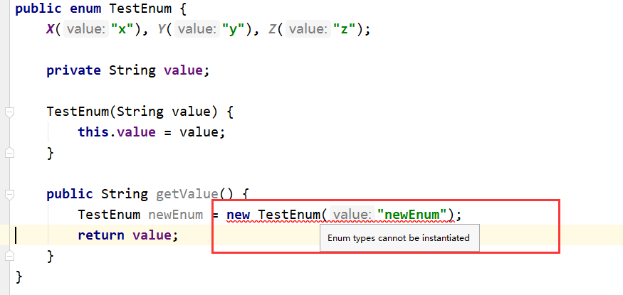
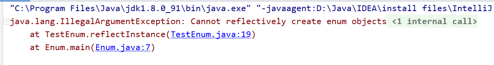
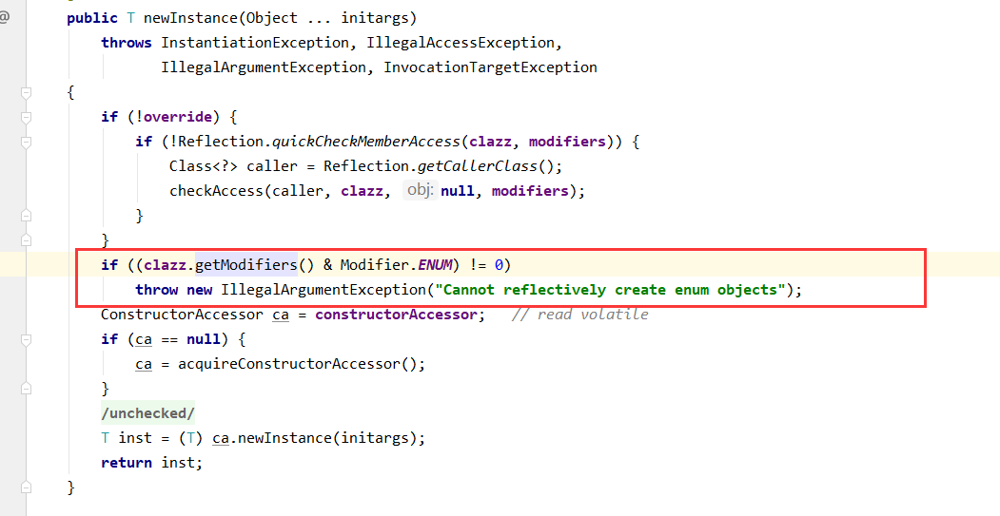
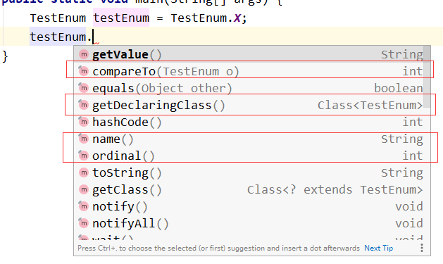

本文大纲：

[TOC]

## 前言

枚举（`enum`）是 Java 语言的关键字之一，和 `class` 关键字一样，我们可以通过 `enum` 来定义一个枚举类，并在这个枚举类里面创建相关的枚举常量。这篇文章里我们来看一下枚举在 Java 字节码层面是怎么表示的。

## 使用枚举

我们通过 `enum` 关键字来定义枚举，一个简单的枚举定义如下：
```java
public enum TestEnum {
	X("x"), Y("y"), Z("z");

	private String value;

	TestEnum(String value) {
		this.value = value;
	}

    public String getValue() {
		return value;
	}
}
```
需要注意的是，**即使我们在 `TestEnum` 中定义的构造方法没有添加任何的访问修饰符，它也不能在任何类中被调用（包括 `TestEnum` 本身）。** 因为枚举本来就是需要在定义时就创建好对应的实例。如果你尝试调用，会出现语法错误：



那通过直接 `new` 是行不通的，能不能通过反射的形式调用呢？我们在 `TestEnum` 类里面加一个静态方法：

```java
public static TestEnum reflectInstance() {
		try {
			return TestEnum.class.getDeclaredConstructor(String.class, int.class, String.class)
					.newInstance("123", 1, "123");
		} catch (Exception e) {
			e.printStackTrace();
		}
		return null;
	}
```

在 `main` 方法中调用：

```java

public class Enum {


    public static void main(String[] args) {
        TestEnum.reflectInstance();
    }
}
```

结果：



我们得到了一个异常：`不能反射创建枚举对象`。抛出这个异常的地方在 `newInstance` 方法调用的时候：



原来系统已经对我们定义的类进行了类型检测，如果是枚举，那么禁止通过反射创建枚举对象。

可能有些小伙伴注意到了，我在上面获取 `TestEnum` 构造方法的时候传入了三个类型参数：`String.class`, `int.class`, `String.class`。但是我在 `TestEnum` 这个类中只定义了接收一个 `String` 类型参数的构造方法。这里为了什么要多加两个类型参数呢？我们在后面解析 `TestEnum` 类型的字节码的时候会说到这个问题。

在使用枚举常量的时候，我们会发现一个有趣的现象：



我们在定义的枚举 `TestEnum` 中并没有为其添加 `compareTo`、`name`、`ordinal` 等方法，那这些多出来的方法哪来的呢？

## 枚举类

我们来深入看一下 Java 编译器是怎么处理枚举的：在控制台上键入 `javap -c TestEnum.class`（类路径需要换成你自己的编译得到的类路径），即反编译查看 `TestEnum.class` 的字节码：

```java
/* 生成的是一个自定义的类，继承于 java.lang.Enum<E extends Enum<E>> */
public final class enum_.TestEnum extends java.lang.Enum<enum_.TestEnum> {
  /* 定义了三个常量，即为我们在定义时书写的三个枚举常量 */
  public static final enum_.TestEnum X;

  public static final enum_.TestEnum Y;

  public static final enum_.TestEnum Z;

  /* 编译器生成的静态代码块，用来创建三个枚举常量（X, Y, Z）并赋值 */
  static {};
    Code:
       0: new           #1                  // class enum_/TestEnum
       3: dup
       4: ldc           #16                 // String X
       6: iconst_0
       7: ldc           #17                 // String x
       9: invokespecial #19                 // Method "<init>":(Ljava/lang/String;ILjava/lang/String;)V
      12: putstatic     #23                 // Field X:Lenum_/TestEnum;
          // 以上是常量 X 的创建及初始化
      15: new           #1                  // class enum_/TestEnum
      18: dup
      19: ldc           #25                 // String Y
      21: iconst_1
      22: ldc           #26                 // String y
      24: invokespecial #19                 // Method "<init>":(Ljava/lang/String;ILjava/lang/String;)V
      27: putstatic     #28                 // Field Y:Lenum_/TestEnum;
          // 以上是常量 Y 的创建及初始化
      30: new           #1                  // class enum_/TestEnum
      33: dup
      34: ldc           #30                 // String Z
      36: iconst_2
      37: ldc           #31                 // String z
      39: invokespecial #19                 // Method "<init>":(Ljava/lang/String;ILjava/lang/String;)V
      42: putstatic     #33                 // Field Z:Lenum_/TestEnum;
          // 以上是常量 Z 的创建及初始化
      45: iconst_3
      46: anewarray     #1                  // class enum_/TestEnum
      49: dup
      50: iconst_0
      51: getstatic     #23                 // Field X:Lenum_/TestEnum;
      54: aastore
      55: dup
      56: iconst_1
      57: getstatic     #28                 // Field Y:Lenum_/TestEnum;
      60: aastore
      61: dup
      62: iconst_2
      63: getstatic     #33                 // Field Z:Lenum_/TestEnum;
      66: aastore
      67: putstatic     #35                 // Field ENUM$VALUES:[Lenum_/TestEnum;
      70: return

  public static enum_.TestEnum[] values();
    Code:
       0: getstatic     #35                 // Field ENUM$VALUES:[Lenum_/TestEnum;
       3: dup
       4: astore_0
       5: iconst_0
       6: aload_0
       7: arraylength
       8: dup
       9: istore_1
      10: anewarray     #1                  // class enum_/TestEnum
      13: dup
      14: astore_2
      15: iconst_0
      16: iload_1
      17: invokestatic  #47                 // Method java/lang/System.arraycopy:(Ljava/lang/Object;ILjava/lang/Object;II)V
      20: aload_2
      21: areturn

  public static enum_.TestEnum valueOf(java.lang.String);
    Code:
       0: ldc           #1                  // class enum_/TestEnum
       2: aload_0
       3: invokestatic  #55                 // Method java/lang/Enum.valueOf:(Ljava/lang/Class;Ljava/lang/String;)Ljava/lang/Enum;
       6: checkcast     #1                  // class enum_/TestEnum
       9: areturn
}
```
从字节码中，我们知道：创建的枚举类经过编译器处理后会生成一个类，这个类继承于 `java.lang.Enum` 类，我们可以看看这个类的相关代码：
```java
public abstract class Enum<E extends Enum<E>>
        implements Comparable<E>, Serializable {
    // ... 
    private final String name;

    public final String name() {
        return name;
    }
    
    private final int ordinal;

    public final int ordinal() {
        return ordinal;
    }

    /**
     * Sole constructor.  Programmers cannot invoke this constructor.
     * It is for use by code emitted by the compiler in response to
     * enum type declarations.
     *
     * @param name - The name of this enum constant, which is the identifier
     *               used to declare it.
     * @param ordinal - The ordinal of this enumeration constant (its position
     *         in the enum declaration, where the initial constant is assigned
     *         an ordinal of zero).
     */
    protected Enum(String name, int ordinal) {
        this.name = name;
        this.ordinal = ordinal;
    }
    // ...
```
可以看到，`Enum` 类本身提供了两个属性（name 和 ordinal）来标识某个枚举对象，`name` 即为该枚举对象的名字，而 `ordinal` 为该枚举对象所在所有枚举常量中的序号（从 0 开始，比如上述的枚举常量 X, Y, Z 中，`X.ordinal` 为 0，`Y.ordinal` 为 1，`Z.ordinal` 为 2）。同时这个类实现了 `Comparable` 接口，提供了两个方法 `name()` 和 `oridinal()` ，这样的话我们就知道文章开头中说到的那几个方法是哪里来的了：就是父类提供的。

## 消失的构造方法

我们再回头看一下 `TestEnum` 类的字节码，你会发现即使 `TestEnum` 已经被作为一个类来处理了，但是在其字节码中并没有看到任何构造方法，但是我们在代码中定义 `TestEnum` 类时明明提供了一个带有一个参数的构造方法。要知道，即使一个最简单的类的都会默认有一个无参构造方法，而在对应的字节码中时可以看到的。我们来试试，写一个空类 EnumClass.java:

```java
public class EmptyClass {
}
```
反编译得到的字节码如下：
```java
public class enum_.EmptyClass {
  public enum_.EmptyClass();
    Code:
       0: aload_0
       1: invokespecial #8                  // Method java/lang/Object."<init>":()V
       4: return
}
```
可以看到，编译器给 `EmptyClass` 类提供了一个空的构造方法。那么为什么在上面的枚举类 `TestEnum` 的字节码中我们没有看到构造方法呢？**我们可以猜到这正是编译器为了顾及枚举的特性而将构造方法去除（或者说用别的方法代替）的体现。**我们回到 `TestEnum` 的字节码中，在 `static{}` 块的第 9 、24、39 行字节码中都调用了`invokespecial` 指令，即调用某个方法，而调用的具体方法为：`"<init>"：(Ljava/lang/String;ILjava/lang/String;)V`，我们知道，编译器在编译某个类时会为该类提供一个  `<init>` 方法，这个方法会在创建该类对象的时候调用。如果你熟悉字节码中方法签名规则的话，很容易就可以复原出这个方法的参数列表和返回值：`void <init>(String , int , String );` 。如果你还不不知道字节码中方法的签名规则，可以参考附录。

有了这个方法，我们大概就知道参数的含义了：第一和第二个参数为 `Enum` 类（`TestEnum` 的父类）传入的值（即 `name` 和 `ordinal`），而第三个参数就是在 `TestEnum` 类中定义的构造方法中的 `value` 参数。

还记得我们在文章开头尝试用反射创建枚举对象的代码吗，

```java
TestEnum.class.getDeclaredConstructor(String.class, int.class, String.class)
					.newInstance("123", 1, "123");
```

在那里我们获取构造方法传入的参数有三个：`String`, `int` 和 `String`。对应的就是这个 `<init>` 方法的参数，也就是说我们是为了调用这个方法来进行枚举对象的初始化。

我们还可以进一步测试，将 `TestEnum` 的构造方法改为接收两个参数：

```java
private TestEnum(String value, int valueInt) {
    this.value = value;
    this.valueInt = valueInt;
}
```
此时反编译得到的 `<init>` 方法的签名如下：
`"<init>":(Ljava/lang/String;ILjava/lang/String;I)V`
还原出来的方法参数和返回值如下：
`void <init>(String , int , String , int );`
有兴趣的小伙伴可以试试其他参数。
相比之前的 `<init>` 方法，该方法末尾多了一个 `int` 类型的参数，即为我们新加入的参数。

至此我们可以得出结论了：**对于枚举类来说，编译时编译器会将其构造方法去除，将其功能和参数都放在了 `<init>` 方法中，也就是说在枚举类的字节码中 `<init>` 方法充当了构造方法的作用。同时，编译器会为其添加静态代码块，在静态代码块中完成枚举类中声明的枚举常量的创建。**
因此我们不能在任何地方调用枚举类的构造方法，因为在字节码层面其已经被去除了。枚举对象只能在枚举类定义的时候进行实例化，即只能创建有限个枚举对象。这也符合枚举的词义（枚举即有限）。

## 枚举和 switch

我们都用过 switch 语句，对于普通常量（`int` 等）使用 switch 语句时其直接将 switch 中引用的值和 case 中引用的常量值一一比较。如果 switch 引用的是 `String` 对象，则通过该对象的 `hashCode` 方法的返回值和 case 中 `String` 类型常量的 `hashCode` 方法返回值进行比较，同时在比较完成后还会使用 `equals` 方法再次验证。

那么对于枚举是怎么样的情况呢，其实到这里很多小伙伴已经可以猜到了，我们写个 demo 验证一下：

```java
public class Enum {


    public static void main(String[] args) {
        TestEnum testEnum = TestEnum.X;
        switch (testEnum) {
            case X: {
                break;
            }
            case Y: {
                break;
            }
            case Z: {
                break;
            }
        }
    }
}
```

看看此时 `Enum` 类的 `main` 方法反编译后的字节码：

```java
public static void main(java.lang.String[]);
    descriptor: ([Ljava/lang/String;)V
    flags: ACC_PUBLIC, ACC_STATIC
    Code:
      stack=2, locals=2, args_size=1
         0: getstatic     #2                  // Field TestEnum.X:LTestEnum;
         3: astore_1
         4: getstatic     #3                  // Field Enum$1.$SwitchMap$TestEnum:[I
         7: aload_1
         8: invokevirtual #4                  // Method TestEnum.ordinal:()I
        11: iaload // 这里加载了一个 int 类型的数组，用来给 tableswitch 字节码做下标->跳转行的索引
        12: tableswitch   { // 1 to 3
                       1: 40
                       2: 43
                       3: 46
                 default: 46
            }
        40: goto          46
        43: goto          46
        46: return
```

从第 8 行字节码中可以知道，对于枚举，switch 语句也是调用其 `oridinal` 方法转换为整数之后再执行 `tableswitch` 字节码，通过数组下标直接索引。

好了，这篇文章就到这里了，相信到了这里你对 Java 枚举已经有了一个的详细的理解。如果觉得文章有什么不正确的地方，请多多指点，如果觉得本篇文章对你有帮助，请不要吝啬你的赞。

谢谢观看。。。

<br>
<br>

---


## 附：字节码中的方法签名

字节码中以**方法所属类全限定名.方法名:(参数类型及列表)返回值** 来描述一个方法，方法参数和返回值字符含义如下表：
##### Java方法签名中特殊字符/字符含义
| 字符 | 数据类型 |	特殊说明 |
| - | - | - |
| V | void |用于表示方法的返回值|
| Z	| boolean|
| B	| byte |
| C	| char |
| S	| short |
| I	| int |
| J	| long |
| F	| float |
| D	| double |
 `[` 代表 数组，以 `[` 开头，配合其他的特殊字符，表示对应数据类型的数组，几个 `[` 表示几维数组，比如一维的 `int` 数组对应的就是：`[I` 。
`L` 代表引用类型，以 `L` 开头，`;`  结尾，中间是引用类的全限定名
比如 `java.lang.String` 对应的就是：`Ljava/lang/String;`。

我们来看一个例子：将签名为 `arraycopy(Ljava/lang/Object;ILjava/lang/Object;II)V` 的方法进行还原：

根据上表，这个方法的第一个参数类型为 `Object`，第二个参数类型为 `int`，第三个参数类型为 `Object`，第四个参数类型为 `int`，第五个参数类型为 `int`。返回值类型为 `void`。由此得出方法原型为：`void arraycopy(Object , int , Object , int , int ) `。

有两点需要注意：

1、这里的方法签名中包括了返回值，但是这并不能作为方法重载的依据，方法重载时判断两个方法是否是同一个方法中只有方法名和方法参数列表，没有返回值类型。（可以理解成一个是语法层面的，一个是反编译后字节码对方法的解释层面的）。

2、表示引用类型的时候末尾需要加上 `;` 表示结束，此时 `L` 之后直到 `;` 之前的内容就代表引用类型的类全限定名。例：`Ljava/lang/String;` 。