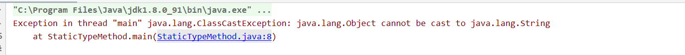

[TOC]

## 前言
从 JDK 1.5 之后，Java 引入了泛型的支持（JDK 1.5 真是一个重要的版本，枚举、泛型、注解都是在这个版本开始支持的）。到现在，泛型已经成为 Java 里面最常使用的特性之一了。不管是各种 Java 集合类，还是一些开源库里面都能见到泛型的身影，如果我们使用得当，泛型可以大幅简化我们的代码。既然泛型这么常用，那么我们一起来看看泛型这个神奇的特性。

## T 参数的由来

在没有其他语义的情况下，我们声明一个类是支持泛型的一般会采用 T 作为泛型名：

```java
/**
 * 一个使用泛型的简单例子
 */
public class Template<T> {
    private T obj;

    public T getObj() {
        return obj;
    }

    public void setObj(T obj) {
        this.obj = obj;
    }
}

```

T 可以理解成 `Type Variable`，意为：可变类型。上面的类只是简单使用了泛型的语法，没有其他意义。我们来看看这个类字节码层面是怎样的，找到类编译后的输出目录，键入命令：`javap -v Template.class`：


我们红框顺序来看一下字节码层面是怎么处理泛型的：

## 泛型擦除

红框 1 中，class 中的常量池中有一个 `Methodref` 类型的常量描述了我们在 `Template` 定义的 `obj` 字段的信息，其中，该字段类型为 `java/lang/Object`，即为 Object 类，也就是说**我们设置的泛型其实并没有实际应用到具体的类字段中去！**这其实就是我们常听到的泛型擦除：泛型类在还没被使用到时中并不知道字段的实际的类型是什么，于是用了一个所有类的基类：`java.lang.Object` 类型的引用来承接实际值。

有一个著名的面试题：假设有定义以下类，问能不能成功编译和运行

```java
public class Test {
    public void test(List<String> listStr) {
    }
    
    public void test(List<Integer> listInteger) {
    }
}
```

答案肯定是不能的，因为有泛型擦除的机制，在编译器看来，上面的代码和下面的代码是一样的：

```java
public class Test {
    public void test(List listStr) {
    }
    
    public void test(List listInteger) {
    }
}
```

两个方法的参数类型和个数都一样，肯定构不成方法重载的条件。

既然泛型类内部是通过 `Object ` 类型引用来承接的，那么我们可不可以在指定类型为 `String` 的泛型类中存入 `Integer` 类型的对象呢？

虽然我们不建议这么做，并且如果通过直接的方法调用会出现语法错误，但是原则上来说是可行，我们需要借助反射即可完成：

```java
public class Main {

    public static void main(String[] args) {
        // 指定泛型具体类型为 String
        Template<String> template = new Template<>();
        Object obj = new Integer(1);
        System.out.println(obj);
        try {
            // 通过反射将 Integer 类型的对象赋值给 template 中的 obj 字段
            Method method = template.getClass().getDeclaredMethod("setObj", Object.class);
            method.setAccessible(true);
            method.invoke(template, obj);

            // 通过反射将 template 中的 obj 字段取出
            Method getMethod = template.getClass().getDeclaredMethod("getObj");
            Object getObj = getMethod.invoke(template);
            System.out.println(getObj);
        } catch (NoSuchMethodException | IllegalAccessException | InvocationTargetException e) {
            e.printStackTrace();
        }
    }
}
```

结果：


## 泛型名称

第二个红框中，标明了这个泛型类的泛型参数名称，这里是 `TT`，为什么会有两个 `T` 呢？因为第一个 `T` 是固定存在的， 实际的泛型参数名称就是 `T`，我们可以把代码中的 `T` 改成 `X` 试试：

```java
/**
 * 一个使用泛型的简单例子
 */
public class Template<X> {
    private X obj;

    public X getObj() {
        return obj;
    }

    public void setObj(X obj) {
        this.obj = obj;
    }
}

```

此时的字节码：


那么既然泛型存在擦除机制，又为什么要记录泛型名称呢？

这里的作用有很多，比如在 `Class` 类有一个方法：`getTypeParameters` ，是用来获取当前类声明的所有泛型参数信息的，如果泛型参数不保存在编译后的 .class 文件中，那么这些需要使用类定义的泛型参数名的地方就拿不到了。

其二，在声明和使用泛型的类和方法中，在 class 文件层面，需要有一个额外的表结构来记录存在泛型参数时的类和方法签名，这个表名为 `Signature`，是虚拟机规范定义的 class 文件中类、方法、字段可能存在（当使用了泛型定义时）的属性之一。对应的其实就是第一张图中红框三、四、五部分。这样的话就可以避免由于泛型擦除机制导致的方法的签名混乱的问题。

## 隐式强制类型转换

我们回到最开始的那个 `Template` 泛型类，我们写下如下调用代码：

```java
public class Main {

    public static void main(String[] args) {
        Template<String> template = new Template<>();
        template.setObj("hello world!");
        String gotStr = template.getObj();
        System.out.println(gotStr);
    }
}
```

这是一段非常简单的代码，我们肯定知道运行结果，不过我们从这个类的字节码层面去看一下这个类会不会更有意思呢？


在字节码层，main 方法中出现了类型强制转换的字节码（`checkcast`）！这个结果小伙伴们仔细思考一下不难理解：`Template` 类中 `obj` 字段为 `Object`，我们使用 `String` 类型的引用来承接 `template.getObj()` 方法的返回结果对象。那么肯定有一个地方做了强制类型转换，我们又没有在代码里面主动添加强制 Object -> String 转换的代码。那么就只能是编译器帮我们做了。我们称这种现象为 隐式强制类型转换。

这种机制本身是可以让我们少些一点代码的。但是如果涉及到的方法是静态方法时，我们就需要注意返回的实际类型了：

```java

public class StaticTypeMethod {

    /**
     * 这里在方法返回值前使用 <T> 来为这个静态方法声明泛型参数
     * 因为静态方法没有类对象的上下文，
     * 因此在类层面声明的泛型参数对其是不可见的
     */
    public static <T> T getObj() {
        // 注意，这里返回的是 Object 类型对象
        return (T) new Object();
    }

    public static void main(String[] args) {
        String s = getObj();
    }
}

```

这段代码在编译时语法是没问题的，但是我们运行一下：



抛出类型转换异常了。当然在这里很容易看出问题出在哪。意料之内，也是情理之中。也正是因为在这种情况下编译器本身不会给出语法错误的提示，甚至不会有警告信息，在复杂工程中，这也是一不留神会出错的。

## ?、super 和 extend

我们或许看到过以下代码：

```java
List list = new ArrayList<>();

List<?> list1 = new ArrayList<>();
```

这两行代码创建的 `ArrayList` 对象有什么区别呢？我们先看第一句，意为：我想创建一个默认类型（因为我没有显示的指定泛型参数对应的实际类型）的列表对象，那么此时创建的就是一个以 `java.lang.Object` 为实际类型的列表。实际上，这句代码等同于：

```java
List<Object> list = new ArrayList<>();
```

再看第二行代码：我想显示的创建一个持有某种类型的列表，但是这个列表的实际类型我也不知道（因为我显示的给了一个 ? 作为泛型实际参数）。

此时会发生什么情况呢？我们不能再向 `list1` 这个容器中 add 任何元素了！为什么呢。因为编译器并不知道实际类型是什么（因为你给了编译器一个问号），所以你 add 任何类型的对象都会报类型不兼容的语法错误。有些小伙伴可能会问：把它当成 Object 类型的容器就好了啊！抱歉，编译器不会这么做，除非在 "实在没有办法" 的情况，例：

```java
Object obj = list1.get(0);
```

为什么把调用 `list1` 的 `get` 方法叫 "实在没有办法" 的情况呢？因为我在代码里面调用了 `list1.get(0)`，这个方法是有返回值的，编译器必须给返回值给你，否则违反了 Java 的基本语法。所以这个时候容器只能获取第一个元素，并将其作为 `Object` 类型（最保险的类型）的对象返回。

### super

`super` 和 `extends` 这两个关键字在泛型中有什么作用呢？用一句话来概述：它们可以指定泛型类型的上界和下界。举个例子：

我们定义三个类，名为 `A` `B` `C`，继承关系为：`B`  继承于 `A`，`C` 继承于 `B`。现在，我们创建一个 `List` 容器：

```java
List<? super A> list = new ArrayList<>();
```

这句定义表名：我定义了一个 `List` 类型的泛型对象，这个 `List` 对象可以接收的参数对象为任何 `A` 和 `A` 类型的子类对象（`super` 关键字的含义为：以 `A` 作为父类的类型）。因此我现在可以向 `list` 添加以下元素：

```java
// 正常
list.add(new A());
// 正常
list.add(new B());
// 正常
list.add(new C());
// 报类型不兼容错误！！
list.add(new Object());
```

因为我们定义 `list` 时指定的泛型参数类型为：`List<? super A> list`，即为 `A` 或者 `A` 的父类类型。因此，**接收实际参数对象的引用类型**为 `A` 或者 `A` 的父类类型，但是具体是哪个我们也不确定，但是由于规定了引用类型的下界为类型 `A`（要么是 `A` 要么是 `A` 的父类，因此引用类型下界为 `A`），我们有了这个信息之后，我们就可以向 `list` 中添加任意 `A` 或者 `A` 子类型的对象，**因为承接这个对象的引用类型的下界为 `A`**（根据 Java 的多态机制，想像一下，`Object` 类型引用可以接收任意对象，就是因为 `Object` 是所有类的父类）。因此前三句添加元素的代码都没有错误（`A` `B` `C` 就是类型 `A ` 本身或者 `A` 类型的子类），最后一句报错，因为 `Object` 类不是 `A` 的子类。

此时，对于 `list` 的 `get` 方法有什么影响呢？因为我们指定了**容器的引用类型**为 `A` 或者 `A` 的父类，但是没有指定具体的类型，因此编译器只会返回一个最保险的类型（`Object`），此时 `list.get` 方法的返回值类型为 `Object` ，想要获取其他类型，则需要强制类型转换。

```java
// 无需强转
Object obj = list.get(0);
// 需强转
A obj = (A) list.get(0);
```

### extends

有了 `super` 的基础，我们再来看 `extends` 就相对简单一点了：

```java
List<? extends A> list = new ArrayList<>();
```

我们定义了一个**实际接收参数对象的引用类型为 `A` 或者 `A` 的子类**的 `List` 容器。但是具体的引用类型是什么类型，我们也不知道，这意味着什么呢？意味着我们不能向这个容器添加任何的元素！

```java
// 报类型不兼容错误
list.add(new A());
// 报类型不兼容错误
list.add(new B());
// 报类型不兼容错误
list.add(new C());
// 报类型不兼容错误
list.add(new Object());
```

为什么呢？因为前半句：`List<? extends A> list` 我们规定的是容器引用类型的**上界**，为类型 `A`，具体的类型是什么呢？我们并不知道，有可能是 `A` 类型本身，有可能是 `B`，也可能是 `C`，既然用来接收对象的引用类型都不确定，又怎么往里面添加对象呢？

到这里可能小伙伴要问了：在 `super` 小节，我们定义的引用类型是 `? super A`，也是不确定的啊，怎么在那里就可以添加 `A` 或者 `A` 的子类的对象呢？请注意：我们在 `super` 小节定义的容器中接收对象的引用类型确实是不确定的，但是我们**定义了这个引用类型的下界，即这个用来接收对象的引用类型只能是 `A` 或者 `A` 的父类**，那么用这个引用类型来接收 `A` 类型的子类对象当然是没有问题的（Java 多态机制）。但是却不能接收 `A` 类型的父类对象（比如 `Object` 类型的对象）和其他非 `A` 子类的对象。问题点在于这里使用 `extends` 时，我们规定的只是上界，不是下界，这样的话可能的引用类型就会有无限多种（一个非 `final` 的类可以有无数个子类）。此时，无法确定具体的引用类型或者是确定具体的引用类型的范围。自然无法添加元素（无法接收对象）。

不能添加元素，那这个容器还有什么用呢？我们来看看 `get` 方法：刚刚提到，我们通过 `extends` 关键字规定了容器接收对象引用类型的上界。那么反过来想，如果这个容器有元素的话，里面的元素类型一定是 `A` 或者 `A` 的子类对象。那么我们用 `A` 类型或者 `A` 类型的父类来接收 `get` 方法的返回值时就不需要强制类型转换：

```java
// 无需强制类型转换
A a = list.get(0);
// 无需强制类型转换
Object obj = list.get(0);
```

但是如果是 `A` 类型的子类型时还是需要强制类型转换（因为上界只规定到了 `A` 类型）:

```java
// 需要强制类型转换
B b = (B) list.get(0);
```

这样一看感觉 `extends` 在泛型中的作用有点鸡肋，其实我们还可以在定义泛型类型的时候配合 `extends` 使用：

```java
public class Template<X extends A> {
    private X obj;

    public X getObj() {
        return obj;
    }

    public void setObj(X obj) {
        this.obj = obj;
    }
}

```

我们在定义 `Template` 类型，指定泛型参数的时候，通过 `extends` 指定了这个泛型类能够接受对象类型的上界：即 `setObj` 方法只能接收 `A` 或者 `A` 的子类对象作为参数。

这一小节可能对刚接触的小伙伴会有点不友好，其实只需要明白三点：

1、如果使用了 ? 传递给带有泛型参数的类 ，那么其内部接收对象的的引用类型就一定是不确定的。此时就需要看有没有配合 `super` 或者 `extends` 关键字使用了。

2、super 关键字用来规定接收引用类型的下界，下界一旦确定，可以接收的对象的类型也确定了（下界类型本身或者下界类型父类的对象）。`get` 方法可以返回的对象引用类型只能是 `Object` 类型。

3、extends 关键字用来规定接受引用类型的上界，上界一旦确定，`get` 方法可以返回的对象引用类型就确定了（上界类型本身或者上街类型的父类），但是由于无法确定具体的引用类型的范围，因此不能接收（添加: `add`）任何类型的对象。

好了，在这篇文章中我们探讨了一下关于 Java 中泛型的一些小秘密，相信你对泛型一定有了一个不错的理解。

如果觉得本文有什么不正确的地方，请多多指点。

如果觉得本文对你有帮助，请不要吝啬你的赞。

谢谢观看。。。