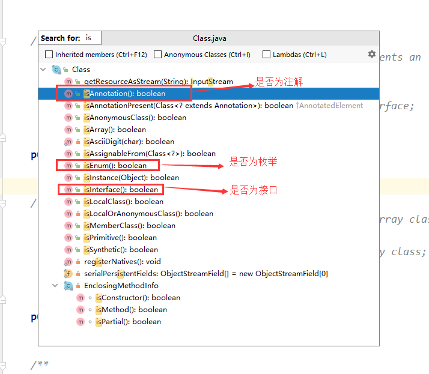

[TOC]

## 前言

上篇文章我们一起探讨了一下在 Java 1.5 版本中新加入的特性：泛型。这篇文章中我们来看一下在 Java 1.5 版本中新加入的另一个特：注解。

## 注解也是类

首页需要明确的是：和我们之前介绍的枚举一样，**注解也是一种类**。在编译成 `.class` 文件的时候类型信息会放在一个被称为 `access_flag` 的标志位中。这个标志位的长度为 2 个字节。里面保存了类的相关访问信息和类型信息（是否为接口类型，是否为枚举类，是否为注解类）。关于这一点，可以参考：[Java 类机制（3）---- 类文件结构](https://blog.csdn.net/Hacker_ZhiDian/article/details/94362039)。

而在 `.class` 文件经过虚拟机的类加载机制被加载到进程中后，虚拟机会创建一个 `Class` 类型的对象，即为 `.class` 文件在虚拟机进程中的动态数据结构描述。在 `Class` 类中提供了一系列类型判断方法：



其实本质上还是将 `.class`  文件中的 `access_flag` 字段读取到 `Class` 对象中，然后根据其中的具体值来进行判断。

## 基本用法

考虑到很多小伙伴对注解可能不是那么熟悉，我们从头开始来看。

### 四大元注解

Java 中所有的注解都是在四大元注解的基础上自定义扩展而来的。这四大元注解包含了注解的使用范围（`@Target`）、注解的生存时间（`@Retention`）、注解是否可以在使用时被使用方的子类继承使用（`@Inherited`）、注解的文档生成标识（`@Documented`）。

#### @Target

该元注解标注了自定义注解的使用范围。源代码如下：

```java
@Documented
@Retention(RetentionPolicy.RUNTIME)
@Target(ElementType.ANNOTATION_TYPE)
public @interface Target {
    /**
     * Returns an array of the kinds of elements an annotation type
     * can be applied to.
     * @return an array of the kinds of elements an annotation type
     * can be applied to
     */
    ElementType[] value();
}
```

可以看到该注解只有一个需要填充的值（`value`），类型为 `ElementType` 数组，即标识了注解的使用范围，`ElementType` 是一下枚举，可能的值如下：

```java
public enum ElementType {
    /* 可以作用于 类、方法、注解或者枚举定义 */
    TYPE,

    /* 可以作用于类字段上，（包括枚举值） */
    FIELD,

    /* 可以作用于方法上 */
    METHOD,

    /* 可以作用于方法参数上 */
    PARAMETER,

    /* 可以作用于构造方法上 */
    CONSTRUCTOR,

    /* 可以作用于方法本地变量上 */
    LOCAL_VARIABLE,

    /* 可以作用于注解类型上 */
    ANNOTATION_TYPE,
    
    // ...
}
```

在上面 `@Target` 注解定义时使用了 `@Target` 注解，同时 `value` 值为 `ANNOTATION_TYPE`，表名 `@Target` 注解只能作用于注解类型上。

#### @Retention

该元注解定义了自定义注解的存活时间。源代码如下：

```java
@Documented
@Retention(RetentionPolicy.RUNTIME)
@Target(ElementType.ANNOTATION_TYPE)
public @interface Retention {
    /**
     * Returns the retention policy.
     * @return the retention policy
     */
    RetentionPolicy value();
}
```

同样的，该注解只能作用于注解类型上。`@Retention` 有一个需要填充的 `RetentionPolicy` 类型的值，`RetentionPolicy` 类型同样是一个枚举：

```java
public enum RetentionPolicy {
    /**
     * Annotations are to be discarded by the compiler.
     */
    SOURCE,

    /**
     * Annotations are to be recorded in the class file by the compiler
     * but need not be retained by the VM at run time.  This is the default
     * behavior.
     */
    CLASS,

    /**
     * Annotations are to be recorded in the class file by the compiler and
     * retained by the VM at run time, so they may be read reflectively.
     *
     * @see java.lang.reflect.AnnotatedElement
     */
    RUNTIME
}
```

`RetentionPolicy` 有三个值：`SOURCE`、`CLASS`、`RUNTIME`，分别代表：

1.  SOURCE：注解只能在源码中存在，编译器将类编译成 `.class` 文件后会消失。

2.  CLASS：注解可以在 `.class` 中存在，编译器在编译源文件的时候保留该注解，注解可以在 `.class` 文件中存在，但是在虚拟机加载这个 `.class` 文件的时候会忽略该注解

3.  RUNTIME：注解可以在运行时虚拟机中的 `Class` 对象中存在，通过代码可以动态的获取。

#### @Inherited

该注解表名自定义注解是否可以在类中继承使用。这里的继承不是指的是注解和注解之间的继承，而是指的是使用该注解的类的子类在没有显式的使用该注解时，能否从父类中继承使用标注的注解。

#### @Documented


### 自定义注解


