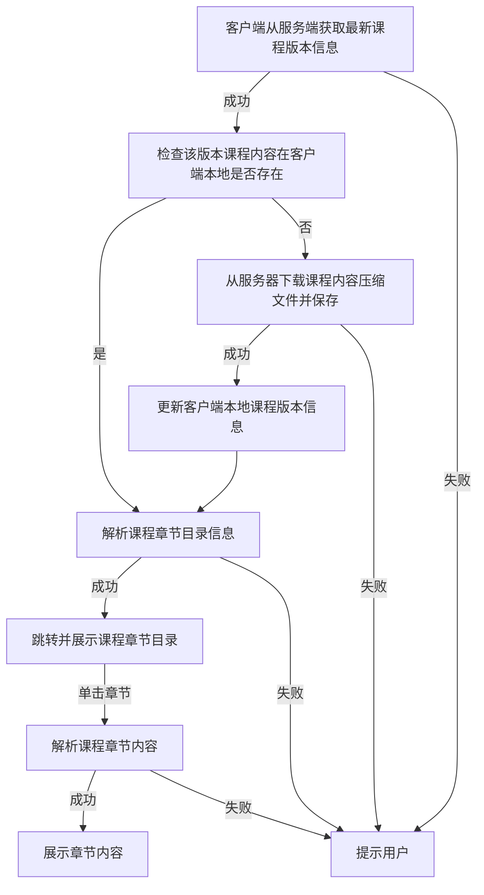
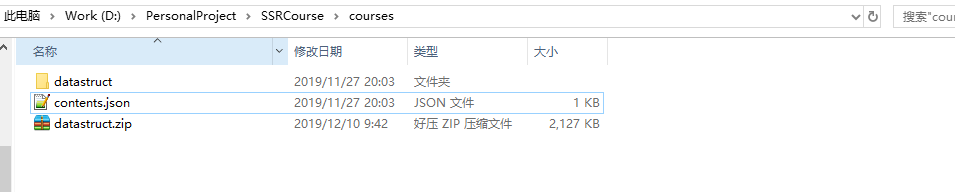
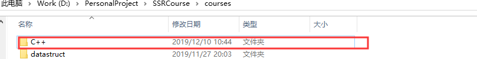
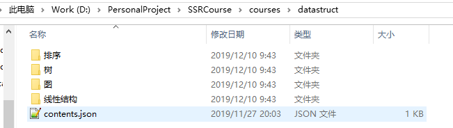
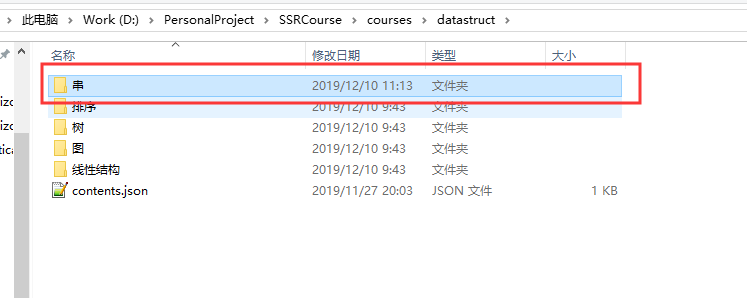
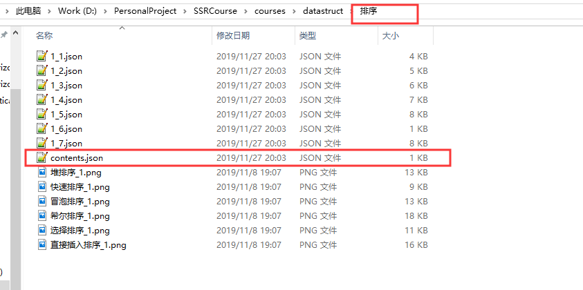
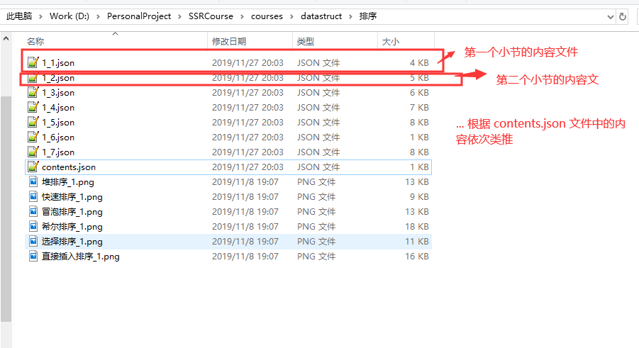

# 课程内容 WIKI

**阅读本 WIKI 之前请确保您对 json 文件格式有一定了解**


App 的所有课程内容都储存在 GitHub 中的一个代码仓库中，仓库地址：https://github.com/StarkZhidian/SSRCourse。

## 课程内容展示流程

客户端拉取课程内容的流程如下：



## 课程内容格式

### 课程目录和版本

课程整体目录和版本在 `/courses` 目录下的 `contents.json` 文件中记录，内容为 `json` 格式。当前文件内容如下：

```json
[
  {
    "courseName": "数据结构",
    "courseDirName": "datastruct",
    "courseZipFileName": "datastruct.zip",
    "lastVersion": "1.0.0"
  }
]

```

这里采用一个 `json` 数组来描述所有课程相关信息，数组中的元素是一个自定义的对象，在客户端中会读取这个数组数据，将得到的课程信息数据展示在首页中。

对象相关字段释义：

| 字段 key          | 作用                                                |
| ----------------- | --------------------------------------------------- |
| courseName        | 记录课程名                                          |
| courseDirName     | 课程内容的所在的目录（相对当前文件的路径）          |
| courseZipFileName | 课程内容的压缩 Zip 文件路径（相对于当前文件的路径） |
| lastVersion       | 课程最新版本信息，课程内容有更新时，需要更新这个值  |

在这里只有一个数据结构课程，此时整个课程目录结构如下：



### 新增课程

那么如果我需要加一个名为 `C++` 的课程呢？只需要仿照上面的 `json` 内容再加一个课程信息即可：

```json
[
  {
    "courseName": "数据结构",
    "courseDirName": "datastruct",
    "courseZipFileName": "datastruct.zip",
    "lastVersion": "1.0.0"
  },
  {
    "courseName": "C++",
    "courseDirName": "C++",
    "courseZipFileName": "C++.zip",
    "lastVersion": "1.0.0"
  }
]

```

同时，你需要创建对应的课程内容文件：



当然，你需要在编写好了这个课程对应的内容之后才可以在课程目录中添加这个课程，否则这就是一个异常课程（课程内容为空）。

在编写完课程内容之后，通过压缩工具即可生成对应的课程压缩文件（当前只支持 zip 格式的压缩文件）：


### 课程内容

#### 章节内容

每一门课程都有章节和小节的概念，章节即为每一章，拿数据结构这门课程来说，章节可以分为：

`线性结构`

`串`

`树`

`图`

`排序`

`动态规划`

等。在每门课程内容的文件夹中，每一个章节对应一个目录，章节目录里面是小节，储存着该章节课程的内容。同时，外层还需要有一个

`contents.json` 的文件来管理每个章节的信息：



这里代表这门课程有 4 个章节。所有的章节信息在 `contents.json` 文件中储存，

```json
[
  {
    "chapterName": "线性结构",
    "chapterDirPath": "datastruct/线性结构"
  },
  {
    "chapterName": "树",
    "chapterDirPath": "datastruct/树"
  },
  {
    "chapterName": "图",
    "chapterDirPath": "datastruct/图"
  },
  {
    "chapterName": "排序",
    "chapterDirPath": "datastruct/排序"
  }
]
```

和上面所有课程目录的 `json` 文件内容类似，也是通过数组的形式保存所有章节的信息，字段释义如下：

| 字段 key       | 字段释义                           |
| -------------- | ---------------------------------- |
| chapterName    | 章节名                             |
| chapterDirPath | 章节内容目录（相对于当前课程来说） |

#### 新增章节

如果需要新增章节，只需要按照格式规范在 `contents.json` 中 “注册” 一下要添加的章节信息，然后就可以创建对应的章节目录并且添加章节内容了。

假设我需要在 **数据结构** 课程中添加一个名为 **串** 的章节，并且我想将其放在 **线性结构** 和 **树** 这两章之间，则需改之后的 `contents.json` 文件内容为：

```json
[
  {
    "chapterName": "线性结构",
    "chapterDirPath": "datastruct/线性结构"
  },
  {
    "chapterName": "串",
    "chapterDirPath": "datastruct/串"
  },
  {
    "chapterName": "树",
    "chapterDirPath": "datastruct/树"
  },
  {
    "chapterName": "图",
    "chapterDirPath": "datastruct/图"
  },
  {
    "chapterName": "排序",
    "chapterDirPath": "datastruct/排序"
  }
]
```

完成了之后我们需要在 `数据结构` 这门课程的目录下新建一个名为 `串` 的子目录：



到这里为止我们已经注册了一个名为 `串` 的章节，目前这个章节是空的，没有任何内容。下面我们需要完善这个章节的课程内容：

#### 小节内容

章节里面就是小节，小节不需要创建目录。只需要创建一个 `json` 类型的文件来描述这个小节的内容就可以了。我们参考已经有的章节中的小节内容架构：



这是 `排序` 章节的内容目录。在里面依然需要一个 `contents.json` 文件来管理所有小节的信息，我们看看这个文件的内容：

```json
[
  {
    "subsectionFileName": "1_1.json",
    "subsectionName": "插入排序"
  },
  {
    "subsectionFileName": "1_2.json",
    "subsectionName": "希尔排序"
  },
  {
    "subsectionFileName": "1_3.json",
    "subsectionName": "冒泡排序"
  },
  {
    "subsectionFileName": "1_4.json",
    "subsectionName": "选择排序"
  },
  {
    "subsectionFileName": "1_5.json",
    "subsectionName": "快速排序"
  },
  {
    "subsectionFileName": "1_7.json",
    "subsectionName": "堆排序"
  }
]
```

和之前的 `contents.json` 文件内容类似，这里面也是通过数组来描述所有小节的内容。每一个 `{...}` 储存的一个小节的信息，字段释义：

| 字段 key           | 释义                               |
| ------------------ | ---------------------------------- |
| subsectionFileName | 课程小节内容文件（相对于当前文件） |
| subsectionName     | 课程小节名                         |

再回过头去看一下章节文件夹中的文件目录：



如果要在章节里面添加新的小节也是类似。比如我想在 `排序` 这一章中添加一个名为 `归并排序` 的小节，我们就可以按葫芦画瓢：

```json
[
  {
    "subsectionFileName": "1_1.json",
    "subsectionName": "插入排序"
  },
  {
    "subsectionFileName": "1_2.json",
    "subsectionName": "希尔排序"
  },
  {
    "subsectionFileName": "1_3.json",
    "subsectionName": "冒泡排序"
  },
  {
    "subsectionFileName": "1_4.json",
    "subsectionName": "选择排序"
  },
  {
    "subsectionFileName": "1_5.json",
    "subsectionName": "快速排序"
  },
  {
    "subsectionFileName": "1_7.json",
    "subsectionName": "堆排序"
  },
  {
    "subsectionFileName": "1_8.json",
    "subsectionName": "归并排序"
  }
]
```

同样的，需要在当前目录下创建 `1_8.json` 文件来编写并保存小节内容。

#### 内容元素

现在，来看一下小节内容的组成。在此之前，我们需要引入一个新的概念：`内容元素`。这是我个人引入的一个新的抽象概念，我们可以这么理解：**所有课程内容都是由一个个内容元素组成的，内容元素是课程内容的最基本单位。**


每一个 `内容元素` 可以表示以下几种内容：

| 内容类型                         | 内容类型编号 |
| -------------------------------- | ------------ |
| 普通文本                         | 0            |
| 图片                             | 1            |
| 代码                             | 2            |
| 网页                             | 3            |
| 原生动画                         | 4            |
| 普通问题（思考题，没有参考答案） | 5            |
| 选择题                           | 6            |
| 填空题                           | 7            |

每一个内容元素数据格式如下：

```json
{
    "basicData": {
      // 自定义的数据 key <-> value
      "parent_dir_path": // 当前小节的父目录路径, 格式：课程目录/章节目录，例：datastruct/排序
    },
    "contentType": 对应的内容类型编号
}
```

其中，自定义的数据 `key <-> value` 具体的 `key` 由内容类型决定，我们来一一看一下：

##### 文本

```json
{
    "basicData": {
      "text": "这是文本内容",
      "parent_dir_path": "datastruct/排序"
    },
    "contentType": 0
}
```

文本内容只有一个数据 key：`text`

##### 图片

```json
{
    "basicData": {
        "image_url": "直接插入排序_1.png",
        "parent_dir_path": "datastruct/排序"
    },
    "contentType": 1
}
```

图片内容只有一个数据 key：`image_url`，代表图片的相对路径/网络图片的 url 地址

##### 代码

```json
{
    "basicData": {
      "code": "这是代码内容",
      "code_language": 0,
      "parent_dir_path": "datastruct/排序"
    },
    "contentType": 2
},
```

代码内容有两个数据 key：`code`，代表代码内容，`code_language`，代表代码语言，代码语言会决定展示时的语法高亮风格，目前支持的代码语言如下：

| 语言 | 值   |
| ---- | ---- |
| C    | 0    |
| C++  | 1    |

##### 网页

```json
{
    "basicData": {
      "html_code": "这是 html 代码",
      "html_url": "这是网页链接",
      "parent_dir_path": "datastruct/排序"
    },
    "contentType": 3
},
```

网页内容支持两个数据 key：`html_code`，代表 html 代码。 `html_url`，代表网页链接。一般来说，这两个属性是互斥的，不会同时出现，因为一个浏览器要么加载网页代码，要么加载一个网页链接，如果两者同时出现，以`html_code` 值优先。

##### 原生动画

原生动画由于 Android 客户端原生内容，如果需要添加额外的动画需要发布新版本（目前而言），这一点上没有 html 灵活。而从用户体验而言，原生动画比 html 动画会好很多，后期会考虑利用技术将原生动画资源发布到服务器上实现不发版添加原生动画。

该内容格式如下：

```json
{
    "basicData": {
        "animation_name": "排序:直接插入排序",
        "parent_dir_path": "datastruct/排序"
    },
    "contentType": 4
},
```

原生动画有一个数据 key：`animation_name`，代表要展示的动画名。目前客户端支持的原生动画名列表：

```java
"线性结构:顺序表"
"线性结构:单向链表"
"线性结构:双向链表"
"线性结构:栈"
"线性结构:队列"
"树:二叉树"
"树:二叉搜索树"
"树:二叉堆"
"图:深度优先遍历"
"图:广度优先遍历"
"图:普里姆算法"
"图:克鲁斯卡尔算法"
"图:迪杰斯特拉算法"
"图:贝尔曼-福特算法"
"排序:直接插入排序"
"排序:冒泡排序"
"排序:选择排序"
"排序:快速排序"
"排序:堆排序"
```

也就是说目前 `animation_name` 的值必须要在这个列表之内。

##### 普通问题


##### 选择题

##### 填空题

我们拿 **排序** 章节的第一小节：`插入排序` 中的内容（`1_1.json`）来举例子：

```json
[
  {
    "basicData": {
      "text": "\n相信大家都玩过扑克牌，插入排序就像我们摸扑克牌一样。\n\n摸到一张扑克牌，我们就可以按照其花色大小将它插入到对应位置，使得已经摸到的牌有序。\n\n插入排序正是这种思想：首先，把数组元素中的第一个元素看成是有序的，从第二个元素开始，我们每次取出一个元素，并且将这个元素插入到前面已经有序的数组中的对应位置，使得插入后的整个数组元素仍有序，直到所有元素都插入完成。\n\n\n看一个简单的例子：假设我们需要把数组：3 1 2 4 5 进行从小到大排序，采用直接插入排序的步骤如下：\n\n1、先将数组的第一个元素看成有序的，即为 3 。\n\n2、接下来从数组第二个元素开始，每一个元素都和前面已经有序的数组元素进行对比，找到第一个比该元素小的元素的位置(位置不能小于 0)并且插入在其后面。例如 1 比 3 小，那么把元素 1 前移，但是因为元素 3 所在数组下标为 0 ，所以元素 1 只能插入在数组下标为 0 的位置而不能继续前移(或者理解成元素 1 已经成为当前有序的元素中最小的元素)。\n并且元素 3 向后移动到元素 1 的位置。\n\n此时的数组元素顺序就变成了 1 3 2 4 5 。那么接下来是数组的第三个元素，即为 2 ，因为 2 小于 3，那么把元素 2 向前移，\n此时只需移动一个位置元素 2 就找到了比它小的元素：1，那么把元素 2 插入到元素 1 后面并且把后面的所有元素向后移动一位。\n\n此时的数组元素就变成了 1 2 3 4 5，接下来继续对元素 4 和元素 5 移动，因为此时的数组元素已经为有序，所以并不需要移动数组元素，即排序结束。\n\n关于直接插入排序的实现，请参考 \"动画\"和\"代码\"部分。\n\t",
      "parent_dir_path": "datastruct/排序"
    },
    "contentType": 0
  },
  {
    "basicData": {
      "animation_name": "排序:直接插入排序",
      "parent_dir_path": "datastruct/排序"
    },
    "contentType": 4
  },
  {
    "basicData": {
      "code": "\n\n/**\n* C语言实现直接插入排序\n* Author：指点 \n*/\n#include <stdio.h>\n#define N 100\nint array[N];\n\n// 直接插入排序，a 待排序为数组，n 为数组元素个数 \nvoid insertSort(int a[], int n) {\nint i, j, v;\n// 把数组第一个元素看成有序的，从数组第二个元素开始进行排序 \nfor(i = 1; i < n; i++) {\n\tv = a[i];\n\tj = i-1;\n\t// 将在该元素前面并且值比其大的元素向后移，这里是一边比较一边移动元素位置\n\twhile(j >= 0 && a[j] > v) {\n\t\ta[j+1] = a[j];\n\t\tj--;\n\t}\n\t// 完成元素插入 \n\ta[j+1] = v;\n}\n}\n\n// 打印出数组信息 \nvoid print(int a[], int n) {\nint i;\nfor(i = 0; i < n; i++) {\n\tprintf(\"%d \", a[i]);\n}\nprintf(\"\\n\");\n}\n\nint main() {\nint i, n;\nprintf(\"输入数组元素的个数(1~100): \");\nscanf(\"%d\", &n);\nprintf(\"输入%d个数组元素：\\n\", n);\nfor(i = 0; i < n; i++) {\n\tscanf(\"%d\", array+i);\n}\nprintf(\"排序之前的数组元素：\\n\");\nprint(array, n);\ninsertSort(array, n);\nprintf(\"排序之后的数组元素：\\n\");\nprint(array, n);\n\nreturn 0;\n} \n\t",
      "code_language": -1,
      "parent_dir_path": "datastruct/排序"
    },
    "contentType": 2
  },
  {
    "basicData": {
      "text": "\n代码中实现插入排序部分采用双重循环，很明显事件复杂度为 O(n*n)。\n\n借用了一个中间变量 v 来保存要排序的变量的值，空间复杂度为 O(1)。\n\n下面是程序的运行结果：\n\t",
      "parent_dir_path": "datastruct/排序"
    },
    "contentType": 0
  },
  {
    "basicData": {
      "image_url": "直接插入排序_1.png",
      "parent_dir_path": "datastruct/排序"
    },
    "contentType": 1
  }
]
```

每个小节内容遵从以下两个规定：

**1、每个小节内容**